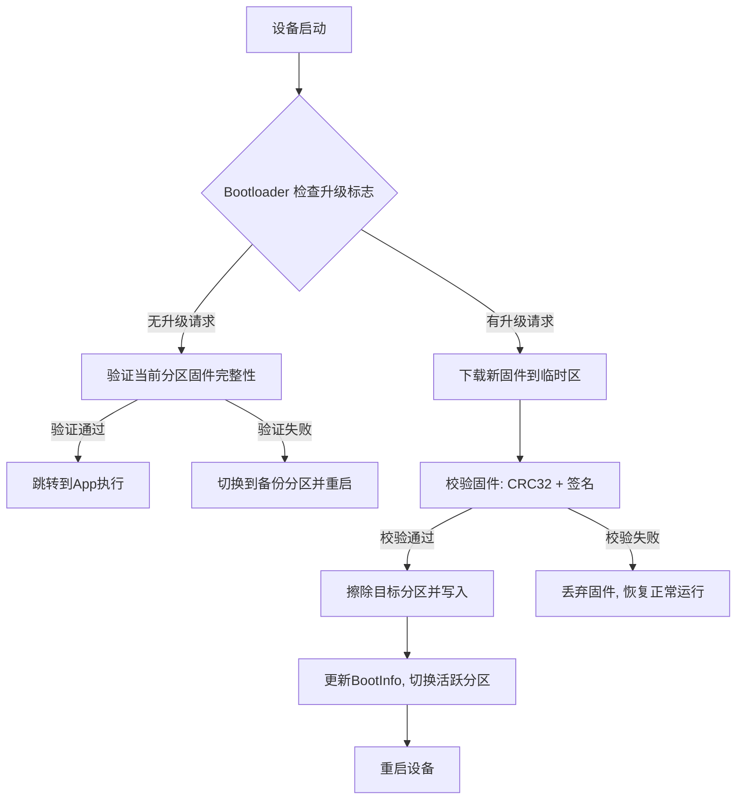

+++
title = 'OTA升级实现'
date = 2026-03-07T00:00:00+08:00
draft = false
categories = ['嵌入式']
tags = ['OTA', '固件升级', '嵌入式', 'Bootloader']
+++

# OTA升级实现

## 题目

什么是OTA升级？在资源受限的单片机上如何实现OTA？

> Bootloader 基础概念见 [Bootloader实现](../01_嵌入式基础/0004.Bootloader实现20260307.md)

## 考察点

- OTA 的基本概念与适用场景
- Flash 分区设计思路（双备份 / A-B 分区）
- OTA 升级完整流程：下载 → 验证 → 安装 → 重启
- 安全性与可靠性设计

## 回答要点

### 1. OTA 基本概念

**OTA（Over-The-Air）**：通过无线网络对设备固件进行远程更新的技术喵~

**优势**：远程更新、降低维护成本、快速修复bug、批量更新

**挑战**：Flash/RAM 资源有限、网络不稳定、安全验证、升级失败不能变砖

### 2. Flash 分区设计

```
Flash Memory Layout
┌─────────────────────────────────┐
│   Bootloader (16KB)              │ 0x08000000
├─────────────────────────────────┤
│   Application A (256KB)          │ 0x08004000
├─────────────────────────────────┤
│   Application B (256KB)          │ 0x08044000
├─────────────────────────────────┤
│   User Data / Config (32KB)      │ 0x08084000
├─────────────────────────────────┤
│   OTA Temp / Download (256KB)    │ 0x0808C000
└─────────────────────────────────┘
```

**双备份（A-B）机制核心思想**：运行 A 分区时，新固件下载到 B 分区；升级失败可回滚到 A 分区喵~

| 策略 | 优点 | 缺点 |
|------|------|------|
| 双备份（A-B分区） | 升级失败可回滚，安全性高 | 占用双倍Flash |
| 单分区 + 临时区 | 节省Flash空间 | 回滚需要重新下载 |

**启动信息结构**（BootInfo）需保存：魔数（magic）、当前活跃分区、固件版本号、CRC32校验值。

### 3. OTA 升级完整流程



**Bootloader 启动流程**：
1. 初始化硬件（时钟、串口、Flash）
2. 读取 BootInfo，确定活跃分区
3. 验证活跃分区固件完整性（CRC32）
4. 验证通过 → 设置 MSP，跳转 Reset_Handler
5. 验证失败 → 切换到备份分区并重启

**固件下载流程**：
1. 通过 HTTP/MQTT/CoAP 等协议分块下载
2. 逐块写入 OTA 临时分区
3. 支持断点续传（记录已下载偏移量）
4. 下载完成后进行完整性校验

**固件安装流程**：
1. 确定目标分区（当前活跃分区的对侧）
2. 擦除目标分区
3. 从临时区复制固件到目标分区
4. 更新 BootInfo（切换活跃分区、更新版本号）
5. 重启设备，Bootloader 加载新固件

### 4. 需要考虑哪些安全性和可靠性问题？

这是 OTA 设计中最关键的环节，面试中经常深入追问喵~

#### 安全性问题

| 问题 | 风险 | 对策 |
|------|------|------|
| 固件被篡改 | 黑客植入恶意代码，设备被控制 | 数字签名（RSA/ECDSA），设备用公钥验证 |
| 固件被窃取 | 竞争对手逆向工程 | 固件加密传输（AES），设备端解密 |
| 中间人攻击 | 升级包被替换 | TLS/SSL 加密通道 |
| 版本回退攻击 | 降级到有漏洞的旧版本 | 版本号单调递增校验，禁止回退 |

**固件签名验证流程**：厂商用私钥对固件哈希签名 → 设备用预置公钥验签 → 验签通过才允许安装

#### 可靠性问题

| 问题 | 风险 | 对策 |
|------|------|------|
| 传输中断 | 下载不完整导致固件损坏 | 断点续传 + 分块校验 |
| 写入中途断电 | Flash数据不完整 | 双备份机制，写入完成前不切换活跃分区 |
| Flash写入失败 | 坏块导致数据损坏 | 写后读回校验，失败重试或标记坏块 |
| 存储空间不足 | 新固件超过分区大小 | 下载前检查大小，超出则拒绝 |
| 固件兼容性 | 新固件不兼容硬件 | 固件头包含硬件兼容信息，安装前检查 |

**防变砖关键设计**：
- BootInfo 的更新必须在固件全部写入完成**之后**
- Bootloader 始终保持只读，任何情况下不可被覆盖
- 设置最大重启次数计数器，反复启动失败时进入安全恢复模式

### 5. 优化策略

| 策略 | 原理 | 适用场景 |
|------|------|---------|
| 差分升级 | 只下载新旧固件的差异部分 | Flash空间紧张、带宽受限 |
| 固件压缩 | 传输压缩包，设备端解压 | 网络带宽受限 |
| 后台下载 | App运行时在空闲分区下载新固件 | 不能停机的场景 |

### 6. 常见 OTA 传输协议对比

| 协议 | 特点 | 适用场景 |
|------|------|---------|
| HTTP/HTTPS | 简单直接，支持Range断点续传 | WiFi设备、带宽充足 |
| MQTT | 轻量，分块传输，适合IoT | 低带宽、NB-IoT设备 |
| CoAP | UDP基础，极轻量 | 极度资源受限设备 |

### 7. 带屏设备的 OTA（如小米手环）

小米手环那种升级中带进度条和加载动画的，本质上还是 OTA，但实现是**多阶段协作**，GUI 不是 Bootloader 画的喵~

#### 三阶段流程

| 阶段 | 执行者 | 能力 | 显示 |
|------|--------|------|------|
| 下载固件 | 旧 App | 完整 RTOS + GUI 驱动 | 进度条、动画 ✅ |
| 验证+搬运 | Bootloader | 裸机，极简 | 通常无显示 ❌ |
| 首次启动 | 新 App | 完整 RTOS + GUI | 可能显示"优化中" |

**阶段一：旧 App 下载固件（带 GUI）**

此时旧 App **还在运行**，负责：
- 通过 BLE 从手机接收固件数据
- 写入 OTA 临时分区
- **驱动屏幕显示进度条/加载动画**

所以你看到的加载界面是旧 App 在画，不是 Bootloader 喵~

**阶段二：Bootloader 接管**

下载完成 → App 写升级标志 → 重启 → Bootloader 接管：
- 验证固件完整性（CRC/签名）
- 搬运固件到目标分区
- 更新 BootInfo
- 跳转新 App

**阶段三：新 App 首次启动**

新固件首次启动，可能做数据迁移或自检，然后正常运行。

#### 为什么 Bootloader 不画 GUI？

Bootloader 设计哲学是**最小化、最可靠**：
- 体积要小（几KB~几十KB），塞不下 LCD 驱动和字体库
- 逻辑要简单，减少出 bug 的概率
- 不依赖外部资源（Flash、RAM 尽量少用）

所以面试里说"Bootloader 负责 OTA"是简化说法，实际工程中是 **App 下载 + Bootloader 安装** 的分工协作喵~
