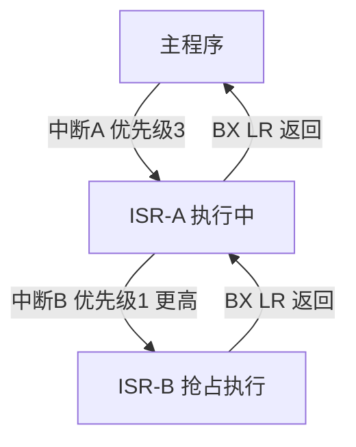

+++
title = '中断向量表嵌套机制与数据一致性'
date = 2026-04-23T00:00:00+08:00
draft = false
categories = ['嵌入式']
tags = ['中断', 'NVIC', 'ARM', '数据一致性']
+++

# 中断向量表、嵌套机制与数据一致性

## 题目

1. MCU上电后，如果中断向量表配置错误，系统会出现什么行为？为什么？
2. 中断嵌套是如何实现的？在ARM架构中，中断优先级和屏蔽机制是如何工作的？
3. 在中断中访问一个全局变量，同时主循环也访问它，如何保证数据一致性？有哪些实现方式，各自代价是什么？

## 考察点

中断向量表的作用与配置、ARM NVIC中断嵌套与优先级机制、中断与主循环共享数据的同步方法。

## 回答要点

### 1. 中断向量表配置错误的后果

#### 1.1 中断向量表是什么

中断向量表是一张**函数指针数组**，存储每个中断源对应的处理函数（ISR）地址喵~ Cortex-M 系列的向量表默认存放在地址 `0x00000000`（即 Flash 起始地址）喵~

```
地址          内容
0x00000000    初始 MSP（主栈指针）
0x00000004    Reset_Handler
0x00000008    NMI_Handler
0x0000000C    HardFault_Handler
0x00000010    MemManage_Handler
...
0x00000040    外设中断 ISR 地址
...
```

#### 1.2 配置错误的行为

| 错误类型 | 系统行为 | 原因 |
|---------|--------|------|
| 向量表地址指向无效区域 | **HardFault** | 中断触发时跳转到无效地址，触发总线错误 |
| 向量表中某项为 NULL（0x00000000） | **HardFault** 或执行空区域代码 | 跳转到地址 0，该处无有效指令 |
| 向量表重定位到 RAM 但 RAM 未初始化 | **随机崩溃** | RAM 内容随机，跳转地址不可预测 |
| 偏移计算错误 | **跳转到错误的 ISR** | 执行了不相关的代码，产生未定义行为 |
| 未更新 VTOR 但重定位了 Flash | **所有中断失效** | CPU 仍从旧地址读取向量表 |

#### 1.3 代码示例

```c
#define VECTOR_TABLE_OFFSET  0x08004000

void relocate_vector_table(void) {
    SCB->VTOR = VECTOR_TABLE_OFFSET;
}
```

如果 `VECTOR_TABLE_OFFSET` 指向的地址没有有效的向量表，一旦任何中断触发（包括 SysTick），系统立即 HardFault 喵~

#### 1.4 调试方法

```c
void HardFault_Handler(void) {
    __asm volatile (
        "TST LR, #4\n"
        "ITE EQ\n"
        "MRSEQ R0, MSP\n"
        "MRSNE R0, PSP\n"
        "B hard_fault_handler_c\n"
    );
}

void hard_fault_handler_c(uint32_t *stack_frame) {
    volatile uint32_t r0  = stack_frame[0];
    volatile uint32_t r1  = stack_frame[1];
    volatile uint32_t r2  = stack_frame[2];
    volatile uint32_t r3  = stack_frame[3];
    volatile uint32_t r12 = stack_frame[4];
    volatile uint32_t lr  = stack_frame[5];
    volatile uint32_t pc  = stack_frame[6];
    volatile uint32_t psr = stack_frame[7];

    (void)r0; (void)r1; (void)r2; (void)r3;
    (void)r12; (void)lr; (void)pc; (void)psr;

    while (1);
}
```

### 2. ARM中断嵌套与优先级机制

#### 2.1 中断嵌套的实现

Cortex-M 通过 NVIC 硬件自动实现中断嵌套，无需软件保存上下文喵~

**硬件自动完成的操作：**
1. 中断触发时，硬件自动将 `xPSR`、`PC`、`LR`、`R12`、`R3-R0` 压入当前栈
2. 从向量表读取 ISR 地址，跳转执行
3. 如果更高优先级中断到来，自动再次压栈并切换到高优先级 ISR
4. 高优先级 ISR 返回时（执行 `BX LR`），硬件自动出栈恢复上下文
5. 继续执行低优先级 ISR



#### 2.2 优先级机制

Cortex-M 使用 **4位优先级**（0~15），数值越小优先级越高喵~

| 概念 | 说明 |
|------|------|
| 抢占优先级（Preemption Priority） | 高的可以打断正在执行的低优先级中断 |
| 响应优先级（Sub Priority） | 多个同抢占优先级中断同时挂起时，决定谁先执行 |
| 优先级分组（Priority Grouping） | 通过 `SCB->AIRCR` 的 `PRIGROUP` 字段划分抢占/响应位数 |

```c
NVIC_SetPriorityGrouping(NVIC_PRIORITYGROUP4);

NVIC_SetPriority(USART1_IRQn, 1);
NVIC_SetPriority(TIM2_IRQn, 2);
NVIC_SetPriority(EXTI0_IRQn, 3);
```

#### 2.3 屏蔽机制

| 寄存器/指令 | 作用 | 影响范围 |
|------------|------|---------|
| `__disable_irq()` | 关闭全局中断 | 屏蔽所有可屏蔽中断 |
| `__enable_irq()` | 开启全局中断 | 恢复所有可屏蔽中断 |
| `BASEPRI` 寄存器 | 屏蔽低于某优先级的中断 | 只屏蔽优先级数值 ≥ BASEPRI 的中断 |
| `FAULTMASK` | 屏蔽除 NMI 外所有中断 | 极端场景使用 |

```c
__set_BASEPRI(3 << 4);

__set_BASEPRI(0);
```

### 3. 中断与主循环的数据一致性

#### 3.1 问题本质

当中断和主循环都访问同一个全局变量时，主循环对变量的**非原子操作**可能被中断打断，导致数据不一致喵~

```c
volatile uint32_t system_tick;

void SysTick_Handler(void) {
    system_tick++;
}

void main_loop(void) {
    uint32_t current = system_tick;
}
```

对于 `uint32_t` 在 32 位 MCU 上是原子的，但在 8/16 位 MCU 上读写 `uint32_t` 需要多条指令，可能被中断打断喵~

#### 3.2 各实现方式及代价

**方式一：关中断（最通用）**

```c
uint32_t get_system_tick(void) {
    uint32_t tick;
    __disable_irq();
    tick = system_tick;
    __enable_irq();
    return tick;
}
```

| 优点 | 缺点 |
|------|------|
| 简单可靠 | 关中断期间所有中断被屏蔽 |
| 适用任何数据类型 | 影响实时性 |
| | 关中断时间必须极短（μs级） |

**方式二：进入/退出临界区**

```c
taskENTER_CRITICAL();
shared_data++;
taskEXIT_CRITICAL();
```

在 FreeRTOS 中，`taskENTER_CRITICAL()` 在单核上等效于关中断，但会记录嵌套深度喵~

**方式三：原子操作（C11 / CMSIS）**

```c
#include <stdatomic.h>

atomic_uint shared_counter;

void ISR(void) {
    atomic_fetch_add(&shared_counter, 1);
}

void main_loop(void) {
    uint32_t val = atomic_load(&shared_counter);
}
```

| 优点 | 缺点 |
|------|------|
| 不关中断 | Cortex-M3/M4 单核上仍用 `LDREX/STREX` 实现 |
| 无实时性影响 | 部分老编译器不支持 C11 atomic |
| | Cortex-M0/M0+ 无独占访问指令，退化为关中断 |

**方式四：双缓冲 / 标志位**

```c
volatile uint8_t data_ready;
sensor_data_t sensor_buf;

void ISR(void) {
    sensor_buf = read_sensor();
    data_ready = 1;
}

void main_loop(void) {
    if (data_ready) {
        process(&sensor_buf);
        data_ready = 0;
    }
}
```

| 优点 | 缺点 |
|------|------|
| 零锁开销 | 仅适用于"生产者-消费者"单方向场景 |
| 不影响中断响应 | 标志位本身需要 `volatile` |

**方式五：volatile 关键字**

```c
volatile uint32_t flag;
```

`volatile` 告诉编译器每次都从内存读取，不做缓存优化喵~ 但它**不保证原子性**，只保证可见性喵~ 对于多字节变量，仍需配合关中断或其他机制喵~

#### 3.3 方案选择总结

| 场景 | 推荐方案 |
|------|---------|
| 单字节标志位 | `volatile` 足够 |
| 多字节简单读写 | 关中断包裹 |
| FreeRTOS 任务与中断共享 | `taskENTER_CRITICAL` 或队列 |
| 高频计数器 | 原子操作或硬件定时器 |
| 结构体/数组 | 双缓冲 + 标志位 |
