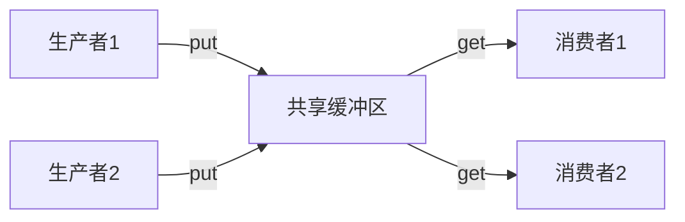

+++
title = '生产者-消费者模式'
date = 2026-04-23T00:00:00+08:00
draft = false
categories = ['嵌入式']
tags = ['生产者消费者', '线程同步', 'FreeRTOS', '并发']
+++

# 生产者-消费者模式

## 题目

手写生产者-消费者模式。

## 考察点

线程同步机制（互斥锁、信号量、条件变量）、共享缓冲区设计、并发编程实践。

## 回答要点

### 1. 模式概述

生产者-消费者模式是经典的并发同步模型：生产者向缓冲区放数据，消费者从缓冲区取数据，两者通过同步机制协调喵~

**核心约束：**
- 缓冲区满时，生产者必须等待
- 缓冲区空时，消费者必须等待
- 对缓冲区的读写必须互斥



### 2. FreeRTOS实现（信号量+队列）

FreeRTOS 的队列本身就是线程安全的，天然适合生产者-消费者模式喵~

```c
#include "FreeRTOS.h"
#include "queue.h"
#include "semphr.h"

#define QUEUE_LENGTH 10
#define ITEM_SIZE sizeof(uint32_t)

QueueHandle_t data_queue;

void Producer_Task(void *pvParameters) {
    uint32_t counter = 0;

    while (1) {
        if (xQueueSend(data_queue, &counter, pdMS_TO_TICKS(100)) == pdPASS) {
            counter++;
        }

        vTaskDelay(pdMS_TO_TICKS(50));
    }
}

void Consumer_Task(void *pvParameters) {
    uint32_t received_value;

    while (1) {
        if (xQueueReceive(data_queue, &received_value, pdMS_TO_TICKS(1000)) == pdPASS) {
        }

        vTaskDelay(pdMS_TO_TICKS(100));
    }
}

int main(void) {
    data_queue = xQueueCreate(QUEUE_LENGTH, ITEM_SIZE);

    xTaskCreate(Producer_Task, "Producer", 256, NULL, 2, NULL);
    xTaskCreate(Consumer_Task, "Consumer", 256, NULL, 1, NULL);

    vTaskStartScheduler();
    while (1);
}
```

### 3. FreeRTOS实现（互斥锁+信号量控制计数）

手动实现缓冲区+同步机制喵~

```c
#include "FreeRTOS.h"
#include "semphr.h"

#define BUF_SIZE 8

static uint32_t buffer[BUF_SIZE];
static int head = 0;
static int tail = 0;

static SemaphoreHandle_t mutex;
static SemaphoreHandle_t sem_empty;
static SemaphoreHandle_t sem_full;

void Buffer_Init(void) {
    mutex = xSemaphoreCreateMutex();
    sem_empty = xSemaphoreCreateCounting(BUF_SIZE, BUF_SIZE);
    sem_full = xSemaphoreCreateCounting(BUF_SIZE, 0);
}

void Producer_Put(uint32_t item) {
    xSemaphoreTake(sem_empty, portMAX_DELAY);

    xSemaphoreTake(mutex, portMAX_DELAY);
    buffer[head] = item;
    head = (head + 1) % BUF_SIZE;
    xSemaphoreGive(mutex);

    xSemaphoreGive(sem_full);
}

uint32_t Consumer_Get(void) {
    xSemaphoreTake(sem_full, portMAX_DELAY);

    xSemaphoreTake(mutex, portMAX_DELAY);
    uint32_t item = buffer[tail];
    tail = (tail + 1) % BUF_SIZE;
    xSemaphoreGive(mutex);

    xSemaphoreGive(sem_empty);

    return item;
}

void Producer_Task(void *pvParameters) {
    uint32_t counter = 0;
    while (1) {
        Producer_Put(counter++);
        vTaskDelay(pdMS_TO_TICKS(50));
    }
}

void Consumer_Task(void *pvParameters) {
    while (1) {
        uint32_t val = Consumer_Get();
        vTaskDelay(pdMS_TO_TICKS(100));
    }
}
```

### 4. Linux C实现（互斥锁+条件变量）

```c
#include <pthread.h>
#include <stdio.h>
#include <stdlib.h>
#include <unistd.h>

#define BUF_SIZE 8

typedef struct {
    int buffer[BUF_SIZE];
    int head;
    int tail;
    int count;
    pthread_mutex_t mutex;
    pthread_cond_t not_empty;
    pthread_cond_t not_full;
} ringbuf_t;

void ringbuf_init(ringbuf_t *rb) {
    rb->head = 0;
    rb->tail = 0;
    rb->count = 0;
    pthread_mutex_init(&rb->mutex, NULL);
    pthread_cond_init(&rb->not_empty, NULL);
    pthread_cond_init(&rb->not_full, NULL);
}

void ringbuf_put(ringbuf_t *rb, int item) {
    pthread_mutex_lock(&rb->mutex);

    while (rb->count == BUF_SIZE) {
        pthread_cond_wait(&rb->not_full, &rb->mutex);
    }

    rb->buffer[rb->head] = item;
    rb->head = (rb->head + 1) % BUF_SIZE;
    rb->count++;

    pthread_cond_signal(&rb->not_empty);
    pthread_mutex_unlock(&rb->mutex);
}

int ringbuf_get(ringbuf_t *rb) {
    pthread_mutex_lock(&rb->mutex);

    while (rb->count == 0) {
        pthread_cond_wait(&rb->not_empty, &rb->mutex);
    }

    int item = rb->buffer[rb->tail];
    rb->tail = (rb->tail + 1) % BUF_SIZE;
    rb->count--;

    pthread_cond_signal(&rb->not_full);
    pthread_mutex_unlock(&rb->mutex);

    return item;
}

void *producer(void *arg) {
    ringbuf_t *rb = (ringbuf_t *)arg;
    for (int i = 0; i < 100; i++) {
        ringbuf_put(rb, i);
        printf("Produced: %d\n", i);
        usleep(50000);
    }
    return NULL;
}

void *consumer(void *arg) {
    ringbuf_t *rb = (ringbuf_t *)arg;
    for (int i = 0; i < 100; i++) {
        int val = ringbuf_get(rb);
        printf("Consumed: %d\n", val);
        usleep(100000);
    }
    return NULL;
}

int main() {
    ringbuf_t rb;
    ringbuf_init(&rb);

    pthread_t prod_tid, cons_tid;
    pthread_create(&prod_tid, NULL, producer, &rb);
    pthread_create(&cons_tid, NULL, consumer, &rb);

    pthread_join(prod_tid, NULL);
    pthread_join(cons_tid, NULL);

    return 0;
}
```

### 5. 同步机制对比

| 同步原语 | FreeRTOS | Linux | 作用 |
|---------|----------|-------|------|
| 互斥 | xSemaphoreCreateMutex() | pthread_mutex_t | 保护共享缓冲区 |
| 计数信号量 | xSemaphoreCreateCounting() | sem_t | 跟踪空闲/已用槽位 |
| 条件变量 | 无（用信号量替代） | pthread_cond_t | 等待/通知缓冲区状态 |
| 队列 | xQueueCreate() | 无直接对应 | 自带同步的缓冲区 |

### 6. 常见变体与追问

| 变体 | 说明 |
|------|------|
| 单生产者单消费者（SPSC） | 最简单，可无锁实现 |
| 多生产者单消费者（MPSC） | 生产端需要互斥 |
| 多生产者多消费者（MPMC） | 读写两端都需要互斥 |
| 优先级反转 | 生产者优先级低于消费者时可能发生，需使用优先级继承 |
