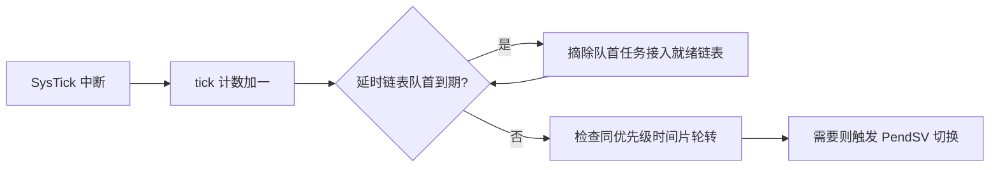

+++
title = 'FreeRTOS周期任务抖动与vTaskDelayUntil'
date = 2026-09-04T00:00:00+08:00
draft = false
categories = ['嵌入式']
tags = ['FreeRTOS', 'RTOS', 'vTaskDelayUntil', '任务调度', '实时性']
+++

# FreeRTOS周期任务抖动与vTaskDelayUntil

## 题目

某工业机械臂控制系统采用 FreeRTOS 管理运动控制任务，机械臂以 10ms 周期执行高速轨迹运算，但偶发任务执行间隔超过 20ms。围绕这个问题：

1. 周期任务应该用 `vTaskDelay()` 还是 `vTaskDelayUntil()`？后者为什么必须传"上次唤醒时间"变量的地址？
2. SysTick 中断里内核需要遍历所有延时任务来更新延时吗？
3. 周期间隔超标（抖动）通常有哪些来源？

## 考察点

`vTaskDelay()` 与 `vTaskDelayUntil()` 的区别及正确用法、FreeRTOS 延时任务列表的组织方式（与 μC/OS-II 的差异）、周期任务抖动的常见来源。

## 回答要点

### 1. vTaskDelay 与 vTaskDelayUntil 的本质区别

| 对比项 | `vTaskDelay()` | `vTaskDelayUntil()` |
|--------|---------------|---------------------|
| 延时基准 | **相对**当前时刻：从调用点往后数 N 个 tick | **绝对**时刻：对齐到"上次唤醒时间 + N" |
| 误差 | 每次循环误差累积（执行时间越长，周期越漂） | 误差不累积，长期平均周期精确 |
| 典型用途 | 一次性的退避、等待 | 周期性采样、控制律计算 |
| 参数形式 | `TickType_t xTicksToDelay` | `TickType_t *pxPreviousWakeTime, TickType_t xTimeIncrement` |

正确用法示例：

```c
void TrajectoryTask(void *pvParameters)
{
    TickType_t xLastWakeTime = xTaskGetTickCount();
    const TickType_t xPeriod = pdMS_TO_TICKS(10);

    while (1) {
        ComputeTrajectory();
        vTaskDelayUntil(&xLastWakeTime, xPeriod);
    }
}
```

三个要点：

1. `xLastWakeTime` 只在进入循环**前**取一次初值；
2. 传的是**地址**，函数内部会自动把它更新为本次实际唤醒时刻，调用方不要手动修改。传错了变量、每次循环重新初始化它、或手动改动它，都会让基准时刻漂移，周期随之拉长——这是周期变长的常见用法错误；
3. 若任务本身执行时间已超过周期，`vTaskDelayUntil()` 会立即返回（不算负延时），此时该做的是提高任务优先级或优化执行时间，而不是改延时方式。

### 2. SysTick 如何管理延时任务：有序链表，只查队首

一个常见误解是"FreeRTOS 的 SysTick 中断会遍历所有延时任务逐个更新延时"——**并不是**。μC/OS-II 确实这么干（每个任务 TCB 里有 `OSTCBDly` 计数，每次 tick 逐个递减，开销是 O(任务数)），而 FreeRTOS 用**按到期时刻排序的有序链表**：

- 挂起延时时，按唤醒时刻插入 `xDelayedTaskList`（升序），新任务插到正确位置，链表始终有序；
- 每 tick 中断（`xTaskIncrementTick()`）只看**链表头**：头节点到期就摘除并接入就绪列表，再看下一个头节点；头节点没到期就直接结束；
- 时间片轮转只发生在**同优先级**就绪任务多于一个时。



这样每次 tick 的开销与延时任务总数无关（均摊 O(1) 级别），这也说明内核的 tick 处理本身不会成为 10ms 周期任务抖动的元凶。

### 3. 周期抖动（jitter）的来源与排查

按出现概率从高到低：

| 抖动来源 | 机理 | 排查与解决 |
|---------|------|-----------|
| 高优先级任务抢占 | 周期任务优先级不够高，被网络通信等高优先级任务推迟执行 | 用 traceX 工具看任务实际占用时间线，提升优先级或拆分高优任务 |
| 长临界区/关中断 | tick 丢失、调度被推迟（`taskENTER_CRITICAL()` 嵌套过深、驱动里粗暴关中断） | 检查临界区嵌套与关中断时长，改用信号量保护 |
| 任务执行超时 | 本体计算就超过周期 | GPIO 翻转 + 示波器量执行时长，优化算法或提高主频 |
| DelayUntil 用法错误 | "上次唤醒时间"变量被重复初始化或手动修改，基准时刻漂移 | 检查变量生命周期，只初始化一次 |
| tick 频率配置过低 | 10ms 周期在 100Hz tick 下只有 1 个 tick 粒度 | `configTICK_RATE_HZ` 提高到 1kHz 以上 |

### 4. 小结

- `vTaskDelayUntil()` 用绝对时刻对齐消除累积误差，核心是"传指针、只初始化一次、别手动改"；
- FreeRTOS 的 SysTick **不遍历**延时任务，靠有序延时链表只查队首，与 μC/OS-II 的逐任务递减是两种设计；
- 周期超标的真实原因通常是抢占、关中断或执行超时，而不是内核遍历链表的开销。
