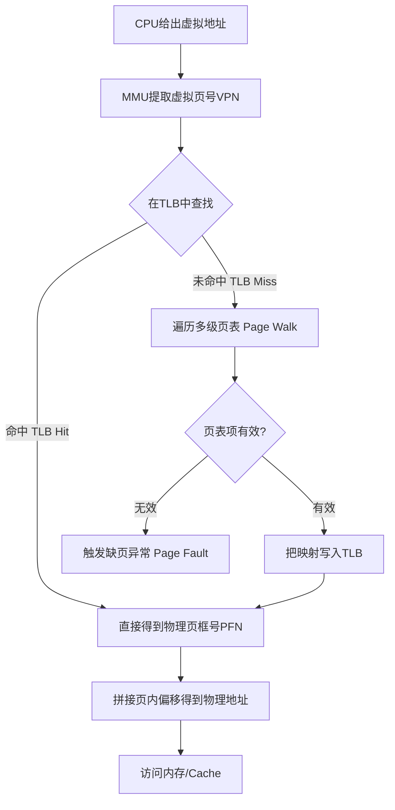

+++
title = 'TLB原理与页表寻址机制'
date = 2026-08-10T00:00:00+08:00
draft = false
categories = ['嵌入式']
tags = ['面试题', 'TLB', '页表', '虚拟内存', 'MMU', '操作系统']
+++

# TLB原理与页表寻址机制

## 题目

什么是 TLB？它在虚拟地址到物理地址转换中起什么作用？

## 考察点

虚拟内存管理、MMU 工作原理、地址转换性能优化。

## 回答要点

### 1. 多级页表带来的性能问题

虚拟内存通过页表（Page Table）将虚拟地址映射到物理地址。以 32 位系统、4KB 页为例，一级页表需要 `2^20 = 1M` 个表项，每进程 4MB；64 位系统更需四级页表（PGD→PUD→PMD→PTE）。每次访存都要串行遍历多级页表，开销极大。

```
一次虚拟地址访问的代价（无 TLB 时）：
取 PTE = 4 次内存访问（四级页表逐级查找）
取数据 = 1 次内存访问
总计    = 5 次内存访问，性能下降 5 倍
```

### 2. TLB 是什么

TLB（Translation Lookaside Buffer，页表缓存/旁路转换缓冲）是 **MMU 内部的一个高速硬件缓存**，专门缓存最近使用的虚拟页号 → 物理页框号映射，避免每次都去查内存中的页表。

```c
// TLB 表项的典型字段
typedef struct {
    unsigned int vpn;     // 虚拟页号
    unsigned int pfn;     // 物理页框号
    unsigned int asid;    // 地址空间 ID（区分进程）
    int valid;            // 有效位
    int global;           // 全局页（内核空间，所有进程共享）
    int dirty;            // 脏位（是否被写过）
    int permissions;      // 读/写/执行权限
} tlb_entry_t;
```

### 3. 地址转换完整流程



```c
// TLB 查找的核心逻辑（硬件实现，软件不可见）
unsigned int translate(unsigned int virt_addr, unsigned int asid) {
    unsigned int vpn   = virt_addr >> 12;   // 虚拟页号
    unsigned int offset = virt_addr & 0xFFF; // 页内偏移

    // 1. 先查 TLB
    tlb_entry_t* hit = tlb_lookup(vpn, asid);
    if (hit != NULL) {
        // TLB 命中，一次完成
        return (hit->pfn << 12) | offset;
    }

    // 2. TLB 未命中，由硬件 Page Walk 遍历多级页表
    unsigned int pfn = walk_page_table(vpn, asid);

    // 3. 把新映射填入 TLB（可能淘汰旧表项）
    tlb_fill(vpn, pfn, asid);

    return (pfn << 12) | offset;
}
```

### 4. TLB Hit / Miss 与 Page Fault 的区别

| 概念 | 触发条件 | 处理者 | 开销 |
|------|----------|--------|------|
| TLB Hit | VPN 已在 TLB 中 | MMU 硬件 | 几乎为 0（1 个时钟周期） |
| TLB Miss | VPN 不在 TLB，但页表项有效 | 硬件 Page Walk（x86/ARM）或软件异常（MIPS） | 几十~上百周期 |
| Page Fault | 页表项不存在/权限不足 | 操作系统缺页处理程序 | 极大（可能涉及磁盘 IO） |

> 注意：TLB Miss ≠ Page Fault。TLB Miss 只是缓存没命中，页表里可能仍有有效映射；Page Fault 是页表层面就找不到或权限错误。

### 5. TLB 刷新与进程切换

切换进程时，新进程有自己的地址空间，旧进程的 TLB 映射会失效，必须处理：

```c
// 方式一：全量刷新（简单但低效）
void context_switch_full_flush(void) {
    // 把整个 TLB 清空
    // 下一轮访问会全部 TLB Miss，造成性能抖动
    asm volatile("invltlb");
}

// 方式二：ASID 标记（现代 CPU 常用，如 ARM/MIPS）
// 给每个进程分配一个 ASID（地址空间 ID）
// TLB 表项带 ASID，切换进程时无需刷新
typedef struct {
    unsigned int vpn;
    unsigned int pfn;
    unsigned int asid;   // 关键：区分不同进程
    int global;          // global=1 表示内核页，所有进程共享
} tlb_entry_t;

// 查找时同时匹配 VPN 和 ASID
tlb_entry_t* tlb_lookup(unsigned int vpn, unsigned int cur_asid) {
    for (int i = 0; i < TLB_SIZE; i++) {
        tlb_entry_t* e = &tlb[i];
        if (e->valid && e->vpn == vpn &&
            (e->global || e->asid == cur_asid)) {
            return e;   // 命中：全局页或同进程页
        }
    }
    return NULL;
}
```

x86 没有 ASID，用 PCID（进程上下文 ID）实现类似机制，配合 `CR4.PCIDE` 控制位。

### 6. 影响 TLB 性能的关键因素

#### 页大小

默认页 4KB，TLB 容量有限（通常 64~1024 项）。大内存程序很容易 TLB 容量未命中（TLB Thrashing）。

```c
// 大页（Huge Pages）减少 TLB 表项数量
// 2MB 大页：1GB 内存只需 512 个 TLB 表项，而非 262144 个
#include <sys/mman.h>
void* p = mmap(NULL, 2 * 1024 * 1024, PROT_READ | PROT_WRITE,
               MAP_PRIVATE | MAP_ANONYMOUS | MAP_HUGETLB, -1, 0);
```

| 页大小 | 覆盖 1GB 内存所需 TLB 表项 | 适用场景 |
|--------|--------------------------|----------|
| 4KB | 262144 | 通用 |
| 2MB | 512 | 数据库、JVM |
| 1GB | 1 | 大型服务器 |

#### 访问局部性

顺序访问、局部性好的程序 TLB 命中率高；随机跳跃访问大量页面会导致 TLB 频繁未命中。

### 7. 软件管理的 TLB（MIPS 等架构）

x86/ARM 的 TLB Miss 由硬件 Page Walk 自动处理；MIPS 等 RISC 架构把 TLB 重填交给操作系统：

```c
// MIPS 风格的 TLB Refill 异常处理（软件管理）
void tlb_refill_handler(unsigned int bad_addr) {
    // 1. 从 BadVAddr 寄存器读取出错的虚拟地址
    unsigned int vpn = bad_addr >> 12;

    // 2. 查软件页表
    pte_t* pte = walk_page_table(vpn);
    if (!pte->valid) {
        do_page_fault(bad_addr);
        return;
    }

    // 3. 用专用指令把表项写入 TLB
    set_tlb_entry(vpn, pte->pfn, current_asid);
    tlb_write();   // 硬件指令，无 C 等价
}
```

软件管理的好处是灵活（可实现任意页表结构），坏处是异常开销大。

### 8. 嵌入式系统中的考量

- **带 MMU 的 SoC（如 ARM Cortex-A、RK3588）**：使用标准 TLB 机制，Linux 完全依赖它。
- **不带 MMU 的 MCU（如 ARM Cortex-M）**：无虚拟内存，也无 TLB，地址直接等于物理地址；部分型号用 MPU 做内存保护，但不做地址翻译。

## 扩展问题

面试官可能会追问：
- 为什么大页能提升性能？只对 TLB 有效吗？（还减少 Page Walk 次数）
- 进程切换时如何避免 TLB 全部失效？（ASID/PCID 机制）
- TLB 和 CPU Cache（L1/L2）有什么区别？（TLB 缓存的是地址映射，Cache 缓存的是数据本身）
- 多核系统中 TLB 如何同步？（TLB Shootdown：核间中断通知其他核刷新特定表项）
