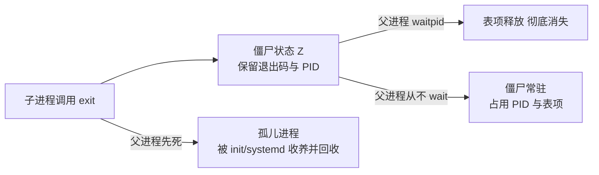

+++
title = 'fork与CreateProcess进程创建模型对比'
date = 2026-08-27T00:00:00+08:00
draft = false
categories = ['嵌入式']
tags = ['Linux', 'Windows', '进程', 'fork', 'CreateProcess']
+++

# fork与CreateProcess进程创建模型对比

## 题目

围绕进程创建与回收的系列问题：为什么说 fork "一次调用返回两次"？Windows 的 CreateProcess 是什么模型？僵尸进程和孤儿进程是怎么产生的，Windows 上为什么没有僵尸进程？

## 考察点

两种进程创建模型的语义差异（复制式 vs 构造式）、进程退出与回收的状态机、句柄与文件描述符两种"回收责任"模型、QProcess 跨平台封装的对应关系

## 回答要点

### 1. 两种创建模型：复制式 vs 构造式

Unix 把"创建进程"和"装载程序"拆成两个独立原语：

- `fork()`：复制当前进程。内核为子进程建好 task_struct、复制页表（物理页写时复制共享，COW 细节见《fork与写时复制COW机制》），父子从 fork 调用点**各自继续执行**——这就是"一次调用返回两次"的由来：父进程拿到子进程 PID，子进程拿到 0
- `exec` 族：把当前进程的程序映像**整个替换**成新程序。PID 不变、打开的 fd 默认保留，只是代码和数据换了一茬

```c
pid_t pid = fork();
if (pid == 0) {
    /* 子进程：换上新程序，从此不再返回 */
    execl("/usr/bin/ls", "ls", "-l", NULL);
    _exit(127);                     /* exec 成功不会走到这里 */
}
/* 父进程：pid 是子进程编号 */
waitpid(pid, NULL, 0);
```

两步走的价值在于 **fork 之后、exec 之前有一个窗口期**，子进程可以任意调整自己的 fd：`dup2` 接好重定向、`close` 多余的句柄，然后再换成新程序。Shell 管道 `ls | grep xx` 正是这样实现的——先把管道两端接到 stdout/stdin，再 exec。

Windows 没有这个中间态。`CreateProcess` 是构造式的：**一步完成"建进程 + 装载 EXE"**，必须显式给出可执行文件路径，不存在"复制自身"的语义。没有返回两次的函数，没有 COW 页错误，也没有"fork 前忘 fflush 导致输出重复"这类经典坑（stdio 缓冲被复制是 fork 特有的现象）。

### 2. Windows 的 CreateProcess 要点

```c
STARTUPINFO si = { sizeof(si) };
PROCESS_INFORMATION pi;
TCHAR cmdline[] = TEXT("child.exe --mode=batch");   /* 必须是可写缓冲区 */

BOOL ok = CreateProcess(NULL, cmdline, NULL, NULL,
                        TRUE,                        /* bInheritHandles */
                        CREATE_NO_WINDOW, NULL, NULL, &si, &pi);
if (ok) {
    WaitForSingleObject(pi.hProcess, INFINITE);
    DWORD code = 0;
    GetExitCodeProcess(pi.hProcess, &code);
    CloseHandle(pi.hThread);                         /* 两个句柄都要关 */
    CloseHandle(pi.hProcess);
}
```

与 fork 对照的几个关键差异：

1. **重定向走 STARTUPINFO**：`si.hStdOutput` 等三个标准句柄 + `STARTF_USESTDHANDLES` 标志，配合 `bInheritHandles = TRUE`。这相当于把"fork 后 dup2"那一步合并进了创建参数；不希望被子进程继承的句柄要用 `SetHandleInformation(h, HANDLE_FLAG_INHERIT, 0)` 显式摘掉，而 Unix 是默认不继承、`FD_CLOEXEC` 控制的方向相反
2. **返回的是句柄不是 PID**：`PROCESS_INFORMATION` 里的 `hProcess`/`hThread` 是内核对象句柄，用完必须 `CloseHandle`，否则泄漏的是内核对象引用
3. **没有父进程的内存副本**：子进程从 `main`/`WinMain` 全新启动，不继承父进程的任何用户态状态（环境变量、当前目录这类显式参数除外）

### 3. 僵尸进程与孤儿进程：Unix 的回收状态机

Unix 上子进程退出后**不是立刻消失**：内核保留它的进程表项（PID、退出状态、资源用量），状态置为 `Z`（zombie），等父进程调用 `wait`/`waitpid` "收割"后才真正释放。设计意图是让父进程总能取到子进程的死因。



- **僵尸进程**：父进程不 wait 的产物。危害是慢性泄漏 PID（`ps` 里可见 `<defunct>`），父进程退出后僵尸会被 init 收走、自动消失
- **孤儿进程**：父进程先死，子进程被过继给 init/systemd（PID 1），由它负责 wait——孤儿无害，是 daemon 双 fork 技巧的基础（见《守护进程与Windows服务模型对比》）

避免僵尸的三个标准姿势：

```c
/* 姿势一：SIGCHLD 处理器里循环收割（必须循环，信号不排队） */
void on_sigchld(int sig) {
    while (waitpid(-1, NULL, WNOHANG) > 0) { }
}
signal(SIGCHLD, on_sigchld);

/* 姿势二：显式声明不关心子进程状态，内核自动回收（POSIX 保证） */
signal(SIGCHLD, SIG_IGN);

/* 姿势三：fork 两次，孙子过继给 init，儿子立刻退出被 wait */
```

### 4. Windows 为什么没有僵尸进程

Windows 的进程是**内核对象**，生命周期由句柄引用计数管理，没有"等父进程收割"的中间态：

- 进程退出 → 内核把它标记为 signaled（受信），退出码存在对象里，进程的地址空间和线程立即销毁
**剩下的是一个轻量的"尸体对象"**：PID、退出码等元数据，只要有任何句柄还开着就保留，供 `WaitForSingleObject` 等待、`GetExitCodeProcess` 查询
- 所有句柄 `CloseHandle` 之后，尸体对象被销毁，PID 可复用

对照着看，两边的"泄漏物"正好相反：

| | Unix | Windows |
|---|---|---|
| 谁掌握退出信息 | 内核进程表项（僵尸态） | 进程内核对象本体 |
| 父进程的责任 | 必须 wait，否则僵尸占表项 | 无强制责任，只有想拿退出码才需要等 |
| 泄漏的形态 | 忘 wait → 僵尸进程 | 忘 CloseHandle → 对象/PID 迟迟不复用 |
| 父进程先死 | 孤儿被 init 收养 | 子进程照常运行，只是没有"父"的概念（父子关系仅记名，不做回收） |

顺带一个 Windows 特有现象：任务管理器结束进程不需要它的"父进程"配合，`OpenProcess` + `TerminateProcess` 就能对任意有权限的进程下手（见《信号机制与Windows异常处理对比》）；Unix 里 kill 信号模型与此对应但语义细节不同。

### 5. Qt 的封装：QProcess

`QProcess` 内部就是本篇两边机制的分叉点（`#ifdef Q_OS_UNIX` 走 fork+exec、`Q_OS_WIN` 走 CreateProcess）：

```cpp
QProcess proc;
proc.start("child.exe", {"--mode=batch"});

/* 想要子进程输出：Unix 上是 pipe+fd 重定向，Windows 上是匿名管道句柄继承 */
connect(&proc, &QProcess::readyReadStandardOutput, [&]{
    qDebug() << proc.readAllStandardOutput();
});

connect(&proc, QOverload<int, QProcess::ExitStatus>::of(&QProcess::finished),
        [](int code, QProcess::ExitStatus /*status*/){
    /* 两种平台都在这里统一收到退出码——Unix 来自 waitpid 的 status，Windows 来自 GetExitCodeProcess */
});
```

`waitForFinished()` / `finished` 信号在 Unix 上对应 waitpid，在 Windows 上对应 WaitForSingleObject；`setProcessChannelMode(Redirected)` 对应两边的重定向机制。跨平台代码里永远不应该出现裸的 fork 或 CreateProcess——出现即说明该模块已经放弃可移植性。

### 6. 总结对照表

| 维度 | Unix（fork+exec） | Windows（CreateProcess） |
|---|---|---|
| 创建语义 | 复制自身，可再 exec 替换 | 指定 EXE 一步到位 |
| 返回模型 | 一次调用返回两次 | BOOL 成败 + 输出句柄 |
| 继承内容 | fd 表、信号处理、COW 地址空间 | 显式参数：环境、当前目录、可继承句柄 |
| 重定向时机 | fork 后 exec 前 dup2 | 创建时 STARTUPINFO 传入 |
| 退出信息载体 | 僵尸表项，wait 收割 | 进程对象 signaled，句柄查询 |
| 常见泄漏 | 僵尸（忘 wait） | 句柄（忘 CloseHandle） |

## 扩展问题

可以进一步追问：

- `posix_spawn` 是为了解决 fork+exec 的什么问题？它和 CreateProcess 的模型更接近吗？
- Linux 上 fork 之后子进程里 `getppid()` 什么时候会变成 1？`PR_SET_CHILD_SUBREAPER` 改变了什么？
- Cygwin 在 Windows 上模拟 fork 为什么要"逐段复制地址空间"，慢在哪一步？
- QProcess 在 Windows 上创建子进程时，为什么子进程默认收不到父进程控制台的 Ctrl+C？（引出 `CREATE_NEW_PROCESS_GROUP`）
