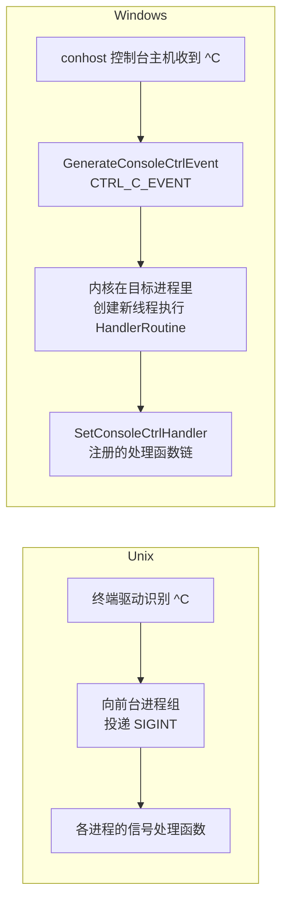

+++
title = '信号机制与Windows异常处理对比'
date = 2026-08-27T00:00:00+08:00
draft = false
categories = ['嵌入式']
tags = ['Linux', 'Windows', '信号', 'SEH', '进程管理']
+++

# 信号机制与Windows异常处理对比

## 题目

围绕信号与异步事件的系列问题：信号的本质是什么？SIGPIPE 为什么会杀死进程？段错误捕获后能恢复执行吗？Ctrl+C 是怎么到达进程的？Windows 上这些分别对应什么机制？

## 考察点

Unix 信号模型（生成/未决/递送三阶段）、信号与 Windows 异常处理、控制台事件两套体系的映射关系、"结论只对 POSIX 成立"的辨别能力

## 回答要点

### 1. 信号的本质：内核向进程注入的异步软件中断

信号是"内核在任意时刻打断进程正常控制流"的机制，生命周期分三步：

1. **生成**：`kill()`/内核事件（子进程退出产生 SIGCHLD、对端关闭触发 SIGPIPE、非法访问触发 SIGSEGV）
2. **未决（pending）**：信号挂在该进程的未决集合上，同类信号不排队——处理函数执行期间再来一个同类信号会被记住，来三个只记一个
3. **递送（delivery）**：进程从内核态返回用户态的检查点上，内核改写其上下文跳进信号处理函数，返回后再回到被打断的位置

三种处置方式：默认动作（终止/核心转储/停止/忽略）、显式忽略、捕获（`sigaction` 注册处理函数）。其中 **SIGKILL 和 SIGSTOP 不可捕获、不可阻塞**——这就是 `kill -9` 必杀的原理：它不是"优先级更高的信号"，而是被内核豁免了用户干预。

信号是全局可变状态：任何知道你 PID 的进程都能给你发信号，处理函数会在任意线程的任意两条指令之间被调用。这个设计被 Windows 刻意拒绝了（NT 设计上讨厌全局可变状态），于是有了完全不同的替代品。

### 2. SIGPIPE 陷阱：一个只在 Unix 上成立的著名结论

常见结论："往对端已关闭的管道或 socket 写数据，进程会被 SIGPIPE 默认动作杀死，服务端要先忽略它。"

```c
/* Unix 服务端的标准开场白 */
signal(SIGPIPE, SIG_IGN);      /* 忽略后 write 改为返回 -1 + errno==EPIPE */

/* Linux 还可以按次调用豁免：send(fd, buf, len, MSG_NOSIGNAL); */
```

Windows 上**没有 SIGPIPE 这个东西**。同样的场景——对端 `closesocket()` 之后继续 `send`——得到的是一个普普通通的失败返回：

```c
int n = send(sock, buf, len, 0);
if (n == SOCKET_ERROR && WSAGetLastError() == WSAECONNRESET) {
    /* Windows 的"对端已关闭"就是普通错误码，绝不会以信号形式出现 */
}
```

注意一个细节：忽略 SIGPIPE 后 Unix 返回 `EPIPE`，Windows 返回 `WSAECONNRESET`（对端 abortive 关闭）或 `WSAECONNABORTED`，错误码都不完全对应。跨平台网络代码里 SIGPIPE 是 `#ifdef` 的经典站位。

### 3. kill 与 Windows 的进程终止

| | Unix `kill(pid, sig)` | Windows `TerminateProcess(h, code)` |
|---|---|---|
| 默认语义 | 只是投递信号，进程可捕获 | 内核直接终结，无任何用户态通知机会 |
| 可否优雅退出 | SIGTERM 可捕获做清理 | 不执行 DllMain(DLL_PROCESS_DETACH)，DLL 清理代码不运行 |
| 必杀 | SIGKILL（不可捕获） | TerminateProcess 本身就是"必杀" |
| 优雅惯例 | 先 SIGTERM，超时再 SIGKILL | 发 `WM_CLOSE`/控制台 CTRL_CLOSE_EVENT/自定义事件，超时再 TerminateProcess |

Unix 的"先礼后兵"两段式（TERM → KILL）在 Windows 上的对应物是"通知自杀 → 强杀"，但通知手段不再是统一的信号，而是按程序形态选：GUI 程序 `PostMessage(WM_CLOSE)`，控制台程序靠控制台事件，服务程序 `ControlService(SERVICE_CONTROL_STOP)`。

### 4. 段错误处理：信号 handler vs SEH，能力不对等

常见结论："段错误可以装 SIGSEGV 处理函数捕获。"两边都做得到，但**能力上限完全不同**。

Unix 侧：处理函数返回后，内核把上下文恢复到故障指令**重新执行**——大概率再次触发同一个 SIGSEGV，死循环。想活命只能 `siglongjmp` 整体跳走（或用 `ucontext` 手改寄存器）：

```c
sigjmp_buf jump;

void segv_handler(int sig) {
    siglongjmp(jump, 1);       /* 不能返回，返回等于再撞一次 */
}
```

Windows 侧的原生机制是 SEH（结构化异常处理）：

```c
int *p = NULL;

__try {
    *p = 42;                               /* 访问违规 */
}
__except (GetExceptionCode() == EXCEPTION_ACCESS_VIOLATION
              ? EXCEPTION_EXECUTE_HANDLER   /* 1：执行处理块 */
              : EXCEPTION_CONTINUE_SEARCH)  /* 0：继续向外层抛 */
{
    /* 处理块 */
    p = &fallback_buffer;
}

/* 过滤表达式若返回 EXCEPTION_CONTINUE_EXECUTION(-1)，
   可以在修复现场（改指针、改上下文）后直接回到故障指令重试——
   这是 Unix 信号模型做不到的事 */
```

三级过滤返回值的含义：

| 返回值 | 效果 |
|---|---|
| `EXCEPTION_CONTINUE_SEARCH` (0) | 本层不处理，继续向外层找 handler |
| `EXCEPTION_EXECUTE_HANDLER` (1) | 执行本层 `__except` 块，然后顺序往下走（跳过故障代码） |
| `EXCEPTION_CONTINUE_EXECUTION` (-1) | 重新执行故障指令——允许"修好再试" |

MSVC 的 `signal(SIGSEGV, ...)` 在 Windows 上底下就是拿 SEH（向量化异常处理）模拟的，语义自然也继承 SEH 的行为，而不是 POSIX 的。

### 5. Ctrl+C 的两条投递路径

Ctrl+C 怎么到达进程，两边是两套完整链路：



- Unix：**发给前台进程组**这个集合（作业控制概念，见《守护进程与Windows服务模型对比》）；进程可以捕获 SIGINT 做退出前清理
- Windows：控制台事件投递给**共享同一个控制台的所有进程**；`SetConsoleCtrlHandler(handler, TRUE)` 注册处理函数（原型 `BOOL WINAPI HandlerRoutine(DWORD ctrlType)`），返回 TRUE 表示已处理。**没注册处理函数的进程由默认处理函数直接终止**。GUI 程序没有控制台，压根不存在 Ctrl+C 这回事

一个 Qt/Windows 工程常见坑：父进程启动的控制台子进程默认和父进程同控制台，用户按 Ctrl+C 时**父子一起收到**；用 `CREATE_NEW_PROCESS_GROUP` 创建的子进程则对 Ctrl+C 免疫（只剩 CTRL_BREAK_EVENT 能送达），需要配合管道或事件做自定义退出通知。

### 6. CRT 的 signal() 在 Windows 上只是模拟

`<signal.h>` 的 `signal()` 在 MSVC 下存在但只覆盖 `SIGINT`/`SIGSEGV`/`SIGFPE`/`SIGILL`/`SIGTERM`/`SIGBREAK` 少数几个，且是 CRT 在用户态的模拟：`raise()` 自己发的能收到，内核来源的事件走的是 SEH/控制台事件的翻译，语义与 POSIX 有出入（例如多线程下哪个线程执行 handler 不可控）。**把 CRT 的 signal 当 POSIX 信号用是移植事故高发区**——它既收不到 `kill`，也没有 SIGPIPE/SIGCHLD 可言。

### 7. 映射总表

| Unix 机制 | Windows 对应物 | 备注 |
|---|---|---|
| `kill(pid, SIGTERM)` | `PostMessage(WM_CLOSE)` / 控制台事件 / 服务控制命令 | 通知手段按程序形态分裂 |
| `kill -9` | `TerminateProcess` | 都不给清理机会 |
| SIGPIPE 杀进程 | 不存在，`send` 返回 WSAECONNRESET | 跨平台 `#ifdef` 经典站位 |
| SIGCHLD + waitpid | 进程对象 signaled + WaitForSingleObject | 见《fork与CreateProcess进程创建模型对比》 |
| SIGINT (Ctrl+C) | CTRL_C_EVENT 控制台事件 | 投递给同控制台进程而非进程组 |
| SIGSEGV handler | SEH `__except` | SEH 可修复后重执行，信号不行 |
| 信号屏蔽 sigprocmask | 无对应（事件模型不需要） | — |
| 定时信号 alarm | `SetTimer`/`CreateWaitableTimer` | 消息或内核对象，不是信号 |

## 扩展问题

可以进一步追问：

- 信号处理函数为什么必须是 async-signal-safe 的？在 handler 里调 `printf`/`malloc` 风险在哪？
- `sigaltstack`（备用信号栈）解决什么问题？栈溢出触发的 SIGSEGV 为什么必须用它？
- SEH 的栈展开和 C++ 异常的栈展开为什么不能混用（`/EHs` 与 `__try` 同函数的限制）？
- 向量化异常处理（VEH，`AddVectoredExceptionHandler`）和普通 SEH 的调用顺序是什么关系？
