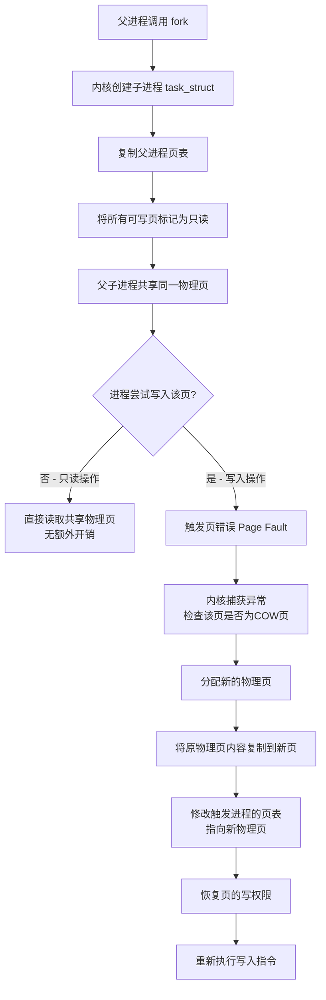

+++
title = 'fork与写时复制COW机制'
date = 2026-05-06T00:00:00+08:00
draft = false
categories = ['嵌入式']
tags = ['Linux', '进程', 'fork', '写时复制', 'COW', '虚拟内存']
+++

# fork与写时复制COW机制

## 题目

fork() 之后父子进程的内存是如何管理的？写时复制（COW）是如何工作的？触发COW的代价是什么？

## 考察点

Linux进程管理、虚拟内存机制、写时复制原理、系统性能考量

## 回答要点

### 1. fork() 的基本行为

`fork()` 是Linux中创建新进程的核心系统调用。调用 `fork()` 后，内核会创建一个与父进程几乎完全相同的子进程，子进程获得父进程地址空间的一个**副本**。具体行为如下：

- **代码段（Text Segment）**：父子进程共享同一份物理内存中的代码段，因为代码段是只读的，不需要复制。
- **数据段（Data Segment）、堆（Heap）、栈（Stack）**：通过写时复制（COW）机制共享，只有在写入时才会真正复制物理页。
- **文件描述符表**：子进程继承父进程所有打开的文件描述符，指向相同的文件表项（引用计数+1）。
- **进程控制块（PCB）**：内核为子进程创建独立的 `task_struct`，拥有独立的PID、运行状态、调度信息等。

`fork()` 的返回值在父子进程中不同：

- 父进程中返回子进程的PID（大于0）
- 子进程中返回0
- 出错时返回-1

通过判断返回值，程序员可以让父子进程执行不同的代码分支，这是Unix进程创建的经典模式。

### 2. 传统fork的内存复制问题

在早期Unix实现中，`fork()` 会将父进程的**整个地址空间**完整复制到子进程。这意味着即使子进程紧接着调用 `exec()` 加载一个全新的程序，之前复制的数据段、堆、栈等全部被丢弃，造成了严重的资源浪费。

典型的 `fork + exec` 模式（如Shell创建子进程执行命令）：

```
父进程 fork() → 复制整个地址空间（可能数百MB）→ 子进程 exec() → 丢弃所有复制内容
```

这种模式的问题：

1. **内存浪费**：大量物理页被复制后立即丢弃，造成内存的峰值占用。
2. **时间浪费**：复制数百MB的地址空间需要消耗大量CPU时间，增加延迟。
3. **性能瓶颈**：对于大内存进程，`fork()` 的耗时与进程地址空间大小成正比。

正是为了解决这些问题，现代Unix/Linux引入了**写时复制（Copy-On-Write, COW）**机制。

### 3. 写时复制（COW）原理

写时复制是现代操作系统中最优雅的优化之一。其核心思想是：**延迟复制，直到真正需要修改时才进行复制**。

#### 3.1 COW的工作流程



#### 3.2 详细机制说明

**fork时的操作：**

1. 内核为子进程创建新的 `task_struct` 和独立的页表。
2. 子进程的页表项直接指向父进程的物理页（而非复制物理页本身）。
3. 将父子进程中所有可写页的页表项标记为**只读**（清除 `_PAGE_WRITE` 标志位）。
4. 将这些物理页的引用计数设为2（表示被两个进程共享）。

**读操作：**

- 父子进程读取共享页时，直接通过各自的页表访问同一物理页，不触发任何异常，无额外开销。

**写操作：**

1. 任一进程尝试写入共享页时，由于页表项标记为只读，CPU产生**页错误异常（Page Fault）**。
2. 内核的缺页处理程序（`do_page_fault`）检查发现该页是COW页（通过检查 `VM_MAYWRITE` 和页表项的写保护标志）。
3. 内核分配一个新的物理页。
4. 将原物理页的内容复制到新物理页。
5. 修改触发写入的进程的页表项，使其指向新物理页，并恢复写权限。
6. 原物理页的引用计数减1，仍被另一个进程以只读方式共享。
7. 重新执行引发异常的写入指令。

#### 3.3 COW的内核数据结构

在Linux内核中，每个物理页通过 `struct page` 管理，其中包含引用计数 `_refcount`。COW机制依赖以下关键字段：

- `struct page._refcount`：物理页的引用计数，fork时设为2，COW后减为1。
- `pte`（页表项）中的写保护位：标记该页是否为COW只读页。
- `VMF`（VMA Fault信息）：缺页处理时用于判断是否为COW场景。

### 4. COW触发的代价

虽然COW在大多数情况下显著优于立即复制，但触发COW本身并非零成本。以下是详细的代价分析：

#### 4.1 页错误处理开销

一次COW页错误的完整处理流程涉及以下步骤：

| 步骤 | 操作 | 代价 |
|------|------|------|
| 1 | CPU检测到写保护违规，产生异常 | 硬件异常处理 |
| 2 | 陷入内核态，保存用户态上下文 | 上下文切换 |
| 3 | 内核查找VMA，验证访问合法性 | 内核数据结构查找 |
| 4 | 判断为COW页，分配新物理页 | 内存分配（可能触发回收） |
| 5 | 复制原页内容到新页（4KB数据拷贝） | 内存带宽消耗 |
| 6 | 更新页表项，设置写权限 | TLB刷新 |
| 7 | 刷新TLB缓存 | TLB Shootdown（多核场景） |
| 8 | 恢复用户态，重新执行写入指令 | 上下文切换 |

单次COW页错误的处理时间通常在**微秒级（1-10us）**，相比直接内存写入（纳秒级）慢了约**1000倍**。

#### 4.2 频繁COW的性能影响

| 场景 | 影响 | 严重程度 |
|------|------|----------|
| 大量小写入（逐字节修改不同页） | 每次写入都可能触发一次COW，频繁陷入内核 | 高 |
| 大块连续写入（同一页内多次写入） | 仅首次写入触发COW，后续写入正常 | 低 |
| fork后立即exec | 几乎不触发COW（exec会替换整个地址空间） | 无 |
| fork后大量修改共享数据 | 大量COW，性能接近甚至低于传统fork | 高 |
| 多进程并发修改同一数据 | 每个进程各自触发COW，内存占用膨胀 | 中高 |

#### 4.3 内存压力

COW期间，被修改的页会占用额外的物理内存：

- **最坏情况**：父子进程修改了所有共享页，物理内存占用翻倍（2x）。
- **典型情况**：部分页被修改，物理内存占用约为原来的 **1.5倍**。
- 在内存紧张的嵌入式系统中，COW可能导致OOM（Out of Memory）。

#### 4.4 实时性影响

对于实时性要求高的嵌入式系统，COW的延迟不确定性是一个重要问题：

- 页错误处理时间不确定：从微秒到毫秒级（涉及内存回收时）。
- TLB Shootdown在多核系统中需要IPI（核间中断），延迟不可预测。
- 无法保证实时任务的截止时间。

#### 4.5 代价总结

| 维度 | 无COW时 | 有COW时（最佳） | 有COW时（最差） |
|------|---------|----------------|----------------|
| fork延迟 | 与地址空间大小成正比 | 与页表大小成正比（极低） | 同左 |
| 内存占用 | 立即翻倍 | 共享，几乎不增加 | 修改后翻倍 |
| 写入延迟 | 正常（纳秒级） | 正常（未触发COW） | 微秒级（触发COW） |
| 实时性 | fork时延迟大 | fork时延迟小 | 写入时延迟不确定 |

### 5. fork() 返回后的父子进程差异

尽管子进程是父进程的"副本"，但两者在多个方面存在关键差异：

| 属性 | 父进程 | 子进程 |
|------|--------|--------|
| **PID** | 原有PID | 新分配的PID |
| **PPID** | 不变 | 父进程的PID |
| **fork()返回值** | 子进程的PID（>0） | 0 |
| **文件锁（flock）** | 不继承 | 不继承 |
| **文件描述符** | 共享（引用计数+1） | 共享（引用计数+1） |
| **文件偏移量** | 共享 | 共享 |
| **异步I/O操作** | 不共享 | 不共享 |
| **定时器（alarm/setitimer）** | 保留 | 清零 |
| **信号处理函数** | 继承 | 继承 |
| **未决信号** | 不继承 | 清空 |
| **资源统计（ru_usage）** | 不继承 | 清零 |
| **tms_utime/tms_stime** | 不继承 | 清零 |
| **挂起的信号** | 不继承 | 清空 |
| **内存锁（mlock）** | 不继承 | 不继承 |
| **已完成的I/O** | 不继承 | 不继承 |

### 6. 代码示例

以下代码演示了fork后父子进程的内存共享与COW行为：

```c
#include <stdio.h>
#include <stdlib.h>
#include <string.h>
#include <unistd.h>
#include <sys/types.h>
#include <sys/wait.h>

int global_var = 100;

int main(void)
{
    pid_t pid;
    int stack_var = 200;
    int *heap_var = (int *)malloc(sizeof(int));
    *heap_var = 300;

    printf("fork前 - 全局变量地址: %p, 值: %d\n", &global_var, global_var);
    printf("fork前 - 栈变量地址:   %p, 值: %d\n", &stack_var, stack_var);
    printf("fork前 - 堆变量地址:   %p, 值: %d\n", heap_var, *heap_var);

    pid = fork();

    if (pid < 0) {
        perror("fork失败");
        return -1;
    } else if (pid == 0) {
        /* 子进程 */
        printf("\n--- 子进程 (PID: %d) ---\n", getpid());
        printf("fork返回值: %d\n", pid);

        /* 修改各区域的变量，触发COW */
        global_var = 111;
        stack_var = 222;
        *heap_var = 333;

        printf("修改后 - 全局变量地址: %p, 值: %d\n", &global_var, global_var);
        printf("修改后 - 栈变量地址:   %p, 值: %d\n", &stack_var, stack_var);
        printf("修改后 - 堆变量地址:   %p, 值: %d\n", heap_var, *heap_var);

        free(heap_var);
    } else {
        /* 父进程 */
        wait(NULL);

        printf("\n--- 父进程 (PID: %d) ---\n", getpid());
        printf("fork返回值: %d (子进程PID)\n", pid);

        /* 父进程的变量应保持不变 */
        printf("父进程 - 全局变量地址: %p, 值: %d\n", &global_var, global_var);
        printf("父进程 - 栈变量地址:   %p, 值: %d\n", &stack_var, stack_var);
        printf("父进程 - 堆变量地址:   %p, 值: %d\n", heap_var, *heap_var);

        free(heap_var);
    }

    return 0;
}
```

编译并运行：

```bash
gcc -o cow_demo cow_demo.c
./cow_demo
```

预期输出：

```
fork前 - 全局变量地址: 0x404060, 值: 100
fork前 - 栈变量地址:   0x7ffd1234567c, 值: 200
fork前 - 堆变量地址:   0x55a1abcdef00, 值: 300

--- 子进程 (PID: 12345) ---
fork返回值: 0
修改后 - 全局变量地址: 0x404060, 值: 111
修改后 - 栈变量地址:   0x7ffd1234567c, 值: 222
修改后 - 堆变量地址:   0x55a1abcdef00, 值: 333

--- 父进程 (PID: 12344) ---
fork返回值: 12345 (子进程PID)
父进程 - 全局变量地址: 0x404060, 值: 100
父进程 - 栈变量地址:   0x7ffd1234567c, 值: 200
父进程 - 堆变量地址:   0x55a1abcdef00, 值: 300
```

**关键观察**：

1. 父子进程中相同变量的**虚拟地址相同**（页表机制保证）。
2. 子进程修改变量后，父进程的值**不受影响**，说明COW已触发，各自拥有独立的物理页。
3. fork前打印的地址与fork后相同，说明虚拟地址空间布局完全一致。

### 7. vfork() 与 fork() 的区别

`vfork()` 是一个历史遗留的系统调用，设计目的是在 `fork + exec` 模式中避免不必要的地址空间复制。

#### 7.1 vfork()的设计

`vfork()` 创建子进程时**不复制页表**，子进程直接在父进程的地址空间中运行，直到调用 `exec()` 或 `_exit()`。这意味着：

- 子进程对栈、数据段的修改会直接影响父进程。
- 子进程不能从当前函数返回（因为会破坏父进程的栈帧）。
- 父进程在子进程调用 `exec()` 或 `_exit()` 之前被**挂起**。

#### 7.2 对比表格

| 特性 | fork() | vfork() |
|------|--------|---------|
| **地址空间** | 独立的地址空间（COW） | 共享父进程地址空间 |
| **页表复制** | 复制页表 | 不复制页表 |
| **父进程状态** | 并发运行 | 挂起，等待子进程exec或exit |
| **子进程修改内存** | 不影响父进程（COW保证） | 直接影响父进程 |
| **子进程能否返回** | 可以正常返回 | 不能从调用函数返回（未定义行为） |
| **安全性** | 安全 | 不安全，容易出错 |
| **性能** | 较好（COW优化） | 最佳（无复制开销） |
| **适用场景** | 通用进程创建 | 仅用于fork+exec模式 |
| **现代建议** | 推荐使用 | 不推荐，使用fork即可 |

#### 7.3 vfork() 的使用示例

```c
#include <stdio.h>
#include <stdlib.h>
#include <unistd.h>
#include <sys/types.h>
#include <sys/wait.h>

int main(void)
{
    pid_t pid;

    pid = vfork();

    if (pid < 0) {
        perror("vfork失败");
        return -1;
    } else if (pid == 0) {
        /* 子进程 - 必须尽快调用exec或_exit */
        /* 绝对不能调用return，不能访问局部变量 */
        _exit(0);
    }

    /* 父进程 - 在子进程调用_exit后才会执行 */
    printf("父进程继续执行\n");

    return 0;
}
```

**注意**：在现代Linux中，由于 `fork()` 的COW机制已经非常高效，`vfork()` 几乎不再有性能优势。Linux手册页明确建议：**在新代码中应避免使用 `vfork()`**。

### 8. 嵌入式Linux中的应用

在嵌入式Linux系统中，`fork()` 和COW机制有着广泛的应用场景：

#### 8.1 进程创建与程序执行

嵌入式系统中最常见的模式仍然是 `fork + exec`：

```c
pid_t pid = fork();
if (pid == 0) {
    /* 子进程执行新程序 */
    execl("/usr/bin/my_app", "my_app", "-d", NULL);
    perror("exec失败");
    _exit(1);
}
/* 父进程继续执行 */
```

由于 `exec()` 会替换整个地址空间，COW机制确保了 `fork()` 本身的开销极小。

#### 8.2 守护进程创建

嵌入式系统中常见的守护进程（如日志服务、网络守护进程）通过 `fork()` 创建：

```c
void create_daemon(void)
{
    pid_t pid = fork();
    if (pid < 0) exit(1);
    if (pid > 0) exit(0);

    /* 子进程成为新的会话组长 */
    if (setsid() < 0) exit(1);

    /* 再次fork，确保不是会话组长，防止重新获取终端 */
    pid = fork();
    if (pid < 0) exit(1);
    if (pid > 0) exit(0);

    /* 设置工作目录、文件权限掩码等 */
    chdir("/");
    umask(0);
}
```

#### 8.3 多进程架构

嵌入式系统中常见的多进程架构：

- **主进程 + 工作进程**：主进程负责管理，工作进程负责具体任务（如Nginx的worker进程模型）。
- **监控进程（Watchdog）**：通过 `fork()` 创建被监控的子进程，父进程负责监控和重启。
- **管道通信**：`fork()` 后父子进程通过管道进行数据传递。

#### 8.4 嵌入式系统中的注意事项

1. **内存受限**：嵌入式设备内存通常有限，大量fork可能导致OOM，应控制并发进程数量。
2. **实时性要求**：COW的页错误延迟不确定，对硬实时系统可能不适用，可考虑使用 `posix_spawn()` 替代 `fork + exec`。
3. **Flash存储**：嵌入式设备使用Flash而非磁盘，`exec()` 加载程序的速度可能较慢。
4. **资源限制**：可通过 `setrlimit()` 限制子进程的内存使用，防止COW导致内存耗尽。
5. **posix_spawn()**：对于仅执行新程序的场景，`posix_spawn()` 是更高效的选择，它直接创建新进程并加载程序，避免了 `fork()` 的开销。
