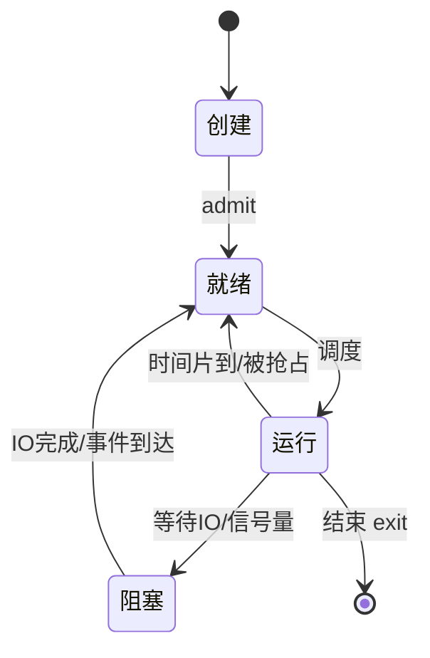

+++
title = '进程状态转换与内核对象'
date = 2026-08-10T00:00:00+08:00
draft = false
categories = ['嵌入式']
tags = ['面试题', '进程', '进程状态', '内核对象', '操作系统', '句柄']
+++

# 进程状态转换与内核对象

## 题目

1. 进程有哪几种状态？
2. 内核对象是什么？用过哪些？有什么注意事项？

## 考察点

操作系统进程模型、内核对象与句柄机制、跨进程共享与资源管理。

## 回答要点

### 1. 进程的几种状态

经典的进程三态模型 + 现代操作系统的五态扩展：



| 状态 | 含义 | 转移条件 |
|------|------|----------|
| 创建 (New) | 正在分配 PCB、资源 | admit → 就绪 |
| 就绪 (Ready) | 已具备运行条件，等 CPU | 调度 → 运行 |
| 运行 (Running) | 占有 CPU 执行 | 时间片到 → 就绪；等待 → 阻塞；结束 → 终止 |
| 阻塞 (Blocked/Wait) | 等待某事件（IO、锁、信号） | 事件完成 → 就绪 |
| 终止 (Terminated) | 执行完毕或被强制结束 | 释放资源 |

#### 五态 vs 七态（带挂起）

现代系统还会引入**挂起（Suspend）**状态——把进程换出到磁盘，腾出内存：

| 状态 | 含义 |
|------|------|
| 就绪挂起 (Ready-Suspend) | 进程在外存，就绪但未调入内存 |
| 阻塞挂起 (Blocked-Suspend) | 在外存且等待事件 |

Linux 的进程状态略有不同（用 `TASK_*` 宏）：

```c
// Linux 内核进程状态（include/linux/sched.h）
#define TASK_RUNNING        0x0000   // 就绪或运行（内核不区分）
#define TASK_INTERRUPTIBLE  0x0001   // 可中断睡眠（可被信号唤醒）
#define TASK_UNINTERRUPTIBLE 0x0002  // 不可中断睡眠（D 状态，等 IO）
#define __TASK_STOPPED      0x0004   // 停止（SIGSTOP）
#define EXIT_ZOMBIE         0x0020   // 僵尸（已死等父进程 wait）
```

```bash
# ps 看到的状态字母
# R = Running, S = Sleeping(可中断), D = 不可中断睡眠
# Z = Zombie, T = Stopped
$ ps -eo pid,stat,cmd
  PID STAT CMD
1234 S    sleep 100        # S: 可中断睡眠
1235 R    busy_loop         # R: 运行/就绪
1236 Z    [defunct] <zombie># Z: 僵尸
```

#### 僵尸进程 (Zombie)

```c
// 子进程退出后，父进程还没 wait，子进程的 PCB 残留 → 僵尸
pid_t pid = fork();
if (pid == 0) {
    exit(0);            // 子进程退出，但 PCB 还在等父进程收尸
}
// 父进程没调 waitpid()，子进程变僵尸
```

僵尸进程本身不占内存（只剩 PCB），但占 PID 资源；大量僵尸会耗尽 PID 表。修复：父进程调 `wait`/`waitpid`，或忽略 `SIGCHLD`，或杀掉父进程让 init 收养。

### 2. 内核对象是什么

**内核对象（Kernel Object）**是操作系统内核管理的一类数据结构，用于抽象系统资源：进程、线程、文件、信号量、互斥锁、事件、定时器、共享内存等。

每个内核对象在内核空间有一份结构体（如 Linux 的 `task_struct`、`file`、`inode`），用户态无法直接访问，只能通过**句柄（Handle）/描述符（fd）**间接操作。

```c
// 用户态看到的只是"句柄"（一个整数或指针）
int fd = open("/tmp/a.txt", O_RDONLY);   // fd 是文件对象的句柄
read(fd, buf, 100);                       // 通过句柄让内核操作真正的对象
close(fd);                                // 释放句柄，引用计数减一

// Windows 用 HANDLE（指针）
HANDLE h = CreateMutex(NULL, FALSE, NULL);
WaitForSingleObject(h, INFINITE);
CloseHandle(h);
```

### 3. 常见内核对象

| 平台 | 通用 | 进程/线程 | 同步 | IO/通信 | 内存 |
|------|------|----------|------|---------|------|
| Linux | file/inode | task_struct | semaphore/mutex | socket/pipe | vm_area_struct |
| 句柄 | fd（整数） | pid/tid | fd | fd | - |
| Windows | HANDLE | Process/Thread | Mutex/Semaphore/Event | File/Socket | Section/FileMapping |

#### 内核对象的共性特征

1. **引用计数**：内核对象有引用计数，所有句柄关闭、所有引用它的内核结构释放后，对象才真正销毁。
2. **安全描述符（Windows）**：Windows 内核对象带安全属性（SD），可控制访问权限。
3. **可命名**：很多内核对象可以命名（如 `CreateMutex` 第三参数），用于跨进程寻址。
4. **跨进程共享**：通过命名、句柄继承、句柄复制（`DuplicateHandle`）等机制。

### 4. 用过哪些内核对象（结合嵌入式/系统开发）

```c
// 1. 进程/线程对象
pid_t pid = fork();          // Linux 创建进程（复制 task_struct）
pthread_t t;
pthread_create(&t, NULL, fn, arg);   // 创建线程

// 2. 文件对象
int fd = open("log.txt", O_RDWR | O_CREAT, 0644);

// 3. 信号量 / 互斥锁（进程间同步）
// Linux System V 信号量
int semid = semget(KEY, 1, IPC_CREAT | 0666);
struct sembuf op = {0, -1, SEM_UNDO};
semop(semid, &op, 1);        // P 操作

// POSIX 信号量（带名，跨进程）
sem_t* s = sem_open("/mysem", O_CREAT, 0644, 1);
sem_wait(s);

// 4. 共享内存对象
int shmid = shmget(KEY, 4096, IPC_CREAT | 0666);
void* addr = shmat(shmid, NULL, 0);

// 5. 套接字（网络对象）
int sock = socket(AF_INET, SOCK_STREAM, 0);

// 6. 定时器（timerfd / Windows Timer）
int tfd = timerfd_create(CLOCK_MONOTONIC, 0);
```

### 5. 内核对象使用的注意事项

#### 句柄泄漏

```c
// 错误：忘记 close
void bad() {
    int fd = open("data", O_RDONLY);
    read(fd, buf, 100);
    // 没 close(fd) → 每次调用泄漏一个 fd，最终 EMFILE
}

// 正确：用 RAII 或确保所有路径都关闭
void good() {
    int fd = open("data", O_RDONLY);
    if (fd < 0) return;
    // ... 操作 ...
    close(fd);
}
```

Linux 进程默认 fd 上限 1024（`ulimit -n`），泄漏到上限后 `open` 失败。

#### 句柄继承与跨进程

```c
// Linux：fork 后子进程继承父进程的 fd 表副本
pid_t pid = fork();
if (pid == 0) {
    // 子进程能访问父进程已打开的 fd
    write(parent_fd, "child", 5);
}

// 跨进程传递 fd：用 unix domain socket 的 SCM_RIGHTS
struct msghdr msg = {0};
char cmsgbuf[CMSG_SPACE(sizeof(int))];
// 把 fd 装进辅助数据发送，接收进程得到一个新 fd 指向同一文件对象
```

```c
// Windows：句柄可继承，也可 DuplicateHandle 复制到其他进程
HANDLE hDup;
DuplicateHandle(GetCurrentProcess(), hSource,
                hOtherProcess, &hDup,
                0, FALSE, DUPLICATE_SAME_ACCESS);
```

#### 引用计数与生命周期

```c
// 内核对象引用计数示例（Linux file 结构）
// open() → 引用计数 +1
// dup()/fork() → 引用计数 +1
// close() → 引用计数 -1
// 引用计数归零 → 内核释放 file 结构

int fd1 = open("a", O_RDONLY);
int fd2 = dup(fd1);     // 同一文件对象，fd 表多一项，引用计数 = 2
close(fd1);             // 引用计数 = 1，对象还在
close(fd2);             // 引用计数 = 0，真正释放
```

#### 安全性（Windows 特有）

```c
// Windows 创建内核对象时可指定安全描述符
SECURITY_ATTRIBUTES sa = { sizeof(sa), NULL, TRUE };  // TRUE = 句柄可继承
HANDLE h = CreateMutex(&sa, FALSE, L"Global\\MyMutex");
// 命名前缀 Global\ 表示全会话可见，跨用户共享
```

### 6. 用户态 vs 内核态访问


用户态不能直接读写内核对象内存，必须经过系统调用陷入内核，由内核代为操作。这是隔离与安全的根本机制。

## 扩展问题

面试官可能会追问：
- 僵尸进程和孤儿进程的区别？（僵尸是死了但父没收尸；孤儿是父先死被 init 收养）
- 为什么需要不可中断睡眠状态（D）？（等待磁盘 IO 时不能被信号打断，保证 IO 完整性）
- fd 和 FILE* 的区别？（fd 是内核句柄，FILE* 是 libc 缓冲包装层）
- 进程间如何安全共享内核对象？（命名对象、SCM_RIGHTS 传 fd、DuplicateHandle）
