+++
title = '进程间同步机制详解'
date = 2026-06-12T00:00:00+08:00
draft = false
categories = ['嵌入式']
tags = ['进程同步', '互斥锁', '信号量', '操作系统', '临界区']
+++

# 进程间同步机制详解

## 题目

进程间同步的机制有哪些？

## 考察点

进程/线程同步的基本概念、各种同步机制的原理与适用场景、临界区问题的经典解决方案。

## 回答要点

### 1. 为什么需要同步

多个进程或线程访问共享资源时，如果不加控制，会产生**竞态条件（Race Condition）**，导致数据不一致。

```c
// 两个线程同时对全局变量自增，不加同步保护
int counter = 0;

void* thread_func(void* arg) {
    for (int i = 0; i < 100000; i++) {
        counter++;  // 非原子操作：读 → 改 → 写
    }
    return NULL;
}

// 预期结果 200000，实际结果不确定（可能只有 130000 左右）
```

**临界区**：访问共享资源的代码段。同步机制的本质就是控制对临界区的互斥访问。

### 2. 同步 vs 通信——先分清概念

面试中经常把"同步"和"通信"混在一起问，但它们是两个不同的问题：

| | 同步（Synchronization） | 通信（IPC） |
|--|------------------------|------------|
| 解决什么问题 | 多个执行流访问共享资源时的**执行顺序** | 多个进程之间**传递数据** |
| 典型问题 | 竞态条件、死锁、优先级反转 | 数据怎么从 A 进程送到 B 进程 |
| 常见机制 | 互斥锁、信号量、自旋锁、条件变量 | 管道、消息队列、共享内存、Socket、信号 |

两者有交集（如信号量既能同步也能通信，共享内存需要同步保护），但核心关注点不同。本篇聚焦**同步**。

### 3. 线程同步 vs 进程同步

同步机制按作用域分为两类：

| | 线程同步（同一进程内） | 进程同步（跨进程） |
|--|---------------------|-------------------|
| 共享什么 | 共享地址空间，全局变量天然共享 | 地址空间独立，需要共享内存等 IPC |
| 同步开销 | 低（同一地址空间，锁就在内存里） | 高（锁需要放在共享内存，且设置 PROCESS_SHARED） |
| 典型机制 | pthread_mutex、pthread_cond、pthread_rwlock | SysV 信号量、共享内存 + pthread mutex（PROCESS_SHARED）、文件锁 |

**面试回答建议**：先说线程同步（面试最常问），再补充哪些机制可以跨进程使用。

### 4. 常见同步机制总览

| 机制 | 线程同步 | 进程同步 | 原理 | 适用场景 |
|------|:-------:|:-------:|------|---------|
| 互斥锁（Mutex） | 可以 | 可以（需 PROCESS_SHARED） | 加锁解锁，同一时刻只有一个执行流进入 | 通用保护临界区 |
| 信号量（Semaphore） | 可以 | 可以 | 计数器，P/V 操作控制并发数 | 限制并发访问数量 |
| 条件变量（Cond） | 可以 | 可以（需配合共享 mutex） | 等待/通知机制 | 生产者-消费者模型 |
| 读写锁（RWLock） | 可以 | 可以（需 PROCESS_SHARED） | 读共享、写独占 | 读多写少场景 |
| 自旋锁（Spinlock） | 可以 | 可以 | 忙等待（CPU 自旋） | 短临界区、中断上下文 |
| 屏障（Barrier） | 可以 | 较少用 | 所有线程到达后一起继续 | 多阶段并行计算 |
| 文件锁（flock） | 不常用 | 可以 | 对文件加锁 | 多进程文件操作 |

### 3. 互斥锁（Mutex）

最常用的同步机制。保证同一时刻只有一个线程进入临界区。

```c
#include <pthread.h>

pthread_mutex_t mutex = PTHREAD_MUTEX_INITIALIZER;
int shared_data = 0;

void* thread_func(void* arg) {
    for (int i = 0; i < 100000; i++) {
        pthread_mutex_lock(&mutex);      // 加锁
        shared_data++;                    // 临界区
        pthread_mutex_unlock(&mutex);    // 解锁
    }
    return NULL;
}
```

**跨进程使用**：需要设置 `PTHREAD_PROCESS_SHARED` 属性，且互斥锁本身要放在共享内存中。

```c
// 跨进程互斥锁初始化
pthread_mutex_t* shm_mutex;  // 位于共享内存中

pthread_mutexattr_t attr;
pthread_mutexattr_init(&attr);
pthread_mutexattr_setpshared(&attr, PTHREAD_PROCESS_SHARED);
pthread_mutex_init(shm_mutex, &attr);
```

### 4. 信号量（Semaphore）

信号量是一个计数器，通过 **P 操作（wait）** 和 **V 操作（signal）** 控制对资源的访问。

```c
#include <semaphore.h>

sem_t sem;
sem_init(&sem, 0, 3);  // 初始值 3，允许 3 个线程同时访问

// P 操作（获取资源）
sem_wait(&sem);   // 计数 -1，若为 0 则阻塞

// 访问资源
// ...

// V 操作（释放资源）
sem_post(&sem);   // 计数 +1，唤醒等待的线程
```

**互斥锁 vs 信号量**：

| 特性 | 互斥锁 | 信号量 |
|------|--------|--------|
| 计数值 | 0/1（二值） | 任意非负整数 |
| 所有权 | 加锁者必须解锁 | 任意线程可 post |
| 用途 | 互斥访问 | 互斥 + 同步（资源计数） |

**二值信号量可以替代互斥锁，但互斥锁有所有权概念更安全。**

### 7. 条件变量（Condition Variable）

条件变量用于**等待某个条件成立**，必须和互斥锁配合使用。

```c
#include <pthread.h>

pthread_mutex_t mutex = PTHREAD_MUTEX_INITIALIZER;
pthread_cond_t cond = PTHREAD_COND_INITIALIZER;
int data_ready = 0;

// 生产者
void producer(void) {
    pthread_mutex_lock(&mutex);
    // 生产数据...
    data_ready = 1;
    pthread_cond_signal(&cond);     // 通知消费者
    pthread_mutex_unlock(&mutex);
}

// 消费者
void consumer(void) {
    pthread_mutex_lock(&mutex);
    while (!data_ready) {           // 必须用 while，不能用 if
        pthread_cond_wait(&cond, &mutex);  // 解锁 → 等待 → 被唤醒后重新加锁
    }
    // 消费数据...
    data_ready = 0;
    pthread_mutex_unlock(&mutex);
}
```

**为什么必须用 while 而不是 if**：防止虚假唤醒（Spurious Wakeup），多个消费者可能被同时唤醒。

### 8. 读写锁（Read-Write Lock）

读操作可以并发，写操作独占。适用于读多写少的场景。

```c
#include <pthread.h>

pthread_rwlock_t rwlock = PTHREAD_RWLOCK_INITIALIZER;

// 读者
void reader(void) {
    pthread_rwlock_rdlock(&rwlock);   // 读锁（多个读者可同时持有）
    // 读取共享数据...
    pthread_rwlock_unlock(&rwlock);
}

// 写者
void writer(void) {
    pthread_rwlock_wrlock(&rwlock);   // 写锁（独占）
    // 修改共享数据...
    pthread_rwlock_unlock(&rwlock);
}
```

### 7. 自旋锁（Spinlock）

自旋锁在获取不到锁时**不会阻塞休眠**，而是在 CPU 上循环等待（自旋）。适用于临界区非常短的场景。

```c
#include <pthread.h>

pthread_spinlock_t spinlock;
pthread_spin_init(&spinlock, PTHREAD_PROCESS_SHARED);

pthread_spin_lock(&spinlock);
// 短临界区（几条指令）
pthread_spin_unlock(&spinlock);

pthread_spin_destroy(&spinlock);
```

**互斥锁 vs 自旋锁**：

| 特性 | 互斥锁 | 自旋锁 |
|------|--------|--------|
| 等待方式 | 阻塞休眠（上下文切换） | 忙等待（CPU 自旋） |
| 临界区长度 | 长短皆可 | 必须很短 |
| 上下文 | 可用于普通线程 | 可用于中断上下文 |
| CPU 占用 | 低（休眠让出 CPU） | 高（自旋不释放 CPU） |

**嵌入式中的典型用法**：中断处理函数和任务之间用自旋锁保护共享数据，因为中断上下文不能睡眠。

### 8. 各机制选择指南

```mermaid
graph TD
    A[需要同步] --> B{保护临界区?}
    B -->|互斥访问| C{临界区长度}
    C -->|短| D[自旋锁]
    C -->|长| E[互斥锁]
    B -->|限制并发数| F[信号量]
    B -->|等待条件| G[条件变量]
    B -->|读多写少| H[读写锁]
    B -->|跨进程| I{共享内存 + 进程间锁}
```



### 9. 经典问题：生产者-消费者

综合使用互斥锁 + 条件变量（或信号量）解决：

```c
#define BUF_SIZE 10

int buffer[BUF_SIZE];
int count = 0;
pthread_mutex_t mutex = PTHREAD_MUTEX_INITIALIZER;
pthread_cond_t not_full = PTHREAD_COND_INITIALIZER;
pthread_cond_t not_empty = PTHREAD_COND_INITIALIZER;

void produce(int item) {
    pthread_mutex_lock(&mutex);
    while (count == BUF_SIZE) {
        pthread_cond_wait(&not_full, &mutex);
    }
    buffer[count++] = item;
    pthread_cond_signal(&not_empty);
    pthread_mutex_unlock(&mutex);
}

int consume(void) {
    pthread_mutex_lock(&mutex);
    while (count == 0) {
        pthread_cond_wait(&not_empty, &mutex);
    }
    int item = buffer[--count];
    pthread_cond_signal(&not_full);
    pthread_mutex_unlock(&mutex);
    return item;
}
```

### 12. 嵌入式中的同步（RTOS 视角）

在 FreeRTOS 等 RTOS 中，同步机制对应关系：

| Linux 机制 | FreeRTOS 对应 |
|-----------|--------------|
| 互斥锁 | `xSemaphoreCreateMutex()` |
| 二值信号量 | `xSemaphoreCreateBinary()` |
| 计数信号量 | `xSemaphoreCreateCounting()` |
| 条件变量 | `xTaskNotify()` / 事件组 |
| 读写锁 | 无直接对应，需自行实现 |

**注意**：RTOS 中的 Mutex 有**优先级继承**机制，可以防止优先级反转问题。
