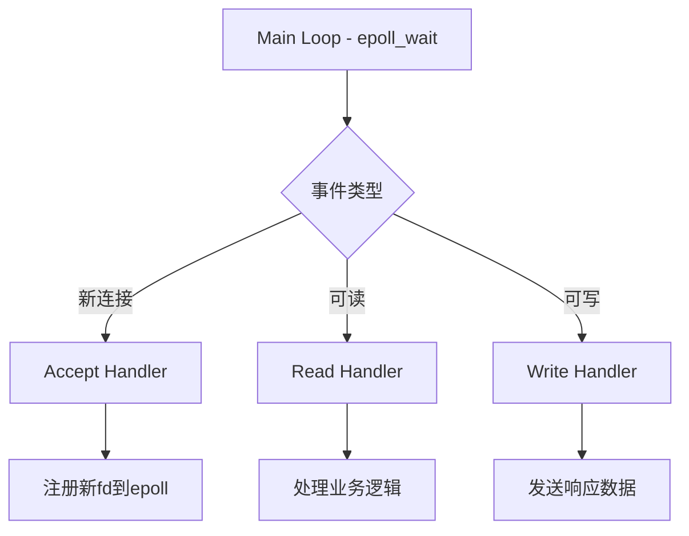

+++
title = 'TCP协议应用场景与高性能服务器实现'
date = 2026-02-26T00:00:00+08:00
draft = false
categories = ['嵌入式']
tags = ['TCP', '网络编程', '服务器', '并发模型']
+++

# TCP协议应用场景与高性能服务器实现

## 题目

1. TCP用于什么？（和上位机进行通信）
2. 如何实现一个高性能的TCP服务器？多线程、多进程、IO多路复用各有什么优缺点？

## 考察点

TCP在嵌入式系统中的应用场景、协议帧设计、心跳保活机制、高并发服务器架构（多线程/多进程/IO多路复用/Reactor模式）。

## 回答要点

### 1. TCP协议概述

**TCP（Transmission Control Protocol）** 是一种面向连接的、可靠的、基于字节流的传输层通信协议喵~

| 特性 | 说明 |
|------|------|
| 面向连接 | 通信前需要建立连接 |
| 可靠传输 | 保证数据无丢失、无重复、按序到达 |
| 流量控制 | 通过滑动窗口控制发送速率 |
| 拥塞控制 | 避免网络拥塞 |
| 全双工通信 | 支持双向数据传输 |

### 2. TCP在嵌入式系统中的应用场景

#### 2.1 与上位机通信

- **数据采集与监控**：传感器数据实时上传、设备状态监控、远程参数配置
- **固件升级**：OTA固件更新、分包传输大文件、断点续传
- **远程控制**：设备远程开关、参数远程调节、命令执行

#### 2.2 TCP客户端实现（嵌入式设备）

```c
#include <sys/socket.h>
#include <netinet/in.h>
#include <arpa/inet.h>

#define SERVER_IP "192.168.1.100"
#define SERVER_PORT 8888

int tcp_client_init() {
    int sock_fd;
    struct sockaddr_in server_addr;

    sock_fd = socket(AF_INET, SOCK_STREAM, 0);
    if (sock_fd < 0) {
        perror("socket creation failed");
        return -1;
    }

    server_addr.sin_family = AF_INET;
    server_addr.sin_port = htons(SERVER_PORT);
    inet_pton(AF_INET, SERVER_IP, &server_addr.sin_addr);

    if (connect(sock_fd, (struct sockaddr*)&server_addr, sizeof(server_addr)) < 0) {
        perror("connection failed");
        close(sock_fd);
        return -1;
    }

    return sock_fd;
}

int send_sensor_data(int sock_fd, float temperature, float humidity) {
    char buffer[256];
    int len;

    len = snprintf(buffer, sizeof(buffer),
                   "{\"temp\":%.2f,\"humi\":%.2f,\"timestamp\":%lu}",
                   temperature, humidity, get_timestamp());

    if (send(sock_fd, buffer, len, 0) < 0) {
        perror("send failed");
        return -1;
    }

    return 0;
}

int receive_command(int sock_fd, char *command, int max_len) {
    int len = recv(sock_fd, command, max_len - 1, 0);
    if (len > 0) {
        command[len] = '\0';
        return 0;
    }
    return -1;
}
```

#### 2.3 TCP服务器实现（上位机）

```python
import socket
import json
import threading

def tcp_server():
    server_socket = socket.socket(socket.AF_INET, socket.SOCK_STREAM)
    server_socket.bind(('0.0.0.0', 8888))
    server_socket.listen(5)

    print("TCP服务器启动，等待连接...")

    while True:
        client_socket, addr = server_socket.accept()
        print(f"设备连接: {addr}")

        client_thread = threading.Thread(target=handle_client, args=(client_socket,))
        client_thread.start()

def handle_client(client_socket):
    while True:
        try:
            data = client_socket.recv(1024)
            if not data:
                break

            sensor_data = json.loads(data.decode())
            print(f"温度: {sensor_data['temp']}°C, 湿度: {sensor_data['humi']}%")

            command = {"action": "status", "interval": 1000}
            client_socket.send(json.dumps(command).encode())

        except Exception as e:
            print(f"处理错误: {e}")
            break

    client_socket.close()
```

### 3. TCP通信协议设计

#### 3.1 协议帧格式

```
+--------+--------+--------+--------+--------+--------+
| 帧头   | 长度   | 类型   | 数据   | 校验   | 帧尾   |
+--------+--------+--------+--------+--------+--------+
| 2字节  | 2字节  | 1字节  | N字节  | 2字节  | 2字节  |
+--------+--------+--------+--------+--------+--------+
```

```c
#define FRAME_HEAD    0xAA55
#define FRAME_TAIL    0x55AA
#define MAX_DATA_LEN  1024

typedef struct {
    uint16_t head;
    uint16_t length;
    uint8_t  type;
    uint8_t  data[MAX_DATA_LEN];
    uint16_t crc;
    uint16_t tail;
} tcp_frame_t;

int send_frame(int sock_fd, uint8_t type, uint8_t *data, uint16_t data_len) {
    tcp_frame_t frame;

    frame.head = FRAME_HEAD;
    frame.length = data_len;
    frame.type = type;
    memcpy(frame.data, data, data_len);
    frame.crc = calculate_crc(frame.data, data_len);
    frame.tail = FRAME_TAIL;

    int frame_len = 6 + data_len + 4;
    return send(sock_fd, (uint8_t*)&frame, frame_len, 0);
}

int recv_frame(int sock_fd, tcp_frame_t *frame) {
    uint8_t buffer[2048];
    int len = recv(sock_fd, buffer, sizeof(buffer), 0);

    if (len < 10) return -1;

    tcp_frame_t *tmp = (tcp_frame_t*)buffer;

    if (tmp->head != FRAME_HEAD || tmp->tail != FRAME_TAIL) return -1;

    uint16_t crc = calculate_crc(tmp->data, tmp->length);
    if (crc != tmp->crc) return -1;

    memcpy(frame, tmp, len);
    return 0;
}
```

#### 3.2 心跳保活机制

```c
#define HEARTBEAT_INTERVAL  30

void heartbeat_thread(int sock_fd) {
    while (1) {
        sleep(HEARTBEAT_INTERVAL);

        if (send_heartbeat(sock_fd) < 0) {
            printf("心跳发送失败，尝试重连...\n");
            reconnect_tcp_server();
        }
    }
}

int send_heartbeat(int sock_fd) {
    uint8_t heartbeat_data[] = {0x01};
    return send_frame(sock_fd, 0xFF, heartbeat_data, 1);
}
```

### 4. 高性能TCP服务器实现

#### 4.1 多线程模型

**优点**：共享内存空间、线程间通信方便、创建和切换开销较小
**缺点**：线程安全问题、上下文切换开销、一个线程崩溃可能影响整个进程
**适用场景**：中等并发（几百连接）

```c
#define MAX_THREADS 10

void* worker_thread(void* arg) {
    int client_fd = *(int*)arg;
    free(arg);

    handle_client(client_fd);
    close(client_fd);
    return NULL;
}

void multi_thread_server(int port) {
    int server_fd = socket(AF_INET, SOCK_STREAM, 0);
    bind_and_listen(server_fd, port);

    while (1) {
        int client_fd = accept(server_fd, NULL, NULL);
        if (client_fd < 0) continue;

        pthread_t thread_id;
        int* client_ptr = malloc(sizeof(int));
        *client_ptr = client_fd;
        pthread_create(&thread_id, NULL, worker_thread, client_ptr);
        pthread_detach(thread_id);
    }
}
```

#### 4.2 多进程模型

**优点**：进程间隔离性好、稳定性高、充分利用多核CPU
**缺点**：创建进程开销大、进程间通信复杂、内存占用较大
**适用场景**：需要高稳定性和隔离性的应用（如Nginx）

```c
void multi_process_server(int port) {
    int server_fd = socket(AF_INET, SOCK_STREAM, 0);
    bind_and_listen(server_fd, port);

    for (int i = 0; i < MAX_PROCESSES; i++) {
        pid_t pid = fork();
        if (pid == 0) {
            while (1) {
                int client_fd = accept(server_fd, NULL, NULL);
                if (client_fd < 0) continue;
                handle_client(client_fd);
                close(client_fd);
            }
            exit(0);
        }
    }

    wait(NULL);
}
```

#### 4.3 IO多路复用+线程池模型

**优点**：高并发、资源利用率高、避免大量线程/进程创建开销
**缺点**：编程复杂度高、需要合理配置线程池大小
**适用场景**：高并发服务器（万级连接）

```c
#define MAX_EVENTS 1024
#define THREAD_POOL_SIZE 16

typedef struct {
    int fd;
    void (*callback)(int);
} task_t;

pthread_mutex_t task_queue_mutex;
pthread_cond_t task_queue_cond;
task_t task_queue[MAX_QUEUE_SIZE];
int task_queue_head = 0;
int task_queue_tail = 0;

void* worker_thread(void* arg) {
    while (1) {
        pthread_mutex_lock(&task_queue_mutex);
        while (task_queue_head == task_queue_tail) {
            pthread_cond_wait(&task_queue_cond, &task_queue_mutex);
        }

        task_t task = task_queue[task_queue_head];
        task_queue_head = (task_queue_head + 1) % MAX_QUEUE_SIZE;
        pthread_mutex_unlock(&task_queue_mutex);

        task.callback(task.fd);
    }
    return NULL;
}

void add_task(int fd, void (*callback)(int)) {
    pthread_mutex_lock(&task_queue_mutex);

    task_queue[task_queue_tail].fd = fd;
    task_queue[task_queue_tail].callback = callback;
    task_queue_tail = (task_queue_tail + 1) % MAX_QUEUE_SIZE;

    pthread_cond_signal(&task_queue_cond);
    pthread_mutex_unlock(&task_queue_mutex);
}

void io_multiplex_server(int port) {
    int epfd = epoll_create1(0);
    int server_fd = socket(AF_INET, SOCK_STREAM, 0);
    bind_and_listen(server_fd, port);

    struct epoll_event ev;
    ev.events = EPOLLIN | EPOLLET;
    ev.data.fd = server_fd;
    epoll_ctl(epfd, EPOLL_CTL_ADD, server_fd, &ev);

    struct epoll_event events[MAX_EVENTS];

    while (1) {
        int nfds = epoll_wait(epfd, events, MAX_EVENTS, -1);

        for (int i = 0; i < nfds; i++) {
            if (events[i].data.fd == server_fd) {
                int client_fd = accept(server_fd, NULL, NULL);
                struct epoll_event client_ev;
                client_ev.events = EPOLLIN | EPOLLET;
                client_ev.data.fd = client_fd;
                epoll_ctl(epfd, EPOLL_CTL_ADD, client_fd, &client_ev);
            } else {
                add_task(events[i].data.fd, handle_client);
            }
        }
    }
}
```

#### 4.4 Reactor模式



**Libevent 实现：**

```c
#include <event2/event.h>

void on_accept(int fd, short events, void* arg) {
    struct event_base* base = (struct event_base*)arg;
    int client_fd = accept(fd, NULL, NULL);

    struct event* ev = event_new(base, client_fd, EV_READ | EV_PERSIST, on_read, base);
    event_add(ev, NULL);
}

void on_read(int fd, short events, void* arg) {
    char buffer[1024];
    int len = recv(fd, buffer, sizeof(buffer), 0);
    if (len <= 0) {
        event_free(arg);
        close(fd);
        return;
    }

    process_data(buffer, len);
}

int main() {
    struct event_base* base = event_base_new();
    int server_fd = socket(AF_INET, SOCK_STREAM, 0);
    bind_and_listen(server_fd, 8888);

    struct event* ev = event_new(base, server_fd, EV_READ | EV_PERSIST, on_accept, base);
    event_add(ev, NULL);

    event_base_dispatch(base);
    return 0;
}
```

### 5. 服务器模型对比

| 模型 | 连接数 | CPU占用 | 内存占用 | 开发难度 | 适用场景 |
|------|--------|---------|----------|----------|----------|
| 多线程 | 几百 | 中 | 中 | 简单 | 中等并发 |
| 多进程 | 几十 | 高 | 高 | 简单 | 需要隔离 |
| IO多路复用 | 万级 | 低 | 低 | 困难 | 高并发 |
| Reactor | 万级+ | 低 | 低 | 困难 | 高并发+可扩展 |

### 6. TCP vs 其他协议对比

| 协议 | 特点 | 适用场景 |
|------|------|---------|
| TCP | 可靠、面向连接、有流量控制 | 数据准确性要求高、需要确认 |
| UDP | 不可靠、无连接、速度快 | 实时性要求高、可容忍丢包 |
| HTTP | 基于TCP、应用层协议 | Web访问、REST API |
| MQTT | 轻量级、发布订阅 | IoT设备通信 |
| WebSocket | 全双工、长连接 | 实时通信、网页推送 |

### 7. 嵌入式TCP优化建议

**内存优化：**
- 使用固定大小缓冲区
- 避免动态内存分配
- 使用内存池管理连接

**性能优化：**
- 使用Nagle算法减少小包
- 启用TCP_NODELAY禁用Nagle（低延迟场景）
- 合理设置TCP窗口大小

**可靠性优化：**
- 实现断线重连机制
- 添加心跳保活
- 实现超时重传

**安全性优化：**
- 使用TLS/SSL加密
- 实现身份认证
- 添加访问控制
