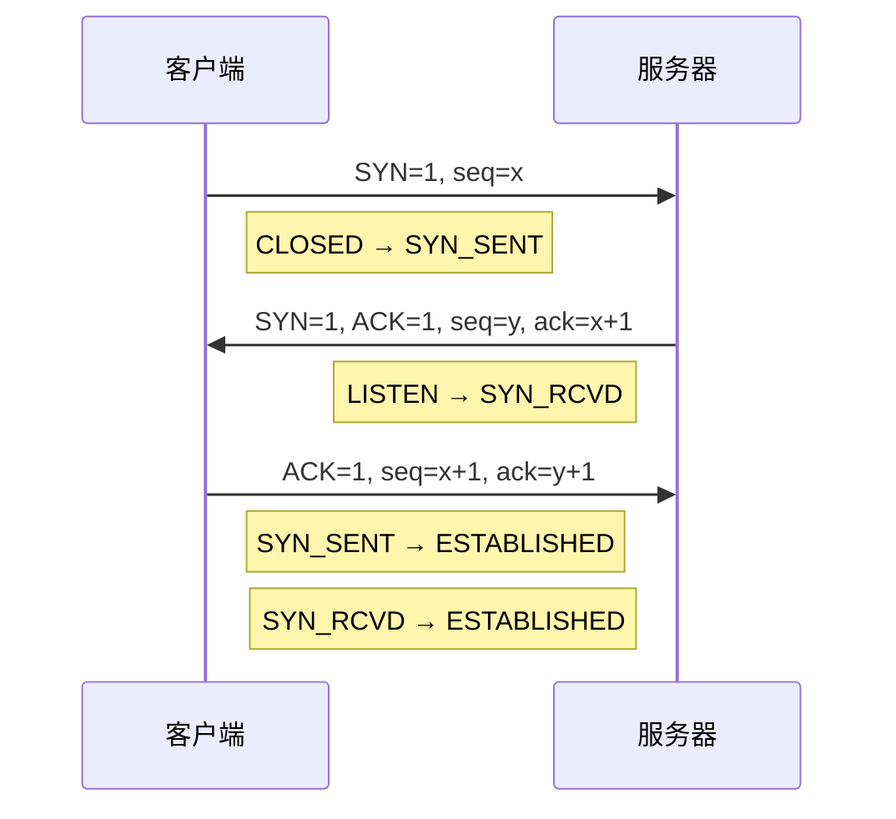
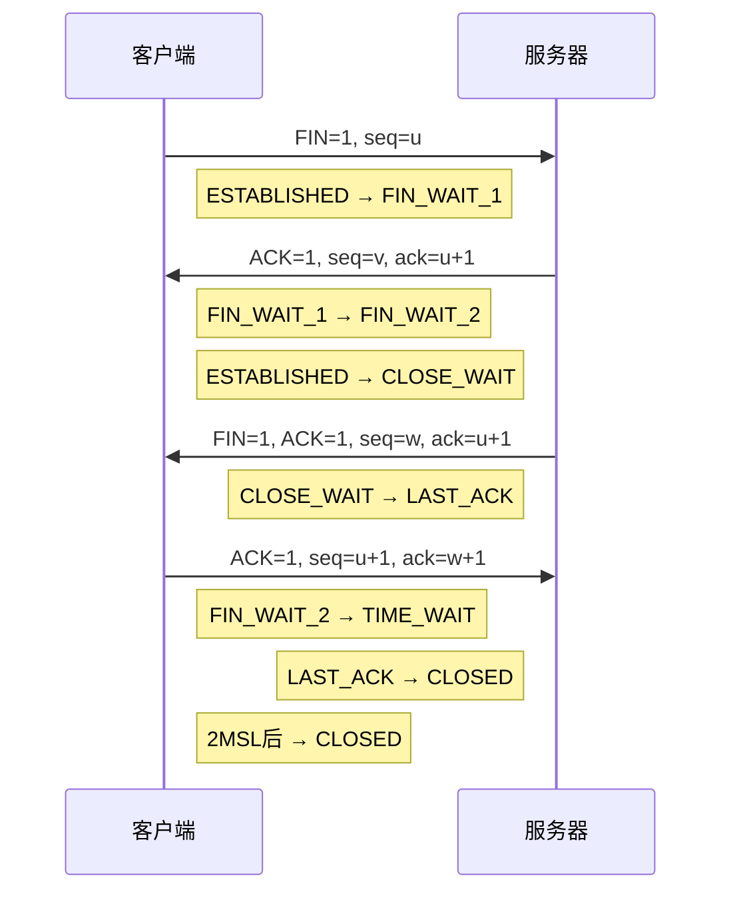

+++
title = 'TCP三次握手四次挥手与TIME_WAIT'
date = 2026-02-26T00:00:00+08:00
draft = false
categories = ['嵌入式']
tags = ['TCP', '网络协议', '三次握手', '四次挥手', 'TIME_WAIT']
+++

# TCP三次握手四次挥手与TIME_WAIT

## 题目

1. TCP的三次握手和四次挥手详细过程，TIME_WAIT状态的作用是什么？如何优化TIME_WAIT过多的问题？
2. TCP三次握手的过程？为什么不可以两次握手？
3. TCP四次挥手的过程？TCP是如何保证可靠性的？
4. 什么是连接半打开、半关闭状态？

## 考察点

TCP连接建立与断开的完整流程、三次握手与四次挥手的必要性、TCP状态机、TIME_WAIT的作用与优化、TCP可靠性机制。

## 回答要点

### 1. TCP三次握手

#### 1.1 握手过程



#### 1.2 为什么需要三次握手

1. **防止已失效的连接请求报文段被服务端接收**
   - 客户端发送的连接请求在网络中滞留
   - 延迟的连接请求到达服务器
   - 服务器误认为是新连接请求

2. **确认双方的接收和发送能力**
   - 第一次握手：客户端确认自己发送正常
   - 第二次握手：服务器确认自己发送和接收正常，客户端确认自己接收正常
   - 第三次握手：服务器确认客户端接收正常

3. **同步初始序列号（ISN）**
   - 双方需要协商初始序列号
   - 防止历史报文干扰新连接

#### 1.3 为什么不可以两次握手

如果只进行两次握手，就不能确定对方已经接收到自己的 SYN 包，也就不能确定是否建立连接喵~

例如：客户端发送 SYN 包后，服务器没有收到，那么客户端会一直等待 ACK 包，而服务器会认为连接已经建立喵~ 这样就会导致数据的不可靠性和安全性问题喵~ 因此 TCP 协议需要进行三次握手，以确保连接的可靠性喵~

#### 1.4 三次握手代码实现

```c
int tcp_connect(const char *ip, int port) {
    int sockfd;
    struct sockaddr_in server_addr;

    sockfd = socket(AF_INET, SOCK_STREAM, 0);
    if (sockfd < 0) {
        return -1;
    }

    memset(&server_addr, 0, sizeof(server_addr));
    server_addr.sin_family = AF_INET;
    server_addr.sin_port = htons(port);
    inet_pton(AF_INET, ip, &server_addr.sin_addr);

    if (connect(sockfd, (struct sockaddr*)&server_addr, sizeof(server_addr)) < 0) {
        close(sockfd);
        return -1;
    }

    return sockfd;
}

int tcp_accept(int listen_fd) {
    struct sockaddr_in client_addr;
    socklen_t addr_len = sizeof(client_addr);

    int client_fd = accept(listen_fd, (struct sockaddr*)&client_addr, &addr_len);
    if (client_fd < 0) {
        return -1;
    }

    return client_fd;
}
```

### 2. TCP四次挥手

#### 2.1 挥手过程



#### 2.2 为什么需要四次挥手

1. **TCP是全双工通信**
   - 每个方向都需要单独关闭
   - 一个方向的关闭不影响另一个方向

2. **服务器可能还有数据要发送**
   - 服务器收到FIN后，ACK表示收到关闭请求
   - 但服务器可能还有未发送完的数据
   - 服务器发送完数据后，再发送FIN

#### 2.3 四次挥手代码实现

```c
void tcp_close(int sockfd) {
    shutdown(sockfd, SHUT_WR);

    char buffer[1024];
    int len;
    while ((len = recv(sockfd, buffer, sizeof(buffer), 0)) > 0) {
    }

    close(sockfd);
}

void tcp_handle_close(int sockfd) {
    char buffer[1024];
    int len;

    while ((len = recv(sockfd, buffer, sizeof(buffer), 0)) > 0) {
    }

    if (len == 0) {
        send_remaining_data(sockfd);
        shutdown(sockfd, SHUT_WR);
        close(sockfd);
    }
}
```

### 3. 连接半打开与半关闭状态

#### 3.1 半打开状态（Half-Open）

指 TCP 连接建立过程中，客户端发送 SYN 包给服务器，但服务器还没有发送 ACK 包进行确认的状态喵~

- 客户端处于 **SYN_SENT** 状态
- 如果服务器没有响应，客户端会发送多个 SYN 包，直到建立连接或达到重试次数上限
- 攻击者可利用此状态发起 SYN Flood 攻击

#### 3.2 半关闭状态（Half-Close / FIN_WAIT）

指 TCP 连接关闭过程中，一方发送 FIN 包后，等待另一方确认和关闭的状态喵~

- **FIN_WAIT_1**：发送 FIN 后等待对方 ACK
- **FIN_WAIT_2**：收到 ACK 后等待对方发送 FIN
- 在此状态下，一方已关闭写通道，但仍可接收数据

### 4. TCP可靠性保证机制

TCP 协议通过以下机制保证可靠性喵~

| 机制 | 说明 |
|------|------|
| 序列号和确认应答 | 每个数据包设置序列号，接收方发送确认应答 |
| 超时重传 | 未收到确认时重新发送，直到确认或达到重传上限 |
| 滑动窗口 | 动态调整窗口大小，控制发送速率 |
| 流量控制 | 防止发送方发送过多数据导致接收方无法处理 |
| 拥塞控制 | 动态调整窗口大小和发送速度，保证网络稳定性 |

### 5. TIME_WAIT状态

#### 5.1 TIME_WAIT状态定义

- **持续时间**：2MSL（Maximum Segment Lifetime，最大报文生存时间）
- **MSL值**：通常为30秒到2分钟，Linux默认为60秒
- **TIME_WAIT时长**：约1-4分钟

#### 5.2 TIME_WAIT的作用

**1. 确保最后的ACK能到达对端**

假设第四次挥手的ACK丢失：
- 服务器重发FIN
- 客户端在TIME_WAIT状态可以重发ACK
- 确保连接正常关闭

**2. 防止旧连接的数据包干扰新连接**

- 客户端和服务器建立连接A，端口为50000
- 连接A关闭，客户端立即重连到服务器，端口仍为50000
- 如果没有TIME_WAIT，连接A的延迟数据包可能到达
- 被误认为是新连接B的数据，导致数据混乱
- TIME_WAIT保留2MSL时间，确保所有旧数据包失效

#### 5.3 TIME_WAIT过多的危害

| 危害 | 说明 |
|------|------|
| 资源消耗 | 占用文件描述符、内存（TCP控制块/缓冲区）、CPU（维护定时器） |
| 端口耗尽 | 可用端口约6万个，大量TIME_WAIT可导致端口耗尽 |
| 性能影响 | 连接建立延迟、系统响应变慢、服务器吞吐量下降 |

### 6. 优化TIME_WAIT过多的方法

#### 6.1 内核参数调整

```bash
echo 1 > /proc/sys/net/ipv4/tcp_tw_reuse
echo 30 > /proc/sys/net/ipv4/tcp_fin_timeout
echo "1024 65535" > /proc/sys/net/ipv4/ip_local_port_range
echo 65535 > /proc/sys/net/core/somaxconn
```

| 参数 | 默认值 | 推荐值 | 说明 |
|------|--------|--------|------|
| tcp_tw_reuse | 0 | 1 | 允许重用TIME_WAIT socket的源端口 |
| tcp_tw_recycle | 0 | 0（不推荐） | 快速回收，NAT环境可能导致异常 |
| tcp_fin_timeout | 60秒 | 30秒 | 减少TIME_WAIT持续时间 |

#### 6.2 应用层优化

```c
typedef struct {
    int sockfd;
    time_t last_used;
    int in_use;
} connection_t;

connection_t *connection_pool;
int pool_size = 100;

int get_connection_from_pool() {
    for (int i = 0; i < pool_size; i++) {
        if (connection_pool[i].sockfd > 0 && !connection_pool[i].in_use) {
            connection_pool[i].in_use = 1;
            return connection_pool[i].sockfd;
        }
    }

    int sockfd = tcp_connect(SERVER_IP, SERVER_PORT);
    for (int i = 0; i < pool_size; i++) {
        if (connection_pool[i].sockfd <= 0) {
            connection_pool[i].sockfd = sockfd;
            connection_pool[i].in_use = 1;
            connection_pool[i].last_used = time(NULL);
            return sockfd;
        }
    }

    return -1;
}

void return_connection_to_pool(int sockfd) {
    for (int i = 0; i < pool_size; i++) {
        if (connection_pool[i].sockfd == sockfd) {
            connection_pool[i].in_use = 0;
            connection_pool[i].last_used = time(NULL);
            return;
        }
    }
}
```

**使用 SO_REUSEADDR 选项：**

```c
int create_server_socket(int port) {
    int sockfd = socket(AF_INET, SOCK_STREAM, 0);
    if (sockfd < 0) return -1;

    int opt = 1;
    setsockopt(sockfd, SOL_SOCKET, SO_REUSEADDR, &opt, sizeof(opt));

    struct sockaddr_in server_addr;
    memset(&server_addr, 0, sizeof(server_addr));
    server_addr.sin_family = AF_INET;
    server_addr.sin_addr.s_addr = INADDR_ANY;
    server_addr.sin_port = htons(port);

    if (bind(sockfd, (struct sockaddr*)&server_addr, sizeof(server_addr)) < 0) {
        close(sockfd);
        return -1;
    }

    return sockfd;
}
```

#### 6.3 监控和诊断

```bash
netstat -an | grep TIME_WAIT | wc -l
ss -tna | grep TIME_WAIT
sysctl net.ipv4.tcp_tw_reuse
sysctl net.ipv4.tcp_fin_timeout
```
