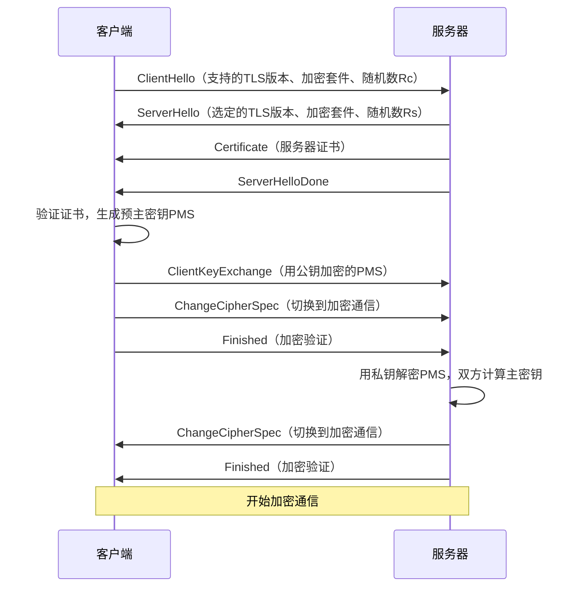
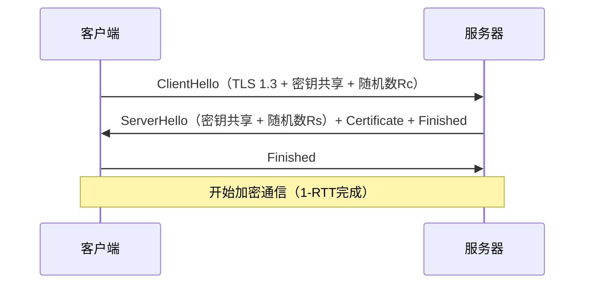

+++
title = 'TLS协议与HTTPS加密原理'
date = 2026-04-23T00:00:00+08:00
draft = false
categories = ['嵌入式']
tags = ['TLS', 'HTTPS', 'SSL', '加密', '网络安全']
+++

# TLS协议与HTTPS加密原理

## 题目

1. TLS是什么？
2. HTTPS是怎么完成加密的？

## 考察点

TLS/SSL协议的作用与层次、对称加密与非对称加密的配合、数字证书与CA体系、HTTPS握手全过程。

## 回答要点

### 1. TLS是什么

**TLS（Transport Layer Security，传输层安全协议）** 是用于在两个通信应用程序之间提供保密性和数据完整性的安全协议喵~ 它的前身是 SSL（Secure Sockets Layer）喵~

**TLS在协议栈中的位置：**

```
┌─────────────────────────┐
│       应用层（HTTP）      │
├─────────────────────────┤
│   TLS（安全层）           │  ← 加密/认证/完整性
├─────────────────────────┤
│       TCP（传输层）       │
├─────────────────────────┤
│       IP（网络层）        │
└─────────────────────────┘
```

**TLS版本演进：**

| 版本 | 年份 | 状态 |
|------|------|------|
| SSL 3.0 | 1996 | 已废弃 |
| TLS 1.0 | 1999 | 已废弃 |
| TLS 1.1 | 2006 | 已废弃 |
| TLS 1.2 | 2008 | 广泛使用 |
| TLS 1.3 | 2018 | 最新标准，更快更安全 |

**TLS提供的三大安全保证：**

| 保证 | 说明 | 实现方式 |
|------|------|---------|
| 加密 | 数据传输保密 | 对称加密（AES/ChaCha20） |
| 认证 | 验证对方身份 | 数字证书（X.509） |
| 完整性 | 数据不被篡改 | MAC/HMAC（SHA-256） |

### 2. 加密算法基础

#### 2.1 对称加密

加密和解密使用**同一个密钥**喵~

| 算法 | 密钥长度 | 特点 |
|------|---------|------|
| AES-128/256 | 128/256位 | 最常用，硬件加速支持好 |
| ChaCha20 | 256位 | 软件实现快，适合移动端 |
| DES | 56位 | 已不安全，已淘汰 |

**优点**：速度快，适合大量数据加密
**缺点**：密钥分发困难——如何安全地把密钥传给对方？

#### 2.2 非对称加密

加密和解密使用**一对密钥**（公钥+私钥）喵~

| 算法 | 密钥长度 | 特点 |
|------|---------|------|
| RSA | 2048/4096位 | 最经典，用于密钥交换和签名 |
| ECDHE | 256位 | 更短密钥、更快，支持前向安全 |
| Ed25519 | 256位 | 现代算法，签名速度快 |

**公钥加密，私钥解密** → 用于加密通信
**私钥签名，公钥验证** → 用于身份认证

**优点**：解决了密钥分发问题
**缺点**：速度慢，不适合大量数据加密

#### 2.3 两种加密配合使用

HTTPS的核心思路是**用非对称加密交换对称密钥，再用对称密钥加密实际数据**喵~

```
1. 服务端把公钥给客户端（通过证书）
2. 客户端生成随机对称密钥
3. 用服务端公钥加密对称密钥，发给服务端
4. 服务端用私钥解密，得到对称密钥
5. 双方用对称密钥加密通信
```

### 3. 数字证书与CA

#### 3.1 为什么需要证书

如果直接发送公钥，中间人可以替换公钥进行攻击（中间人攻击）喵~ 数字证书用于证明"这个公钥确实属于这个服务器"喵~

#### 3.2 CA（证书颁发机构）

CA是受信任的第三方机构，负责签发和管理数字证书喵~

**证书信任链：**

```
根CA（自签名，内置在浏览器/OS中）
  └── 中间CA
       └── 终端证书（服务器证书）
```

**证书包含的信息：**
- 服务器域名
- 服务器公钥
- 证书有效期
- CA的数字签名
- 证书序列号

#### 3.3 证书验证过程

```
1. 客户端收到服务器证书
2. 用CA公钥验证证书签名（CA公钥内置在系统中）
3. 检查证书有效期
4. 检查域名是否匹配
5. 检查证书是否被吊销（CRL/OCSP）
6. 验证通过 → 信任证书中的公钥
```

### 4. HTTPS完整握手过程

#### 4.1 TLS 1.2 握手（RSA密钥交换）



**密钥生成过程：**

```
预主密钥（Pre-Master Secret）：
  由客户端生成，用服务器公钥加密传输

主密钥（Master Secret）：
  = PRF(预主密钥, "master secret", Rc + Rs)

会话密钥：
  从主密钥派生出6个密钥：
  - 客户端写加密密钥
  - 服务器写加密密钥
  - 客户端写MAC密钥
  - 服务器写MAC密钥
  - 客户端写IV
  - 服务器写IV
```

#### 4.2 TLS 1.3 握手（更快速）

TLS 1.3 简化了握手流程，仅需 **1-RTT** 即可完成喵~



**TLS 1.3 改进：**
- 去除了不安全的加密算法（RSA密钥交换、RC4、SHA-1等）
- 握手从2-RTT减少到1-RTT
- 支持 0-RTT 恢复（已连接过再次连接时）
- 强制前向安全（PFS）

#### 4.3 前向安全（Perfect Forward Secrecy, PFS）

**前向安全**意味着即使服务器的长期私钥泄露，过去的通信记录也无法被解密喵~

- **RSA密钥交换**：不具备前向安全（私钥泄露可解密所有历史通信）
- **ECDHE密钥交换**：具备前向安全（每次会话使用临时密钥对）

### 5. HTTPS = HTTP + TLS

**HTTPS并非一个新协议，而是HTTP运行在TLS之上的统称喵~**

| 对比项 | HTTP | HTTPS |
|--------|------|-------|
| 默认端口 | 80 | 443 |
| 传输安全 | 明文传输 | TLS加密 |
| 证书 | 不需要 | 需要CA证书 |
| 性能 | 快 | 略慢（加密开销） |
| SEO | 无加成 | 搜索排名优先 |

### 6. 嵌入式设备TLS实现

```c
#include "mbedtls/net_sockets.h"
#include "mbedtls/ssl.h"
#include "mbedtls/entropy.h"
#include "mbedtls/ctr_drbg.h"

mbedtls_ssl_context ssl;
mbedtls_ssl_config conf;

bool HTTPS_Connect(const char *host, const char *port) {
    mbedtls_ssl_init(&ssl);
    mbedtls_ssl_config_init(&conf);

    mbedtls_ssl_config_defaults(&conf, MBEDTLS_SSL_IS_CLIENT,
                                MBEDTLS_SSL_TRANSPORT_STREAM,
                                MBEDTLS_SSL_PRESET_DEFAULT);

    mbedtls_ssl_conf_authmode(&conf, MBEDTLS_SSL_VERIFY_REQUIRED);
    mbedtls_ssl_conf_ca_chain(&conf, &cacert, NULL);

    mbedtls_entropy_context entropy;
    mbedtls_ctr_drbg_context ctr_drbg;
    mbedtls_entropy_init(&entropy);
    mbedtls_ctr_drbg_init(&ctr_drbg);
    mbedtls_ctr_drbg_seed(&ctr_drbg, mbedtls_entropy_func, &entropy, NULL, 0);

    mbedtls_ssl_conf_rng(&conf, mbedtls_ctr_drbg_random, &ctr_drbg);
    mbedtls_ssl_set_hostname(&ssl, host);

    mbedtls_net_context server_fd;
    mbedtls_net_connect(&server_fd, host, port, MBEDTLS_NET_PROTO_TCP);

    mbedtls_ssl_setup(&ssl, &conf);
    mbedtls_ssl_set_bio(&ssl, &server_fd, mbedtls_net_send, mbedtls_net_recv, NULL);

    int ret = mbedtls_ssl_handshake(&ssl);
    if (ret != 0) return false;

    uint32_t flags = mbedtls_ssl_get_verify_result(&ssl);
    if (flags != 0) return false;

    return true;
}

int HTTPS_Write(const uint8_t *data, size_t len) {
    return mbedtls_ssl_write(&ssl, data, len);
}

int HTTPS_Read(uint8_t *data, size_t len) {
    return mbedtls_ssl_read(&ssl, data, len);
}
```

### 7. 加密算法对比总结

| 类型 | 算法 | 用途 | 速度 |
|------|------|------|------|
| 对称加密 | AES-256-GCM | 数据加密 | 快 |
| 对称加密 | ChaCha20-Poly1305 | 数据加密（移动端） | 快 |
| 非对称加密 | RSA-2048 | 密钥交换/签名 | 慢 |
| 非对称加密 | ECDHE | 密钥交换（前向安全） | 中 |
| 哈希 | SHA-256 | 完整性校验 | 快 |
| 哈希 | SHA-384 | 完整性校验 | 中 |
