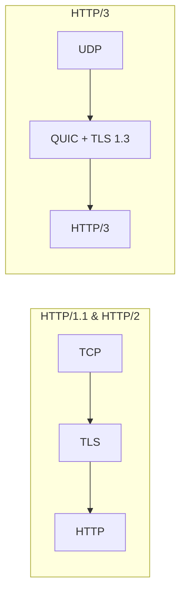

+++
title = 'HTTP协议演进与WebSocket协议'
date = 2026-02-27T00:00:00+08:00
draft = false
categories = ['嵌入式']
tags = ['HTTP', 'WebSocket', 'HTTP2', 'HTTP3', '网络协议']
+++

# HTTP协议演进与WebSocket协议

## 题目

1. HTTP协议、WebSocket协议的区别？
2. HTTP3是基于什么协议做的？
3. HTTP1.1和HTTP2有什么区别？
4. HTTP2的多路复用是怎么回事？
5. HTTP2的帧可以乱序吗，接收方怎么处理？

## 考察点

HTTP协议各版本的演进、多路复用机制、帧与流的概念、QUIC协议、WebSocket与HTTP的区别。

## 回答要点

### 1. HTTP协议概述

**HTTP（Hypertext Transfer Protocol）** 是一种应用层协议，基于TCP协议，使用请求-响应模式喵~

**核心特点：**
- **简单易用**：请求和响应格式简单明了
- **无状态协议**：服务器不保存客户端状态信息
- **基于请求-响应模式**：客户端发送请求，服务器返回响应

### 2. HTTP版本演进

#### 2.1 HTTP/1.0

- 每次请求都需要建立新的TCP连接
- 一个TCP连接只传输一个资源
- 连接建立和断开开销大

#### 2.2 HTTP/1.1

- **持久连接（Keep-Alive）**：默认保持TCP连接，可复用
- **管道化（Pipelining）**：允许在一个连接上连续发送多个请求
- **分块传输（Chunked）**：支持动态内容传输
- **Host头**：支持虚拟主机

**HTTP/1.1的队头阻塞问题：**

虽然支持管道化，但响应必须按请求顺序返回喵~ 如果第一个请求处理慢，后续请求必须等待，这就是**队头阻塞（Head-of-Line Blocking）**喵~

```
请求1 ────┐
请求2 ────┤── 同一个TCP连接 ── 响应1 → 响应2 → 响应3
请求3 ────┘    （必须按序响应）
```

#### 2.3 HTTP/2

**HTTP/2 的核心改进：**

| 特性 | HTTP/1.1 | HTTP/2 |
|------|----------|--------|
| 传输格式 | 文本协议 | 二进制帧 |
| 多路复用 | 不支持（队头阻塞） | 支持（一个连接多个流） |
| 头部压缩 | 无 | HPACK压缩 |
| 服务器推送 | 不支持 | 支持 |
| 流优先级 | 不支持 | 支持 |
| 传输层 | TCP | TCP |

**HTTP/2 多路复用详解：**

HTTP/2 将数据拆分为更小的**帧（Frame）**和**流（Stream）**喵~

- **流（Stream）**：已建立的连接内的双向字节流，每个请求/响应对应一个流
- **帧（Frame）**：HTTP/2通信的最小单位，每个帧属于某个流
- **消息（Message）**：一个完整的请求或响应，由一个或多个帧组成

```
一个TCP连接
├── Stream 1: 请求A → 响应A（多个帧）
├── Stream 3: 请求B → 响应B（多个帧）
├── Stream 5: 请求C → 响应C（多个帧）
└── 所有流的帧可以交错发送
```

**多路复用工作方式：**

```
客户端发送：
  Stream1: HEADERS帧(请求A) | DATA帧
  Stream3: HEADERS帧(请求B)
  Stream5: HEADERS帧(请求C)

服务器响应（帧可以交错）：
  Stream1: HEADERS帧(响应A开始)
  Stream3: HEADERS帧(响应B开始)  ← 不用等A完成
  Stream1: DATA帧(A的数据)
  Stream5: HEADERS帧(响应C开始)
  Stream3: DATA帧(B的数据)
  ...
```

#### 2.4 HTTP/3

**HTTP/3 基于 QUIC 协议喵~**

QUIC（Quick UDP Internet Connections）是 Google 设计的基于 **UDP** 的传输层协议喵~

**为什么HTTP/3选择UDP而不是TCP？**

因为HTTP/2虽然解决了应用层的队头阻塞，但**TCP层仍然存在队头阻塞**喵~ 如果TCP层丢了一个包，所有流都必须等待重传完成，即使其他流的数据已经到了喵~

**QUIC的核心优势：**

| 特性 | TCP+TLS | QUIC |
|------|---------|------|
| 建连速度 | TCP握手+TLS握手（3~4 RTT） | 合并为1-2 RTT |
| 队头阻塞 | TCP层丢包阻塞所有流 | 每个流独立，互不影响 |
| 连接迁移 | IP/端口变化需重建连接 | Connection ID支持无缝迁移 |
| 传输层 | TCP | UDP |
| 加密 | 可选TLS | 默认加密（TLS 1.3集成） |



### 3. HTTP/2帧乱序处理

**HTTP/2的帧可以乱序到达吗？可以喵~**

HTTP/2 帧在TCP连接上传输，TCP保证字节流的有序性，所以帧不会在TCP层面乱序喵~ 但从HTTP/2协议设计角度：

- **不同流之间**：帧可以交错发送，不存在顺序要求
- **同一个流内**：帧的顺序由流级别的流控保证

**接收方如何处理：**

1. **帧头标识流ID**：每个帧的头部包含 Stream Identifier，接收方根据流ID将帧分发到对应流
2. **流内重组**：同一流内的帧按序列号重组为完整的消息
3. **流控机制**：每个流有独立的流控窗口，防止发送方淹没接收方
4. **优先级调度**：接收方可以根据流的优先级决定处理顺序

```
接收到的帧序列（交错）：
  [Stream3, HEADERS] → 分配给Stream 3
  [Stream1, DATA]    → 分配给Stream 1
  [Stream3, DATA]    → 分配给Stream 3
  [Stream5, HEADERS] → 分配给Stream 5
  [Stream1, DATA]    → 分配给Stream 1

每个流独立重组：
  Stream 1: HEADERS + DATA + DATA = 完整响应A
  Stream 3: HEADERS + DATA = 完整响应B
  Stream 5: HEADERS = 完整响应C
```

### 4. WebSocket协议

**WebSocket** 是基于TCP的全双工通信协议，用于实现双向实时通信喵~

**HTTP vs WebSocket 对比：**

| 对比项 | HTTP | WebSocket |
|--------|------|-----------|
| 通信模式 | 请求-响应 | 全双工 |
| 连接 | 短连接（HTTP/1.0）或长连接（HTTP/1.1+） | 持久连接 |
| 方向性 | 单向（客户端发起） | 双向 |
| 数据格式 | 文本为主 | 文本和二进制 |
| 开销 | 每次请求带完整头部 | 建连后帧头仅2-10字节 |
| 实时性 | 需轮询（Polling） | 服务端主动推送 |

**WebSocket握手过程：**

```http
GET /chat HTTP/1.1
Host: server.example.com
Upgrade: websocket
Connection: Upgrade
Sec-WebSocket-Key: dGhlIHNhbXBsZSBub25jZQ==
Sec-WebSocket-Version: 13
```

```http
HTTP/1.1 101 Switching Protocols
Upgrade: websocket
Connection: Upgrade
Sec-WebSocket-Accept: s3pPLMBiTxaQ9kYGzzhZRbK+xOo=
```

**嵌入式WebSocket客户端代码：**

```c
#include "libwebsockets.h"

static int callback_ws(struct lws *wsi, enum lws_callback_reasons reason,
                       void *user, void *in, size_t len) {
    switch (reason) {
        case LWS_CALLBACK_CLIENT_ESTABLISHED:
            lwsl_info("WebSocket connected\n");
            break;

        case LWS_CALLBACK_CLIENT_RECEIVE:
            lwsl_info("Received: %.*s\n", (int)len, (char*)in);
            break;

        case LWS_CALLBACK_CLIENT_WRITEABLE: {
            char msg[] = "Hello from MCU";
            unsigned char buf[LWS_PRE + sizeof(msg)];
            memcpy(&buf[LWS_PRE], msg, sizeof(msg));
            lws_write(wsi, &buf[LWS_PRE], sizeof(msg), LWS_WRITE_TEXT);
            break;
        }

        default:
            break;
    }
    return 0;
}
```

### 5. HTTP各版本协议栈对比

| 版本 | 应用层 | 安全层 | 传输层 | 底层 |
|------|--------|--------|--------|------|
| HTTP/1.1 | HTTP | TLS（可选） | TCP | IP |
| HTTP/2 | HTTP | TLS（推荐） | TCP | IP |
| HTTP/3 | HTTP/3 | QUIC（内置TLS 1.3） | UDP | IP |
