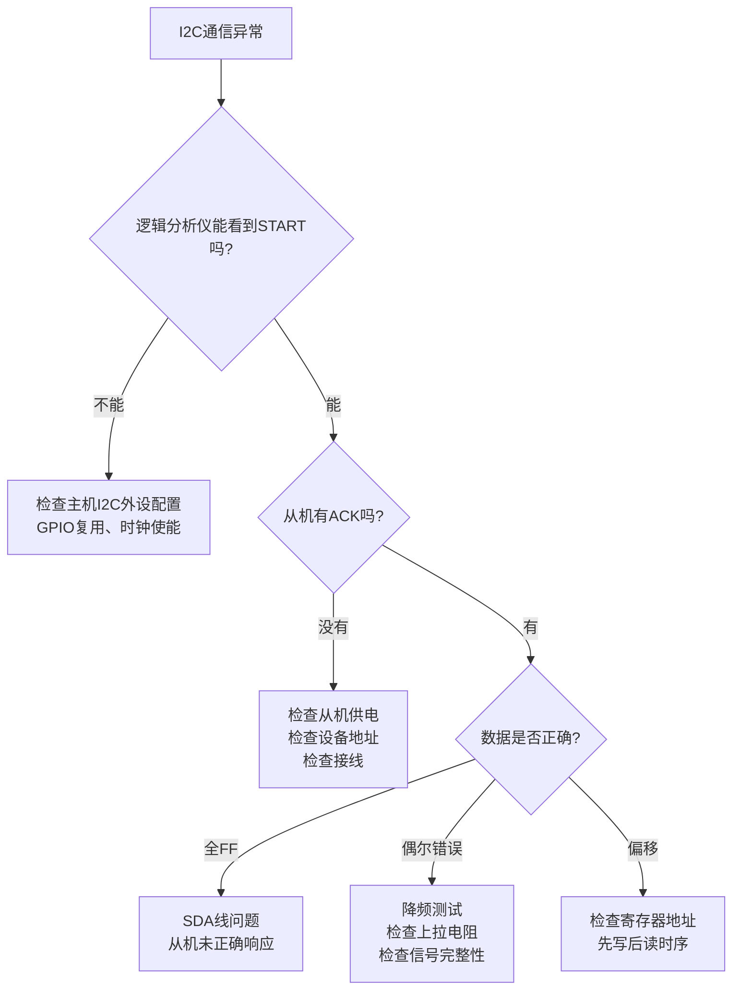

+++
title = 'I2C底层通信机制与异常排查'
date = 2026-05-25T00:00:00+08:00
draft = false
categories = ['通信协议']
tags = ['I2C', '通信协议', '总线异常', '仲裁机制', '嵌入式']
+++

# I2C底层通信机制与异常排查

## 题目

围绕I2C底层通信机制的系列问题：

1. 从寄存器0x04读取10字节的完整流程？
2. 最后一个字节如何响应？
3. I2C异常如何排查？
4. I2C总线被拉低如何恢复？
5. I2C仲裁机制是什么？

## 考察点

I2C协议底层时序理解、数据读取流程与ACK/NACK规则、总线异常诊断能力、总线恢复手段、多主机仲裁机制。

## 回答要点

### 1. 从寄存器0x04读取10字节的完整流程？

I2C读取从机寄存器的完整时序分为两个阶段：先写寄存器地址，再读数据。

#### 完整时序分解

```
主机发起          写阶段                      读阶段                主机结束
  │                │                           │                      │
  │  ┌─START─┐    │   ┌─START─┐              │                      │
  │  │       │    │   │       │              │                      │
  │  │  SCL  │    │   │  SCL  │              │                      │
  │  │  ▽▽▽  │    │   │  ▽▽▽  │              │                      │
  │  │ ADDR+W│    │   │ ADDR+R│              │                      │
  │  │ ACK   │    │   │ ACK   │              │                      │
  │  │ REG   │    │   │ DATA0 │              │                      │
  │  │ ACK   │    │   │ ACK   │              │                      │
  │  │       │    │   │ DATA1 │              │                      │
  │  │       │    │   │ ACK   │              │                      │
  │  │       │    │   │  ...  │              │                      │
  │  │       │    │   │ DATA9 │              │                      │
  │  │       │    │   │ NACK  │              │                      │
  │  └───────┘    │   └───────┘              │                      │
  │                │                           │                      │
  └────────────────┘                           └──────────────────────┘
```

#### 详细步骤

**第一阶段：写入寄存器地址**

| 步骤 | 主机动作 | 从机响应 | 数据线内容 |
|------|---------|---------|-----------|
| 1 | 发送START信号 | — | SDA: 高→低（SCL为高时） |
| 2 | 发送设备地址+W（0xA0） | 匹配则ACK | 7位地址 + 写位0 |
| 3 | 发送寄存器地址（0x04） | ACK | 8位寄存器地址 |
| 4 | 发送RESTART信号 | — | SDA: 高→低（SCL为高时） |

**第二阶段：读取数据**

| 步骤 | 主机动作 | 从机响应 | 数据线内容 |
|------|---------|---------|-----------|
| 5 | 发送设备地址+R（0xA1） | ACK | 7位地址 + 读位1 |
| 6 | 释放SDA，接收DATA[0] | — | 从机输出第1字节 |
| 7 | 主机发送ACK | — | SDA拉低，告知从机继续 |
| 8 | 接收DATA[1]~DATA[8] | — | 从机依次输出字节 |
| 9 | 每字节后主机发ACK | — | 告知从机继续发送 |
| 10 | 接收DATA[9]（第10字节） | — | 从机输出最后一字节 |
| 11 | 主机发送NACK | — | SDA保持高，告知从机停止 |
| 12 | 发送STOP信号 | — | SDA: 低→高（SCL为高时） |

#### STM32 HAL库实现

```c
#define DEV_ADDR  0x50
#define REG_ADDR  0x04

uint8_t I2C_Read_10Bytes(I2C_HandleTypeDef *hi2c, uint8_t *buf)
{
    return HAL_I2C_Mem_Read(hi2c, DEV_ADDR << 1, REG_ADDR,
                            I2C_MEMADD_SIZE_8BIT, buf, 10, 1000);
}
```

`HAL_I2C_Mem_Read` 内部自动完成了 START → ADDR+W → REG → RESTART → ADDR+R → 读10字节 → NACK → STOP 的全部流程。

#### 手动实现（理解底层时序）

```c
HAL_StatusTypeDef I2C_Read_Manual(I2C_HandleTypeDef *hi2c, uint8_t *buf)
{
    uint8_t dev_write = DEV_ADDR << 1;
    uint8_t dev_read  = (DEV_ADDR << 1) | 0x01;
    uint8_t reg = REG_ADDR;

    HAL_I2C_Master_Transmit(hi2c, dev_write, &reg, 1, 100);
    return HAL_I2C_Master_Receive(hi2c, dev_read, buf, 10, 100);
}
```

### 2. 最后一个字节如何响应？

**关键规则：主机读取最后一个字节后必须发送NACK（不应答）**。

#### 为什么最后一个字节必须NACK？

```
读取流程中 ACK/NACK 的含义：

主机 → 从机 的 ACK：  "我收到了，请继续发下一个字节"
主机 → 从机 的 NACK：  "我收到了，但不需要更多数据了，你可以释放SDA"

如果最后一个字节也发 ACK：
  → 从机以为主机还要继续读
  → 从机会在下一个SCL周期尝试驱动SDA输出下一字节
  → 主机此时想发STOP信号（SDA低→高），但从机可能正拉着SDA
  → 导致STOP信号无法正确产生，通信错乱
```

#### ACK/NACK 时序细节

```
ACK（应答）：第9个时钟周期，接收方将 SDA 拉低
NACK（非应答）：第9个时钟周期，接收方保持 SDA 为高

       SCL   ──┐  ┌──┐  ┌──
                 └──┘  └──┘
                  8    9
                  
ACK:   SDA   ──────┐
                      └─────  （拉低表示应答）
                      
NACK:  SDA   ────────────────  （保持高表示非应答）
```

#### HAL库内部处理

```c
// HAL_I2C_Master_Receive 内部对最后一个字节的处理（简化）
if (Size == 1) {
    CLEAR_BIT(hi2c->Instance->CR1, I2C_CR1_ACK);
    SET_BIT(hi2c->Instance->CR1, I2C_CR1_STOP);
} else {
    for (uint32_t i = 0; i < Size - 1; i++) {
        SET_BIT(hi2c->Instance->CR1, I2C_CR1_ACK);
        while (!(__HAL_I2C_GET_FLAG(hi2c, I2C_FLAG_RXNE)));
        *pData++ = hi2c->Instance->DR;
    }
    CLEAR_BIT(hi2c->Instance->CR1, I2C_CR1_ACK);
    SET_BIT(hi2c->Instance->CR1, I2C_CR1_STOP);
    while (!(__HAL_I2C_GET_FLAG(hi2c, I2C_FLAG_RXNE)));
    *pData++ = hi2c->Instance->DR;
}
```

**总结**：前9个字节回ACK告诉从机继续发，第10个字节回NACK告诉从机停止，然后发STOP释放总线。

### 3. I2C异常如何排查？

I2C通信异常通常分为以下几类：

#### 常见异常分类

| 异常现象 | 可能原因 | 排查方法 |
|---------|---------|---------|
| 无ACK（地址NACK） | 接线错误、地址错误、从机未上电 | 检查地址、测电压、查接线 |
| 数据全为0xFF | SDA被拉高（断线或从机未响应） | 示波器看SDA波形 |
| 数据随机错误 | 信号完整性差、速率过高、上拉电阻不当 | 降频测试、检查上拉电阻 |
| 偶发通信失败 | 总线干扰、时序临界、中断冲突 | 加延时、降频、查中断优先级 |
| 总线挂死 | 从机异常拉低SDA或SCL | 见第4题恢复方法 |
| 读取数据偏移 | 寄存器地址写入未成功 | 先验证写入再读取 |

#### 系统化排查流程



#### 代码层面的排查手段

```c
typedef struct {
    uint32_t total;
    uint32_t ack_fail;
    uint32_t timeout;
    uint32_t bus_error;
    uint32_t last_error_tick;
    uint32_t last_error_code;
} i2c_stats_t;

static i2c_stats_t i2c_stats;

HAL_StatusTypeDef I2C_Read_Safe(I2C_HandleTypeDef *hi2c,
                                 uint16_t dev_addr, uint16_t reg_addr,
                                 uint8_t *buf, uint16_t size)
{
    i2c_stats.total++;
    HAL_StatusTypeDef status = HAL_I2C_Mem_Read(hi2c, dev_addr, reg_addr,
                                                  I2C_MEMADD_SIZE_8BIT,
                                                  buf, size, 1000);
    if (status != HAL_OK) {
        i2c_stats.last_error_code = hi2c->ErrorCode;
        i2c_stats.last_error_tick = HAL_GetTick();

        if (status == HAL_TIMEOUT) i2c_stats.timeout++;
        if (hi2c->ErrorCode == HAL_I2C_ERROR_AF) i2c_stats.ack_fail++;
        if (hi2c->ErrorCode == HAL_I2C_ERROR_BERR) i2c_stats.bus_error++;
    }
    return status;
}

void I2C_Print_Stats(void)
{
    printf("I2C Stats: total=%lu, ack_fail=%lu, timeout=%lu, bus_err=%lu\n",
           i2c_stats.total, i2c_stats.ack_fail,
           i2c_stats.timeout, i2c_stats.bus_error);
}
```

#### 硬件排查清单

| 检查项 | 正常值 | 异常处理 |
|--------|--------|---------|
| 上拉电阻 | 4.7kΩ（标准）/ 2.2kΩ（快速模式） | 阻值过大→上升沿慢；过小→功耗高 |
| SDA/SCL空闲电平 | 均为高电平（VCC） | 被拉低→总线挂死或短路 |
| 信号上升沿 | <300ns（400kHz模式） | 过慢→减小上拉电阻或降低频率 |
| 总线负载电容 | <400pF | 过大→减少设备数量或降低频率 |
| 从机供电 | 满足数据手册要求 | 电压不足→通信不稳定 |

### 4. I2C总线被拉低如何恢复？

#### 总线被拉低的原因

从机设备在以下情况下可能异常拉低SDA或SCL，导致总线锁死：

- 从机在数据传输中间被复位（看门狗、电源波动）
- 从机I2C状态机跑飞，持续驱动SDA
- 主机在读取过程中异常中断，未完成完整的STOP时序
- 从机等待更多时钟周期来完成当前操作

#### 恢复方案一：软件恢复（推荐优先尝试）

I2C规范推荐的恢复方法——手动发送9个SCL时钟脉冲 + STOP信号：

```c
#define I2C_RECOVERY_CLK_CYCLES  9

HAL_StatusTypeDef I2C_Bus_Recovery(I2C_HandleTypeDef *hi2c)
{
    GPIO_InitTypeDef GPIO_InitStruct = {0};

    HAL_I2C_DeInit(hi2c);

    GPIO_InitStruct.Mode = GPIO_MODE_OUTPUT_OD;
    GPIO_InitStruct.Pull = GPIO_PULLUP;
    GPIO_InitStruct.Speed = GPIO_SPEED_FREQ_HIGH;

    GPIO_InitStruct.Pin = SCL_PIN;
    HAL_GPIO_Init(SCL_PORT, &GPIO_InitStruct);

    GPIO_InitStruct.Pin = SDA_PIN;
    HAL_GPIO_Init(SDA_PORT, &GPIO_InitStruct);

    HAL_GPIO_WritePin(SCL_PORT, SCL_PIN, GPIO_PIN_SET);
    HAL_GPIO_WritePin(SDA_PORT, SDA_PIN, GPIO_PIN_SET);

    if (HAL_GPIO_ReadPin(SDA_PORT, SDA_PIN) == GPIO_PIN_RESET) {
        for (int i = 0; i < I2C_RECOVERY_CLK_CYCLES; i++) {
            HAL_GPIO_WritePin(SCL_PORT, SCL_PIN, GPIO_PIN_RESET);
            HAL_DelayUs(5);
            HAL_GPIO_WritePin(SCL_PORT, SCL_PIN, GPIO_PIN_SET);
            HAL_DelayUs(5);

            if (HAL_GPIO_ReadPin(SDA_PORT, SDA_PIN) == GPIO_PIN_SET) {
                break;
            }
        }

        HAL_GPIO_WritePin(SCL_PORT, SCL_PIN, GPIO_PIN_RESET);
        HAL_DelayUs(5);
        HAL_GPIO_WritePin(SDA_PORT, SDA_PIN, GPIO_PIN_RESET);
        HAL_DelayUs(5);
        HAL_GPIO_WritePin(SCL_PORT, SCL_PIN, GPIO_PIN_SET);
        HAL_DelayUs(5);
        HAL_GPIO_WritePin(SDA_PORT, SDA_PIN, GPIO_PIN_SET);
        HAL_DelayUs(5);
    }

    GPIO_InitStruct.Mode = GPIO_MODE_AF_OD;
    GPIO_InitStruct.Pin = SCL_PIN;
    HAL_GPIO_Init(SCL_PORT, &GPIO_InitStruct);

    GPIO_InitStruct.Pin = SDA_PIN;
    HAL_GPIO_Init(SDA_PORT, &GPIO_InitStruct);

    return HAL_I2C_Init(hi2c);
}
```

#### 恢复方案二：从机复位

```c
void I2C_Recovery_ResetSlave(void)
{
    if (SLAVE_HAS_RESET_PIN) {
        HAL_GPIO_WritePin(SLAVE_RESET_PORT, SLAVE_RESET_PIN, GPIO_PIN_RESET);
        HAL_Delay(1);
        HAL_GPIO_WritePin(SLAVE_RESET_PORT, SLAVE_RESET_PIN, GPIO_PIN_SET);
        HAL_Delay(10);
    }

    I2C_Bus_Recovery(&hi2c1);
}
```

#### 恢复方案三：硬件方案

| 方案 | 实现 | 适用场景 |
|------|------|---------|
| 从机硬件复位引脚 | 用GPIO控制从机RST引脚 | 可控从机设备 |
| 总线开关 | 使用I2C多路复用器（如TCA9548A）隔离故障段 | 多设备复杂系统 |
| 电源周期 | 断电重启从机 | 最后手段 |
| 外部看门狗 | 专用I2C总线恢复芯片（如PCA9511） | 高可靠性产品 |

#### 自动恢复机制

```c
HAL_StatusTypeDef I2C_Read_AutoRecover(I2C_HandleTypeDef *hi2c,
                                        uint16_t dev_addr, uint16_t reg_addr,
                                        uint8_t *buf, uint16_t size)
{
    HAL_StatusTypeDef status;
    int retry = 3;

    while (retry-- > 0) {
        status = HAL_I2C_Mem_Read(hi2c, dev_addr, reg_addr,
                                   I2C_MEMADD_SIZE_8BIT, buf, size, 500);
        if (status == HAL_OK) return HAL_OK;

        if (hi2c->ErrorCode & (HAL_I2C_ERROR_BERR | HAL_I2C_ERROR_ARLO)) {
            I2C_Bus_Recovery(hi2c);
        } else {
            HAL_Delay(10);
        }
    }
    return status;
}
```

### 5. I2C仲裁机制是什么？

#### 为什么需要仲裁？

I2C总线支持多主机。当两个或多个主机同时发起通信时，需要一种机制决定谁获得总线控制权，这就是仲裁。

#### 仲裁原理：线与特性 + SDA电平比较

I2C总线是**开漏输出 + 线与（Wired-AND）**结构：

```
主机A的SDA输出 ──┐
                  ├── 线与 ──→ 实际SDA电平
主机B的SDA输出 ──┘

线与规则：只要有一个输出低电平，总线就是低电平
```

**仲裁过程**：每个主机在发送地址/数据的同时，实时采样SDA线。如果自己发送的是高电平，但检测到SDA实际是低电平，说明有其他主机发送了低电平，自己**输了**，立即退出。

#### 仲裁时序示例

```
        ┌──┐  ┌──┐  ┌──┐  ┌──┐  ┌──┐  ┌──┐
SCL     │  │  │  │  │  │  │  │  │  │  │  │
     ───┘  └──┘  └──┘  └──┘  └──┘  └──┘  └──

主机A:  1  0  1  1  0  1  ...  (发送)
主机B:  1  0  1  0  ...        (发送)
                     ↑
                 第4位：A发1，B发0
                 实际SDA=0（线与）
                 A检测到：我发了1但线上是0 → A退出
                 B赢得仲裁，继续传输
```

#### 仲裁规则总结

| 规则 | 说明 |
|------|------|
| 仲裁时机 | 在地址阶段和数据阶段持续进行 |
| 获胜条件 | 发送的数据与实际SDA电平始终一致 |
| 失败处理 | 立即切换为从机模式或等待总线空闲重试 |
| 仲裁范围 | 仅在地址和数据阶段仲裁，START/STOP不参与 |
| 无损性 | 获胜的主机不会受到任何影响，数据完整 |
| 硬件自动 | STM32 I2C外设自动完成仲裁检测，软件只需检查ARLO标志 |

#### STM32中的仲裁丢失处理

```c
void HAL_I2C_ErrorCallback(I2C_HandleTypeDef *hi2c)
{
    if (hi2c->ErrorCode & HAL_I2C_ERROR_ARLO) {
        hi2c->State = HAL_I2C_STATE_READY;
    }
}
```

当仲裁丢失时，STM32硬件会自动：
1. 设置ARLO（Arbitration Lost）标志位
2. 释放SDA线（切换为输入）
3. 不发送STOP信号（因为赢得仲裁的主机还在用总线）
4. 软件可以在后续重新尝试发送

#### I2C仲裁 vs CAN仲裁

| 对比项 | I2C仲裁 | CAN仲裁 |
|--------|---------|---------|
| 物理层 | 开漏线与 | 差分线显性/隐性 |
| 仲裁依据 | 地址/数据内容（先发0的赢） | 报文ID（ID越小优先级越高） |
| 仲裁范围 | 地址+数据阶段 | 仅仲裁段（11位/29位ID） |
| 丢失后 | 自动转为从机监听 | 自动转为接收方 |
| 可预测性 | 不确定（取决于数据内容） | 确定（ID小的一定赢） |

#### 多主机架构建议

实际嵌入式项目中多主机I2C较少见，原因：
- 仲裁机制依赖软件配合，调试困难
- 总线死锁风险增加
- 实时性难以保证

替代方案：
- **单主机 + I2C多路复用器**（如TCA9548A）分时控制
- **SPI替代**（天然支持多CS独立控制）
- **每个主机独立总线**（最可靠但占资源多）
