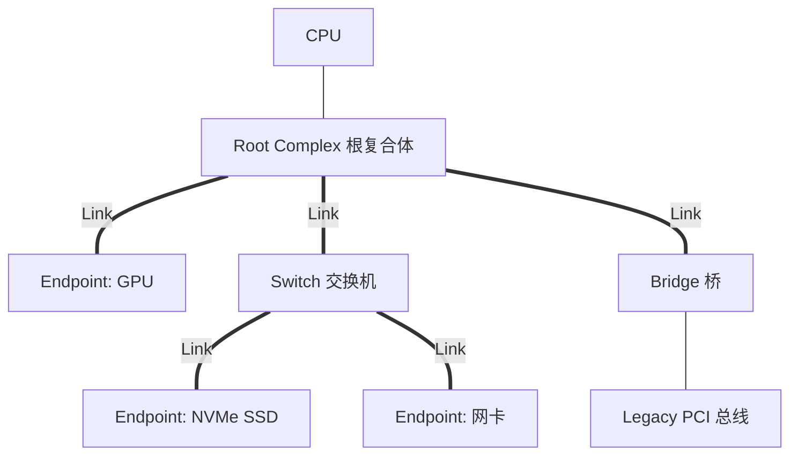
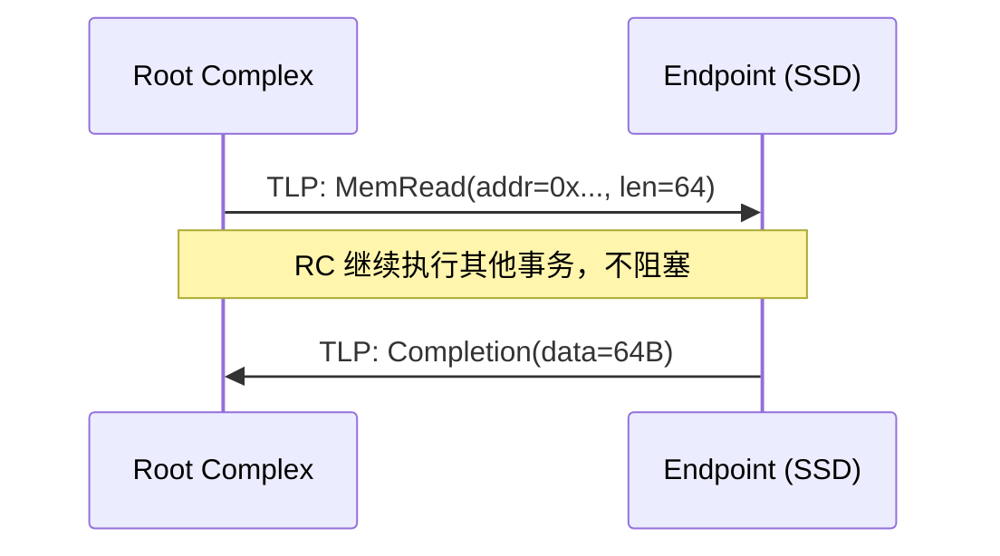

+++
title = 'PCIe总线协议与拓扑结构'
date = 2026-08-10T00:00:00+08:00
draft = false
categories = ['嵌入式']
tags = ['面试题', 'PCIe', '高速总线', '通信协议', 'DMA', '嵌入式']
+++

# PCIe总线协议与拓扑结构

## 题目

了解 PCIe 吗？它和传统的 PCI、SPI/I2C 有什么区别？

## 考察点

高速串行总线协议、嵌入式 SoC 内部/外部通信架构。

## 回答要点

### 1. PCIe 是什么

PCIe（PCI Express）是继 PCI/PCI-X 之后的**高速串行点对点互连总线**，广泛用于 PC、服务器和高端嵌入式 SoC（如 RK3588、NVIDIA Jetson、地平线征程系列）连接 GPU、SSD（NVMe）、网卡、AI 加速器、摄像头（MIPI 转 PCIe）等外设。

#### 与传统 PCI 的核心区别

| 特性 | PCI（并行） | PCIe（串行） |
|------|------------|-------------|
| 传输方式 | 共享总线，并行 | 点对点，串行差分 |
| 时钟 | 共同时钟信号 | 内嵌时钟（8b/10b、128b/130b 编码） |
| 带宽 | 受总线宽度限制（33MHz×32bit≈1064MB/s） | 单 Lane 多 Gbps，可多 Lane 聚合 |
| 拓扑 | 多设备共享一条总线 | 每设备独占一条 Link 到 Switch |
| 中断 | INTx 共享中断 | MSI/MSI-X 消息中断 |
| 工程性 | 走线多、抗干扰差 | 差分对、LVDS，速率高距离短 |

### 2. 拓扑结构：Root / Switch / Endpoint



- **Root Complex（RC，根复合体）**：靠近 CPU 的根节点，把 CPU/内存子系统接入 PCIe 拓扑，是所有事务的发起方之一。
- **Switch（交换机）**：多端口转发设备，把一条上游 Link 扩展为多条下游 Link，类似网络交换机。
- **Endpoint（EP，端点）**：最终的外设（GPU、SSD、加速卡），是事务的响应方。
- **Link（链路）**：点对点连接，由若干 Lane 组成。

### 3. Lane（通道）与可扩展带宽

一条 Link 由 1/2/4/8/16 个 Lane 组成（写作 x1、x4、x16）。每个 Lane 是**两对差分线**（一对发送 TX+/TX-，一对接收 RX+/RX-），全双工。

```c
// 带宽估算（PCIe 3.0，每 Lane 编码后 8 GT/s，128b/130b 编码效率 ~98.5%）
// 有效带宽 ≈ 8 GT/s × 0.985 / 8 = 985 MB/s（单方向）
// PCIe 3.0 x4 ≈ 3.94 GB/s
// PCIe 3.0 x16 ≈ 15.75 GB/s
// PCIe 4.0 翻倍，PCIe 5.0 再翻倍，PCIe 6.0 引入 PAM-4 编码
```

| 版本 | 单 Lane 单向编码速率 | x16 单向有效带宽 |
|------|---------------------|-----------------|
| PCIe 2.0 | 5 GT/s（8b/10b，效率 80%） | ~8 GB/s |
| PCIe 3.0 | 8 GT/s（128b/130b） | ~15.75 GB/s |
| PCIe 4.0 | 16 GT/s | ~31.5 GB/s |
| PCIe 5.0 | 32 GT/s | ~63 GB/s |
| PCIe 6.0 | 64 GT/s（PAM-4） | ~121 GB/s |

### 4. 分层协议栈

PCIe 采用分层结构，类似 OSI 模型：

```
┌─────────────────────────┐
│  事务层 TLP             │  读写请求、完成、配置
├─────────────────────────┤
│  数据链路层 DLLP        │  应答、流控、错误校验
├─────────────────────────┤
│  物理层（逻辑+电气）    │  串并转换、加扰、Lane 分配
└─────────────────────────┘
```

#### TLP（事务层包）的核心字段

```c
// TLP 包结构（简化）
typedef struct {
    uint32_t fmt_type;    // 格式+类型：MemRead/MemWrite/Cfg/Completion
    uint32_t length;      // 负载长度（以 DW=4B 为单位）
    uint32_t requester_id;// 请求者 ID（Bus:Dev:Func）
    uint32_t tag;         // 事务标签（用于匹配请求与完成）
    uint64_t address;     // 目标地址（内存读写）
    uint8_t  data[];      // 净荷（写事务才有）
    uint32_t lcrc;        // 链路层 CRC
} tlp_packet_t;
```

### 5. 事务类型与读写流程

PCIe 用 **分离事务（Split Transaction）** 模型：读请求发出后不等结果，由 Completion 包异步返回。



```c
// 软件视角：CPU 读 PCIe 设备内存（MMIO 或 DMA）
// 1. CPU 通过配置空间枚举设备，分配 BAR（Base Address Register）地址
// 2. 把设备内存映射到 CPU 地址空间
volatile uint32_t* dev_mem = (uint32_t*)bar0_address;
uint32_t val = dev_mem[0];   // 触发一次 PCIe MemRead TLP
```

### 6. DMA 与中断

#### DMA

PCIe 设备通过 DMA 直接读写系统内存，是高性能数据搬运的核心：

```c
// 典型 NVMe SSD 读取流程
// 1. CPU 在内存中准备好 Submission Queue 条目
// 2. 写设备 Doorbell 寄存器（一次 PCIe 写）
// 3. SSD 控制器通过 DMA 把数据搬到内存
// 4. SSD 发 MSI-X 中断通知 CPU
```

#### MSI / MSI-X 中断

PCIe 摒弃了共享的 INTx 电平中断，改用**内存写事务模拟中断**：

```c
// MSI 本质：设备向一个特殊地址写一个数据，触发 CPU 中断
void configure_msi(pci_device_t* dev) {
    // CPU 给设备分配一个中断消息地址和数据
    dev->msi_addr = MSI_MESSAGE_ADDR;   // 例如 0xFEE00000（APIC 地址）
    dev->msi_data = vector;             // 中断向量号
    dev->msi_enable = 1;
}
// 设备要发中断时，硬件自动发起一次：
// MemWrite(addr=msi_addr, data=msi_data)
// CPU 侧的 I/O APIC 收到这个写，触发对应 vector 中断
```

MSI 只有一个向量，MSI-X 支持最多 2048 个独立向量，适合网卡多队列等场景。

### 7. 与低速嵌入式总线（SPI/I2C）对比

| 特性 | PCIe | SPI | I2C |
|------|------|-----|-----|
| 速率 | GT/s 级 | 几十 MHz | 100k~几 MHz |
| 拓扑 | 点对点 | 主从一主多从 | 多主多从 |
| 信号 | 差分对 | 单端（CLK/MOSI/MISO/CS） | 单端（SCL/SDA） |
| 用途 | GPU/SSD/网卡等高速 | Flash、传感器 | 低速传感器、EEPROM |
| 协议复杂度 | 高（事务层+链路层） | 极简 | 简单 |

### 8. 嵌入式 SoC 中的典型应用

- **RK3588**：自带多个 PCIe 3.0 x4 / 2.0 接口，可接 NVMe、5G 模组、外置 GPU。
- **NVIDIA Jetson**：用 PCIe 连接 Wi-Fi、NVMe SSD、扩展卡。
- **车载 SoC（征程、Orin）**：用 PCIe 连接多个摄像头接入芯片、AI 加速器。
- **FPGA 加速卡**：作为 Endpoint 插在主机 PCIe 槽，做数据包处理。

## 扩展问题

面试官可能会追问：
- PCIe 枚举过程是怎样的？（BIOS/RC 从 Bus 0 开始读 Vendor ID，递归分配 Bus 号）
- BAR（Base Address Register）的作用？（设备声明自己需要的地址空间大小）
- PCIe 和 CXL 有什么关系？（CXL 基于 PCIe 5.0 物理层，增加缓存一致性协议）
- 为什么 PCIe 用差分信号？（抗共模干扰，速率高）
