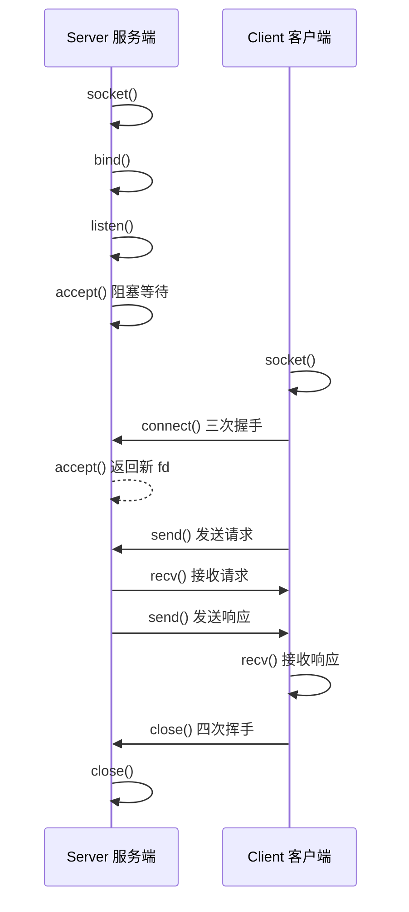
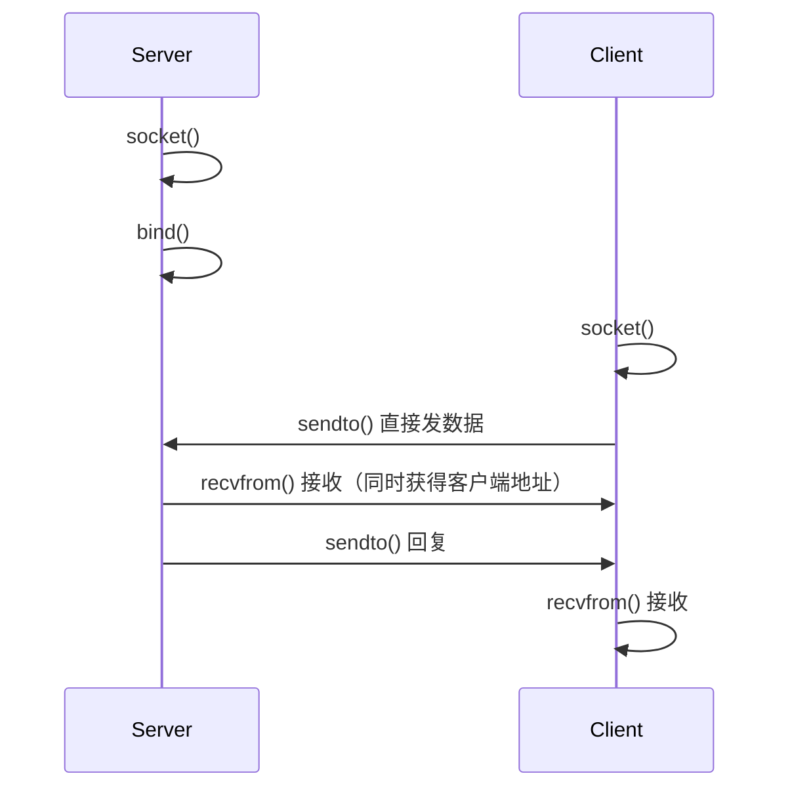

+++
title = 'Socket编程实现CS通信'
date = 2026-06-12T00:00:00+08:00
draft = false
categories = ['嵌入式']
tags = ['Socket', 'TCP', '网络编程', '客户端服务端']
+++

# Socket编程实现CS通信

## 题目

用 socket 实现 Client-Server 的通信过程？对应的实现接口有哪些？

## 考察点

Socket 编程的完整流程、TCP 服务端/客户端的 API 调用顺序、各接口参数含义。

## 回答要点

### 1. Socket 通信整体流程



### 2. 核心 API 一览

| 函数 | 作用 | 服务端 | 客户端 |
|------|------|--------|--------|
| `socket()` | 创建套接字 | 需要 | 需要 |
| `bind()` | 绑定 IP 和端口 | 需要 | 不需要（系统自动分配） |
| `listen()` | 开始监听 | 需要 | 不需要 |
| `accept()` | 等待并接受连接 | 需要 | 不需要 |
| `connect()` | 发起连接 | 不需要 | 需要 |
| `send()` / `write()` | 发送数据 | 需要 | 需要 |
| `recv()` / `read()` | 接收数据 | 需要 | 需要 |
| `close()` | 关闭连接 | 需要 | 需要 |

### 3. TCP 服务端实现

```c
#include <stdio.h>
#include <stdlib.h>
#include <string.h>
#include <unistd.h>
#include <sys/socket.h>
#include <netinet/in.h>
#include <arpa/inet.h>

#define PORT 8888
#define BUFFER_SIZE 1024

int main(void) {
    int server_fd, client_fd;
    struct sockaddr_in server_addr, client_addr;
    socklen_t client_len = sizeof(client_addr);
    char buffer[BUFFER_SIZE];

    /* 1. 创建套接字 */
    server_fd = socket(AF_INET, SOCK_STREAM, 0);
    // AF_INET: IPv4
    // SOCK_STREAM: TCP（流式套接字）
    // SOCK_DGRAM: UDP（数据报套接字）
    // 第三个参数 0: 自动选择协议
    if (server_fd < 0) {
        perror("socket failed");
        exit(EXIT_FAILURE);
    }

    /* 设置地址复用，避免 TIME_WAIT 导致 bind 失败 */
    int opt = 1;
    setsockopt(server_fd, SOL_SOCKET, SO_REUSEADDR, &opt, sizeof(opt));

    /* 2. 绑定 IP 和端口 */
    memset(&server_addr, 0, sizeof(server_addr));
    server_addr.sin_family = AF_INET;
    server_addr.sin_addr.s_addr = INADDR_ANY;  // 绑定所有网卡
    server_addr.sin_port = htons(PORT);          // 主机字节序 → 网络字节序

    if (bind(server_fd, (struct sockaddr*)&server_addr, sizeof(server_addr)) < 0) {
        perror("bind failed");
        close(server_fd);
        exit(EXIT_FAILURE);
    }

    /* 3. 开始监听 */
    if (listen(server_fd, 5) < 0) {
        // 第二个参数 5: 已完成三次握手但未被 accept 的连接队列长度
        perror("listen failed");
        close(server_fd);
        exit(EXIT_FAILURE);
    }

    printf("服务端启动，监听端口 %d...\n", PORT);

    /* 4. 等待客户端连接 */
    client_fd = accept(server_fd, (struct sockaddr*)&client_addr, &client_len);
    // accept 会阻塞，直到有客户端连接
    // 返回一个新的 fd 用于与该客户端通信
    // 原来的 server_fd 继续监听其他连接
    if (client_fd < 0) {
        perror("accept failed");
        close(server_fd);
        exit(EXIT_FAILURE);
    }

    printf("客户端连接: %s:%d\n",
           inet_ntoa(client_addr.sin_addr),
           ntohs(client_addr.sin_port));

    /* 5. 收发数据 */
    while (1) {
        memset(buffer, 0, BUFFER_SIZE);
        int n = recv(client_fd, buffer, BUFFER_SIZE - 1, 0);
        if (n <= 0) {
            printf("客户端断开连接\n");
            break;
        }
        printf("收到: %s\n", buffer);

        // 回显
        send(client_fd, buffer, n, 0);
    }

    /* 6. 关闭连接 */
    close(client_fd);
    close(server_fd);
    return 0;
}
```

### 4. TCP 客户端实现

```c
#include <stdio.h>
#include <stdlib.h>
#include <string.h>
#include <unistd.h>
#include <sys/socket.h>
#include <netinet/in.h>
#include <arpa/inet.h>

#define SERVER_IP "127.0.0.1"
#define SERVER_PORT 8888
#define BUFFER_SIZE 1024

int main(void) {
    int sock_fd;
    struct sockaddr_in server_addr;
    char buffer[BUFFER_SIZE];

    /* 1. 创建套接字 */
    sock_fd = socket(AF_INET, SOCK_STREAM, 0);
    if (sock_fd < 0) {
        perror("socket failed");
        exit(EXIT_FAILURE);
    }

    /* 2. 设置服务器地址 */
    memset(&server_addr, 0, sizeof(server_addr));
    server_addr.sin_family = AF_INET;
    server_addr.sin_port = htons(SERVER_PORT);
    inet_pton(AF_INET, SERVER_IP, &server_addr.sin_addr);
    // inet_pton: 点分十进制 → 二进制网络字节序

    /* 3. 发起连接（三次握手） */
    if (connect(sock_fd, (struct sockaddr*)&server_addr, sizeof(server_addr)) < 0) {
        perror("connect failed");
        close(sock_fd);
        exit(EXIT_FAILURE);
    }

    printf("已连接到服务器 %s:%d\n", SERVER_IP, SERVER_PORT);

    /* 4. 收发数据 */
    while (1) {
        printf("输入消息: ");
        fgets(buffer, BUFFER_SIZE, stdin);
        buffer[strcspn(buffer, "\n")] = '\0';

        if (strcmp(buffer, "quit") == 0) break;

        send(sock_fd, buffer, strlen(buffer), 0);

        memset(buffer, 0, BUFFER_SIZE);
        int n = recv(sock_fd, buffer, BUFFER_SIZE - 1, 0);
        if (n <= 0) break;
        printf("服务器回复: %s\n", buffer);
    }

    /* 5. 关闭连接 */
    close(sock_fd);
    return 0;
}
```

### 5. UDP 的区别

UDP 不需要建立连接，流程更简单：



```c
// UDP 服务端
int udp_fd = socket(AF_INET, SOCK_DGRAM, 0);  // SOCK_DGRAM
bind(udp_fd, ...);

// 接收数据（同时获取发送方地址）
struct sockaddr_in client_addr;
socklen_t addr_len = sizeof(client_addr);
int n = recvfrom(udp_fd, buffer, BUFFER_SIZE, 0,
                 (struct sockaddr*)&client_addr, &addr_len);

// 回复数据（指定目标地址）
sendto(udp_fd, response, strlen(response), 0,
       (struct sockaddr*)&client_addr, addr_len);
```

```c
// UDP 客户端
int udp_fd = socket(AF_INET, SOCK_DGRAM, 0);
// 不需要 connect，直接 sendto
sendto(udp_fd, data, len, 0, (struct sockaddr*)&server_addr, sizeof(server_addr));
recvfrom(udp_fd, buffer, BUFFER_SIZE, 0, NULL, NULL);
```

### 6. TCP vs UDP Socket 编程对比

| 步骤 | TCP | UDP |
|------|-----|-----|
| 创建 | `socket(AF_INET, SOCK_STREAM, 0)` | `socket(AF_INET, SOCK_DGRAM, 0)` |
| 绑定 | `bind()` | `bind()` |
| 监听 | `listen()` | 不需要 |
| 连接 | `accept()` / `connect()` | 不需要 |
| 发送 | `send()` / `write()` | `sendto()` |
| 接收 | `recv()` / `read()` | `recvfrom()` |
| 可靠性 | 内核保证可靠 | 应用层自行保证 |

### 7. 字节序转换

网络传输使用**大端字节序（网络字节序）**，而 x86/ARM 通常是**小端字节序**。必须转换：

```c
// 主机字节序 → 网络字节序
htons(uint16_t);  // 用于端口号
htonl(uint32_t);  // 用于 IP 地址

// 网络字节序 → 主机字节序
ntohs(uint16_t);
ntohl(uint32_t);

// IP 地址转换
inet_pton(AF_INET, "192.168.1.1", &addr.sin_addr);  // 字符串 → 二进制
inet_ntoa(addr.sin_addr);                             // 二进制 → 字符串
```

### 8. 嵌入式中的 Socket 编程

嵌入式设备通常作为 **TCP 客户端**，连接上位机服务器：

- 设备上电后自动 `connect()` 到服务器
- 周期性 `send()` 传感器数据
- `recv()` 接收控制命令
- 需要实现**断线重连**机制
- 需要实现**心跳保活**（定时发送心跳包）
