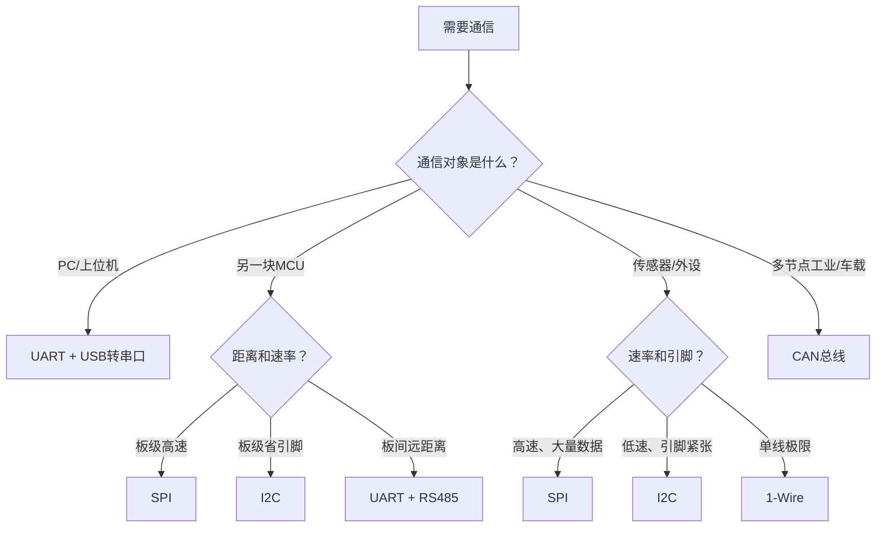

+++
title = '嵌入式通信协议选型对比'
date = 2026-05-25T00:00:00+08:00
draft = false
categories = ['通信协议']
tags = ['SPI', 'I2C', 'UART', 'CAN', '通信协议', '选型']
+++

# 嵌入式通信协议选型对比

## 题目

1. 嵌入式开发中常用的通信协议有哪些？各有什么特点？
2. SPI和I2C怎么选？什么场景用SPI，什么场景用I2C？
3. UART、I2C、SPI、CAN分别适合什么场景？
4. 项目中为什么选择某个协议？有没有考虑过其他方案？

## 考察点

通信协议的分层视角理解、常用板级通信协议的特性对比、根据应用需求进行协议选型的能力。

## 回答要点

### 1. 说到"通信协议"到底在说什么？

嵌入式面试中提到的"通信协议"可能处于完全不同的层次。很多人一听到"通信协议"就只想到SPI/I2C，其实远不止这些喵~

#### 分层视角

| 层次 | 关注什么 | 典型协议/标准 | 嵌入式中的例子 |
|------|---------|--------------|---------------|
| **物理层** | 电信号怎么传（电压、线缆、编码） | RS232、RS485、TTL、LVDS、PHY芯片 | MCU的TX引脚输出3.3V TTL电平；CAN收发器TJA1050把TTL转差分信号 |
| **数据链路层/总线协议** | 字节帧怎么组织、怎么寻址、怎么应答 | UART、I2C、SPI、CAN、USB | MPU6050通过I2C发送7位地址+读写位，每字节后回ACK |
| **网络/传输层** | 数据怎么路由、怎么保证可靠到达 | IP、TCP、UDP | STM32通过lwIP发TCP连接到服务器 |
| **应用层协议** | 数据的业务含义是什么、怎么交互 | HTTP、MQTT、Modbus、SOME/IP | ESP32通过MQTT发布传感器数据到云端 |
| **设备级通信** | 完整的设备间交互规范（通常跨多层） | BLE、WiFi、LoRa、Zigbee | nRF52832通过BLE广播心率数据给手机 |

#### 嵌入式工程师最常接触的三个层次

**① 总线协议（芯片之间、板级通信）**

这是MCU外设驱动中最核心的协议，直接操作GPIO或硬件外设喵~

| 协议 | 一句话描述 | 举例 |
|------|-----------|------|
| UART | 异步串口，两根线点对点 | printf调试、GPS模块、蓝牙模块 |
| I2C | 同步总线，两根线多设备 | 传感器（MPU6050）、EEPROM、RTC |
| SPI | 同步总线，四根线高速 | Flash、LCD、ADC、SD卡 |
| CAN | 差分总线，高可靠多节点 | 汽车ECU、工业控制 |
| 1-Wire | 单线总线，超省引脚 | DS18B20温度传感器 |

**② 网络协议（连网通信）**

当MCU需要联网时（通常通过WiFi/以太网模块），会用到这些喵~

| 协议 | 一句话描述 | 举例 |
|------|-----------|------|
| TCP | 可靠传输，有连接 | HTTP服务、文件传输 |
| UDP | 不可靠但快，无连接 | DNS查询、视频流 |
| MQTT | 轻量级发布订阅 | IoT传感器上报 |
| HTTP | 请求-响应 | REST API调用、OTA下载 |
| WebSocket | 全双工长连接 | 实时数据推送 |
| CoAP | 专为IoT设计的类HTTP协议 | 受限设备上的RESTful接口 |

**③ 无线/设备级协议（短距离或远距离无线）**

| 协议 | 一句话描述 | 举例 |
|------|-----------|------|
| BLE | 低功耗蓝牙，手机配件 | 手环、心率带、Beacon |
| WiFi | 高速无线局域网 | ESP32、IoT网关 |
| LoRa | 远距离低功耗 | 农业监测、智慧城市 |
| Zigbee | Mesh组网，智能家居 | 智能灯泡、传感器网络 |
| NFC | 近场通信，几厘米 | 门禁卡、支付 |

#### 面试怎么回答"你用过什么通信协议"

根据项目实际经历，按层次来说喵~

> "我在项目中用到过几种不同层次的通信协议。板级通信方面，用I2C连接MPU6050传感器，用SPI连接Flash存储器，用UART做调试打印。如果项目涉及联网，还用过TCP/MQTT通过ESP32上报数据。"

这样回答既展示了分层意识，又避免了只答SPI/I2C显得视角太窄喵~

**本文重点覆盖总线协议的选型**，网络协议和无线协议的详细内容在其他文章中展开。

### 2. 板级通信协议总览

| 协议 | 线数 | 全/半双工 | 典型速率 | 通信距离 | 多从机 | 同步/异步 | 典型器件 |
|------|------|----------|---------|---------|--------|----------|---------|
| UART | 2（TX/RX） | 全双工 | ≤1Mbps | 中（板间） | 否 | 异步 | GPS、蓝牙、调试串口 |
| I2C | 2（SCL/SDA） | 半双工 | 100k/400k/3.4M | 短（板级） | 是 | 同步 | MPU6050、EEPROM、BMP280 |
| SPI | 4+（CLK/MOSI/MISO/CS） | 全双工 | 几十MHz | 短（板级） | 是 | 同步 | Flash、LCD、ADC |
| CAN | 2（CANH/CANL） | 半双工 | 1Mbps | 长（几十米） | 是 | 异步 | 汽车ECU、工业控制 |
| 1-Wire | 1（数据） | 半双工 | 16.3kbps | 中 | 是 | 异步 | DS18B20、iButton |
| USB | 4（D+/D-/VCC/GND） | 半双工 | 480Mbps | 中 | 是 | 异步 | PC通信、U盘 |

### 2. SPI vs I2C（面试最高频对比）

这是面试中最常被追问的对比，必须熟练喵~

| 对比维度 | SPI | I2C |
|---------|-----|-----|
| 信号线 | 4根：SCLK、MOSI、MISO、CS | 2根：SCL、SDA |
| 双工方式 | 全双工（同时收发） | 半双工（分时收发） |
| 速率 | 几十MHz | 100kHz / 400kHz / 3.4MHz |
| 多从机方式 | 每个从机独立CS线 | 7位/10位地址寻址 |
| 应答机制 | 无ACK | 有ACK/NACK |
| 多主机 | 不支持 | 支持（有仲裁机制） |
| 流控 | 无（从机慢了只能出错） | Clock Stretching |
| 协议开销 | 无（纯数据传输） | 有地址帧+ACK开销 |
| 引脚占用 | 多（每加一个从机多1个CS） | 少（始终2根线） |
| 硬件复杂度 | 简单 | 稍复杂（开漏+上拉） |

**选SPI的场景**：
- 高速数据传输（SPI Flash读写、屏幕刷新）
- 需要全双工同时收发
- 数据量大、实时性要求高
- 典型器件：W25Q64 Flash、ST7789 LCD、AD7606 ADC

**选I2C的场景**：
- 引脚资源紧张
- 挂载多个低速传感器
- 数据量小、速率要求不高
- 典型器件：MPU6050、AT24C02 EEPROM、BMP280气压计

### 3. 各协议选型决策

#### UART：点对点异步通信的首选

```
特点：
- 只需TX/RX两根线
- 异步通信（无时钟线），双方约定波特率
- 点对点，不支持多从机
- 全双工

选UART的场景：
├── MCU调试打印（printf重定向）
├── 连接GPS模块、蓝牙模块、WiFi模块
├── 两块MCU之间简单通信
├── RS485转换后用于工业通信（多节点+长距离）
└── 与PC通信（USB转串口）
```

#### I2C：多传感器总线的首选

```
特点：
- 只需SCL/SDA两根线
- 同步通信，主机提供时钟
- 7位地址寻址，一条总线可挂127个从机
- 从机可Clock Stretching暂停通信
- 支持多主机仲裁

选I2C的场景：
├── 一条总线上挂多个传感器
├── 引脚不够用（2根线就够了）
├── 低速外设（EEPROM、RTC、传感器）
├── 需要读取从机多个连续寄存器
└── 不追求极致速率
```

#### SPI：高速板级通信的首选

```
特点：
- 4根线（CLK、MOSI、MISO、CS）
- 全双工，无协议开销
- 速率可达几十MHz
- 每个从机需要独立CS线
- 无应答机制，传输更简洁

选SPI的场景：
├── SPI Flash存储器（W25Q系列）
├── SPI接口屏幕（TFT LCD、OLED）
├── 高速ADC/DAC
├── SD卡（SPI模式）
├── 无线模块（nRF24L01、LoRa）
└── 需要几MB/s以上的传输速率
```

#### CAN：高可靠性多节点通信的首选

```
特点：
- 差分信号（CANH/CANL），抗干扰能力强
- 报文ID仲裁，非破坏性
- 内置CRC校验、错误检测与自动重传
- 支持几十个节点，通信距离可达几十米

选CAN的场景：
├── 汽车ECU之间通信
├── 工业现场总线
├── 电机驱动器多节点控制
├── 通信环境电磁干扰强
└── 对可靠性要求高于速率要求
```

### 4. 选型决策流程



### 6. 实际项目选型示例

| 项目 | 选的协议 | 理由 |
|------|---------|------|
| 四轴飞行器IMU | I2C（MPU6050） | 数据量小（14字节），采样率125Hz，I2C够用且省引脚 |
| 高性能飞控IMU | SPI（ICM-42688） | 采样率8kHz，需要低延迟、高吞吐 |
| 智能手表多传感器 | I2C | 引脚极度紧张，一条总线挂加速度计+陀螺仪+心率+气压 |
| 工业数据采集 | SPI + UART | ADC用SPI高速采集，调试用UART打印 |
| 汽车仪表盘 | CAN | 多ECU节点、高可靠性、抗干扰 |
| 3D打印机温度 | 1-Wire | DS18B20只占1个GPIO，可串联多个探头 |
| 固件存储 | SPI | SPI Flash读写速度几MB/s，满足OTA需求 |
| 蓝牙模块通信 | UART | 模块厂商约定UART接口，AT指令控制 |

### 6. 面试回答套路

面试时被问到"为什么选XX协议"，按以下结构回答喵~

> **第一层：场景需求**（速度/引脚/距离/可靠性）
> **第二层：协议特点匹配**（选它的理由）
> **第三层：替代方案对比**（为什么没选另一个）
> **第四层：实际器件佐证**（具体用什么芯片）

**示例回答**：

> "我的项目用I2C连接MPU6050传感器。从需求看，IMU数据量只有14字节，采样率125Hz，速率要求不高；从引脚资源看，板子上还有EEPROM和气压计，用I2C一条总线2根线全挂上去，非常节省GPIO。如果采样率要求到1kHz以上，我会考虑换SPI接口的ICM-42688，因为SPI没有地址帧和ACK开销，延迟更低，速率可达24MHz。"

这样回答有场景、有理由、有对比、有器件，面试官会认为你真的做过选型决策喵~
