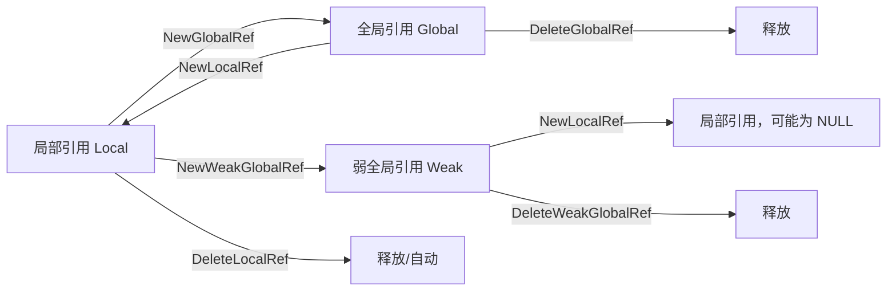

+++
title = 'JNI对象引用类型与生命周期'
date = 2026-08-10T00:00:00+08:00
draft = false
categories = ['嵌入式']
tags = ['面试题', 'JNI', 'Android', '本地引用', '全局引用', '垃圾回收']
+++

# JNI对象引用类型与生命周期

## 题目

JNI 中对象的引用有哪些类型？它们的生命周期和回收机制有什么区别？

## 考察点

JNI（Java Native Interface）引用管理、与 GC 的交互、Android NDK 开发中的内存泄漏防范。

## 回答要点

### 1. JNI 为什么需要区分引用类型

JNI 让 native（C/C++）代码能操作 Java 对象。但 Java 有 GC，而 native 代码不归 GC 管。如果 native 持有的引用类型不对，要么导致对象被提前回收（野指针），要么导致对象无法回收（内存泄漏）。因此 JNI 设计了三种引用，对应不同的生命周期和可见性。

### 2. 三种引用类型对比

| 引用类型 | 创建方式 | 生命周期 | 跨方法/线程 | GC 行为 | 释放方式 |
|---------|---------|----------|------------|---------|---------|
| **Local Reference（局部引用）** | JNI 函数返回、`NewLocalRef` | 一次 native 调用期间 | 仅当前方法、当前线程 | native 方法返回后自动失效 | 自动 或 `DeleteLocalRef` 手动 |
| **Global Reference（全局引用）** | `NewGlobalRef` | 跨多次调用，直到显式删除 | 跨方法、跨线程 | 阻止 GC 回收所指对象 | 必须手动 `DeleteGlobalRef` |
| **Weak Global Reference（弱全局引用）** | `NewWeakGlobalRef` | 跨多次调用，直到显式删除或对象被 GC | 跨方法、跨线程 | 不阻止 GC，对象可能随时消失 | `DeleteWeakGlobalRef` |

### 3. 局部引用（Local Reference）

每个 native 方法调用进入时，JVM 创建一个局部引用帧；方法返回时，帧内所有局部引用被自动释放。

```c
JNIEXPORT jstring JNICALL
Java_com_example_Foo_getMsg(JNIEnv* env, jobject thiz) {
    // 创建的 jstring 是局部引用
    jstring str = (*env)->NewStringUTF(env, "hello");

    // 用完后可提前释放（推荐：循环中避免局部引用表溢出）
    // (*env)->DeleteLocalRef(env, str);

    return str;   // 返回给 Java 层，由 Java 接管
}
```

#### 局部引用的常见陷阱：局部引用表溢出

```c
// 错误：循环中累积局部引用，默认表容量有限（Android 上每帧 512 个）
JNIEXPORT void JNICALL
Java_com_example_Foo_process(JNIEnv* env, jobject thiz, jint count) {
    for (int i = 0; i < 100000; ++i) {
        jstring s = (*env)->NewStringUTF(env, "tmp");
        use(s);
        // 不 DeleteLocalRef → 局部引用累积 → ReferenceTable overflow 崩溃
    }
}

// 正确：及时删除
for (int i = 0; i < 100000; ++i) {
    jstring s = (*env)->NewStringUTF(env, "tmp");
    use(s);
    (*env)->DeleteLocalRef(env, s);   // 关键
}
```

> 注意：`jobject`/`jclass`/`jstring` 等句柄**都是局部引用**，不能跨 native 方法调用长期持有，更不能跨线程持有（线程没有对方的局部引用帧）。

### 4. 全局引用（Global Reference）

如果需要长期持有 Java 对象（如缓存到 C++ 静态变量、跨线程回调），必须用全局引用。

```c
static jobject g_callback;        // C++ 侧缓存 Java 对象
static jmethodID g_cb_method;

JNIEXPORT void JNICALL
Java_com_example_Foo_initCallback(JNIEnv* env, jobject thiz, jobject callback) {
    // callback 是局部引用，跨调用必须转全局引用
    g_callback = (*env)->NewGlobalRef(env, callback);

    jclass cls = (*env)->GetObjectClass(env, callback);
    jmethodID m = (*env)->GetMethodID(env, cls, "onEvent", "(I)V");
    g_cb_method = m;                       // jmethodID 是稳定 ID，可直接保存
    (*env)->DeleteLocalRef(env, cls);
}

// 跨线程回调 Java
void native_thread_func(int arg) {
    JavaVM* vm = g_vm;
    JNIEnv* env;
    (*vm)->AttachCurrentThread(vm, &env, NULL);   // 子线程必须 Attach

    (*env)->CallVoidMethod(env, g_callback, g_cb_method, arg);

    (*vm)->DetachCurrentThread(vm);
}

// 退出时必须释放
JNIEXPORT void JNICALL
Java_com_example_Foo_destroy(JNIEnv* env, jobject thiz) {
    (*env)->DeleteGlobalRef(env, g_callback);
    g_callback = NULL;
}
```

**漏掉 `DeleteGlobalRef` 会导致 Java 对象永远无法被 GC 回收**（典型内存泄漏）。

### 5. 弱全局引用（Weak Global Reference）

类似 Java 的 `WeakReference`：不阻止 GC 回收对象，但引用本身长期有效。适合做缓存键、监听器弱持有。

```c
static jweak g_weak_cache;

JNIEXPORT void JNICALL
Java_com_example_Foo_cache(JNIEnv* env, jobject thiz, jobject obj) {
    if (g_weak_cache) {
        (*env)->DeleteWeakGlobalRef(env, g_weak_cache);
    }
    g_weak_cache = (*env)->NewWeakGlobalRef(env, obj);   // 不阻止 GC
}

// 使用前必须检查对象是否还活着
jobject get_cached(JNIEnv* env) {
    jobject local = (*env)->NewLocalRef(env, g_weak_cache);   // 提升为局部引用
    if (local == NULL) {
        // 对象已被 GC，需要重建
        return NULL;
    }
    return local;   // 用完后记得 DeleteLocalRef
}
```

> `jweak` 不是直接可用的指针，**必须先 `NewLocalRef` 提升后才能使用**，且提升后要检查是否为 NULL。

### 6. 引用类型转换关系



### 7. 线程安全与 JNIEnv

```c
// 关键规则：
// 1. JNIEnv 是线程局部的，不能跨线程使用！
// 2. 在 native 线程中必须先 AttachCurrentThread 拿到自己的 JNIEnv
// 3. JavaVM 是进程唯一的，可跨线程共享

static JavaVM* g_vm;   // 在 JNI_OnLoad 中保存

jint JNI_OnLoad(JavaVM* vm, void* reserved) {
    g_vm = vm;
    return JNI_VERSION_1_6;
}

void worker_thread() {
    JNIEnv* env;
    (*g_vm)->AttachCurrentThread(g_vm, &env, NULL);
    // ... 用 env 操作 Java ...
    (*g_vm)->DetachCurrentThread(g_vm);
}
```

### 8. 常见错误总结

| 错误 | 后果 | 修正 |
|------|------|------|
| 缓存局部引用做长期持有 | 引用失效后野指针崩溃 | 用 `NewGlobalRef` |
| 循环中不删除局部引用 | 局部引用表溢出崩溃 | `DeleteLocalRef` |
| 忘记 `DeleteGlobalRef` | 对象永不回收，内存泄漏 | 配对调用 |
| 跨线程使用 JNIEnv | 崩溃/未定义行为 | `AttachCurrentThread` |
| 直接使用 `jweak` 不提升 | 可能已 GC，野指针 | 先 `NewLocalRef` 检查 NULL |
| 把局部引用当返回值但调用方未释放 | 短期 OK，JVM 返回后自动清 | 注意返回值也是局部引用 |

### 9. 引用计数与自动管理（JNI 局部引用管理框架）

C++ 中可以封装 RAII 类管理引用：

```cpp
class LocalRef {
    JNIEnv* env_;
    jobject ref_;
public:
    LocalRef(JNIEnv* env, jobject ref) : env_(env), ref_(ref) {}
    ~LocalRef() { if (ref_) (*env_)->DeleteLocalRef(env_, ref_); }
    operator jobject() const { return ref_; }
    LocalRef(const LocalRef&) = delete;             // 禁拷贝
    // ... 移动语义略
};
```

## 扩展问题

面试官可能会追问：
- `jmethodID` / `jfieldID` 是引用吗？（不是对象引用，是稳定的 ID，可长期持有）
- 局部引用表有多大？能调大吗？（Android 默认 512，可通过 `EnsureLocalCapacity` 预留）
- 全局引用有没有上限？（有，Android 约 65536 个，超过会 OOM）
- 弱全局引用和 Java 的 `WeakReference` 有什么区别？（机制类似，但 JNI 侧必须手动提升才能用）
