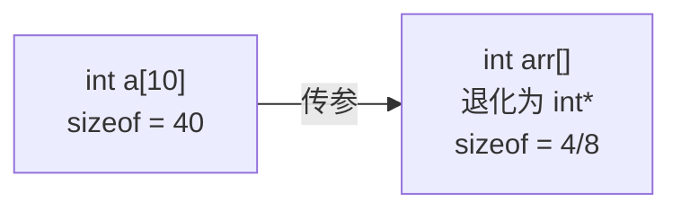

+++
title = 'sizeof运算符与数组大小计算'
date = 2026-05-27T00:00:00+08:00
draft = false
categories = ['嵌入式']
tags = ['C语言', 'sizeof', '数组', '指针退化', '编译时计算']
+++

# sizeof运算符与数组大小计算

## 题目

1. `sizeof(int a[10])` 是多少？
2. 数组作为函数参数后 sizeof 为什么变了？
3. sizeof 是在什么时候计算的？

## 考察点

sizeof 的本质（编译时运算符）、数组与指针的区别、函数参数退化、常见陷阱。

## 回答要点

### 1. sizeof 是什么

`sizeof` 是 C 语言的**编译时运算符**（不是函数），在编译阶段就确定了值，结果类型为 `size_t`。

```c
int a[10];
printf("%zu\n", sizeof(a));  // 40（10 × 4字节）
```

编译器在编译时就知道 `a` 是 `int[10]` 类型，直接计算出 `10 * sizeof(int) = 40`。

### 2. sizeof(int a[10]) 是多少

**答案是 40**（假设 `sizeof(int) = 4`）。

```c
int a[10];

sizeof(a);           // 40 = 10 × 4
sizeof(int [10]);    // 40，直接对类型求大小
sizeof(a[0]);        // 4，单个 int
sizeof(&a[0]);       // 4 或 8，指针大小
```

**计算规则**：`sizeof(数组)` = 元素个数 × 每个元素的大小。

### 3. 数组退化为指针后 sizeof 的变化

这是最常见的面试陷阱：**数组作为函数参数传递后，退化为指针**，sizeof 结果完全不同。

```c
void print_size(int arr[]) {
    printf("in function: %zu\n", sizeof(arr));  // 4 或 8（指针大小！）
}

int main(void) {
    int a[10];
    printf("in main: %zu\n", sizeof(a));         // 40
    print_size(a);
    return 0;
}
```



**原因**：C 语言中数组不能直接传值，函数参数 `int arr[]` 等价于 `int *arr`，编译器丢失了数组长度信息。

| 上下文 | 声明 | 实际类型 | sizeof 结果 |
|--------|------|---------|------------|
| 函数外 | `int a[10]` | `int[10]`（数组） | 40 |
| 函数参数 | `int arr[]` | `int*`（指针） | 4 或 8 |
| 函数参数 | `int arr[10]` | `int*`（指针） | 4 或 8 |
| 指针 | `int *p = a` | `int*` | 4 或 8 |

### 4. 用 sizeof 计算数组元素个数

```c
int a[10];
int count = sizeof(a) / sizeof(a[0]);  // 40 / 4 = 10
```

**但这个宏在指针上会出错**：

```c
void wrong_count(int arr[]) {
    int count = sizeof(arr) / sizeof(arr[0]);
    // sizeof(arr) = 4（指针），sizeof(arr[0]) = 4
    // count = 1，而不是数组长度！
}
```

**安全做法**：用宏，但只在数组上使用：

```c
#define ARRAY_SIZE(arr) (sizeof(arr) / sizeof((arr)[0]))

int a[10];
int n = ARRAY_SIZE(a);  // 10，正确

int *p = a;
int m = ARRAY_SIZE(p);  // 1，错误但编译不报错

// 更安全的写法（C11/GNU扩展）：触发编译警告
#define SAFE_ARRAY_SIZE(arr) \
    ({ __attribute__((unused)) typeof(&(arr)[0]) _p = NULL; \
       sizeof(arr) / sizeof((arr)[0]); })
```

### 5. 各种场景的 sizeof

```c
// 基本类型
sizeof(char)       // 1（标准保证）
sizeof(short)      // 2
sizeof(int)        // 4（大多数平台）
sizeof(long)       // 4（32位）或 8（64位）
sizeof(long long)  // 8
sizeof(float)      // 4
sizeof(double)     // 8
sizeof(void*)      // 4（32位）或 8（64位）

// 数组
int a[10];
sizeof(a)          // 40

char str[] = "hello";
sizeof(str)        // 6（含 '\0'）

char *p = "hello";
sizeof(p)          // 4 或 8（指针大小，不是字符串长度）

// 结构体（考虑对齐）
struct S {
    char c;
    int i;
};
sizeof(struct S)   // 8（对齐填充）

// 二维数组
int mat[3][4];
sizeof(mat)        // 48（3 × 4 × 4）
sizeof(mat[0])     // 16（一行，4 个 int）
sizeof(mat[0][0])  // 4（单个 int）
```

#### 基本类型大小的排序关系

在常见的 32/64 位系统（Linux、Windows 主流环境）上，把基本类型按存储空间从低到高排序，恒成立的只有 **`char < int < double`**：

| 类型 | 32 位典型值 | 64 位（Linux LP64） | 64 位（Windows LLP64） |
|------|------------|--------------------|-----------------------|
| `char` | 1 | 1 | 1 |
| `short` | 2 | 2 | 2 |
| `int` | 4 | 4 | 4 |
| `long` | 4 | **8** | 4 |
| `long long` | 8 | 8 | 8 |
| `float` | 4 | 4 | 4 |
| `double` | 8 | 8 | 8 |

依据这张表可以排除常见的错误排序：

- `char = int`：永远不成立（1 ≠ 4）；
- `float < long int < double`：在 LP64 上 `long` 与 `double` 同为 8 字节，`long < double` 不成立；
- `char < float = double`：`float`（4）与 `double`（8）不等长。

标准层面只保证**非递减**的链条：`sizeof(char) <= sizeof(short) <= sizeof(int) <= sizeof(long) <= sizeof(long long)`，且 `sizeof(float) <= sizeof(double)`。`long` 是平台差异最大的一个（4 或 8），凡是把它写进严格不等式的排序都要先确认数据模型（ILP32/LP64/LLP64）。C 标准对各类型只规定最小宽度与相对关系、各架构的实际大小对照（含 8/16 位 MCU 与 DSP 的例外），详见《int和float占几个字节》。

### 6. sizeof vs strlen

| 特性 | sizeof | strlen |
|------|--------|--------|
| 本质 | 编译时运算符 | 运行时函数 |
| 对数组 | 返回数组总大小 | 遍历到 `\0` 计算长度 |
| 含 `\0` | 包含 | 不包含 |
| 对指针 | 返回指针大小 | 遍历到 `\0` |

```c
char s[] = "hello";
sizeof(s)    // 6（5字符 + '\0'）
strlen(s)    // 5

char *p = s;
sizeof(p)    // 4 或 8（指针）
strlen(p)    // 5
```

### 7. 面试速记

- `sizeof(int a[10])` = **40**（编译时计算，10×4）
- 数组传参后退化为指针，sizeof 变成 **4 或 8**
- sizeof 是**运算符不是函数**，编译时确定
- 用 `sizeof(a)/sizeof(a[0])` 算元素个数，但**只对数组有效，对指针无效**
