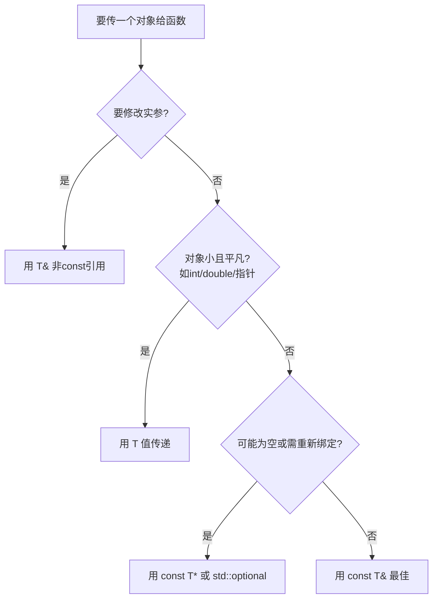

+++
title = '常用C++特性与智能指针'
date = 2026-08-10T00:00:00+08:00
draft = false
categories = ['嵌入式']
tags = ['面试题', 'C++', '智能指针', 'unique_ptr', 'shared_ptr', '虚函数', '引用']
+++

# 常用C++特性与智能指针

## 题目

1. 常用 C++ 特性有哪些？
2. `shared_ptr` 和裸指针有什么区别？
3. `shared_ptr` 和 `unique_ptr` 有什么区别？`unique_ptr` 能否作为返回值？如何转移所有权？
4. 虚函数和纯虚函数是什么？析构函数不为 `virtual` 有什么问题？
5. 引用传参有什么好处？如何兼顾效率和不修改数据？

## 考察点

C++ 语言特性的整体掌握、智能指针的语义差异、面向对象的虚函数机制、const 引用传参。

## 回答要点

### 1. 现代 C++ 常用特性总览

```cpp
// ===== C++11/14/17/20 常用特性（按出现频率排序）=====

// 1. 自动类型推导
auto it = vec.begin();            // auto
auto f = [](int x) { return x*2; }; // 配合 lambda

// 2. 智能指针
std::unique_ptr<T> up = std::make_unique<T>();
std::shared_ptr<T> sp = std::make_shared<T>();

// 3. 右值引用 + 移动语义
std::vector<T> v;
T t;
v.push_back(std::move(t));        // 移动，避免深拷贝

// 4. lambda 与 std::function
std::sort(v.begin(), v.end(), [](const T& a, const T& b){ return a.x < b.x; });

// 5. 范围 for
for (auto& e : v) e *= 2;

// 6. nullptr 替代 NULL
void f(int);  void f(char*);
f(nullptr);                       // 明确调 f(char*)

// 7. 强类型枚举
enum class Color { Red, Green, Blue };

// 8. constexpr 编译期计算
constexpr int factorial(int n){ return n<=1?1:n*factorial(n-1); }

// 9. override / final
struct D : B { void foo() override; void bar() final; };

// 10. std::thread / std::mutex / std::atomic（并发）

// C++17: structured bindings, std::optional, std::variant, if constexpr
// C++20: concepts, ranges, coroutines, modules
```

回答时挑 3~5 个自己最熟的展开讲（智能指针、移动语义、lambda、auto 最常用）。

### 2. `shared_ptr` 与裸指针的区别

```cpp
// 裸指针：程序员全权负责
int* raw = new int(42);
// ... 忘记 delete → 内存泄漏
// ... delete 后继续用 → 悬垂指针
// ... delete 两次 → 双重释放崩溃
delete raw;

// shared_ptr：引用计数自动释放
std::shared_ptr<int> sp = std::make_shared<int>(42);
auto sp2 = sp;           // 引用计数 2
// 离开作用域自动释放，无需 delete
```

| 维度 | 裸指针 | shared_ptr |
|------|--------|-----------|
| 内存释放 | 手动 delete | 引用计数归零自动 delete |
| 异常安全 | 差（new 后抛异常即泄漏） | 好（RAII） |
| 性能开销 | 零 | 控制块 + 原子计数开销 |
| 拷贝语义 | 浅拷贝（共享同一地址） | 拷贝增加引用计数 |
| 所有权语义 | 不明确 | 共享所有权 |
| 可空性 | 可为 nullptr | 可为空（默认构造或 reset） |

> 注意：`shared_ptr` 不是万能的，**循环引用（A 持有 B，B 持有 A）会导致内存泄漏**，必须用 `weak_ptr` 打破环。

### 3. `shared_ptr` 与 `unique_ptr` 的区别

| 维度 | `unique_ptr` | `shared_ptr` |
|------|-------------|-------------|
| 所有权模型 | 独占（单一所有者） | 共享（引用计数） |
| 拷贝 | **禁止**拷贝构造/赋值 | 允许，计数 +1 |
| 移动 | 允许 `std::move` | 允许 |
| 开销 | 几乎为零（无控制块） | 控制块 + 原子计数 |
| 控制块 | 无 | 有（strong/weak 计数） |
| 典型用途 | 工厂返回值、PImpl、独占资源 | 多处共享、观察者模式、缓存 |

#### `unique_ptr` 能否作为返回值？能。

```cpp
// 工厂函数返回 unique_ptr，编译器做 RVO 或移动，零开销
std::unique_ptr<Widget> make_widget() {
    return std::make_unique<Widget>();   // OK
}

auto w = make_widget();   // OK：移动构造（或 NRVO）
```

返回 `unique_ptr` 是表达"工厂把所有权移交调用者"的惯用手法，且能从中自动转换到 `shared_ptr`：

```cpp
std::shared_ptr<Widget> sw = make_widget();   // unique → shared 隐式转换
```

#### `unique_ptr` 如何转移所有权

`unique_ptr` 不能拷贝，只能移动：

```cpp
auto up1 = std::make_unique<int>(42);

// std::move 转移所有权：up1 变空，up2 接管
std::unique_ptr<int> up2 = std::move(up1);
// 现在 up1 == nullptr，up2 持有 42

// 也可以 reset 转移
up2.reset(new int(100));    // 释放旧的 42，接管新的 100

// 转入容器
std::vector<std::unique_ptr<int>> vec;
vec.push_back(std::move(up2));   // 转移到容器
```

`unique_ptr` 移动的本质：编译期禁止拷贝构造（`delete` 了拷贝构造函数），只留下移动构造，从而强制"独占"语义。

### 4. 虚函数与纯虚函数

```cpp
class Shape {
public:
    virtual double area() { return 0; }     // 虚函数：有默认实现，子类可重写
    virtual void draw() = 0;                 // 纯虚函数：无实现，子类必须重写
    virtual ~Shape() = default;              // 虚析构（关键！见下文）
};

class Circle : public Shape {
public:
    double area() override { return 3.14 * r * r; }
    void draw() override { /* ... */ }
private:
    double r;
};

// Shape s;       // 编译错误：含纯虚函数的是抽象类，不能实例化
Shape* p = new Circle();   // OK：多态
```

| 维度 | 虚函数 | 纯虚函数 |
|------|--------|----------|
| 语法 | `virtual T f() { ... }` | `virtual T f() = 0;` |
| 默认实现 | 有 | 无（C++11 起也允许纯虚函数有函数体，但仍不可直接调用） |
| 子类是否必须重写 | 否 | 是（否则子类也是抽象类） |
| 所在类能否实例化 | 能 | 不能（抽象类） |

#### 析构函数不为 `virtual` 的问题

这是经典陷阱：通过基类指针 `delete` 派生类对象时，若析构不是虚函数，**只调用基类析构，派生类析构被跳过**，导致派生类资源泄漏。

```cpp
class Base {
public:
    ~Base() { puts("Base dtor"); }       // 非 virtual！
};
class Derived : public Base {
    int* data = new int[100];
public:
    ~Derived() { delete[] data; puts("Derived dtor"); }
};

Base* p = new Derived();
delete p;
// 输出：Base dtor
// 派生类的 ~Derived 没被调用 → data 泄漏 400 字节
```

修复：

```cpp
class Base {
public:
    virtual ~Base() { puts("Base dtor"); }   // 改为 virtual
};
// delete p; 现在输出：Derived dtor → Base dtor，资源正确释放
```

**规则**：只要类打算作为多态基类（有任何其他 `virtual` 函数），析构函数就必须声明为 `virtual` 或 `override` 的 `=default`。

> 虚函数表原理、构造函数中调用虚函数的陷阱等更深内容，见 `C++多态原理与虚函数表20260923.md`。

### 5. 引用传参：兼顾效率与不可变

#### 引用传参的好处

```cpp
// 值传参：触发拷贝构造，开销大
void process(std::vector<int> v);          // 大对象拷贝

// 引用传参：零拷贝
void process(std::vector<int>& v);         // 直接操作原对象

// 指针传参：也可以避免拷贝，但语法啰嗦、可空、需判空
void process(std::vector<int>* v);         // 调用：process(&v)
```

| 传参方式 | 拷贝开销 | 能否修改实参 | 可空性 | 调用语法 |
|---------|---------|------------|--------|---------|
| 值传递 `T v` | 有 | 否（改的是副本） | 不可空 | `f(x)` |
| 引用 `T& v` | 无 | 能 | 不可空 | `f(x)` |
| 指针 `T* v` | 无 | 能 | 可空 | `f(&x)` |

#### 如何兼顾效率和不修改数据：`const T&`

```cpp
// 只读且高效的最佳实践
void print(const std::vector<int>& v) {
    for (auto e : v) std::cout << e;   // v 在函数内不可改
}
// 既避免了拷贝（引用），又禁止了修改（const）
```

**C++ 传参选择决策树**：



口诀：
- 内置小类型（int、指针）→ 值传递
- 大对象只读 → `const T&`
- 大对象要改 → `T&`
- 可能不持有 / 可空 → `const T*` 或 `std::optional<T>`

#### 移动语义的进阶：`T&&` 与 `T` 值传后 move

```cpp
// C++11 高级：转交所有权或临时对象
void sink(std::vector<int>&& v);           // 只接受右值，移动资源

// 字符串成员的"值传递 + move"惯用法
class Person {
    std::string name_;
public:
    Person(std::string name) : name_(std::move(name)) {}   // 接受左值拷贝/右值移动，再 move 到成员
};
```

## 扩展问题

面试官可能会追问：
- `make_shared` 比 `new` + `shared_ptr` 好在哪？（一次分配、缓存友好；缺点是大对象内存延迟释放）
- `unique_ptr` 为何不能拷贝却能放进 vector？（vector 用移动构造转移）
- 为什么构造函数中调用虚函数不会触发多态？（构造时 vptr 还指向当前类）
- `const T&` 能延长临时对象生命周期吗？（能，const 引用绑定到临时对象会延长其到引用的作用域结束）
