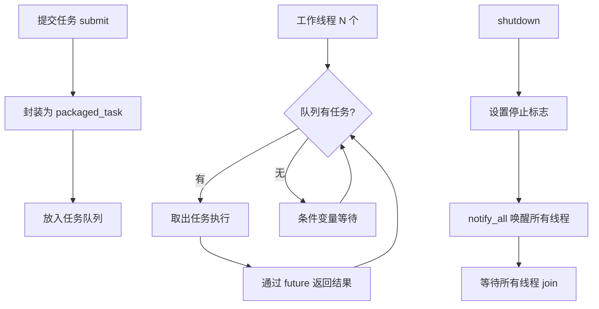

+++
title = '手写线程池与std::async对比'
date = 2026-05-20T00:00:00+08:00
draft = false
categories = ['嵌入式']
tags = ['C++', '线程池', '并发', 'std::async', '任务队列']
+++

# 手写线程池与std::async对比

## 题目

1. 手写一个线程池，要求包含任务队列、优雅关闭和异常处理。
2. 说明手写线程池和 `std::async` 的区别。

## 考察点

C++ 多线程编程能力、RAII 资源管理、条件变量/互斥锁的使用、`std::future`/`std::packaged_task` 机制。

## 回答要点

### 1. 线程池整体架构



### 2. 完整实现

```cpp
#include <iostream>
#include <vector>
#include <queue>
#include <thread>
#include <mutex>
#include <condition_variable>
#include <future>
#include <functional>
#include <atomic>
#include <stdexcept>

class ThreadPool {
public:
    explicit ThreadPool(size_t threadCount = std::thread::hardware_concurrency())
        : stop_(false)
    {
        if (threadCount == 0) {
            threadCount = 1;
        }

        for (size_t i = 0; i < threadCount; ++i) {
            workers_.emplace_back([this] { workerLoop(); });
        }
    }

    ~ThreadPool() {
        shutdown();
    }

    ThreadPool(const ThreadPool &) = delete;
    ThreadPool &operator=(const ThreadPool &) = delete;

    template <typename F, typename... Args>
    auto submit(F &&func, Args &&...args) -> std::future<std::invoke_result_t<F, Args...>> {
        using ReturnType = std::invoke_result_t<F, Args...>;

        auto task = std::make_shared<std::packaged_task<ReturnType()>>(
            std::bind(std::forward<F>(func), std::forward<Args>(args)...)
        );

        std::future<ReturnType> result = task->get_future();

        {
            std::lock_guard<std::mutex> lock(mutex_);
            if (stop_) {
                throw std::runtime_error("ThreadPool: submit on stopped pool");
            }
            tasks_.emplace([task]() { (*task)(); });
        }

        cond_.notify_one();
        return result;
    }

    void shutdown() {
        {
            std::lock_guard<std::mutex> lock(mutex_);
            if (stop_) return;
            stop_ = true;
        }

        cond_.notify_all();

        for (std::thread &worker : workers_) {
            if (worker.joinable()) {
                worker.join();
            }
        }
    }

    size_t pendingCount() const {
        std::lock_guard<std::mutex> lock(mutex_);
        return tasks_.size();
    }

private:
    void workerLoop() {
        while (true) {
            std::function<void()> task;

            {
                std::unique_lock<std::mutex> lock(mutex_);
                cond_.wait(lock, [this] {
                    return stop_ || !tasks_.empty();
                });

                if (stop_ && tasks_.empty()) {
                    return;
                }

                task = std::move(tasks_.front());
                tasks_.pop();
            }

            try {
                task();
            } catch (const std::exception &e) {
                std::cerr << "ThreadPool task exception: " << e.what() << std::endl;
            } catch (...) {
                std::cerr << "ThreadPool task unknown exception" << std::endl;
            }
        }
    }

    std::vector<std::thread> workers_;
    std::queue<std::function<void()>> tasks_;
    mutable std::mutex mutex_;
    std::condition_variable cond_;
    bool stop_;
};
```

### 3. 关键设计解析

#### 3.1 任务队列

```cpp
std::queue<std::function<void()>> tasks_;
```

所有任务被类型擦除为 `std::function<void()>` 存入队列喵~

**封装过程**（submit 函数中）：

```cpp
auto task = std::make_shared<std::packaged_task<ReturnType()>>(
    std::bind(std::forward<F>(func), std::forward<Args>(args)...)
);

tasks_.emplace([task]() { (*task)(); });
```

| 步骤 | 说明 |
|------|------|
| `packaged_task` | 将任意可调用对象包装，结果可通过 `future` 获取 |
| `shared_ptr` | 延长 `packaged_task` 生命周期，确保异步可获取结果 |
| lambda 捕获 | 按值捕获 `shared_ptr`，保证任务对象不被提前销毁 |

#### 3.2 优雅关闭

```cpp
void shutdown() {
    {
        std::lock_guard<std::mutex> lock(mutex_);
        if (stop_) return;
        stop_ = true;
    }
    cond_.notify_all();
    for (std::thread &worker : workers_) {
        if (worker.joinable()) {
            worker.join();
        }
    }
}
```

**优雅关闭三步走：**

1. 设置停止标志（加锁保护）
2. 唤醒所有等待中的线程
3. 等待所有线程执行完毕后 join

**workerLoop 中的退出条件：**

```cpp
cond_.wait(lock, [this] {
    return stop_ || !tasks_.empty();
});

if (stop_ && tasks_.empty()) {
    return;
}
```

关键：即使收到停止信号，也要先把队列中剩余的任务执行完才退出喵~

#### 3.3 异常处理

异常在两个层面处理喵~

**层面一：workerLoop 中捕获任务异常**

```cpp
try {
    task();
} catch (const std::exception &e) {
    std::cerr << "ThreadPool task exception: " << e.what() << std::endl;
} catch (...) {
    std::cerr << "ThreadPool task unknown exception" << std::endl;
}
```

防止单个任务异常导致工作线程崩溃喵~

**层面二：通过 future 传递异常给调用者**

```cpp
auto taskFunc = []() -> int {
    throw std::runtime_error("task failed");
    return 42;
};

auto future = pool.submit(taskFunc);

try {
    int result = future.get();
} catch (const std::runtime_error &e) {
    std::cout << "Caught: " << e.what() << std::endl;
}
```

`packaged_task` 会自动捕获任务中的异常，通过 `future.get()` 重新抛出给调用者喵~

#### 3.4 submit 后停止的防护

```cpp
if (stop_) {
    throw std::runtime_error("ThreadPool: submit on stopped pool");
}
```

线程池关闭后不允许再提交新任务喵~

### 4. 使用示例

```cpp
int main() {
    ThreadPool pool(4);

    auto f1 = pool.submit([]() -> int {
        std::this_thread::sleep_for(std::chrono::milliseconds(100));
        return 42;
    });

    auto f2 = pool.submit([](int a, int b) -> int {
        return a + b;
    }, 10, 20);

    std::vector<std::future<int>> results;
    for (int i = 0; i < 10; ++i) {
        results.push_back(pool.submit([i] {
            return i * i;
        }));
    }

    std::cout << "f1 = " << f1.get() << std::endl;
    std::cout << "f2 = " << f2.get() << std::endl;

    for (auto &r : results) {
        std::cout << r.get() << " ";
    }
    std::cout << std::endl;

    return 0;
}
```

输出：

```
f1 = 42
f2 = 30
0 1 4 9 16 25 36 49 64 81
```

### 5. 线程池 vs std::async 对比

#### 5.1 std::async 基本用法

```cpp
#include <future>

auto f1 = std::async(std::launch::async, [] {
    std::this_thread::sleep_for(std::chrono::milliseconds(100));
    return 42;
});

auto f2 = std::async(std::launch::async, [](int a, int b) {
    return a + b;
}, 10, 20);

std::cout << f1.get() << std::endl;
std::cout << f2.get() << std::endl;
```

#### 5.2 核心区别

| 维度 | 线程池 | std::async |
|------|--------|------------|
| 线程管理 | 固定 N 个工作线程，复用 | 每次调用可能创建新线程 |
| 资源开销 | 创建一次，持续复用 | 频繁创建销毁线程 |
| 任务队列 | 有，支持排队等待 | 无，直接启动 |
| 优雅关闭 | 支持，等队列任务完成 | 不支持，析构时阻塞等待 |
| 异常处理 | 双层（线程+future） | 通过 future 传递 |
| 并发控制 | 可控（线程数量固定） | 不可控（可能创建大量线程） |
| 返回值 | `std::future<T>` | `std::future<T>` |
| 适用场景 | 大量短任务、服务器 | 少量异步任务、简单场景 |

#### 5.3 std::async 的隐藏陷阱

**陷阱一：析构阻塞**

```cpp
{
    std::async(std::launch::async, [] {
        std::this_thread::sleep_for(std::chrono::seconds(5));
    });
}
```

`std::async` 返回的 `future` 析构时会阻塞等待任务完成喵~ 上面的代码会等待 5 秒。

**陷阱二：线程数失控**

```cpp
for (int i = 0; i < 1000; ++i) {
    std::async(std::launch::async, [i] {
        heavyTask(i);
    });
}
```

可能同时创建 1000 个线程，导致资源耗尽喵~

**陷阱三：launch 策略不确定**

```cpp
auto f = std::async(func);
```

不指定策略时，编译器可能选择 `std::launch::deferred`（延迟执行，在 `get()` 时才同步执行），根本不是异步喵~

```cpp
auto f = std::async(std::launch::async, func);
```

必须显式指定 `std::launch::async` 才能保证异步执行喵~

#### 5.4 何时用哪个

| 场景 | 推荐 | 原因 |
|------|------|------|
| Web 服务器处理请求 | 线程池 | 高并发，需要限流 |
| 批量数据处理 | 线程池 | 大量短任务，复用线程 |
| 并行排序 | 线程池 | 控制并行度 |
| 异步读文件 | std::async | 简单，一次性任务 |
| 并行计算少量值 | std::async | 2-4 个任务，不值得建池 |
| 定时任务 | 线程池 | 需要任务队列支持 |

### 6. 嵌入式场景注意事项

| 要点 | 说明 |
|------|------|
| 线程数量 | 嵌入式资源有限，通常 2-4 个工作线程 |
| 任务大小 | 避免提交耗时过长的任务，影响实时性 |
| 内存限制 | 任务队列应有上限，防止 OOM |
| 优先级 | RTOS 环境下需考虑线程优先级反转 |
| 替代方案 | FreeRTOS 使用 xTaskCreate + 消息队列实现类似功能 |

### 7. 总结

| 要点 | 说明 |
|------|------|
| 核心组成 | 工作线程 + 任务队列 + 互斥锁 + 条件变量 |
| 提交任务 | packaged_task 封装，返回 future |
| 优雅关闭 | 设置标志 → 唤醒所有线程 → 执行完剩余任务 → join |
| 异常处理 | workerLoop 捕获防崩溃 + future 传递给调用者 |
| vs async | 线程池复用线程、有队列、可控并发；async 简单但不适合高并发 |
