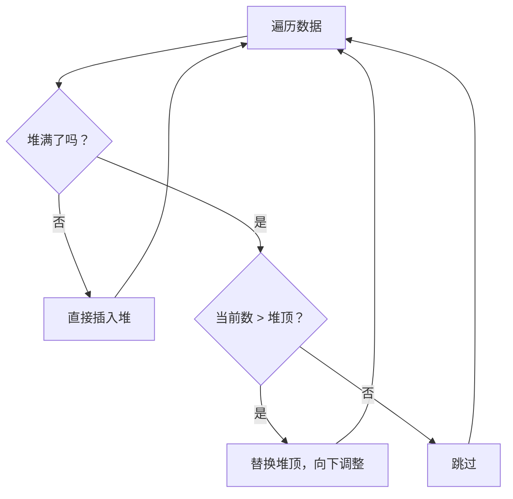

+++
title = 'Top-K问题海量数据找最大K个数'
date = 2026-04-23T00:00:00+08:00
draft = false
categories = ['嵌入式']
tags = ['算法', '堆', '优先队列', 'Top-K']
+++

# Top-K问题：海量数据找最大K个数

## 题目

怎么在500万个数中找到里面最大的100个数？

## 考察点

堆（优先队列）的应用、时间空间复杂度分析、海量数据处理思路。

## 回答要点

### 1. 问题分析

- 数据量 N = 500万，需要找最大的 K = 100 个数
- 限制条件：数据量可能大到无法全部加载到内存
- 目标：时间复杂度尽量低，空间复杂度 O(K)

### 2. 最优解：小顶堆

**核心思路**：维护一个大小为 K 的**小顶堆**，堆顶始终是当前 K 个数中的最小值喵~

遍历所有数据：
- 如果当前数 > 堆顶（最小值），则替换堆顶并向下调整
- 如果当前数 ≤ 堆顶，跳过

遍历结束后，堆中就是最大的 K 个数喵~



### 3. 代码实现

#### C++ STL 实现（最简洁）

```cpp
#include <vector>
#include <queue>
#include <iostream>

std::vector<int> findTopK(const std::vector<int>& nums, int k) {
    std::priority_queue<int, std::vector<int>, std::greater<int>> minHeap;

    for (int num : nums) {
        if (minHeap.size() < (size_t)k) {
            minHeap.push(num);
        } else if (num > minHeap.top()) {
            minHeap.pop();
            minHeap.push(num);
        }
    }

    std::vector<int> result;
    while (!minHeap.empty()) {
        result.push_back(minHeap.top());
        minHeap.pop();
    }

    return result;
}

int main() {
    std::vector<int> data = {3, 1, 4, 1, 5, 9, 2, 6, 5, 3, 5, 8, 9, 7, 9};
    int k = 3;

    auto result = findTopK(data, k);

    std::cout << "Top " << k << " elements: ";
    for (int x : result) {
        std::cout << x << " ";
    }
    std::cout << std::endl;

    return 0;
}
```

#### C 语言手写堆实现

```c
#include <stdio.h>
#include <stdlib.h>

void swap(int *a, int *b) {
    int t = *a; *a = *b; *b = t;
}

void heapify_down(int *heap, int size, int i) {
    int smallest = i;
    int left = 2 * i + 1;
    int right = 2 * i + 2;

    if (left < size && heap[left] < heap[smallest])
        smallest = left;
    if (right < size && heap[right] < heap[smallest])
        smallest = right;

    if (smallest != i) {
        swap(&heap[i], &heap[smallest]);
        heapify_down(heap, size, smallest);
    }
}

void heapify_up(int *heap, int i) {
    while (i > 0) {
        int parent = (i - 1) / 2;
        if (heap[i] < heap[parent]) {
            swap(&heap[i], &heap[parent]);
            i = parent;
        } else {
            break;
        }
    }
}

void findTopK(int *data, int n, int k, int *result) {
    int *heap = (int *)malloc(k * sizeof(int));
    int heapSize = 0;

    for (int i = 0; i < n; i++) {
        if (heapSize < k) {
            heap[heapSize] = data[i];
            heapify_up(heap, heapSize);
            heapSize++;
        } else if (data[i] > heap[0]) {
            heap[0] = data[i];
            heapify_down(heap, heapSize, 0);
        }
    }

    for (int i = 0; i < k; i++) {
        result[i] = heap[i];
    }

    free(heap);
}

int main() {
    int data[] = {3, 1, 4, 1, 5, 9, 2, 6, 5, 3, 5, 8, 9, 7, 9};
    int n = sizeof(data) / sizeof(data[0]);
    int k = 3;
    int result[3];

    findTopK(data, n, k, result);

    printf("Top %d elements: ", k);
    for (int i = 0; i < k; i++) {
        printf("%d ", result[i]);
    }
    printf("\n");

    return 0;
}
```

### 4. 复杂度分析

| 方法 | 时间复杂度 | 空间复杂度 | 是否需要加载全部数据 |
|------|-----------|-----------|-------------------|
| 排序 | O(N log N) | O(N) | 是 |
| 小顶堆 | O(N log K) | O(K) | 否 |
| 快速选择 | O(N) 平均 | O(N) | 是 |
| 分治法 | O(N log K) | O(K) | 否 |

**500万数据找最大100个：**
- 小顶堆：500万 × log(100) ≈ 500万 × 7 ≈ 3500万次操作
- 排序：500万 × log(500万) ≈ 500万 × 22 ≈ 1.1亿次操作
- **小顶堆快约3倍，且只需100个元素的额外空间**

### 5. 为什么用小顶堆而不是大顶堆

| 堆类型 | 堆顶含义 | 操作逻辑 |
|--------|---------|---------|
| 小顶堆 | K个数中的**最小值** | 新数 > 堆顶 → 替换堆顶 |
| 大顶堆 | K个数中的**最大值** | 无法判断新数是否应该替换 |

小顶堆的堆顶相当于一个"门槛"：只有比门槛大的数才有资格进入Top-K喵~ 这是小顶堆解决Top-K问题的核心优势喵~

### 6. 海量数据扩展：无法全部加载到内存

如果500万个数存在文件中，无法全部读入内存喵~

**解决方案：分批处理**

```cpp
std::vector<int> findTopKFromFile(const std::string &filename, int k) {
    std::priority_queue<int, std::vector<int>, std::greater<int>> minHeap;
    std::ifstream fin(filename);
    int num;

    while (fin >> num) {
        if (minHeap.size() < (size_t)k) {
            minHeap.push(num);
        } else if (num > minHeap.top()) {
            minHeap.pop();
            minHeap.push(num);
        }
    }

    std::vector<int> result;
    while (!minHeap.empty()) {
        result.push_back(minHeap.top());
        minHeap.pop();
    }

    return result;
}
```

### 7. 变体问题

| 变体 | 解法 |
|------|------|
| 找最小的K个数 | 用**大顶堆**，堆顶为门槛 |
| 找第K大的数 | 小顶堆大小为K，堆顶即为答案 |
| 找第K小的数 | 大顶堆大小为K，堆顶即为答案 |
| 数据流中动态Top-K | 维护小顶堆，每次新数据实时比较 |
