+++
title = 'AUTOSAR架构与RTE运行时环境'
date = 2026-05-06T00:00:00+08:00
draft = false
categories = ['嵌入式']
tags = ['AUTOSAR', 'RTE', '车载电子', '软件架构', 'Classic', 'Adaptive']
+++

# AUTOSAR架构与RTE运行时环境

## 题目

什么是AUTOSAR？Classic AUTOSAR和Adaptive AUTOSAR的区别是什么？RTE层的作用是什么？

## 考察点

车载电子软件架构理解、AUTOSAR标准知识、整车电子电气架构

## 回答要点

### 1. AUTOSAR 概述

AUTOSAR（AUTomotive Open System ARchitecture，汽车开放系统架构）是由全球汽车制造商、零部件供应商及电子/半导体企业联合发起的开放标准软件架构联盟，成立于2003年。其核心目标是建立一套标准化的车载ECU软件架构，解决以下行业痛点：

- **可移植性**：同一应用软件无需修改即可运行在不同厂商的ECU硬件上
- **可复用性**：软件组件可以在不同车型、不同项目中复用，降低开发成本
- **互操作性**：不同供应商开发的软件组件能够无缝集成到同一ECU上
- **可维护性**：标准化的分层架构使得各层可以独立升级和演进

AUTOSAR联盟目前拥有超过300家成员，包括宝马、奔驰、大众、丰田、博世、大陆、电装等主流车企和Tier1供应商。随着汽车电子电气架构从分布式向集中式演进，AUTOSAR标准也在持续发展，形成了Classic AUTOSAR（CP）和Adaptive AUTOSAR（AP）两大分支。

### 2. Classic AUTOSAR（CP）

Classic AUTOSAR是AUTOSAR最早发布的标准版本，面向基于传统MCU的ECU，是目前车载控制器领域应用最广泛的软件架构标准。

#### 2.1 分层架构

Classic AUTOSAR采用严格的分层架构，自上而下分为三层：

**应用软件层（ASW - Application Software Layer）**

- 由多个软件组件（SWC，Software Component）组成
- SWC是AUTOSAR中应用逻辑的基本封装单元
- 每个SWC通过端口（Port）与外部交互，不直接访问底层硬件
- SWC之间通过RTE进行通信，实现完全解耦

**运行时环境（RTE - Runtime Environment）**

- 位于ASW和BSW之间，是AUTOSAR架构的核心中间件
- 为应用软件提供统一的标准化API接口
- 屏蔽底层BSW和硬件的差异，实现应用软件的可移植性
- 负责SWC之间的通信调度和数据管理

**基础软件层（BSW - Basic Software Layer）**

BSW从上到下又细分为多个子层：

| 子层 | 职责 |
|------|------|
| 服务层（Service Layer） | 提供操作系统、通信、诊断、NvM、看门狗等通用服务 |
| ECU抽象层（ECU Abstraction） | 对ECU上的外设进行抽象，向上提供统一接口，向下访问MCAL |
| 复杂驱动层（Complex Drivers） | 用于非标准化外设的驱动，直接访问硬件，不经过标准接口 |
| 微控制器抽象层（MCAL） | 直接操作MCU硬件寄存器，包括CAN、LIN、SPI、ADC、PWM、GPT等模块的底层驱动 |

#### 2.2 通信方式

Classic AUTOSAR主要采用**面向信号的通信（Sender-Receiver）**模式：

- 发送方将数据写入发送端口，RTE负责将数据传递给接收方的接收端口
- 支持的数据类型包括信号（Signal）、信号组（Signal Group）
- 通信行为可配置：无限制（Unrestricted）、触发（Triggered）、周期（Periodic）
- 底层通信基于CAN、LIN、FlexRay等车载总线协议

同时也支持**客户端-服务器（Client-Server）**模式，用于请求-响应式交互场景，如诊断服务调用。

#### 2.3 适用场景

Classic AUTOSAR适用于对实时性、安全性、可靠性要求极高的传统控制域：

- **动力总成**：发动机控制（EMS）、变速箱控制（TCU）
- **车身控制**：BCM车身控制模块、车门控制、座椅控制
- **底盘控制**：ESC电子稳定系统、EPS电子助力转向、ABS防抱死系统
- **电池管理**：BMS电池管理系统
- **热管理**：整车热管理控制器

### 3. Adaptive AUTOSAR（AP）

Adaptive AUTOSAR是AUTOSAR联盟为应对智能网联汽车发展需求而推出的新标准，于2017年发布首个正式版本。它面向高性能计算平台，支持面向服务的架构（SOA），是当前自动驾驶和智能座舱域的主流软件架构选择。

#### 3.1 架构特点

Adaptive AUTOSAR与Classic AUTOSAR在设计理念上有根本性差异：

- **基于POSIX操作系统**：运行在Linux或QNX等POSIX兼容的操作系统上，而非实时操作系统
- **面向服务架构（SOA）**：应用以服务（Service）的形式存在，通过 ara::com 中间件进行服务发现和通信
- **动态部署**：支持在运行时动态加载和卸载应用，无需重启系统
- **高性能计算**：面向多核SoC/MPU平台，支持数百MB甚至GB级别的内存
- **支持OTA更新**：应用软件可以独立于整个系统进行远程更新
- **支持以太网通信**：基于SOME/IP（Scalable service-Oriented MiddlewarE over IP）协议

#### 3.2 ara::com 通信机制

Adaptive AUTOSAR的通信中间件 ara::com 提供两种通信模式：

**发布-订阅（Publish-Subscribe）**

- 服务端将数据发布到特定主题（Topic）
- 客户端订阅感兴趣的主题，自动接收数据更新
- 适用于传感器数据广播、状态通知等场景

**客户端-服务器（Client-Server）**

- 客户端向服务端发送请求，服务端处理后返回响应
- 支持Fire & Forget（单向调用）和Request & Response（请求-响应）两种模式
- 适用于功能调用、配置查询等场景

底层传输协议通常使用SOME/IP，通过以太网进行通信，支持服务发现（Service Discovery）机制，实现动态的服务注册与查找。

#### 3.3 执行管理（Execution Management）

Adaptive AUTOSAR引入了执行管理器（EM），负责：

- 应用的启动、停止和状态监控
- 进程的优先级管理和资源分配
- 应用健康状态监控和故障恢复
- 支持多个应用实例并行运行

#### 3.4 适用场景

Adaptive AUTOSAR适用于需要高性能计算和灵活部署的领域：

- **自动驾驶**：感知算法融合、路径规划、决策控制
- **智能座舱**：信息娱乐系统、HUD、语音交互、DMS驾驶员监控系统
- **域控制器**：中央计算平台、区域控制器
- **V2X通信**：车路协同、远程信息处理
- **OTA升级**：整车软件远程升级管理

### 4. Classic vs Adaptive 对比

| 对比维度 | Classic AUTOSAR (CP) | Adaptive AUTOSAR (AP) |
|----------|----------------------|----------------------|
| 目标硬件 | MCU（单片机） | SoC/MPU（高性能处理器） |
| 操作系统 | OSEK/VDX或AUTOSAR OS（实时操作系统） | POSIX兼容OS（Linux、QNX等） |
| 通信方式 | 面向信号（Sender-Receiver）、Client-Server | 面向服务（Publish-Subscribe、Client-Server） |
| 通信协议 | CAN、LIN、FlexRay | 以太网（SOME/IP）、DDS |
| 编程语言 | C语言 | C++14及以上 |
| 应用部署 | 静态链接，编译时确定 | 动态加载，运行时部署 |
| 启动时间 | 毫秒级（通常<100ms） | 秒级（通常1-10s） |
| 实时性 | 硬实时（确定性执行） | 软实时（非确定性，但可配置优先级） |
| 内存占用 | KB~MB级别 | MB~GB级别 |
| 安全等级 | 支持ASIL-D（功能安全最高等级） | 支持ASIL-B，ASIL-D需配合额外机制 |
| 应用场景 | 动力、底盘、车身等传统控制域 | 自动驾驶、智能座舱、域控制器 |
| OTA更新 | 支持有限，通常需整体刷写 | 原生支持应用级OTA |
| 服务发现 | 静态配置 | 动态服务发现（Service Discovery） |
| 软件组件 | SWC（Software Component） | AA（Adaptive Application） |
| 中间件 | RTE | ara::com |
| 标准成熟度 | 非常成熟，行业广泛采用 | 快速发展中，主流车企已采用 |
| 生态工具链 | Vector DaVinci、EB tresos、MENTOR工具链 | Vector MICROSAR Adaptive、EB corbos |

### 5. RTE（Runtime Environment）运行时环境

RTE是AUTOSAR架构中最核心的中间件组件，它扮演着"软件总线"的角色，是理解AUTOSAR架构设计的关键。

#### 5.1 RTE的核心定位

RTE位于应用软件层（ASW）和基础软件层（BSW）之间，是AUTOSAR分层架构中唯一与ASW直接交互的组件。每个ECU上只有一个RTE实例，但RTE在编译时会为每个SWC生成专属的RTE代码。

```
┌─────────────────────────────────────────┐
│           Application Layer             │
│  ┌──────┐  ┌──────┐  ┌──────┐         │
│  │ SWC-A│  │ SWC-B│  │ SWC-C│         │
│  └──┬───┘  └──┬───┘  └──┬───┘         │
├─────┼─────────┼─────────┼──────────────┤
│     │    RTE (Runtime Environment)  │   │
│     │  ┌───────────────────────┐    │   │
│     │  │   Virtual Functional  │    │   │
│     │  │       Bus (VFB)       │    │   │
│     │  └───────────────────────┘    │   │
├─────┼─────────┼─────────┼──────────────┤
│           Basic Software Layer          │
│  ┌──────────────────────────────────┐  │
│  │  Communication | Diagnosis | OS  │  │
│  │  NvM | WDG | Memory | Logging   │  │
│  └──────────────────────────────────┘  │
└─────────────────────────────────────────┘
```

#### 5.2 RTE的主要职责

**通信管理**

- SWC间通信：同一ECU内的SWC通过RTE进行数据交换
- 跨ECU通信：RTE调用BSW中的COM模块，通过CAN/LIN/FlexRay等总线与其他ECU通信
- 内部通信和外部通信对应用层透明，SWC无需关心数据是发往本地还是远程

**接口抽象**

- RTE通过端口（Port）和接口（Interface）为SWC提供标准化的数据交互方式
- Sender-Receiver接口：用于数据传输，定义数据元素（Data Element）
- Client-Server接口：用于操作调用，定义操作（Operation）及其参数和返回值
- SWC只与RTE交互，完全不知道底层BSW和硬件的存在

**数据一致性保障**

- RTE负责通信数据的缓冲管理，确保数据在传输过程中的一致性
- 支持数据变更通知机制，接收方可以选择在数据更新时被触发
- 支持超时检测和错误处理

**模式管理**

- RTE与BSW的模式管理模块协作，管理ECU的不同运行模式
- 在模式切换时，RTE负责通知相关SWC进行状态调整

#### 5.3 虚拟功能总线（VFB）

虚拟功能总线（Virtual Functional Bus）是AUTOSAR中一个重要的抽象概念：

- VFB是一个逻辑上的通信总线，连接了系统中所有的SWC
- 在系统设计阶段，VFB用于验证SWC之间的接口定义和通信关系，无需依赖具体硬件
- 在实现阶段，RTE就是VFB在具体ECU上的实现
- VFB使得软件架构设计可以与硬件平台完全解耦，实现"先设计软件架构，再选择硬件平台"的开发模式

#### 5.4 两种通信模式详解

**Sender-Receiver通信**

```
发送方 SWC                RTE                接收方 SWC
┌──────────┐        ┌──────────┐        ┌──────────┐
│          │──写入──▶│          │──读取──▶│          │
│  Sender  │        │   RTE    │        │ Receiver │
│          │        │ (缓冲区) │        │          │
└──────────┘        └──────────┘        └──────────┘
```

- 发送方调用 `Rte_Write_<Port>_<Data>()` 写入数据
- 接收方调用 `Rte_Read_<Port>_<Data>()` 读取数据
- 数据在RTE中通过缓冲区传递，发送和接收是异步的
- 适用于周期性数据传输，如传感器信号、状态信息

**Client-Server通信**

```
客户端 SWC                RTE                服务端 SWC
┌──────────┐        ┌──────────┐        ┌──────────┐
│          │──请求──▶│          │──请求──▶│          │
│  Client  │        │   RTE    │        │  Server  │
│          │◀──响应──│          │◀──响应──│          │
└──────────┘        └──────────┘        └──────────┘
```

- 客户端调用 `Rte_Call_<Port>_<Operation>()` 发起请求
- RTE将请求路由到服务端，服务端执行操作后返回结果
- 支持同步调用和异步调用
- 适用于需要即时响应的操作，如诊断服务、函数调用

#### 5.5 RTE如何实现可移植性

RTE实现软件组件可移植性的核心机制：

1. **接口标准化**：所有SWC通过标准化的AUTOSAR接口与RTE交互，接口定义与具体ECU无关
2. **配置驱动**：RTE的具体行为通过ARXML配置文件描述，编译时根据配置生成对应的RTE代码
3. **映射机制**：同一SWC可以映射到不同的ECU上，只需修改配置，无需修改SWC代码
4. **通信透明**：SWC间的通信路径（本地或跨ECU）对SWC透明，由RTE配置决定
5. **BSW抽象**：RTE屏蔽了BSW的具体实现差异，SWC不直接依赖任何BSW模块

这意味着一个在A厂商MCU上开发和验证过的SWC，只需修改RTE配置文件，重新生成RTE代码并编译，即可运行在B厂商的MCU上，SWC的源代码不需要任何修改。

### 6. AUTOSAR分层架构图

```mermaid
graph TB
    subgraph ASW["应用软件层 (ASW)"]
        SWC1["SWC-A<br/>应用组件A"]
        SWC2["SWC-B<br/>应用组件B"]
        SWC3["SWC-C<br/>应用组件C"]
    end

    subgraph RTE_Layer["运行时环境 (RTE)"]
        VFB["虚拟功能总线 (VFB)<br/>端口 & 接口管理<br/>通信调度"]
    end

    subgraph BSW["基础软件层 (BSW)"]
        subgraph ServiceLayer["服务层 (Service Layer)"]
            OS["操作系统 (OS)"]
            COM["通信 (COM / PDU Router)"]
            DIAG["诊断 (DEM / DCM / FIM)"]
            NVM["非易失性存储 (NvM / MemIf)"]
            WDG["看门狗 (WdgM / WdgIf)"]
            SCHM["模式管理 (SchM / BswM)"]
        end

        subgraph ECULayer["ECU抽象层 (ECU Abstraction)"]
            CANIF["CAN接口 (CanIf)"]
            LINIF["LIN接口 (LinIf)"]
            SPI["SPI驱动 (Spi)"]
            ADC["ADC驱动 (Adc)"]
            PWM["PWM驱动 (Pwm)"]
            GPT["定时器 (Gpt)"]
        end

        subgraph MCALLayer["微控制器抽象层 (MCAL)"]
            CANDRV["CAN驱动 (Can)"]
            LINDRV["LIN驱动 (Lin)"]
            SPIDRV["SPI驱动 (Spi_Hw)"]
            ADCDRV["ADC驱动 (Adc_Hw)"]
            PWMDRV["PWM驱动 (Pwm_Hw)"]
            GPTDRV["GPT驱动 (Gpt_Hw)"]
            PORTDRV["端口驱动 (Port)"]
            MCUDRV["MCU驱动 (Mcu)"]
        end

        subgraph ComplexDrivers["复杂驱动 (Complex Drivers)"]
            CD["复杂设备驱动<br/>(非标准化外设)"]
        end
    end

    subgraph HW["微控制器硬件 (Microcontroller)"]
        CORE["CPU Core"]
        CANHW["CAN Controller"]
        FLASH["Flash / EEPROM"]
        RAM_HW["SRAM"]
        GPIO["GPIO"]
        TIMER["Timer / Counter"]
    end

    SWC1 & SWC2 & SWC3 --> VFB
    VFB --> OS & COM & DIAG & NVM & WDG & SCHM
    OS & COM & DIAG & NVM & WDG & SCHM --> CANIF & LINIF & SPI & ADC & PWM & GPT
    CANIF & LINIF & SPI & ADC & PWM & GPT --> CANDRV & LINDRV & SPIDRV & ADCDRV & PWMDRV & GPTDRV & PORTDRV & MCUDRV
    CD -.-> PORTDRV & SPI
    CANDRV & LINDRV & SPIDRV & ADCDRV & PWMDRV & GPTDRV & PORTDRV & MCUDRV --> CORE & CANHW & FLASH & RAM_HW & GPIO & TIMER

    style ASW fill:#4CAF50,color:#fff,stroke:#388E3C
    style RTE_Layer fill:#FF9800,color:#fff,stroke:#F57C00
    style BSW fill:#2196F3,color:#fff,stroke:#1565C0
    style HW fill:#9E9E9E,color:#fff,stroke:#616161
```



### 7. 零跑/车企中的AUTOSAR应用

#### 7.1 整车电子电气架构演进

当前主流车企（包括零跑）的电子电气架构正在经历从分布式架构向域集中架构、再到中央计算架构的演进：

- **分布式架构**：每个ECU独立运行，通过CAN总线连接，Classic AUTOSAR是主流选择
- **域集中架构**：多个功能域（动力域、智驾域、座舱域、车身域）各由一个域控制器管理，域控制器内部可能同时运行CP和AP
- **中央计算架构**：一个中央计算平台统一管理所有功能，配合区域控制器实现IO就近接入

#### 7.2 AUTOSAR在整车OTA中的角色

整车OTA（Over-The-Air）升级是智能汽车的核心能力之一，AUTOSAR在其中扮演重要角色：

- **Classic AUTOSAR**：负责底层控制器的固件升级，通过UDS诊断协议实现刷写，支持刷写进度上报、完整性校验和回滚机制
- **Adaptive AUTOSAR**：支持应用级OTA，可以独立更新单个AA（Adaptive Application），无需重启整个系统，实现更灵活的软件迭代
- **OTA管理器**：通常运行在AP平台上，负责升级包管理、版本控制、差分升级策略和升级调度

#### 7.3 为什么车企重视AUTOSAR能力

车企在嵌入式岗位面试中重点考察AUTOSAR知识，原因包括：

1. **标准化需求**：整车软件规模急剧增长（现代高端车型软件代码量超过1亿行），需要标准化的架构来管理复杂度
2. **供应链协同**：车企需要与多家Tier1供应商协同开发，AUTOSAR提供了统一的接口标准和集成规范
3. **软件复用**：同一套软件组件可以跨车型、跨平台复用，显著降低开发成本和周期
4. **功能安全**：AUTOSAR提供了完善的功能安全支持机制（ISO 26262），满足ASIL-D等级的安全要求
5. **行业趋势**：域控制器和中央计算架构的普及使得AUTOSAR成为车载软件开发的必备技能
6. **人才稀缺**：同时掌握Classic和Adaptive AUTOSAR的工程师相对稀缺，具备该能力是核心竞争力

#### 7.4 面试建议

针对AUTOSAR相关面试题，建议从以下角度准备：

- 理解AUTOSAR的设计哲学和核心价值，而非死记硬背标准文档
- 能够结合实际项目经验，说明AUTOSAR在具体场景中的应用
- 了解CP和AP的融合趋势，如SOA在CP中的引入（SOME/IP over CAN等）
- 关注行业动态，如AUTOSAR R20-11、R21-11等新版本的特性
- 理解AUTOSAR工具链的使用，如DaVinci Configurator、EB tresos等配置工具的基本概念
