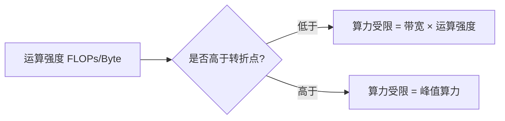

+++
title = 'CPU缓存体系与算力评估'
date = 2026-08-10T00:00:00+08:00
draft = false
categories = ['嵌入式']
tags = ['面试题', 'cache', 'cache line', '三级缓存', '流水线', '算力', 'CPU调度', '性能优化']
+++

# CPU缓存体系与算力评估

## 题目

1. CPU 三级缓存有什么特点？
2. 什么是 cache hit 和 cache miss？为什么某些数据布局能减少 cache miss？
3. cache line 是什么？
4. CPU 调度方式有哪些？
5. 算力峰值如何估算？指令周期是什么？流水线是什么？

## 考察点

计算机体系结构、存储层次、缓存友好编程、CPU 性能评估。

## 回答要点

### 1. 存储层次与三级缓存

CPU 速度远超内存（主存访问约 100 ns，CPU 一个时钟周期不到 1 ns），中间靠多级缓存弥合速度差。

```
┌──────────┐
│ 寄存器    │  0 cycle       最快、最小、最贵
├──────────┤
│ L1 Cache │  ~1-4 cycle    每核私有（分指令/数据）
├──────────┤
│ L2 Cache │  ~10 cycle     每核私有
├──────────┤
│ L3 Cache │  ~40 cycle     多核共享
├──────────┤
│ 主存 DRAM │  ~100-300 cycle 全局共享
├──────────┤
│ SSD/磁盘  │  us~ms         持久化
└──────────┘
```

| 层级 | 容量（典型） | 访问延迟 | 共享性 |
|------|------------|---------|--------|
| L1 | 32~64 KB | 1~4 cycle | 每核私有（L1I 指令 / L1D 数据分离） |
| L2 | 256 KB~1 MB | ~10 cycle | 每核私有 |
| L3 | 数 MB~几十 MB | ~40 cycle | 多核共享（LLC，Last Level Cache） |
| 主存 | GB 级 | 100~300 cycle | 全局 |

> 高通/联发科手机 SoC、RK3588 等嵌入式 SoC 同样有 L1/L2（每核），大核簇共享 L3 或 LLC。

### 2. Cache Line（缓存行）是什么

缓存不是按字节管理的，而是按**固定大小的块**整体搬运，这个块叫 **cache line**（缓存行），常见大小 64 字节。

```c
// 一行 64 字节 = 16 个 int = 8 个 double
// 访问一个 int 时，它所在整行 64 字节都会被加载到缓存
int arr[16];
arr[0] = 1;   // 触发加载 arr[0..15] 所在的整行到 L1
arr[1];       // 命中同一行，无需再访问主存
```

```c
// 查看 CPU cache line 大小（Linux）
// /sys/devices/system/cpu/cpu0/cache/index0/coherency_line_size → 64
size_t cacheline_size = sysconf(_SC_LEVEL1_DCACHE_LINESIZE);
```

Cache line 还引发**伪共享（False Sharing）**问题：两个变量落在同一缓存行，不同核各改各的，导致该行在核间反复 invalidate/同步，性能骤降。

```cpp
struct Bad {
    int a;   // 线程 1 写
    int b;   // 线程 2 写
};   // a、b 大概率同处一个 cache line → 伪共享

struct Good {
    alignas(64) int a;   // 用对齐填充，把 a、b 隔到不同行
    alignas(64) int b;
};
```

### 3. Cache Hit 与 Cache Miss

```c
int sum = arr[0];   // 第一次访问 arr[0]：Compulsory Miss（冷缺失），需从内存加载
int x = arr[1];     // 命中（同一 cache line）
int y = arr[0];     // 命中（刚加载过）
// 一段时间后 arr[0] 所在行被淘汰
int z = arr[0];     // Capacity Miss（容量缺失）
```

#### Miss 的三种类型（3C 模型）

| 类型 | 原因 | 应对 |
|------|------|------|
| Compulsory（冷缺失） | 第一次访问，必然 miss | 预取（prefetch） |
| Capacity（容量缺失） | 缓存装不下，被淘汰后再次访问 | 优化数据布局、分块 |
| Conflict（冲突缺失） | 多个数据映射到同一组（set），互相驱逐 | 对齐、调整访问顺序 |

### 4. 为什么数据布局能减少 cache miss

**核心思想：让连续访问的数据落在同一/相邻 cache line，提高空间局部性。**

#### 反例：链表 vs 数组

```c
// 链表节点散落在堆各处，遍历时每跳一个节点就 miss
struct Node { int val; Node* next; };
for (Node* p = head; p; p = p->next) sum += p->val;   // 每步都可能 miss

// 数组连续内存，遍历顺序访问，命中率极高
int arr[N];
for (int i = 0; i < N; ++i) sum += arr[i];             // 一次加载 16 个 int
```

#### 经典案例：二维数组按行 vs 按列遍历

```c
int mat[N][N];

// 按行遍历：连续访问，cache 友好
for (int i = 0; i < N; ++i)
    for (int j = 0; j < N; ++j)
        sum += mat[i][j];        // mat[i][j] 与 mat[i][j+1] 同一行

// 按列遍历：跨行跳跃，cache 不友好
for (int j = 0; j < N; ++j)
    for (int i = 0; i < N; ++i)
        sum += mat[i][j];        // 每次跨 4KB，几乎全 miss
```

C 行主序，按列遍历可能比按行慢 5~10 倍。

#### 分块（Blocking / Tiling）优化矩阵乘法

```c
// 朴素矩阵乘法，对大矩阵 cache miss 严重
for (i) for (j) for (k)
    C[i][j] += A[i][k] * B[k][j];

// 分块：把大矩阵切成小块（如 64×64），每块能装进 cache
for (ii=0; ii<N; ii+=B)
  for (jj=0; jj<N; jj+=B)
    for (kk=0; kk<N; kk+=B)
      for (i=ii; i<ii+B; ++i)
        for (j=jj; j<jj+B; ++j)
          for (k=kk; k<kk+B; ++k)
            C[i][j] += A[i][k] * B[k][j];   // 小块全部命中 cache
```

#### 结构数组 vs 数组结构（AoS vs SoA）

```cpp
// AoS（Array of Structs）：每个对象字段紧凑排列
struct Particle { float x, y, z, v; };
Particle particles[N];        // 只想算 x 时，y/z/v 也被加载，浪费带宽

// SoA（Struct of Arrays）：按字段分列
struct Particles {
    float x[N], y[N], z[N], v[N];
};
// 只遍历 x 时，连续访问，cache 完美
```

SIMD（NEON/SSE）和 GPU 编程中 SoA 布局几乎是标配。

### 5. CPU 调度方式

操作系统层面的调度算法（针对进程/线程）：

| 算法 | 原理 | 特点 |
|------|------|------|
| FCFS（先来先服务） | 按到达顺序排队 | 简单公平，短任务被长任务拖累 |
| SJF（短作业优先） | 优先调度估计时间最短的 | 平均等待最短，但可能饿生长任务 |
| RR（时间片轮转） | 每个任务执行一个时间片后让出 | 公平，响应快，时间片大小敏感 |
| 优先级调度 | 按优先级高低调度 | 高优先级可能饿死低优先级（需老化机制） |
| 多级反馈队列 | 多个队列+不同时间片，任务可在队列间移动 | 兼顾响应和吞吐，Linux/Windows 接近 |

**Linux 的 CFS（完全公平调度器）**：用红黑树按虚拟运行时间排序，选最小的运行，目标是让每个任务获得公平的 CPU 比例。

嵌入式 RTOS（FreeRTOS、RT-Thread）几乎都用**抢占式优先级调度**：

```c
// FreeRTOS：高优先级任务就绪立即抢占低优先级
vTaskPrioritySet(handle, 5);   // 数字越大优先级越高
// 同优先级的多个任务用 RR 时间片轮转
```

### 6. 指令周期与流水线

#### 指令周期

一条指令的执行分若干阶段：

```
取指 (Fetch) → 译码 (Decode) → 执行 (Execute) → 访存 (Memory) → 写回 (Writeback)
```

这五个阶段构成经典的 **5 级流水线**（RISC 经典模型）。

#### 流水线（Pipeline）

让不同指令的不同阶段并行执行，整体吞吐率提升。

```
时钟周期:    1     2     3     4     5     6     7
指令1:      取指  译码  执行  访存  写回
指令2:            取指  译码  执行  访存  写回
指令3:                  取指  译码  执行  访存  写回
```

理想情况下，每个时钟周期完成一条指令（CPI ≈ 1）。实际受流水线冒险（Hazard）影响：

| 冒险类型 | 原因 | 解决 |
|---------|------|------|
| 结构冒险 | 同一硬件被同时需要（如访存与取指冲突） | 资源复制（分离 I/D Cache） |
| 数据冒险 | 后一条指令依赖前一条的结果 | 转发（Forwarding）、停顿（Stall） |
| 控制冒险 | 分支跳转改变了后续指令流 | 分支预测、延迟槽 |

现代 ARM Cortex-A 流水线 10~15 级，x86 更深；Cortex-M0 只有 3 级，Cortex-M3/M4 是 3 级。

#### 分支预测对性能的影响

```c
// 分支预测失败的代价：流水线清空，损失等于流水线深度
// 经典例子：对有序数组求和比对无序数组快很多（条件分支可预测）
if (data[i] >= 128) sum += data[i];
// 排序后分支预测命中率高 → 快
```

### 7. 算力峰值估算

**算力峰值 = 核心数 × 频率 × 每周期浮点运算数（FLOPs/cycle）**

```c
// 示例：RK3588 八核 A76+A55，A76 @2.4GHz
// A76 每周期 2 条 128-bit NEON（每条 128bit = 4 个 float）
// 每 cycle FLOPs = 2 × 2 × 4 = 16 FLOPs（乘加算 2 次）
// 单核峰值 = 2.4e9 × 16 = 38.4 GFLOPS
// 八核峰值 ≈ 300 GFLOPS（理论，不含小核差异）
```

| 参数 | 含义 | 获取方式 |
|------|------|---------|
| 核心数 | N | 数据手册 |
| 频率 | Hz | 时钟配置（可超频/降频） |
| FLOPs/cycle | 依赖 SIMD 宽度与流水线 | 架构手册（NEON 是 128bit，SVE 可到 2048bit） |

```c
// 通用估算公式
peak_gflops = cores * freq_ghz * fma_units * simd_lanes * 2;
// 末尾 ×2：FMA（Fused Multiply-Add）一条指令算两次浮点运算
```

#### NPU/GPU 算力（TOPS）

AI 加速器常用 **TOPS（每秒万亿次操作）** 衡量，注意是 INT8 还是 FP16：

```c
// 例如某 NPU 标称 6 TOPS @INT8，对应可能是 3 TFLOPS @FP16
// 1 TOPS = 1e12 ops/s（INT8 乘加算 2 次）
```

面试要点：算力峰值是理论上限，实际受限于带宽（roofline 模型）、cache 命中率、流水线停顿。

### 8. Roofline 模型：算力 vs 带宽



很多 AI 推理任务实际是**带宽受限**而非算力受限，这就是为什么优化 cache、用 SoA 布局、减少访存比堆算力更有效。

## 扩展问题

面试官可能会追问：
- 多核之间如何保证 cache 一致性？（MESI 协议，见 `ARM多核cache一致性保证与问题分析20260420.md`）
- 为什么按行遍历比按列快？（C 行主序 + cache line 局部性）
- 流水线分支预测失败会发生什么？（清空流水线，损失 = 深度 × 频率周期）
- 如何测量实际算力？（用高密度 FMA/MUL 微基准，避免 cache miss，监控硬件计数器）
