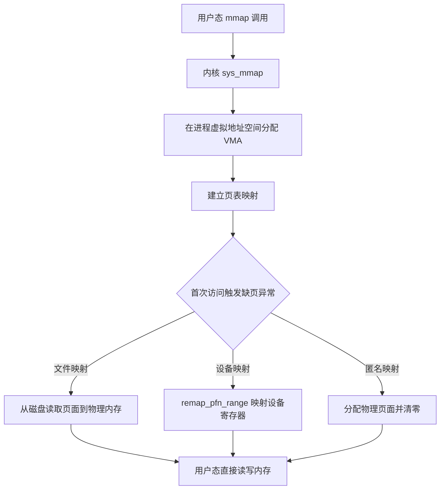

+++
title = 'Linux系统调用read路径与mmap原理'
date = 2026-04-23T00:00:00+08:00
draft = false
categories = ['嵌入式']
tags = ['Linux', '系统调用', 'mmap', '驱动']
+++

# Linux系统调用read路径与mmap原理

## 题目

1. Linux中一次read系统调用，从用户态到驱动返回数据，完整路径是什么？涉及哪些关键结构体或机制？
2. mmap的本质是什么？相比read/write，它在性能和一致性上有什么代价？

## 考察点

Linux系统调用流程、VFS层、文件描述符与file结构体、mmap内存映射原理与零拷贝。

## 回答要点

### 1. read系统调用的完整路径

#### 1.1 全链路概览


#### 1.2 逐层详解

**第一层：用户态 C 库封装**

```c
// 应用代码
int fd = open("/dev/mydev", O_RDWR);
char buf[1024];
ssize_t n = read(fd, buf, sizeof(buf));
```

`glibc` 的 `read()` 并不直接调用内核，而是将系统调用号（`__NR_read`，ARM 上为 `3`）放入 `r7` 寄存器，然后执行 `SVC #0`（ARM）或 `syscall` 指令（x86）触发异常进入内核喵~

**第二层：内核系统调用入口**

```
SVC #0
  → vector_swi（向量表条目）
    → vector_stub
      → __sys_trace
        → sys_call_table[3]  →  sys_read
```

关键结构：**`sys_call_table`** — 系统调用表，以系统调用号为索引的函数指针数组喵~

**第三层：VFS 虚拟文件系统层（`sys_read` → `vfs_read`）**

```c
// linux/fs/read_write.c
ssize_t vfs_read(struct file *file, char __user *buf, size_t count, loff_t *pos)
{
    // 1. 检查文件模式是否允许读
    if (!(file->f_mode & FMODE_READ))
        return -EBADF;

    // 2. 检查用户缓冲区是否可写
    if (!access_ok(buf, count))
        return -EFAULT;

    // 3. 调用具体文件系统的 read 方法
    if (file->f_op->read)
        return file->f_op->read(file, buf, count, pos);
    else
        return do_sync_read(file, buf, count, pos);
}
```

**第四层：驱动层（`file_operations->read`）**

```c
// 驱动注册的文件操作
static struct file_operations my_fops = {
    .owner   = THIS_MODULE,
    .open    = my_open,
    .read    = my_read,
    .write   = my_write,
    .mmap    = my_mmap,
    .release = my_release,
};

// 驱动的 read 实现
static ssize_t my_read(struct file *filp, char __user *buf,
                       size_t count, loff_t *f_pos)
{
    // 1. 从硬件或内核缓冲区获取数据
    // 2. copy_to_user(buf, kernel_data, count)
    // 3. 返回读取字节数
}
```

**第五层：数据回传**

驱动通过 `copy_to_user()` 将数据从内核空间拷贝到用户空间，然后逐层返回，最终用户态 `read()` 函数拿到数据喵~

#### 1.3 涉及的关键结构体

| 结构体 | 作用 | 关键成员 |
|--------|------|---------|
| `struct file` | 表示一个打开的文件 | `f_op`(操作函数表)、`f_pos`(读写位置)、`private_data`(私有数据) |
| `struct inode` | 表示磁盘上的文件元信息 | `i_rdev`(设备号)、`i_cdev`(字符设备) |
| `struct file_operations` | 文件操作函数表 | `open`、`read`、`write`、`mmap`、`ioctl`、`poll` |
| `struct cdev` | 字符设备抽象 | `ops`(file_operations)、`owner`、`dev`(设备号) |
| `struct task_struct` | 进程描述符 | `files`(打开文件表) |

#### 1.4 调用链汇总

```
用户态:  read(fd, buf, count)
         │
         ▼ glibc 封装 + SVC/syscall
内核态:  entry.S（异常入口）
         │
         ▼
         sys_call_table[__NR_read]
         │
         ▼
         sys_read()  →  vfs_read()
         │
         ▼ 查找 file → inode → file_operations
         file->f_op->read()  或  do_sync_read()
         │
         ▼
         驱动 my_read()
         │
         ▼
         copy_to_user(buf, kernel_data, count)
         │
         ▼
用户态:  read() 返回，buf 中已有数据
```

### 2. mmap 的本质

#### 2.1 什么是 mmap

`mmap`（Memory Map）将文件或设备的一段区域**映射到进程的虚拟地址空间**，使得进程可以通过指针直接访问文件内容，无需 `read`/`write` 系统调用喵~

```c
// 用户态
void *addr = mmap(NULL, length, PROT_READ | PROT_WRITE,
                  MAP_SHARED, fd, offset);

// 直接通过指针读写
uint32_t val = *(volatile uint32_t *)(addr + 0x10);
*(volatile uint32_t *)(addr + 0x20) = 0x01;

// 不再需要 read() / write()
```

#### 2.2 mmap 的实现原理



**驱动端 mmap 实现：**

```c
static int my_mmap(struct file *filp, struct vm_area_struct *vma)
{
    struct my_device *dev = filp->private_data;
    unsigned long phys_addr = dev->regs_phys;
    unsigned long vsize = vma->vm_end - vma->vm_start;
    unsigned long psize = dev->regs_size;

    if (vsize > psize)
        return -EINVAL;

    vma->vm_page_prot = pgprot_noncached(vma->vm_page_prot);

    return remap_pfn_range(vma,
                           vma->vm_start,
                           phys_addr >> PAGE_SHIFT,
                           vsize,
                           vma->vm_page_prot);
}
```

#### 2.3 mmap vs read/write 对比

| 对比项 | read/write | mmap |
|--------|-----------|------|
| 系统调用次数 | 每次读写都要调用 | 只在映射时调用一次 |
| 数据拷贝 | 2次（内核缓冲区→页缓存→用户缓冲区） | 0次（直接访问页缓存） |
| 内存占用 | 需要用户态缓冲区 | 共用页缓存，无需额外缓冲 |
| 延迟 | 每次都有系统调用开销 | 首次访问缺页有开销，后续接近内存访问速度 |
| 适用场景 | 少量随机读写、流式读写 | 大文件随机访问、设备寄存器映射、进程间共享内存 |

#### 2.4 mmap 的性能代价

| 代价 | 说明 |
|------|------|
| 缺页异常开销 | 首次访问每页触发一次缺页，内核需分配物理页、建立映射 |
| TLB 压力 | 大面积映射产生大量 TLB entry，miss 率上升 |
| 页面换出风险 | 映射区域可能被内核换出到 swap，导致访问延迟不可预测 |
| 不适合顺序读写 | 顺序读写场景下，read 的预读（readahead）机制更高效 |

#### 2.5 mmap 的一致性代价

| 问题 | 说明 |
|------|------|
| 多进程共享映射（MAP_SHARED） | 一个进程写入后，其他进程**可能不会立即看到**，需要内核自动同步页缓存 |
| 信号安全 | mmap 区域的写入不是原子的，信号中断可能导致不一致 |
| 与 read/write 混用 | 同一文件同时用 mmap 和 read/write 访问，需要关注缓存一致性 |
| 设备寄存器映射 | 必须使用 `pgprot_noncached` 禁用 cache，否则读写可能被缓存 |

```c
// 多进程共享内存的正确同步
volatile int *shared = mmap(NULL, sizeof(int), PROT_READ | PROT_WRITE,
                            MAP_SHARED, fd, 0);

__sync_fetch_and_add(shared, 1);

printf("value = %d\n", *shared);
```

### 3. 总结

| 问题 | 核心答案 |
|------|---------|
| read路径 | 用户态→SVC→sys_call_table→sys_read→vfs_read→file_operations→驱动→copy_to_user |
| 关键结构体 | `file`、`inode`、`file_operations`、`cdev`、`task_struct` |
| mmap本质 | 将文件/设备物理内存映射到进程虚拟地址空间，通过页表/缺页机制按需加载 |
| 性能优势 | 零拷贝、无系统调用开销 |
| 性能代价 | 缺页异常、TLB压力、不适合顺序读写 |
| 一致性代价 | 多进程可见性、与read/write混用、设备映射需noncached |
