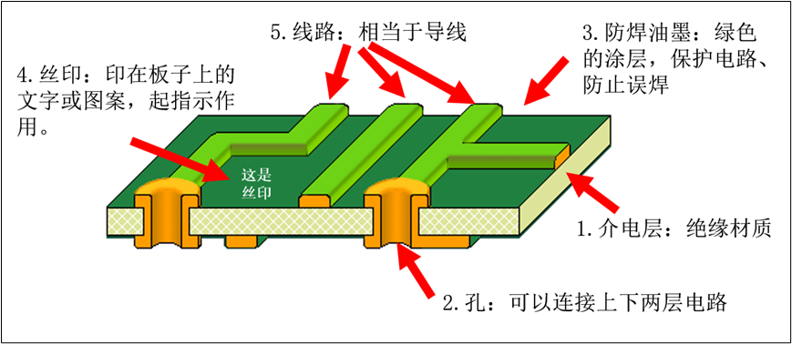
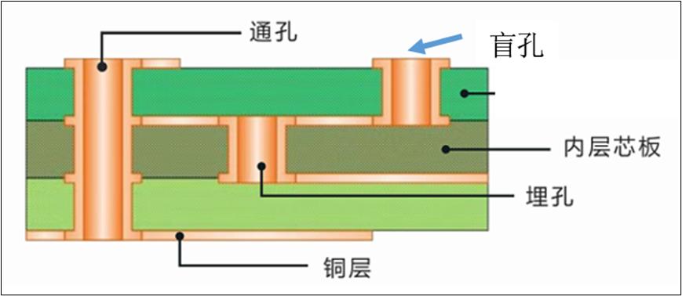

+++
title = 'PCB设计软件'
date = 2026-03-17T00:00:00+08:00
draft = false
categories = ['PCB设计']
tags = ['硬件设计']
+++

以下是一些常见的PCB（印刷电路板）设计软件及其对应的文件后缀名，供你参考：

1. Altium Designer
简介：目前业界使用非常广泛的软件之一，功能强大，集成度高。

常见后缀名：

原理图文件：.SchDoc

PCB文件：.PcbDoc

集成库文件：.IntLib

项目文件：.PrjPcb

2. Cadence Allegro
简介：主要针对中高端电路设计，尤其在高速板、复杂板卡设计领域占据主导地位。

常见后缀名：

原理图文件：.DSN (OrCAD CIS 原理图)

PCB文件：.brd

封装库文件：.dra (Drawing)、.psm (Package Symbol)、.pad (Padstack)

项目文件：.opj

3. PADS (Mentor Graphics， 现西门子)
简介：界面友好，上手相对容易，在中小企业中非常流行。

常见后缀名：

原理图文件：.sch

PCB文件：.pcb

库文件：.pt4 (元件类型库)、.pd4 (PCB封装库)、.ld4 (逻辑库)

4. KiCad EDA
简介：开源免费的软件，社区活跃，跨平台（Windows， macOS， Linux）。

常见后缀名：

原理图文件：.kicad_sch

PCB文件：.kicad_pcb

项目文件：.kicad_pro

封装库：.pretty (文件夹形式，但内部包含 .kicad_mod 文件)

5. Eagle (Autodesk)
简介：早期在创客和教育领域非常流行，后被Autodesk收购。

常见后缀名：

原理图文件：.sch

PCB文件：.brd

库文件：.lbr

6. 立创EDA (EasyEDA)
简介：国产软件，基于浏览器的在线/离线设计工具，与立创商城和PCB打样服务结合紧密。

常见后缀名：

原理图文件：_sch.json 或 工程文件内嵌 (标准版和专业版有差异)

PCB文件：_pcb.json 或 工程文件内嵌

专业版项目：.eprj

7. Proteus
简介：以仿真功能见长，常用于单片机系统的仿真和教学。

常见后缀名：

设计文件：.pdsprj (Proteus 8 及以上版本)

总结
不同的公司或学校可能习惯使用不同的软件。如果需要打开一个PCB文件，可以先通过其后缀名判断它是由哪款软件生成的。

2.1 PCB的典型结构（双层板为例）
目前的电路板，主要由以下部分组成。
（1）介电层：用来保持线路及各层之间的绝缘性，俗称为基材，最常见的材料是玻璃纤维。
（2）孔：导通孔可以使两层次以上的线路彼此导通，
（3）防焊油墨：对于整个电路板来说，并非全部的铜面都要吃锡上零件，因此非吃锡的区域，会印一层隔绝铜面吃锡的物质（通常是环氧树脂），避免
（4）丝印：丝印的主要功能是是在电路板上标注个零件的名称、位置框，方便组装后维修及辨识用。
（5）线路：基材上的铜面，经过曝光和化学腐蚀形成特定的线路，用来对元件起到连接作用。

随着电路板层数的增加，孔的类型也变得更加多样化。根据孔的穿透策略，我们可以将它们分为以下几类：

（1）**通孔（Through Hole****）**：这种孔类型从PCB的一侧直接穿透至另一侧。

（2）**盲孔（Blind Via****）**：盲孔连接PCB内部层与外部层，但并不贯穿整个PCB板。

（3）**埋孔（Buried Via****）**：也可以称为盖孔，埋孔仅存在于PCB的内部层之间，不与PCB表层相连。

这些不同的孔类型为电路板的设计提供了更高的灵活性和更复杂的电气连接可能性，适用于各种不同的应用需求。

​                                   

在PCB设计中，插件封装和贴片封装之间一个关键的区别在于：插件封装的元件需要在PCB上进行打孔处理，以便安装，而贴片封装的元件则无需此项操作。

1.1 几种常见的IC封装

1.1.1 DIP

**DIP****（Dual In-line Package****）双列直插封装：**一种传统的封装形式，元件有两排平行的引脚，适合于穿孔安装在PCB上。

​                                   

1.1.2 SOP

**SOIC****（Small Out-Line Package****）小型轮廓封装：**是一种集成电路的封装类型，特点是小型轮廓封装，两边有引脚。这种封装通常用于贴片技术，意味着它们是为了直接贴装到印刷电路板（PCB）上而设计的，而不是通过孔插装。

SOP 包含了多个不同的封装类型，如 SOIC、SOP（Standard SOP）、TSSOP（Thin Shrink SOP）等。

 

1.1.3 QFP

**QFP****（Quad Flat Package****）四边扁平封装：**四边都有引脚的封装，通常用于集成电路，提供较高的引脚数目，适合复杂的电路设计。

​     

1.1.4 QFN封装（Quad Flat No-leads Package，方形扁平无引脚封装）

QFN 是日本电子[机械工业](https://baike.baidu.com/item/机械工业/526872?fromModule=lemma_inlink) 会规定的名称，封装四侧配置有电极触点，由于无引脚，贴装占有[面积比](https://baike.baidu.com/item/面积比/108757?fromModule=lemma_inlink)[QFP](https://baike.baidu.com/item/QFP/909936?fromModule=lemma_inlink) 小，高度 比QFP 低。      

​     

1.1.5 BGA

**BGA****（Ball Grid Array****）球栅阵列封装：**在元件底部使用网格形式的球形引脚，能提供更高的引脚密度，对于高性能、多引脚的集成电路尤其适用。
