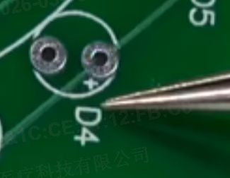
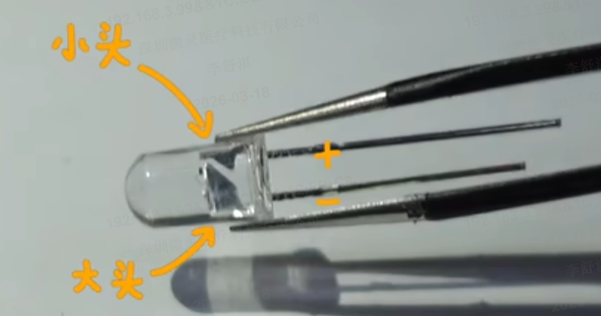

+++
title = 'LED 灯的设计与应用'
date = 2026-03-17T00:00:00+08:00
draft = false
categories = ['PCB设计']
tags = ['LED', '指示灯', '硬件设计']
+++

# LED 灯的设计与应用

## LED 的基本原理

LED（Light Emitting Diode，发光二极管）是一种能够将电能转换为光能的半导体器件。它具有二极管的单向导电特性，当正向偏置时，电子与空穴复合释放能量，以光的形式发出。

### LED 的工作特性

**正向电压（VF）：**
- 不同颜色的 LED 有不同的正向电压降
- 红色 LED：约 1.8V - 2.2V
- 绿色 LED：约 2.0V - 2.4V
- 蓝色 LED：约 2.8V - 3.2V
- 白色 LED：约 3.0V - 3.4V

**工作电流（IF）：**
- 普通指示 LED：5mA - 20mA
- 高亮 LED：20mA - 100mA
- 超高亮 LED：100mA 以上

**反向电压（VR）：**
- 一般为 5V 左右
- 超过反向电压可能损坏 LED

## LED 的分类

### 按封装分类

#### 1. 直插式 LED（THT）

**常见规格：**
- 3mm（圆形）
- 5mm（圆形，最常用）
- 8mm、10mm（大功率）
- 方形、矩形等异形

**特点：**
- 功率大，亮度高
- 引脚长，便于手工焊接
- 适合作为指示灯、背光

#### 2. 贴片式 LED（SMD）

**常见封装：**
- 0402：极小，适合高密度
- 0603：最常用
- 0805：较易焊接
- 1206：大功率应用

**特点：**
- 体积小，适合自动化贴装
- 高度低，适合薄型产品
- 散热性能相对较差

### 按颜色分类

**单色 LED：**
- 红色、绿色、蓝色、黄色、橙色等
- 成本低，应用广泛

**双色 LED：**
- 共阴或共阳极
- 两个引脚控制两种颜色
- 适合状态指示

**RGB LED：**
- 红、绿、蓝三色合一
- 可调出各种颜色
- 需要三路控制

### 按亮度分类

**普通 LED：**
- 亮度：10mcd - 100mcd
- 电流：5mA - 20mA
- 适合室内指示

**高亮 LED：**
- 亮度：100mcd - 1000mcd
- 电流：20mA - 100mA
- 适合户外指示、背光

**超高亮 LED：**
- 亮度：1000mcd 以上
- 电流：100mA 以上
- 适合照明、车灯

## LED 的驱动方式

### 1. 限流电阻驱动

最简单、最常用的驱动方式：

```
VCC ----[电阻]----[LED]----GND
```

**限流电阻计算公式：**
```
R = (VCC - VF) / IF
```

其中：
- R：限流电阻值
- VCC：电源电压
- VF：LED 正向电压
- IF：LED 工作电流

**示例计算：**

使用 5V 电源驱动红色 LED（VF=2V），电流设为 10mA：
```
R = (5V - 2V) / 0.01A = 300Ω
```

选择标准电阻值：330Ω（向上取整，更安全）

实际电流：
```
IF = (5V - 2V) / 330Ω ≈ 9.1mA
```

### 2. 三极管驱动

当 LED 需要较大电流或多个 LED 并联时，使用三极管驱动：

```
GPIO ----[电阻]----基极
                     |
VCC ----[电阻]----集电极 ----[LED]----GND
                     |
                   发射极----GND
```

**适用场景：**
- 需要驱动大功率 LED
- 需要控制多个 LED
- MCU 输出电流不足

### 3. 恒流驱动

对于要求高稳定性的应用，使用恒流驱动芯片：

**优点：**
- 亮度稳定，不受电压波动影响
- 保护 LED 不受过流损坏
- 可实现调光、PWM 控制

**适用场景：**
- 照明应用
- 背光显示
- 要求亮度稳定的场合

## 电源指示灯设计

### 设计说明

电源指示灯是 LED 最常见的应用之一，用于指示设备是否通电。这个 LED 及其限流电阻是并联在 MCU 的 VCC 供电线上，因此只要 MCU 通电，LED 就会亮起。

### 限流电阻选择

**低功耗设计：**

为了降低功耗，指示灯的 LED 通常不会调得很亮。在这种情况下，限流电阻可以从 1kΩ 起始，也可以尝试使用其他阻值。

**电阻值与亮度关系：**

| 电阻值 | 工作电流（5V电源，红LED） | 亮度 | 功耗 |
|-------|-------------------------|------|------|
| 220Ω | 13.6mA | 很亮 | 40.8mW |
| 470Ω | 6.4mA | 较亮 | 19.2mW |
| 1kΩ | 3mA | 适中 | 9mW |
| 2.2kΩ | 1.4mA | 较暗 | 3.1mW |
| 4.7kΩ | 0.6mA | 很暗 | 0.9mW |

**推荐值：**
- 室内产品：1kΩ - 2.2kΩ
- 户外产品：470Ω - 1kΩ
- 低功耗产品：2.2kΩ - 4.7kΩ

确保 LED 亮度适中即可。适当地降低亮度不仅能满足指示要求，还能有效减少整个电路板的电流消耗，降低功耗。

### 连接方式

**并联连接：**
```
VCC ----[LED]----[电阻]----GND
```

**优点：**
- 电路简单
- 不占用 MCU 引脚

**缺点：**
- 无法控制开关
- 持续消耗功率

## 状态指示 LED 设计

### GPIO 驱动指示灯

使用 MCU 的 GPIO 引脚控制 LED，用于显示各种工作状态：

```
GPIO ----[电阻]----[LED]----GND
```

**常见应用：**
- 运行状态指示
- 通信状态指示
- 报警指示
- 模式切换指示

### 多状态指示

#### 1. 单色 LED 多状态

通过闪烁频率、亮度变化表示不同状态：

**示例：**
- 常亮：正常工作
- 慢闪（1Hz）：待机
- 快闪（4Hz）：数据传输
- 双闪：错误状态

#### 2. 双色 LED

使用双色 LED 实现更多状态指示：

**连接方式（共阳极）：**
```
VCC ----+----[红LED]----[电阻]----GPIO1
       |
       +----[绿LED]----[电阻]----GPIO2
```

**状态表示：**
- 红色常亮：错误
- 绿色常亮：正常
- 红绿交替：警告
- 都熄灭：关机

#### 3. RGB LED

使用 RGB LED 实现全彩指示：

**连接方式（共阴极）：**
```
GPIO1 ----[电阻]----[红LED]----+
GPIO2 ----[电阻]----[绿LED]----+----[共阴极]----GND
GPIO3 ----[电阻]----[蓝LED]----+
```

**状态表示：**
- 红色：错误
- 绿色：正常
- 蓝色：蓝牙连接
- 紫色（红+蓝）：错误+蓝牙
- 黄色（红+绿）：警告
- 白色（全亮）：系统初始化

## LED 驱动电流考虑

### MCU GPIO 输出能力

不同 MCU 的 GPIO 输出能力不同：

**STM32 系列：**
- 单个 GPIO：最大 20mA
- 所有 GPIO 总和：最大 150mA

**ESP32：**
- 单个 GPIO：最大 40mA
- 所有 GPIO 总和：最大 1200mA

**51 单片机：**
- 单个 GPIO：最大 20mA

**设计原则：**
- 单个 LED 电流不超过 10mA（留裕量）
- 所有 LED 总电流不超过 MCU 总输出能力的 50%
- 大电流 LED 必须使用三极管或驱动芯片

### PWM 调光

使用 PWM（脉冲宽度调制）控制 LED 亮度：

**原理：**
- 快速开关 LED
- 通过占空比控制平均亮度
- 人眼看到的是平均亮度

**实现：**
```
占空比 100%：最亮
占空比 50%：中等亮度
占空比 10%：较暗
占空比 0%：熄灭
```

**频率选择：**
- 最低频率：50Hz（避免闪烁）
- 推荐频率：1kHz - 10kHz
- 高频调光：>20kHz（人耳听不到噪声）

## LED 并联与串联

### 串联连接

```
VCC ----[LED1]----[LED2]----[LED3]----[电阻]----GND
```

**特点：**
- 所有 LED 电流相同
- 需要的电压较高
- 一个 LED 损坏，全部不亮

**适用：**
- 高电压电源（如 12V、24V）
- 需要相同亮度

**限流电阻计算：**
```
R = (VCC - VF1 - VF2 - VF3) / IF
```

### 并联连接

```
        +--[LED1]--[电阻1]--+
VCC ---+                   +---GND
        +--[LED2]--[电阻2]--+
```

**特点：**
- 每个 LED 独立控制
- 每个 LED 需要独立限流电阻
- 一个 LED 损坏不影响其他

**适用：**
- 低电压电源（如 3.3V、5V）
- 需要独立控制

**限流电阻计算：**
每个 LED 独立计算：
```
R1 = (VCC - VF1) / IF1
R2 = (VCC - VF2) / IF2
```

### 混合连接（串并联）

```
        +--[LED1]--[LED2]--[电阻1]--+
VCC ---+                              +---GND
        +--[LED3]--[LED4]--[电阻2]--+
```

**适用：**
- 需要多个 LED
- 平衡电压和电流需求

## PCB 布局注意事项

### 1. LED 放置

**位置选择：**
- 指示灯：放在板子边缘或面板位置
- 状态灯：靠近对应的功能区域
- RGB LED：避免放在易反光位置

**方向：**
- 直插 LED：注意引脚方向（长脚为正极）
- 贴片 LED：注意极性标记

### 2. 走线设计

**电流能力：**
- LED 电流较大（10mA - 20mA）
- 走线宽度：8mil - 10mil 即可
- 多个 LED 并联时，电源线加宽

**参考平面：**
- LED 的回流路径要有完整的参考平面
- 避免跨越分割的参考平面

### 3. 散热考虑

**大功率 LED：**
- 铺铜散热
- 使用过孔连接到背面铺铜
- 考虑加散热片

**多个 LED：**
- 保持一定间距
- 避免热集中

### 4. 光学设计

**避免遮挡：**
- LED 发光方向不要被元件遮挡
- 使用导光柱或透镜

**减少光污染：**
- 不需要的 LED 要隔离
- 使用不透明材料遮挡

## 常见问题与解决

### 1. LED 不亮

**可能原因：**
- 电阻值过大，电流太小
- LED 极性接反
- LED 损坏
- GPIO 配置错误

**解决方法：**
- 检查电阻值
- 确认 LED 极性
- 更换 LED
- 检查 GPIO 配置

### 2. LED 过亮或过暗

**可能原因：**
- 电阻值选择不当
- 电源电压波动

**解决方法：**
- 调整电阻值
- 使用稳压电源
- 使用恒流驱动

### 3. LED 闪烁异常

**可能原因：**
- PWM 频率过低
- 供电不稳定
- MCU 程序问题

**解决方法：**
- 提高 PWM 频率
- 检查电源滤波
- 检查程序逻辑

### 4. LED 寿命短

**可能原因：**
- 电流过大
- 温度过高
- 质量问题

**解决方法：**
- 降低工作电流
- 改善散热
- 选择高质量 LED

## 总结

LED 指示灯的设计虽然简单，但需要注意以下要点：

1. **限流电阻选择**：根据电源电压和 LED 特性计算，选择合适阻值
2. **亮度与功耗平衡**：在满足指示要求的前提下尽量降低亮度
3. **驱动方式选择**：小电流用 GPIO 驱动，大电流用三极管或驱动芯片
4. **连接方式**：根据电源电压和控制需求选择串联或并联
5. **布局优化**：LED 放置合理，走线规范，考虑散热和光学效果
6. **多状态指示**：充分利用颜色、闪烁、亮度等方式传达信息

合理的 LED 设计不仅能提供清晰的状态指示，还能有效控制功耗，提升产品用户体验。


# 焊接

这个正号就是led正极

LED管：

LED正极对上pcb的正极


烙铁靠上去，然后把锡丝往焊盘上靠，先移开锡丝再移开烙铁

检查是否焊点短路

使用吸锡器（有哪些？）


