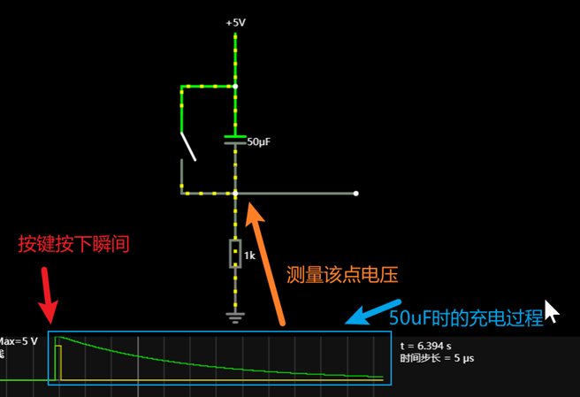

+++
title = '14_PCB设计-0006.复位电路'
date = 2026-03-17T00:00:00+08:00
draft = false
categories = ['PCB设计']
tags = ['硬件设计']
+++

12.3.1 MCU的复位
单片机上一般会有一个引脚。这个引脚可以感知外部网络传过来的是高电平还是低电平。然后根据MCU的内部设计，数据手册可能会告知用户。默认情况下，你给这个引脚低电平，MCU就会正常执行代码。如果你给了他高电平一定时间。它就会清除掉目前所有的状态，重新从代码的第一行开始执行。
对于STC89C52RC来说，他的RTS引脚是高电平复位，符合我们上面说的这种情况。

12.3.2 参考数据手册
STC89C52RC的数据手册已经为我们提供了建议，针对RC这个系列来说，如果芯片后HD后缀名，则芯片内部已经将RST通过一个电阻接地下拉了。因为我们用的STC89C52RC不是

12.3.3 复位电路的工作原理
（1）在上电的瞬间，电容处于充电状态，此时电容相当于一根导线，RST引脚得到高电平。!

（2）在上电一段时间后，电容充满，此时电容相当于短路，这个时候RST将拿到低电平。

（3）按下开关后，RST引脚相当于直接接到VCC，此时RST引脚将是高电平，这个状态维持几十us，MCU就会清空当前状态，重新回到第一行代码开始执行。

12.4 电容的作用
这个电容的作用主要是保证充足的高电平维持时间，这个电容的选择越大，这个电容所需的充电时间就越长。
10uF电容时，按键按下和电容充电时长：

50uf电容时，按键按下和电容充电时长：

通常情况下，单片机的复位引脚（RST）需要一个持续一定时间长度的高电平信号才能识别并执行复位操作。通过调整复位电路中的电容值，我们可以确保每次按下复位按钮时，都能提供足够长的高电平信号，保证单片机能够稳定地触发复位。
12.5.1 RST引脚的内部，与电平的不确定性。
下图展示了MCU内部关于RST引脚的一种简单设想。RST引脚内部直接连接受控电路，但该连接点上方靠近VCC的一端可能还有其他电路，下方靠近GND的一端也可能有其他电路。由于MCU内部电路是动态的，我们无法确定这些电路的具体阻值，不过可以肯定的是，这两个电路的阻值都非常的大，可能有500K到1MΩ级别。

这些阻值的大小关系会影响电压分配，因此在RST引脚悬空的状态下，我们无法确定它在MCU工作时到底是高电平还是低电平。
12.5.2 如何给RST确定的电平信号
要为RST引脚提供确定的电平信号，只需将其直接连接到VCC或GND。如果需要给RST引脚高电平信号，则将其直接接到VCC。这时，上方其他电路的阻值可以被忽略，受控电路会感知到高电平信号。同样，如果需要给RST引脚低电平信号，则将其直接接到GND，这样下方其他电路的阻值可以忽略，受控电路会获得确定的低电平信号。

12.5.3 为什么要加一个电阻
如果我们的RST引脚自始至终都只需要高电平或者低电平，那么我们其实可以不用给任何的电阻，直接接VCC或者GND就行了。但是因为我们要根据情况，在不同的时刻给RST引脚接VCC或者GND。下图的电路，在开关没有闭合的时候是直接连接GND的，拿到的是低电平信号。

但是，如果我们想要给RST高电平，直接闭合开关，会导致左侧电路的短路。

因此，这个时候，我们可以在下拉接地的位置引入一个电阻，
 1
12.5.4 下拉电阻
刚才我们在GND一侧放置的电阻就是"下拉电阻"，因为它接在下拉电路上。当开关未闭合时，这个电阻与"其他电路1"串联，与"其他电路2"并联。此时，可以忽略阻值很大的"其他电路2"，关注下拉电阻与"其他电路1"的分压关系。
在下方的电路仿真中，我们将下拉电阻替换为一个可调电阻器，"其他电路1"抽象为一个500kΩ的电阻。当前，下拉电阻的阻值为1kΩ，这时上方的500kΩ电阻几乎分走了所有电压，此时RST引脚上的电压为9.98mV。这个下拉效果非常强，可以称之为"强下拉"。

如果我们将可调电阻的阻值改为100kΩ，那么RST引脚的电压将变为1.423V。这种情况下，下拉效果较弱，不能完全将电压拉下来，可以称其为"弱下拉"。

如果将电路改为上拉电路，原理也是相同的。因此可以说，上拉/下拉电阻的阻值决定了上拉/下拉的强度。而且是阻值越小，拉动感越强。
经验上讲，我们可以给出下面的范围：
（1）强上拉/下拉电阻
阻值较小，通常在1kΩ到10kΩ之间。
（2）弱上拉/下拉电阻
阻值较大，通常在10kΩ到100kΩ之间，当然也可以更高。
因此，一般来说，上拉/下拉电阻的常见阻值是10kΩ。

复位电路

复位电路由电容串联电阻构成,由图并结合"电容电压不能突变"的性质,可以知道,当系统一上电,RST脚将会出现高电平,并且,这个高电平持续的时间由电路的RC值来决定.

典型的51单片机当RST脚的高电平持续两个机器周期以上就将复位,所以,适当组合RC的取值就可以保证可靠的复位。

.一般教科书推荐C 取10u,R取8.2K.当然也有其他取法的,原则就是要让RC组合可以在RST脚上产生不少于2个机周期的高电平.至于如何具体定量计算,可以参考电路分析相关书籍. 晶振电路:典型的晶振取11.0592MHz(因为可以准确地得到9600波特率和19200波特率,用于有串口通讯的场合)/12MHz(产生精确的uS级时歇,方便定时操作)

常见的复位电路

80C51单片机复位电路

单片机的复位有上电复位和按钮手动复位两种。如图2（a）所示为上电复位电路，图（b）所示为上电按键复位电路。

点击放大图片

上电复位是利用电容充电来实现的，即上电瞬间RST端的电位与VCC相同，随着充电电流的减少，RST的电位逐渐下降。图2（a）中的R是施密特触发器输入端的一个10KΩ下拉电阻，时间常数为10&times;10-6×10×103=100ms。只要VCC的上升时间不超过1ms，振荡器建立时间不超过10ms，这个时间常数足以保证完成复位操作。上电复位所需的最短时间是振荡周期建立时间加上2个机器周期时间，在这个时间内RST的电平应维持高于施密特触发器的下阈值。

上电按键复位2（b）所示。当按下复位按键时，RST端产生高电平，使单片机复位。复位后，其片内各寄存器状态见表，片内RAM内容不变。

c51单片机复位电路

点击放大图片

如S22复位键按下时：RST经1k电阻接VCC，获得10k电阻上所分得电压，形成高电平，进入“复位状态”

当S22复位键断开时：RST经10k电阻接地，电流降为0，电阻上的电压也将为0，RST降为低电平，开始正常工作。

单片机上电复位电路

AT89C51的上电复位电路如图2所示，只要在RST复位输入引脚上接一电容至Vcc端，下接一个电阻到地即可。对于CMOS型单片机，由于在RST端内部有一个下拉电阻，故可将外部电阻去掉，而将外接电容减至1µF。上电复位的工作过程是在加电时，复位电路通过电 容加给RST端一个短暂的高电平信号，此高电平信号随着Vcc对电容的充电过程而逐渐回落，即RST端的高电平持续时间取决于电容的充电时间。

为了保证系统能够可靠地复位，RST端的高电平信号必须维持足够长的时间。上电时，Vcc的上升时间约为10ms，而振荡器的起振时间取决于振荡频率，如晶振频率为10MHz，起振时间为1ms；晶振频率为1MHz，起振时间则为10ms。

在图2的复位电路中，当Vcc掉电时，必然会使RST端电压迅速下降到0V以下，但是，由于内部电路的限制作用，这个负电压将不会对器件产生损害。另外，在复位期间，端口引脚处于随机状态，复位后，系统将端口置为全“l”态。如果系统在上电时得不到有效的复位，则程序计数器PC将得不到一个合适的初值，因此，CPU可能会从一个未被定义的位置开始执行程序。

点击放大图片

积分型上电复位：

常用的上电或开关复位电路如图3所示。上电后，由于电容C3的充电和反相门的作用，使RST持续一段时间的高电平。当单片机已在运行当中时，按下复位键K后松开，也能使RST为一段时间的高电平，从而实现上电或开关复位的操作。

根据实际操作的经验，下面给出这种复位电路的电容、电阻参考值。

图3中：C：＝1uF，Rl＝lk，R2＝10k

点击放大图片

积分型上电复位电路图

专用芯片复位电路

上电复位电路 在控制系统中的作用是启动单片机开始工作。但在电源上电以及在正常工作时电压异常或干扰时，电源会有一些不稳定的因素，为单片机工作的稳定性可能带来严重的影响。因此，在电源上电时延时输出给芯片输出一复位信号。上复位电路另一个作用是，监视正常工作时电源电压。若电源有异常则会进行强制复位。复位输出脚输出低电平需要持续三个（12/fc s）或者更多的指令周期，复位程序开始初始化芯片内部的初始状态。等待接受输入信号（若如遥控器的信号等）。

点击放大图片

高低电平复位电路

点击放大图片

51单片机要求的是：高电平复位。上图是51单片机的复位电路。在上电的瞬间，电容器充电，充电电流在电阻上形成的电压为高电平（可按照欧姆定律来分析）；几个毫秒之后，电容器充满，电流为0，电阻上的电压也就为低电平了，这时，51单片机将进入正常工作状态。图1是用来产生低电平复位信号的。

单片机复位电路的原理

复位电路的目的就是在上电的瞬间提供一个与正常工作状态下相反的电平。一般利用电容电压不能突变的原理,将电容与电阻串联,上电时刻,电容没有充电,两端电压为零,此时,提供复位脉冲,电源不断的给电容充电,直至电容两端电压为电源电压,电路进入正常工作状态。

关于单片机复位电路，以前做的一点小笔记和文摘，在这里做一个综述，一方面，由于我自己做的面包板上的复位电路按键无效，于是又回过头来重新整理了一下，供自己复习，另一方面大家一起交流学习。在我看来，读书，重在交流，不管你学什么，交流，可以让你深刻的理解你所思考的问题，可以深化你的记忆，更会让你识得人生的朋友。

最近在学ARM，ARM处理器的复位电路比单片机的复位电路有讲究，比起单片机可靠性要求更高了。先让我自己来回忆一下单片机复位电路吧。

先说原理。上电复位POR(Pmver On Reset)实质上就是上电延时复位，也就是在上电延时期间把单片机锁定在复位状态上。为什么在每次单片机接通电源时，都需要加入一定的延迟时间呢?分析如下。

上电复位时序

在单片机及其应用电路每次上电的过程中，由于电源同路中通常存在一些容量大小不等的滤波电容，使得单片机芯片在其电源引脚VCC和VSS之间所感受到的电源电压值VDD，是从低到高逐渐上升的。该过程所持续的时间一般为1～100ms。上电延时的定义是电源电压从lO％VDD上升到90％VDD所需的时间。在单片机电压源电压上升到适合内部振荡电路运行的范围并且稳定下来之后，时钟振荡器开始了启动过程(具体包括偏置、起振、锁定和稳定几个过程)。该过程所持续的时间一般为1～50 ms。

起振延时的定义是时钟振荡器输出信号的高电平达到10％VDD所需的时间。例如，对于常见的单片机型号AT和AT89S，厂家给出的这个值为0．7VDD～VDD+0．5V。从理论上讲，单片机每次上电复位所需的最短延时应该不小于treset。从实际上讲，延迟一个treset往往还不够，不能够保障单片机有一个良好的工作开端。

在单片机每次初始加电的时候，首先投入工作的部件是复位电路。复位电路把单片机锁定在复位状态上并且维持一个延时，以便给予电源电压从上升到稳定的一个等待时间；在电源电压稳定之后，再插入一个延时，给予始终振荡器从起振到稳定的一个等待时间；在单片机开始进入运行状态之前，还要至少推迟2个及其周期的延时。