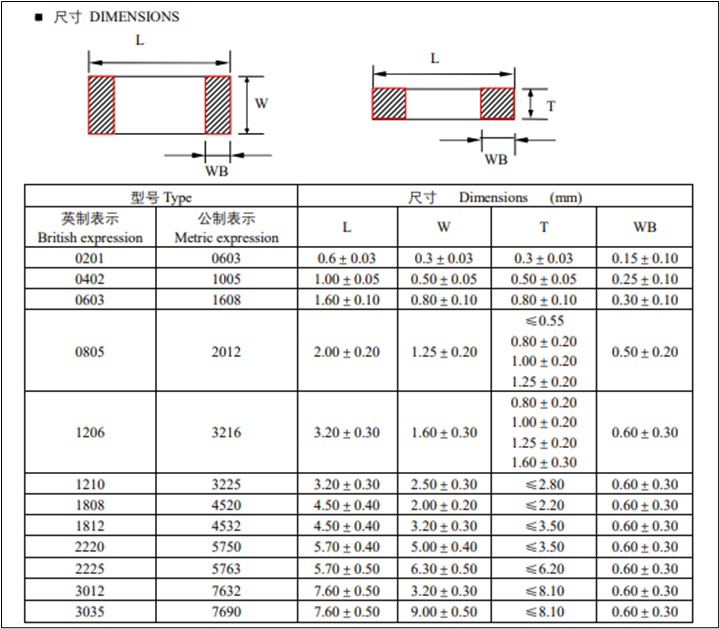

+++
title = '贴片电阻和电阻环认识'
date = 2026-03-07T00:00:00+08:00
draft = false
categories = ['嵌入式']
tags = ['贴片电阻和电阻环认识']
+++
1.1 常见贴片电阻和贴片电容封装

贴片电阻的常见封装有9种，用两种尺寸代码来表示。一种尺寸代码是由4位数字表示的EIA（美国电子工业协会）代码，前两位表示电阻的长度，后两位表示电阻的宽度，以英寸为单位。我们称为英制代码。常见的8050就是英制代码。另一种是米制代码，也由4位数字表示，单位是毫米。下表列出了贴片电阻封装英制和公制的关系及详细的尺寸：