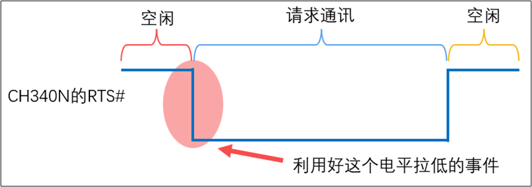
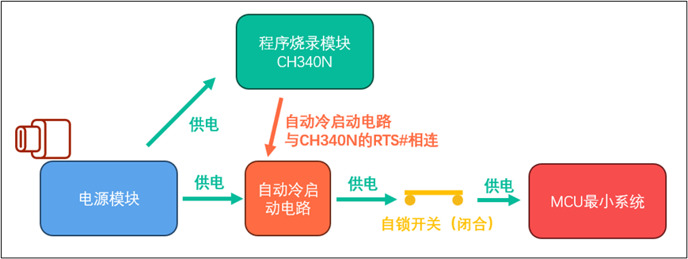

+++
title = 'RTS与硬件控制流'
date = 2026-03-07T00:00:00+08:00
draft = false
categories = ['嵌入式']
tags = ['RTS与硬件控制流']
+++

硬件控制流
18.3.1.1 RTS#引脚的功能
RTS（Request To Send，发送请求）引脚的作用是向其他设备发出“我有数据要发送，请准备接收”的信号。当芯片准备好发送数据时，RTS引脚会进入激活状态。如果在RTS旁边有一个#（即RTS#），或者名字上方有一个横杠（RTS(————)），这通常表示它是以低电平激活的。
对于CH340N芯片，其RTS#引脚在空闲状态时会保持高电平。在使用电脑通过CH340N对芯片进行程序烧录时，RTS#引脚会被拉至低电平，并在程序烧录完成后恢复至高电平。
利用RTS#引脚的这一特性，我们可以设计一个电路来控制微控制器（MCU）的电源供应，从而实现在需要时自动重置或启动MCU。
18.3.1.2 什么是硬件流控制
硬件流控制是一个专业数据，意思是在设备之间的数据通信中，使用一些辅助的硬件信号来控制数据传输速率和保证数据完整性的一种方法。这种控制方式主要用于避免数据发送速度过快，接受设备来不及处理而造成数据丢失的问题。
RTS是Request to Send，用来告诉别的硬件我要发送数据的。这样可以让别的设备停下来准备接数据，保证数据完整性。
18.3.1.3 CH340系列芯片与常见硬件控制引脚
我们选择的CH340N芯片，设计CH340系列芯片中引脚最少的一个。CH340系列的其他型号主要是引入了不同的硬件控制流引脚，同学们在日后可以根据不同的需要选择不同的芯片型号。

此处我们简单介绍一下含RTS的常见硬件流工作引脚：
（1）RTS（Request To Send）-发送请求：
这是发送设备用来告诉接收设备“我有数据要发送，请准备好接收”的信号。当发送设备准备好数据发送时，它会将RTS信号设置为激活状态。
（2）CTS（Clear To Send）-清除发送：
这是接收设备用来回应发送设备“我已准备好接收数据，你可以发送了”的信号。只有在接收设备将CTS信号设置为激活状态时，发送设备才开始数据传输。
（3）DTR（Data Terminal Ready）-数据终端就绪：
由发送设备用来指示其已准备好进行通信。
（4）DSR（Data Set Ready）-数据设备就绪：
由接收设备用来响应DTR，表示它已准备好进行通信。
（5）CD（Carrier Detect）-载波检测：
有时候也叫DCD（Data Carrier Detect），这个信号用于调制解调器通信，表明已经检测到一个有效的传输信号。
（6）RI（Ring Indicator）-振铃指示：
这个信号在电话线调制解调器中使用，指示电话线上有来电信号。
18.3.2 自动冷启动电路的设计
18.3.2.1 设计目的
每次烧录程序都需要按两下开关，这实在是太不友好了，时间长了容易磨出茧子，因此我们设计一个自动冷启动电路让MCU能够自动掉电再上电，保护我们的纤纤玉手。
18.3.2.2 设计思路
现在，我们已经了解了CH340N的RTS#引脚的工作逻辑，可以设计一个电路来捕捉CH340N的RTS#引脚电平拉低的事件，并利用它去控制一个电子开关，从而控制MCU的供电。

**体来说，该电路需要满足以下四个要点：**

（1）这个电路要捕捉到CH340N的RTS#引脚的电平拉低事件。

（2）捕捉到CH340N的RTS#引脚电平拉低的事件。

（3）在捕获到电平拉低信号后，关闭电子开关，使MCU断电关机。

（4）在一个很小的间隔后，重新打开电子开关，使MCU上电开机。

**如此，自动冷启动电路应当在下图的位置：**

可以参考开源的独立CH340下载模块原网址：https://oshwhub.com/zengxianhui/stc-isp-mian-ling-qi-dong-xia-zai-qi
