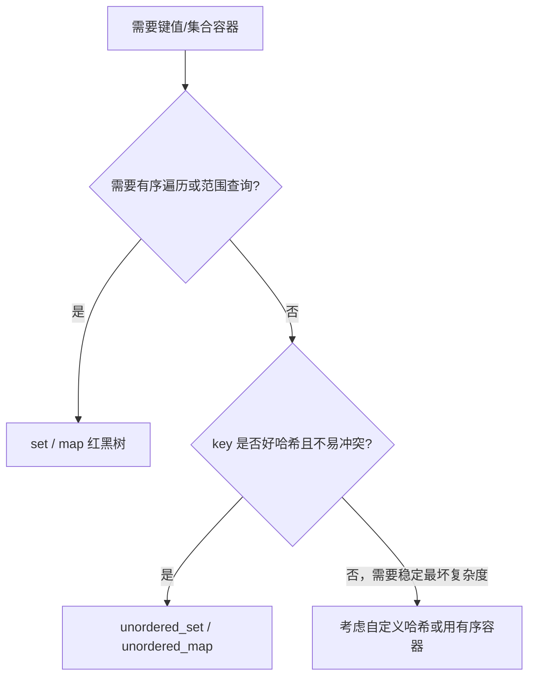

+++
title = 'set与unordered_map底层实现对比'
date = 2026-08-10T00:00:00+08:00
draft = false
categories = ['嵌入式']
tags = ['面试题', 'C++', 'STL', 'set', 'unordered_map', '红黑树', '哈希表']
+++

# set与unordered_map底层实现对比

## 题目

`set` 和 `unordered_map`（以及 `map`）有什么区别？分别适合什么场景？

## 考察点

STL 关联容器底层结构、红黑树与哈希表的权衡、容器选型。

## 回答要点

### 1. 四大关联容器一览

C++ STL 的关联容器按两个维度划分：**底层结构**（树 vs 哈希）和**键值组织**（单键 vs 键值对）。

| 容器 | 底层结构 | 元素组织 | 是否有序 | 查找复杂度 | 是否去重 |
|------|---------|---------|---------|-----------|---------|
| `set` | 红黑树 | 只有 key | 有序 | O(log n) | 去重 |
| `map` | 红黑树 | key→value | 有序 | O(log n) | key 去重 |
| `multiset` | 红黑树 | 只有 key | 有序 | O(log n) | 允许重复 key |
| `multimap` | 红黑树 | key→value | 有序 | O(log n) | 允许重复 key |
| `unordered_set` | 哈希表 | 只有 key | 无序 | 平均 O(1) | 去重 |
| `unordered_map` | 哈希表 | key→value | 无序 | 平均 O(1) | key 去重 |
| `unordered_multiset/multimap` | 哈希表 | 只有key/键值对 | 无序 | 平均 O(1) | 允许重复 |

> 题目中的对比核心其实是**有序（红黑树）vs 无序（哈希表）**两种底层结构的差异。

### 2. `set`（与 `map`）：红黑树底层

```cpp
#include <set>
#include <map>

std::set<int> s = {3, 1, 4, 1, 5};
// 插入后内部自动按升序排列：1, 3, 4, 5（重复的 1 被去重）

for (int x : s) std::cout << x << ' ';   // 1 3 4 5（中序遍历有序）

std::map<std::string, int> m;
m["apple"]  = 3;
m["banana"] = 5;
// 内部按 key 字典序：apple, banana
```

#### 红黑树的关键特性

- 近似平衡二叉搜索树，**最长路径不超过最短路径的 2 倍**
- 增删改查均为 **O(log n)**
- **中序遍历得到有序序列**（这是 `set/map` 有序的根本原因）
- 支持范围查询：`lower_bound`、`upper_bound`、`equal_range`

```cpp
std::set<int> s = {1, 3, 5, 7, 9};
auto lo = s.lower_bound(4);   // 指向 5（第一个 >= 4）
auto hi = s.upper_bound(6);   // 指向 7（第一个 > 6）
```

> 红黑树与平衡二叉树（AVL）的详细对比见 `红黑树与平衡二叉树对比20260810.md`。

### 3. `unordered_map`（与 `unordered_set`）：哈希表底层

```cpp
#include <unordered_map>
std::unordered_map<std::string, int> um;
um["apple"]  = 3;
um["banana"] = 5;
// 内部无特定顺序，由哈希值决定桶位置

// 遍历顺序不确定
for (auto& [k, v] : um) std::cout << k << ' ';
// 可能是 banana apple，也可能是 apple banana
```

#### 哈希表的工作原理

```
插入 key=k：
1. 计算 hash(k) → 桶编号 bucket = hash(k) % bucket_count
2. 把元素挂到 bucket 对应的链表/开放寻址槽中

查找 key=k：
1. 同样计算 bucket
2. 在桶内逐个比较 key
```

#### 负载因子与 rehash

```cpp
std::unordered_map<int,int> um;
um.max_load_factor();   // 默认 1.0
// 当 元素数 / 桶数 > max_load_factor 时触发 rehash：
//   1. 分配更大的桶数组（通常翻倍）
//   2. 把所有元素重新映射到新桶
// rehash 期间所有迭代器失效，单次插入变为 O(n)
```

### 4. 性能对比

| 操作 | set/map（红黑树） | unordered_set/map（哈希表） |
|------|------------------|---------------------------|
| 插入 | O(log n) | 平均 O(1)，最坏 O(n)（rehash） |
| 查找 | O(log n) | 平均 O(1)，最坏 O(n)（哈希冲突） |
| 删除 | O(log n) | 平均 O(1) |
| 范围查询 | **支持，高效** | 不支持 |
| 有序遍历 | 支持 | 不支持（顺序随机） |
| 内存占用 | 每节点 3 指针+颜色位 | 桶数组+链表节点 |
| 缓存友好性 | 差（节点散落堆中） | 较好（桶数组连续） |

#### 哈希表的最坏情况

```cpp
// 攻击场景：精心构造的 key 让所有元素落到同一桶 → 退化为 O(n)
// 例如 unordered_map<int> 用某些 key 让 hash 全部相同
// C++ 标准允许实现用随机化哈希种子缓解（DoS 防护）
```

### 5. 选型决策



#### 选 `set/map` 的场景
- 需要 **key 有序输出**（排行榜、时间序列）
- 需要 **范围查询**（`lower_bound`、区间查找）
- key 类型不易哈希（自定义复杂对象）
- 需要稳定的最坏复杂度（不能用 O(n) 的哈希退化）

#### 选 `unordered_set/map` 的场景
- 只做**精确查找**，不关心顺序
- 数据量大、查找频繁，要榨取平均 O(1)
- key 类型好哈希（int、string 标配哈希函数）

### 6. 自定义类型作为 key

```cpp
// set/map：需要定义 operator<（严格弱序）
struct Person {
    std::string name;
    int age;
    bool operator<(const Person& o) const {
        return name != o.name ? name < o.name : age < o.age;
    }
};
std::set<Person> ps;

// unordered_set/map：需要定义哈希函数和相等判断
struct PersonHash {
    size_t operator()(const Person& p) const noexcept {
        return std::hash<std::string>{}(p.name) ^ (std::hash<int>{}(p.age) << 1);
    }
};
struct PersonEq {
    bool operator()(const Person& a, const Person& b) const {
        return a.name == b.name && a.age == b.age;
    }
};
std::unordered_set<Person, PersonHash, PersonEq> ups;
```

自定义类型用 `set/map` 通常更省事（只写 `operator<`），`unordered_*` 要写两个辅助类。

### 7. 内存与迭代器失效

- **`set/map`**：插入/删除只影响相关节点，**迭代器、引用、指针不失效**（除被删除元素本身）。
- **`unordered_*`**：插入可能触发 rehash，导致**所有迭代器失效**（但指针/引用仍有效，C++ 标准保证元素地址不变）。

```cpp
std::map<int,int> m;
auto it = m.find(1);
m[2] = 3;          // it 仍有效（节点式容器）
m.erase(2);        // it 仍有效

std::unordered_map<int,int> um;
auto uit = um.find(1);
um[100] = 3;       // 可能 rehash，uit 失效！
```

### 8. 实战对比：查找性能实测

```cpp
#include <chrono>
const int N = 1000000;
std::set<int> s;
std::unordered_set<int> us;
for (int i = 0; i < N; ++i) { s.insert(i); us.insert(i); }

// 查找 100 万次（命中）
auto t1 = std::chrono::high_resolution_clock::now();
for (int i = 0; i < N; ++i) volatile auto x = s.count(i);
auto t2 = std::chrono::high_resolution_clock::now();
for (int i = 0; i < N; ++i) volatile auto x = us.count(i);
auto t3 = std::chrono::high_resolution_clock::now();

// 典型结果：unordered_set 比 set 快 3~10 倍（平均 O(1) vs O(log n)）
```

但要注意：数据量小（如 < 100）时，红黑树的常数因子 + 连续 cache 反而可能更快，实测为准。

## 扩展问题

面试官可能会追问：
- 红黑树为什么比 AVL 更适合做 STL 底层？（AVL 平衡要求严，插入删除旋转多；红黑树旋转少）
- 哈希冲突怎么解决？（链地址法、开放寻址法）
- `unordered_map` 的 rehash 什么时候发生？如何避免？（负载因子超阈值；预 `reserve` 桶数）
- `map` 和 `unordered_map` 哪个内存占用更大？（`map` 每节点三指针+颜色，`unordered_map` 桶数组+节点，小数据量 map 略省）
