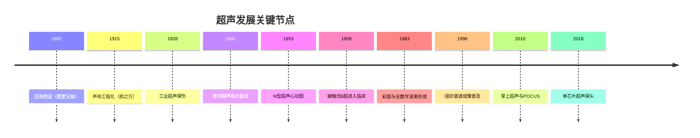

+++
title = '超声发展历史'
date = 2026-09-22T00:00:00+08:00
draft = false
categories = ['嵌入式']
tags = ['超声', '发展历史', '压电效应', '换能器', '波束形成', 'POCUS']
+++

# 超声发展历史

## 题目

请介绍一下超声技术的发展历史：从物理原理被发现，到声呐、工业探伤，再到医学超声成像和今天的掌上超声，主要经历了哪些阶段和关键节点？

## 考察点

超声技术整体发展脉络：压电效应与声呐的工程起源、脉冲-回波技术从工业探伤迁移到医学成像的路径、A/B/M/D 四种成像模式的诞生顺序、机械扫查→电子阵列→全数字化→芯片化的技术主线、超声内窥镜与 POCUS 等前沿方向，以及每个阶段背后的工程驱动力。

## 回答要点

### 1. 物理基础期（18世纪末~19世纪末）：三个奠基性发现

超声的一切应用都建立在几条物理发现之上：

| 年份 | 人物 | 发现 | 对超声技术的意义 |
|------|------|------|----------------|
| 1794 | 斯帕兰扎尼（Spallanzani） | 实验发现蝙蝠靠"听觉"而非视觉导航 | 首次揭示回声定位的可能性，生物声呐的原型观察 |
| 1842 | 多普勒（Doppler） | 波源与观察者相对运动时频率偏移 | 超声测血流、测心脏运动的理论基础（D 模式） |
| 1880 | 居里兄弟（P. Curie & J. Curie） | 石英等晶体受压产生电荷（压电效应） | 提供电能⇌声能互相转换的物理载体——换能器的根基 |
| 1881 | 李普曼（Lippmann） | 理论预言逆压电效应（电场使晶体形变） | 与正效应配对，"一发一收"与"自发自收"从此可行 |

一句话：**多普勒效应决定了"能测什么"（运动），压电效应决定了"怎么测"（换能）**。今天探头里的 PZT 陶瓷、CMUT 硅片，都是 1880 年那块石英的延续。

### 2. 声呐与工业探伤期（1910s~1940s）：超声第一次工程化

- 1912 年泰坦尼克号沉没，"探测冰山与水下目标"成为明确的工程需求
- 1915~1918 年，法国物理学家郎之万（Langevin）在第一次世界大战中研制石英夹心式换能器与水听器，实现超声水下回波探测潜艇——**声呐（SONAR）诞生，人类第一次主动发射超声并接收回波**；石英片贴合钢背板的"夹心"结构提升功率的思路，至今仍在功率超声中使用
- 1928 年苏联索科洛夫（Sokolov）提出超声探伤思想（透射法检测金属内部缺陷）；1940 年代美国 Firestone 做出**脉冲-回波式**超声探伤仪，超声探伤成为工业无损检测（NDT）的标准手段
- 1942 年 Lynn 等用聚焦超声在活体脑组织制造可控损伤，开创**治疗超声（HIFU 方向）**——超声用于"治"的起点几乎与用于"看"同时，但真正临床落地（2004 年获批聚焦超声消融子宫肌瘤）晚了半个多世纪

这一阶段沉淀的核心遗产是**脉冲-回波（pulse-echo）体制**：发射一个短脉冲，测量回波的时间与幅度反推界面位置和性质——后来所有 A/B/M 模式成像都是它的变体。

### 3. 医学超声开创期（1940s~1950s）：从透射到回波

| 年份 | 人物/地点 | 贡献 | 对应模式 |
|------|----------|------|---------|
| 1942 | 杜西克（Dussik，奥地利） | 透射法经颅探测脑室（"超声照相术"） | 透射成像，后被证明图像主要是颅骨衰减造成的伪像，但开创了医学超声 |
| 1947~1949 | 路德维希（Ludwig，美国） | 脉冲-回波法检测胆囊结石，系统研究软组织声衰减与工作频率选择 | A 模式雏形 |
| 1951~1953 | 怀尔德（Wild）与里德（Reid） | 研制专用医学超声设备，测量肠壁厚度、鉴别肿瘤 | A 模式用于软组织诊断 |
| 1951~1952 | 豪利（Howry，美国） | 水槽式复合扫查获得人体断面图像 | **B 模式（二维图像）诞生** |
| 1953 | 埃德勒（Edler）与赫兹（Hertz），瑞典隆德 | 借用工业金属探伤仪记录心脏瓣膜运动 | **M 模式（超声心动图）诞生** |
| 1955~1958 | 唐纳德（Donald）与布朗（Brown），格拉斯哥 | 接触式复合扫查仪，开创产科超声；1958 年《柳叶刀》经典论文 | B 模式进入临床，产科成为超声第一主战场 |

两个值得记住的细节：

1. **Edler 和 Hertz 用的就是一台西门子工业探伤仪**——医学超声的直接技术源头是工业无损检测，"借设备起步"决定了早期医学超声的形态
2. 早期 B 超是**水槽/水囊耦合 + 手动复合扫查**，扫一帧要数秒到数十秒，只能看静态结构；Donald 与工程师 Brown 合作的接触式扫描仪，才让超声变成床旁常规检查

### 4. 多普勒与血流测量（1950s~1980s）：D 模式补全四件套

- 1957 年日本里村茂夫（Satomura）发表超声多普勒法测量心脏运动与血流——**连续波（CW）多普勒首次用于人体**
- 1960 年代末美国 Baker 等实现**脉冲波（PW）多普勒**，具有距离分辨能力，可定位采样容积
- 1974 年前后出现**双功（Duplex）扫描**：B 超图像引导多普勒采样，"看得见 + 测得到"
- 1982~1983 年日本 Namekawa 等（Aloka）实现**彩色多普勒血流成像**并商用——二维图像上实时叠加彩色血流，"彩超"诞生

至此 A（一维回波幅度）、B（二维结构）、M（运动-时间）、D（血流速度）四种模式集齐，构成现代超声诊断系统的标准形态。

### 5. 实时化与阵列化（1960s~1980s）：从"拍照片"到"放电影"

早期 B 超扫一帧要数秒，实时化有两条技术路线：

| 路线 | 代表节点 | 原理 | 结局 |
|------|---------|------|------|
| 机械实时扫查 | 1965 年西门子 Vidoson | 电机旋转/摆动单个换能器快速扫掠 | 超声第一次"动起来"，产科首用；机械磨损、噪声与耦合限制是硬伤 |
| 电子阵列扫查 | 1968 年 Somer 提出相控阵；1970 年代中后期线阵探头普及 | 多阵元**电子延迟发射/接收**，波束电子偏转与聚焦 | 成为绝对主流——波束形成从此是超声设备的心脏 |

同期配套进展：1970 年代灰阶成像成熟（存储示波器被扫描转换器 + 电视显示器取代），图像从"双稳态"变为有层次的组织纹理；经食管、经阴道、经直肠等腔内探头开始出现，为后来的超声内镜埋下伏笔。

**对嵌入式工程师的含义**：电子阵列化是超声与"我们这一行"的交汇点——每条扫描线上百个阵元的延迟控制、动态聚焦与求和，催生了专用波束形成芯片与 FPGA 实时管线，一直延续到今天的 GPU/AI 后处理。

### 6. 数字化与图像质量革命（1980s~1990s）

- 1983 年前后，ATL 推出全数字波束形成的超声系统——**前端数字化**开启，动态孔径、动态聚焦、多波束合成等算法能力爆发
- 1990 年代初首个微泡超声造影剂获批；**1990 年代中期组织谐波成像（THI）**普及，大幅抑制旁瓣伪像，是图像质量的里程碑
- 1990 年代：三维/四维容积超声商用（奥地利 Kretztechnik 的 Voluson 系列是代表），产科是主要受益场景
- 1999 年前后便携式超声（手提箱级）出现，超声开始离开放射科，走向床旁、急诊与救护车

### 7. 超声内窥（EUS）的发展（1980s~）：与内窥系统融合

把超声探头做进内镜，是本栏目最相关的一条支线：

- **1980 年，DiMagno 与 Green（梅奥诊所）实现首例超声内镜**：从消化道内部发射超声，避开腹壁衰减与肠道气体干扰，胰腺、胆道和胃壁分层的成像质量跃升
- 1980~1990 年代：环形阵列 EUS（360° 横断面成像）商用成熟，胃壁五层结构与黏膜下肿瘤诊断体系建立
- 1990 年代：**线阵 EUS + 穿刺活检（EUS-FNA）**成熟——超声从"看"升级为"看 + 穿"，胰腺占位等深部病灶获得微创病理通道
- 2000 年代初：支气管内超声（EBUS）穿刺技术成熟，纵隔与肺门淋巴结活检路径被改写
- 同期细径微探头（miniprobe）可经内镜钳道进入胰管、胆管，实现毫米级高频成像

EUS 的发展史浓缩了超声工程的两条永恒主线：**更高频率换更细探头**（频率↑分辨率↑、穿透↓），以及**成像与介入融合**。

### 8. 现代便携化与智能化（2000s~至今）

| 年份 | 节点 | 意义 |
|------|------|------|
| 2003 | 瞬时弹性成像设备商用 | 弹性成像临床落地，肝纤维化无创评估 |
| 2009 | 剪切波弹性成像（SWE）、超快平面波成像 | 平面波一次发射整幅成像，帧率上千 fps——超声的"高速摄像机"，衍生超快多普勒等新方向 |
| 2010 | 掌上超声面世 | 超声进白大褂口袋，POCUS（床旁超声）运动兴起 |
| 2015 | 智能手机探头 | 探头直连手机，显示/存储/通信全部复用移动平台 |
| 2017~2018 | 单芯片超声（CMUT-on-CMOS） | 一个探头覆盖全身扫查，价格降到传统台机的零头——1994 年斯坦福提出的 CMUT 技术首次大规模消费化 |
| 2020~ | AI 辅助成像 | 深度学习去噪、自动测量、扫查引导陆续获批，AI 成为新内置组件 |

国产线（不点名）：国产厂商 1990 年代从黑白超起步，2000 年代攻关彩超，如今在中高端彩超与便携 POCUS 领域已占全球主要份额，无线掌上探头这个品类基本由中国供应链主导。

### 9. 五条贯穿始终的主线

1. **换能器材料**：石英 → 压电陶瓷 PZT → 复合材料/单晶 → CMUT，一条材料学主线
2. **扫查方式**：手动复合扫查 → 机械实时 → 电子阵列 → 单芯片平面波，波束控制越来越"电子化"
3. **信号链**：模拟 → 模数混合 → 全数字波束形成 → 片上系统，嵌入式深度持续下沉
4. **设备形态**：水槽 → 推车 → 笔记本 → 口袋/手机 → 导管（IVUS 等血管内超声），探头无限贴近病灶
5. **临床角色**：看结构 → 测血流（D 模式）→ 测硬度（弹性成像）→ 做治疗（HIFU）→ AI 自主辅助

### 10. 一句话总结

超声一百四十年的主线是：**压电效应提供钥匙，声呐提供第一推动，工业探伤提供方法学，医学需求提供市场，半导体与嵌入式技术持续把它做小、做快、做智能**——从一块石英到一片硅，从水槽里的手动扫查到口袋里的单芯片探头。

## 扩展问题

- A/B/M/D 四种模式的成像原理与区别 → 详见《超声成像基本原理》
- 压电换能器、阵元与探头结构 → 详见《超声探头技术与换能器原理》
- 波束形成与发射接收链路 → 详见《超声信号处理与波束形成》
- 谐波、造影等图像后处理 → 详见《超声图像后处理技术》
- 超声与内窥镜的系统集成 → 详见《超声内窥联合系统架构设计》
