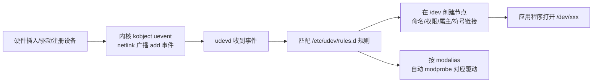

+++
title = 'Linux设备驱动模型'
date = 2026-04-25T00:00:00+08:00
draft = false
categories = ['嵌入式']
tags = ['Linux', '设备驱动', '驱动模型', 'sysfs', 'udev']
+++

# Linux设备驱动模型

## 题目

围绕 Linux 设备驱动模型与设备节点管理的系列问题：

1. udev 运行在内核空间还是用户空间？它和内核是怎么配合完成设备文件的创建与删除的？
2. 统一设备驱动模型由哪些核心对象组成？它解决什么问题？

## 考察点

Linux 设备驱动模型的组成（bus/device/driver/class 与 kobject 底座）、udev 的工作原理（用户空间守护进程 + uevent + 规则）、设备节点为什么要动态管理。

## 回答要点

### 1. udev 是用户空间的守护进程，不是内核程序

udev（udevd，现已并入 systemd 的 systemd-udevd）是**用户空间的守护进程**，它监听内核发出的设备事件并据此在 `/dev` 下创建/删除设备节点，本身不是内核驱动程序。它的职责：

| 职责 | 说明 |
|------|------|
| 根据内核事件和规则创建设备节点文件 | 监听内核通过 **uevent 机制**（netlink 广播）发出的 add/remove/change 事件，按 `/etc/udev/rules.d/` 下的规则决定节点名、属主、权限 |
| 管理热插拔事件 | USB 插拔、SD 卡插拔等热插拔事件引发的节点创建/删除、模块自动加载（配合 modalias）都由 udev 处理 |
| 设置设备文件的权限 | 规则里可以写 `MODE="0666"`、`OWNER=`、`GROUP=` 等，灵活设置设备文件属性 |

一个常见的误解就是把 udev 当成"内核驱动程序"——恰恰相反，udev 的设计哲学就是**策略不放内核**：设备节点不该静态预建（devfs 时代的老路），也不该由内核直接建（内核不该管策略），而应由用户空间按规则动态生成。

### 2. 设备驱动模型：为什么需要它

2.6 版本内核引入统一的设备驱动模型，把所有设备纳入一棵树，目的有三：

1. **电源管理**：按树形拓扑有序挂起/唤醒；
2. **与用户空间通信**：通过 sysfs 导出设备拓扑与属性；
3. **对象生命周期管理**：统一的引用计数与热插拔支持。

模型的核心对象：

| 对象 | 结构 | 含义 | sysfs 中的体现 |
|------|------|------|----------------|
| kobject | `struct kobject` | 模型的底座，提供引用计数、名字、挂到 kset | `/sys` 下每个目录背后都是一个 kobject |
| 总线 | `struct bus_type` | 匹配设备与驱动的通道（`match()` 回调） | `/sys/bus/xxx/` |
| 设备 | `struct device` | 硬件设备实例 | `/sys/devices/...`（真正的树） |
| 驱动 | `struct device_driver` | 某类设备的软件驱动 | `/sys/bus/xxx/drivers/` |
| 类 | `struct class` | 按功能归类（不看连接拓扑） | `/sys/class/xxx/` |

设备与驱动的匹配流程：设备注册或驱动注册时，内核调用总线的 `match()`（如比较 `of_match_table` 的 compatible 或 id_table），匹配成功则调用驱动的 `probe()`。

### 3. udev 的工作流程



一条典型规则（以串口转 USB 芯片为例）：

```
SUBSYSTEM=="tty", ATTRS{idVendor}=="1a86", ATTRS{idProduct}=="7523", \
    MODE="0666", SYMLINK+="my_usb_serial"
```

含义：厂商/产品 ID 匹配的 tty 设备，权限开放为 0666，并额外建一个 `/dev/my_usb_serial` 符号链接，应用写死这个名字就不怕 ttyUSB0/ttyUSB1 顺序漂移。

### 4. udev 与相关机制对比

| 方案 | 运行位置 | 节点管理方式 | 现状 |
|------|---------|-------------|------|
| 静态节点（mknod 手建） | — | 开机前手工创建一堆 | 早期做法，无法应对热插拔 |
| devfs | 内核 | 内核里动态建节点 | 已淘汰：策略进了内核、命名规则不灵活 |
| **udev** | **用户空间** | uevent + 规则引擎 | 现行标准（systemd-udevd） |
| devtmpfs | 内核 | 内核建一个临时节点，udev 再按规则改名/加链接 | 与 udev 配合：先保证早期启动有节点 |

另一个容易混淆的点：**mdev** 是 BusyBox 提供的轻量级替代品，原理与 udev 相同（监听 uevent + 规则），用在嵌入式精简根文件系统里。

### 5. 驱动开发者视角：怎么配合 udev

驱动只负责两件事，节点创建交给 udev：

1. **注册设备时携带正确的设备号与 class**：`class_create()` + `device_create()` 之后，内核会发出带 `MAJOR/MINOR` 的 uevent，udev 据此 `mknod`；
2. **需要固定名字/权限时写 udev 规则**，而不是在驱动里硬编码。

```c
my_class = class_create("mydev");
device_create(my_class, NULL, devno, NULL, "mydev%d", minor);
```

老内核里驱动手动 `mknod` 的做法（如《LDD3》时代的脚本创建节点）已过时。

### 6. 小结

- udev = **用户空间守护进程** + **内核 uevent 事件** + **规则文件**，负责设备节点的动态创建/删除、热插拔管理、权限设置，唯独"不是内核驱动程序"；
- 设备驱动模型四件套 bus/device/driver/class 搭在 kobject 底座上，为 udev 提供事件源（sysfs 与 uevent 都依托 kobject）；
- 驱动注册设备 → 内核发 uevent → udev 按规则建节点，这条链路把"机制"留在内核、"策略"放在用户空间。
