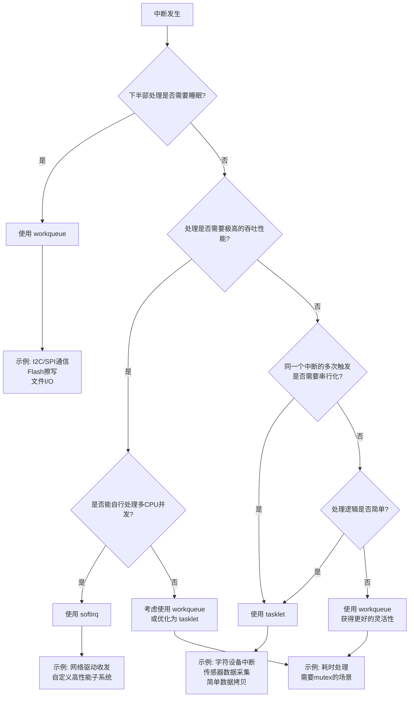

+++
title = 'Linux中断与DMA机制'
date = 2026-04-25T00:00:00+08:00
draft = false
categories = ['嵌入式']
tags = ['Linux', '中断', 'DMA', '中断上下半部', 'tasklet']
+++

# Linux中断与DMA机制

## 题目

Linux内核中断处理的上半部和下半部机制是什么？softirq、tasklet、workqueue各适合什么场景？在驱动开发中如何选择？

## 考察点

Linux内核中断子系统、中断上下半部划分、延迟处理机制、驱动开发实践

## 回答要点

### 1. 为什么需要中断上下半部

中断处理面临一个核心矛盾：**既要快速响应硬件（关中断时间尽可能短），又要完成足够的处理工作**。

当硬件触发中断时，CPU会暂停当前任务，跳转到中断处理程序执行。在此期间，同一条中断线（甚至同级中断线）上的其他中断会被屏蔽。如果中断处理程序执行时间过长，会导致：

- 其他中断得不到及时响应，系统实时性下降
- 高优先级任务被延迟调度
- 在极端情况下，甚至丢失中断事件

为了解决这个矛盾，Linux内核将中断处理分为两个阶段：

- **上半部（Top Half）**：在中断上下文中立即执行，只做最紧急、最少量的事情，然后尽快退出并重新开中断
- **下半部（Bottom Half）**：将剩余的耗时处理推迟到稍后执行，此时中断已经重新开启，系统可以正常响应其他中断

这种设计思想本质上是**"分而治之"**——用最小的中断延迟代价，换取完整的处理能力。

### 2. 上半部（Top Half / 硬中断）

上半部即我们通过 `request_irq()` 注册的中断处理函数，其核心特征如下：

**执行环境：**

- 在**中断上下文**（interrupt context）中执行，不属于任何进程
- 执行期间该CPU上的中断可能被屏蔽（取决于中断控制器和驱动配置）
- 关抢占（preemption disabled）

**严格限制：**

- **不能睡眠**：不能调用 `schedule()`、不能使用 `msleep()`、不能使用可能引起调度的锁（如 `mutex`）
- **不能耗时**：执行时间应尽可能短，通常在微秒级别
- **不能访问用户空间**：因为不在进程上下文中

**核心职责：**

1. **保存现场**：读取硬件状态寄存器，保存关键数据
2. **应答硬件**：向硬件发送ACK，通知硬件中断已被接收，允许硬件发送下一个中断
3. **ack中断控制器**：通知中断控制器（如GIC）该中断已被处理
4. **提交下半部**：将耗时工作调度到下半部机制中处理

```c
/* 上半部中断处理函数示例 */
static irqreturn_t my_device_isr(int irq, void *dev_id)
{
    struct my_device *dev = dev_id;
    u32 status;

    /* 1. 读取硬件状态寄存器 */
    status = readl(dev->regs + INT_STATUS);

    /* 2. 判断是否为本设备的中断 */
    if (!(status & INT_VALID))
        return IRQ_NONE;

    /* 3. 应答硬件，清除中断标志 */
    writel(status, dev->regs + INT_CLEAR);

    /* 4. 保存关键数据到设备私有结构体 */
    dev->event_status = status;

    /* 5. 提交下半部处理 */
    tasklet_schedule(&dev->tasklet);

    return IRQ_HANDLED;
}
```

### 3. 下半部（Bottom Half）的三种机制

Linux内核提供了三种下半部机制，按灵活性和开销从低到高依次为：**softirq -> tasklet -> workqueue**。

#### 3.1 softirq

softirq 是内核中最低层、最高效的下半部机制。

**核心特征：**

- **静态分配**：在编译时通过枚举 `enum softirq_vec` 确定，不能在运行时动态添加
- **执行上下文**：在软中断上下文中执行（`do_softirq()` / `local_bh_disable()` 期间），仍然属于中断上下文
- **不能睡眠**：与上半部一样，不能调用任何可能引起调度的函数
- **并发特性**：**同一个 softirq 可以在多个 CPU 上同时并行执行**，因此必须自行处理并发保护

**内核预定义的 softirq 类型：**

```c
enum
{
    HI_SOFTIRQ,       /* 高优先级 softirq，tasklet 使用 */
    TIMER_SOFTIRQ,    /* 定时器软中断 */
    NET_TX_SOFTIRQ,   /* 网络发送 */
    NET_RX_SOFTIRQ,   /* 网络接收 */
    BLOCK_SOFTIRQ,    /* 块设备 */
    IRQ_POLL_SOFTIRQ, /* IRQ 轮询 */
    TASKLET_SOFTIRQ,  /* 普通 tasklet 使用 */
    SCHED_SOFTIRQ,    /* 调度器 */
    HRTIMER_SOFTIRQ,  /* 高精度定时器 */
    RCU_SOFTIRQ,      /* RCU 回调 */
    NR_SOFTIRQS
};
```

**适用场景：**

- **网络收发**（NET_TX_SOFTIRQ / NET_RX_SOFTIRQ）：这是 softirq 最核心的使用者，网络子系统需要极高的吞吐量和极低的延迟
- **定时器子系统**（TIMER_SOFTIRQ / HRTIMER_SOFTIRQ）
- **RCU 机制**（RCU_SOFTIRQ）
- 其他对性能要求极高且能够自行处理并发的内核子系统

**一般驱动开发者通常不直接使用 softirq**，原因如下：

1. 需要修改内核源码来添加新的 softirq 类型，无法在模块中动态注册
2. 需要自行处理多 CPU 并发问题，编程复杂度高
3. 在软中断上下文中不能睡眠，限制太多

#### 3.2 tasklet

tasklet 是基于 softirq 实现的更高层抽象，是驱动开发中最常用的下半部机制之一。

**核心特征：**

- **基于 softirq 实现**：内核使用 `HI_SOFTIRQ` 和 `TASKLET_SOFTIRQ` 两种 softirq 来支撑 tasklet 机制
- **动态分配**：可以在运行时通过 `tasklet_init()` 或 `DECLARE_TASKLET()` 创建，非常适合驱动模块使用
- **串行化保证**：**同一个 tasklet 同一时刻只会在一个 CPU 上执行**，即使多个 CPU 同时触发，也不会出现并发问题
- **不同 tasklet 可并行**：不同的 tasklet 可以在不同 CPU 上同时执行
- **不能睡眠**：仍然在软中断上下文中执行，不能调用阻塞函数

**使用方式：**

```c
#include <linux/interrupt.h>

struct my_device {
    /* ... 其他成员 ... */
    struct tasklet_struct tasklet;
    struct list_head rx_list;
    spinlock_t lock;
};

/* tasklet 处理函数 */
static void my_device_tasklet_func(unsigned long data)
{
    struct my_device *dev = (struct my_device *)data;
    struct rx_packet *pkt, *tmp;
    unsigned long flags;

    spin_lock_irqsave(&dev->lock, flags);

    /* 遍历并处理上半部收集的数据包 */
    list_for_each_entry_safe(pkt, tmp, &dev->rx_list, list) {
        list_del(&pkt->list);

        /* 处理数据包：解析协议、向上层提交等 */
        process_packet(pkt);

        kfree(pkt);
    }

    spin_unlock_irqrestore(&dev->lock, flags);
}

/* 初始化 tasklet */
static int my_device_probe(struct platform_device *pdev)
{
    struct my_device *dev;

    dev = devm_kzalloc(&pdev->dev, sizeof(*dev), GFP_KERNEL);
    if (!dev)
        return -ENOMEM;

    INIT_LIST_HEAD(&dev->rx_list);
    spin_lock_init(&dev->lock);

    /* 方式一：使用 tasklet_init 动态初始化 */
    tasklet_init(&dev->tasklet, my_device_tasklet_func,
                 (unsigned long)dev);

    /* 方式二：也可以使用 DECLARE_TASKLET 宏在编译时定义
     * DECLARE_TASKLET(dev->tasklet, my_device_tasklet_func, data);
     */

    /* ... 其他初始化 ... */

    return 0;
}

/* 移除 tasklet */
static int my_device_remove(struct platform_device *pdev)
{
    struct my_device *dev = platform_get_drvdata(pdev);

    /* 确保 tasklet 不再执行后销毁 */
    tasklet_kill(&dev->tasklet);

    return 0;
}
```

**适用场景：**

- 字符设备中断处理（如按键、传感器数据采集）
- 简单的数据拷贝和转发
- 中断频率较高但单个中断处理量不大的场景
- 不需要睡眠、处理逻辑相对简单的驱动

#### 3.3 workqueue

workqueue 是最灵活的下半部机制，将工作推迟到**内核线程**（`kworker`）中执行。

**核心特征：**

- **进程上下文执行**：由内核线程 `kworker/n:x` 执行，拥有完整的进程上下文
- **可以睡眠**：可以使用 `msleep()`、`mutex`、等待队列等所有阻塞 API
- **动态创建**：可以在运行时创建，支持自定义 workqueue（如高优先级、单线程等）
- **延迟相对较大**：需要经过调度器调度，延迟通常在毫秒级别
- **默认并发**：默认的 system workqueue 会在多个 CPU 上并行执行 work

**使用方式：**

```c
#include <linux/workqueue.h>

struct my_device {
    /* ... 其他成员 ... */
    struct work_struct work;
    struct workqueue_struct *wq;
    void *data_buf;
    size_t data_len;
};

/* work 处理函数 */
static void my_device_work_func(struct work_struct *work)
{
    struct my_device *dev =
        container_of(work, struct my_device, work);

    /*
     * 在进程上下文中执行，可以：
     * - 睡眠
     * - 使用 mutex
     * - 访问用户空间
     * - 执行耗时的 I/O 操作
     */

    /* 示例：将数据写入文件（可能睡眠） */
    process_and_save_data(dev->data_buf, dev->data_len);

    /* 示例：通过 I2C/SPI 与从设备通信（可能睡眠） */
    i2c_transfer(dev->client, dev->msgs, dev->msg_count);

    /* 示例：发送 netlink 通知给用户空间 */
    send_netlink_notification(dev);
}

/* 初始化 workqueue */
static int my_device_probe(struct platform_device *pdev)
{
    struct my_device *dev;

    dev = devm_kzalloc(&pdev->dev, sizeof(*dev), GFP_KERNEL);
    if (!dev)
        return -ENOMEM;

    /* 方式一：使用系统默认 workqueue（共享） */
    INIT_WORK(&dev->work, my_device_work_func);

    /* 方式二：创建专用 workqueue（独占，可控并发度）
     * dev->wq = create_singlethread_workqueue("my_device_wq");
     * 或：
     * dev->wq = alloc_workqueue("my_device_wq",
     *                            WQ_HIGHPRI | WQ_CPU_INTENSIVE, 1);
     */

    /* ... 其他初始化 ... */

    return 0;
}

/* 在上半部中调度 work */
static irqreturn_t my_device_isr(int irq, void *dev_id)
{
    struct my_device *dev = dev_id;

    /* 快速应答硬件 */
    ack_hardware(dev);

    /* 准备数据 */
    dev->data_len = read_hardware_fifo(dev->regs, dev->data_buf);

    /* 调度 work 到 workqueue */
    if (dev->wq)
        queue_work(dev->wq, &dev->work);
    else
        schedule_work(&dev->work);

    return IRQ_HANDLED;
}

/* 移除 workqueue */
static int my_device_remove(struct platform_device *pdev)
{
    struct my_device *dev = platform_get_drvdata(pdev);

    /* 确保所有 work 执行完毕 */
    cancel_work_sync(&dev->work);

    /* 如果创建了专用 workqueue，需要销毁 */
    if (dev->wq)
        destroy_workqueue(dev->wq);

    return 0;
}
```

**适用场景：**

- 耗时较长的处理（如数据压缩、加密解密）
- 需要睡眠的操作（如 I2C/SPI 通信、Flash 擦写、文件 I/O）
- 需要与用户空间交互的操作（如 copy_to_user、copy_from_user）
- 需要使用 mutex 等可睡眠锁的场景
- 处理量较大、对延迟不敏感的后台任务

### 4. 三种机制对比

| 特性 | softirq | tasklet | workqueue |
|------|---------|---------|-----------|
| **执行上下文** | 软中断上下文 | 软中断上下文 | 进程上下文（内核线程） |
| **能否睡眠** | 不能 | 不能 | 可以 |
| **能否使用 mutex** | 不能 | 不能 | 可以 |
| **能否访问用户空间** | 不能 | 不能 | 可以 |
| **分配方式** | 静态（编译时） | 动态（运行时） | 动态（运行时） |
| **同一实例并发** | 可多 CPU 并行 | 串行（同一 tasklet） | 可多 CPU 并行 |
| **不同实例并发** | 可并行 | 可并行 | 可并行 |
| **执行延迟** | 最低（微秒级） | 低（微秒级） | 较高（毫秒级） |
| **编程复杂度** | 高（需自行处理并发） | 低（自动串行化） | 低 |
| **典型使用者** | 网络、定时器、RCU | 字符设备、传感器驱动 | 块设备、网络驱动、需要睡眠的场景 |
| **驱动中直接使用** | 不推荐 | 推荐 | 推荐 |

### 5. 驱动开发中的选择策略

在实际驱动开发中，选择哪种下半部机制可以遵循以下决策流程：



**典型场景选择建议：**

1. **网卡驱动**：网络收发使用 softirq（内核网络子系统已封装好），驱动中其他处理使用 tasklet 或 NAPI 机制
2. **字符设备（按键、GPIO 中断）**：使用 tasklet，处理简单且不需要睡眠
3. **I2C/SPI 设备驱动**：使用 workqueue，因为 I2C/SPI 传输可能睡眠
4. **传感器驱动**：数据采集用 tasklet，数据处理和上报用 workqueue
5. **块设备驱动**：使用 workqueue，因为涉及大量 I/O 操作和复杂的错误处理
6. **音频驱动**：使用 tasklet 处理 DMA 完成中断，保证低延迟

### 6. 实际驱动中的组合使用

下面给出一个完整的网卡驱动中断处理框架，展示上半部与下半部的配合：

```c
#include <linux/module.h>
#include <linux/netdevice.h>
#include <linux/interrupt.h>
#include <linux/workqueue.h>
#include <linux/skbuff.h>
#include <linux/spinlock.h>

#define RX_DESC_COUNT    256
#define TX_DESC_COUNT    256
#define MAX_RX_BUDGET    64

struct my_net_priv {
    struct net_device *ndev;
    void __iomem *regs;

    /* 接收相关 */
    struct sk_buff *rx_skb[RX_DESC_COUNT];
    struct rx_desc *rx_desc_ring;
    dma_addr_t rx_desc_dma;
    u32 rx_head;
    u32 rx_tail;
    spinlock_t rx_lock;

    /* 发送相关 */
    struct sk_buff *tx_skb[TX_DESC_COUNT];
    struct tx_desc *tx_desc_ring;
    dma_addr_t tx_desc_dma;
    u32 tx_head;
    u32 tx_tail;
    spinlock_t tx_lock;

    /* 下半部：使用 NAPI + tasklet 组合 */
    struct napi_struct napi;

    /* 下半部：使用 workqueue 处理耗时任务 */
    struct workqueue_struct *hw_wq;
    struct work_struct tx_reclaim_work;
    struct work_struct link_check_work;
};

/*
 * 上半部：中断处理函数
 * 职责：快速应答硬件，调度 NAPI 进行收包
 */
static irqreturn_t my_net_isr(int irq, void *dev_id)
{
    struct my_net_priv *priv = dev_id;
    u32 int_status;

    int_status = readl(priv->regs + REG_INT_STATUS);

    if (!int_status)
        return IRQ_NONE;

    /* 清除中断标志，应答硬件 */
    writel(int_status, priv->regs + REG_INT_CLEAR);

    if (int_status & INT_RX_DONE) {
        /*
         * 接收中断：禁用接收中断，调度 NAPI 进行批量收包
         * NAPI 本质上是一种基于 net_rx_softirq 的 poll 机制
         */
        napi_schedule(&priv->napi);
    }

    if (int_status & INT_TX_DONE) {
        /*
         * 发送完成中断：调度 workqueue 进行发送描述符回收
         * 这里不使用 tasklet 是因为回收可能涉及复杂的
         * 内存管理和统计更新
         */
        queue_work(priv->hw_wq, &priv->tx_reclaim_work);
    }

    if (int_status & INT_LINK_CHANGE) {
        /* 链路状态变化：调度 workqueue 进行链路检测
         * 需要通过 PHY 读取状态（MDIO 总线操作可能睡眠） */
        queue_work(priv->hw_wq, &priv->link_check_work);
    }

    return IRQ_HANDLED;
}

/*
 * 下半部（softirq 机制）：NAPI poll 函数
 * 在 net_rx_softirq 上下文中执行，批量处理接收到的数据包
 * 这是 softirq 在网络驱动中的典型应用
 */
static int my_net_poll(struct napi_struct *napi, int budget)
{
    struct my_net_priv *priv =
        container_of(napi, struct my_net_priv, napi);
    int rx_done = 0;
    struct sk_buff *skb;
    unsigned int len;

    while (rx_done < budget) {
        if (priv->rx_head == priv->rx_tail)
            break;

        /* 从 DMA 描述符中获取数据包长度 */
        len = priv->rx_desc_ring[priv->rx_head].len;

        /* 分配新的 skb 替换当前 skb */
        skb = netdev_alloc_skb_ip_align(priv->ndev, len);
        if (!skb)
            break;

        /* 将 DMA 缓冲区数据拷贝到新 skb */
        skb_copy_to_linear_data(skb,
            (void *)priv->rx_desc_ring[priv->rx_head].buf_addr, len);
        skb_put(skb, len);

        /* 释放旧的 skb */
        dev_kfree_skb(priv->rx_skb[priv->rx_head]);
        priv->rx_skb[priv->rx_head] = skb;

        /* 更新 DMA 描述符，交还给硬件 */
        priv->rx_desc_ring[priv->rx_head].status = DESC_OWN_BY_HW;

        priv->rx_head = (priv->rx_head + 1) % RX_DESC_COUNT;

        /* 提交 skb 到网络协议栈 */
        skb->protocol = eth_type_trans(skb, priv->ndev);
        napi_gro_receive(napi, skb);

        rx_done++;
    }

    /* 如果还有未处理的数据包，返回已处理的数量，下次继续 poll */
    if (rx_done < budget) {
        /* 所有包都处理完了，重新启用接收中断 */
        napi_complete_done(napi, rx_done);
        writel(INT_RX_DONE, priv->regs + REG_INT_ENABLE);
    }

    return rx_done;
}

/*
 * 下半部（workqueue 机制）：发送描述符回收
 * 在内核线程中执行，可以睡眠
 */
static void my_net_tx_reclaim(struct work_struct *work)
{
    struct my_net_priv *priv =
        container_of(work, struct my_net_priv, tx_reclaim_work);
    unsigned long flags;

    spin_lock_irqsave(&priv->tx_lock, flags);

    while (priv->tx_tail != priv->tx_head) {
        struct tx_desc *desc = &priv->tx_desc_ring[priv->tx_tail];

        if (desc->status & DESC_OWN_BY_HW)
            break;

        /* 释放已发送的 skb */
        if (priv->tx_skb[priv->tx_tail]) {
            dev_kfree_skb_any(priv->tx_skb[priv->tx_tail]);
            priv->tx_skb[priv->tx_tail] = NULL;
        }

        /* 更新统计 */
        priv->ndev->stats.tx_packets++;
        priv->ndev->stats.tx_bytes += desc->len;

        priv->tx_tail = (priv->tx_tail + 1) % TX_DESC_COUNT;
    }

    /* 如果有空间了，唤醒等待发送的队列 */
    if (netif_queue_stopped(priv->ndev))
        netif_wake_queue(priv->ndev);

    spin_unlock_irqrestore(&priv->tx_lock, flags);
}

/*
 * 下半部（workqueue 机制）：链路状态检测
 * 需要通过 MDIO 总线读取 PHY 状态，可能睡眠
 */
static void my_net_link_check(struct work_struct *work)
{
    struct my_net_priv *priv =
        container_of(work, struct my_net_priv, link_check_work);
    u32 phy_status;
    bool link_up;

    /* 通过 MDIO 读取 PHY 状态（可能睡眠） */
    phy_status = mdiobus_read(priv->mii_bus, priv->phy_addr, MII_BMSR);
    link_up = !!(phy_status & BMSR_LSTATUS);

    if (link_up != netif_carrier_ok(priv->ndev)) {
        if (link_up) {
            netif_carrier_on(priv->ndev);
            netdev_info(priv->ndev, "link up\n");
        } else {
            netif_carrier_off(priv->ndev);
            netdev_info(priv->ndev, "link down\n");
        }
    }
}

/* 驱动初始化 */
static int my_net_probe(struct platform_device *pdev)
{
    struct my_net_priv *priv;
    int ret;

    priv = devm_kzalloc(&pdev->dev, sizeof(*priv), GFP_KERNEL);
    if (!priv)
        return -ENOMEM;

    /* 初始化自旋锁 */
    spin_lock_init(&priv->rx_lock);
    spin_lock_init(&priv->tx_lock);

    /* 初始化 NAPI（基于 softirq 的网络收包机制） */
    netif_napi_add(priv->ndev, &priv->napi, my_net_poll, MAX_RX_BUDGET);

    /* 创建专用 workqueue */
    priv->hw_wq = alloc_workqueue("my_net_hw",
                                   WQ_HIGHPRI | WQ_MEM_RECLAIM, 1);
    if (!priv->hw_wq) {
        ret = -ENOMEM;
        goto err_napi_del;
    }

    /* 初始化 work */
    INIT_WORK(&priv->tx_reclaim_work, my_net_tx_reclaim);
    INIT_WORK(&priv->link_check_work, my_net_link_check);

    /* 注册中断处理函数 */
    ret = devm_request_irq(&pdev->dev, priv->irq, my_net_isr,
                           IRQF_SHARED, "my_net", priv);
    if (ret)
        goto err_destroy_wq;

    /* 启用 NAPI */
    napi_enable(&priv->napi);

    return 0;

err_destroy_wq:
    destroy_workqueue(priv->hw_wq);
err_napi_del:
    netif_napi_del(&priv->napi);
    return ret;
}

/* 驱动移除 */
static int my_net_remove(struct platform_device *pdev)
{
    struct my_net_priv *priv = platform_get_drvdata(pdev);

    /* 禁用 NAPI */
    napi_disable(&priv->napi);
    netif_napi_del(&priv->napi);

    /* 确保所有 work 执行完毕 */
    cancel_work_sync(&priv->tx_reclaim_work);
    cancel_work_sync(&priv->link_check_work);

    /* 销毁 workqueue */
    destroy_workqueue(priv->hw_wq);

    return 0;
}
```

**上述示例展示了三种机制的典型配合方式：**

- **上半部（硬中断）**：`my_net_isr()` 在中断上下文中快速应答硬件，根据中断类型分别调度不同的下半部
- **softirq（通过 NAPI）**：`my_net_poll()` 在 `net_rx_softirq` 上下文中批量收包，利用 softirq 的高性能实现高吞吐量
- **workqueue**：`my_net_tx_reclaim()` 和 `my_net_link_check()` 在内核线程中执行，分别处理发送回收和链路检测等可能需要睡眠的操作

这种组合方式在实际网卡驱动中非常常见，它充分发挥了每种机制的优势：softirq 保证网络收发的高性能，workqueue 提供处理复杂任务的灵活性，上半部则确保中断的快速响应。

---

> **面试加分点**：可以进一步讨论 NAPI 机制如何解决高频中断导致的"活锁"（livelock）问题——在高负载下，NAPI 关闭中断改用轮询（poll）模式，避免了中断风暴；在低负载下恢复中断模式，保证低延迟。这种中断与轮询的自适应切换是 Linux 网络子系统的核心优化之一。
