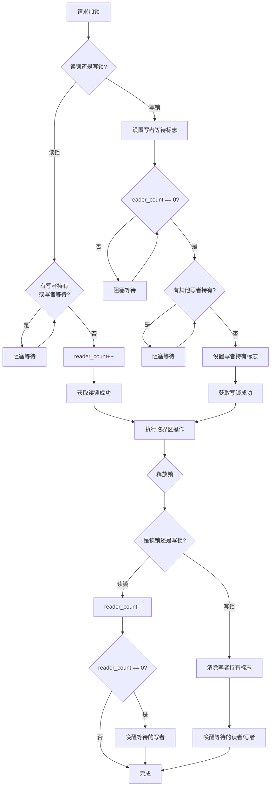

+++
title = 'Linux多线程与同步机制'
date = 2026-04-25T00:00:00+08:00
draft = false
categories = ['嵌入式']
tags = ['Linux', '多线程', 'pthread', '互斥锁', '条件变量', '读写锁']
+++

# Linux多线程与同步机制

## 题目

多线程中互斥锁和读写锁分别适合什么场景？读写锁的实现原理是什么？写饥饿问题怎么解决？

> 来源：零跑汽车嵌入式岗面试

## 考察点

- Linux多线程同步机制的理解深度
- 互斥锁（Mutex）与读写锁（RW Lock）的原理与选型
- 读写锁的内部实现原理（读者计数器 + 写者标志）
- 写饥饿问题的成因与解决方案
- pthread API 的熟练使用
- 嵌入式场景下锁的选型与性能考量

## 回答要点

### 1. 互斥锁（Mutex）

#### 基本原理

互斥锁（Mutual Exclusion Lock）是最基本的线程同步原语。它的核心规则是：**同一时刻只允许一个线程持有锁**。当一个线程获取互斥锁后，其他试图获取该锁的线程会被阻塞，直到锁被释放。

互斥锁保护的是**临界区（Critical Section）**，即访问共享资源的代码段。通过互斥锁，可以保证对共享数据的原子性访问。

#### pthread_mutex_t API

```c
#include <pthread.h>
#include <stdio.h>

pthread_mutex_t mutex;

// 初始化互斥锁
// 方式一：使用宏初始化（全局/静态变量）
pthread_mutex_t mutex = PTHREAD_MUTEX_INITIALIZER;

// 方式二：使用函数初始化（动态分配时必须使用）
int ret = pthread_mutex_init(&mutex, NULL);

// 加锁（阻塞式）
pthread_mutex_lock(&mutex);

// 尝试加锁（非阻塞，失败返回EBUSY）
int ret = pthread_mutex_trylock(&mutex);

// 带超时的加锁
struct timespec ts;
clock_gettime(CLOCK_REALTIME, &ts);
ts.tv_sec += 1;  // 超时1秒
int ret = pthread_mutex_timedlock(&mutex, &ts);

// 解锁
pthread_mutex_unlock(&mutex);

// 销毁互斥锁
pthread_mutex_destroy(&mutex);
```

#### 适用场景

- **临界区较短**：锁内操作耗时少，不会造成其他线程长时间等待
- **读写操作都有**：对共享数据的读和写频率相近
- **竞争不激烈**：线程数不多，锁争用概率较低
- **嵌入式常见场景**：设备寄存器访问、共享配置参数保护、日志缓冲区写入

#### 代码示例

```c
#include <pthread.h>
#include <stdio.h>
#include <unistd.h>

#define THREAD_NUM 4

typedef struct {
    int value;
    pthread_mutex_t mutex;
} SharedData;

SharedData g_data = {0, PTHREAD_MUTEX_INITIALIZER};

void *thread_func(void *arg)
{
    int id = *(int *)arg;

    for (int i = 0; i < 100000; i++) {
        pthread_mutex_lock(&g_data.mutex);
        g_data.value++;
        pthread_mutex_unlock(&g_data.mutex);
    }

    printf("线程 %d 完成\n", id);
    return NULL;
}

int main(void)
{
    pthread_t threads[THREAD_NUM];
    int ids[THREAD_NUM];

    for (int i = 0; i < THREAD_NUM; i++) {
        ids[i] = i;
        pthread_create(&threads[i], NULL, thread_func, &ids[i]);
    }

    for (int i = 0; i < THREAD_NUM; i++) {
        pthread_join(threads[i], NULL);
    }

    printf("最终结果: %d (期望: %d)\n", g_data.value, THREAD_NUM * 100000);

    pthread_mutex_destroy(&g_data.mutex);
    return 0;
}
```

#### 注意事项

**死锁预防**：

- **固定加锁顺序**：多个锁时，所有线程按相同顺序获取
- **避免嵌套加锁**：尽量减少一个线程同时持有多个锁的情况
- **使用 trylock**：在可能死锁的场景下使用非阻塞加锁，失败时释放已持有的锁并重试
- **设置超时**：使用 `pthread_mutex_timedlock` 避免无限等待

**锁的粒度**：

- **粒度太粗**：锁范围过大，并发度降低，性能下降
- **粒度太细**：增加加锁/解锁开销，且容易遗漏导致数据竞争
- **原则**：锁的范围应刚好覆盖共享数据的访问，不多不少

### 2. 读写锁（RW Lock）

#### 基本原理

读写锁是一种**读者-写者锁（Readers-Writer Lock）**，它区分读操作和写操作，提供不同的并发策略：

- **读共享**：多个读者线程可以同时持有读锁，并发读取共享数据
- **写独占**：写者线程必须独占锁，其他读者和写者都不能同时持有锁
- **读写互斥**：写者持有锁时，读者不能获取读锁；有读者持有读锁时，写者不能获取写锁

这种设计适合**读多写少**的场景，能显著提高读操作的并发度。

#### pthread_rwlock_t API

```c
#include <pthread.h>

pthread_rwlock_t rwlock;

// 初始化
// 方式一：宏初始化（全局/静态变量）
pthread_rwlock_t rwlock = PTHREAD_RWLOCK_INITIALIZER;

// 方式二：函数初始化
int ret = pthread_rwlock_init(&rwlock, NULL);

// 加读锁（阻塞式）
pthread_rwlock_rdlock(&rwlock);

// 尝试加读锁（非阻塞）
int ret = pthread_rwlock_tryrdlock(&rwlock);

// 加写锁（阻塞式）
pthread_rwlock_wrlock(&rwlock);

// 尝试加写锁（非阻塞）
int ret = pthread_rwlock_trywrlock(&rwlock);

// 解锁（读锁和写锁都用同一个解锁函数）
pthread_rwlock_unlock(&rwlock);

// 销毁
pthread_rwlock_destroy(&rwlock);
```

#### 代码示例

```c
#include <pthread.h>
#include <stdio.h>
#include <unistd.h>

#define READER_NUM 5
#define WRITER_NUM 2

typedef struct {
    int data;
    int version;
    pthread_rwlock_t rwlock;
} SharedConfig;

SharedConfig g_config = {0, 0, PTHREAD_RWLOCK_INITIALIZER};

void *reader_func(void *arg)
{
    int id = *(int *)arg;

    for (int i = 0; i < 5; i++) {
        pthread_rwlock_rdlock(&g_config.rwlock);
        int local_data = g_config.data;
        int local_ver = g_config.version;
        pthread_rwlock_unlock(&g_config.rwlock);

        printf("[读者 %d] 读取数据: %d, 版本: %d\n", id, local_data, local_ver);
        usleep(100000);
    }

    return NULL;
}

void *writer_func(void *arg)
{
    int id = *(int *)arg;

    for (int i = 0; i < 3; i++) {
        pthread_rwlock_wrlock(&g_config.rwlock);
        g_config.data += 10;
        g_config.version++;
        printf("[写者 %d] 更新数据: %d, 版本: %d\n", id, g_config.data, g_config.version);
        pthread_rwlock_unlock(&g_config.rwlock);

        usleep(300000);
    }

    return NULL;
}

int main(void)
{
    pthread_t readers[READER_NUM];
    pthread_t writers[WRITER_NUM];
    int ids[READER_NUM + WRITER_NUM];

    for (int i = 0; i < READER_NUM; i++) {
        ids[i] = i;
        pthread_create(&readers[i], NULL, reader_func, &ids[i]);
    }

    for (int i = 0; i < WRITER_NUM; i++) {
        ids[READER_NUM + i] = i;
        pthread_create(&writers[i], NULL, writer_func, &ids[READER_NUM + i]);
    }

    for (int i = 0; i < READER_NUM; i++)
        pthread_join(readers[i], NULL);
    for (int i = 0; i < WRITER_NUM; i++)
        pthread_join(writers[i], NULL);

    pthread_rwlock_destroy(&g_config.rwlock);
    return 0;
}
```

### 3. 互斥锁 vs 读写锁对比

| 对比维度 | 互斥锁（Mutex） | 读写锁（RW Lock） |
|---------|----------------|-------------------|
| 并发度 | 低，同一时刻仅一个线程访问 | 高，多个读者可并发访问 |
| 适用场景 | 读写频率相近、临界区短 | 读多写少、读操作远多于写操作 |
| 锁开销 | 低，实现简单 | 较高，内部维护读者计数和写者状态 |
| API复杂度 | 简单（lock/unlock） | 较复杂（rdlock/wrlock/unlock） |
| 内存占用 | 小（通常16-24字节） | 较大（通常32-56字节） |
| 写饥饿 | 不存在，严格FIFO | 可能发生，大量连续读会导致写者等待 |
| 读性能 | 差，读操作也串行化 | 好，多个读者可同时执行 |
| 写性能 | 好，无额外判断逻辑 | 略差，需等待所有读者释放 |
| 典型应用 | 设备寄存器保护、全局计数器 | 配置参数读取、缓存管理、传感器数据读取 |
| 死锁风险 | 低 | 中等，读写锁嵌套使用时容易出错 |
| 可移植性 | 极好，POSIX标准 | 好，但行为细节因实现而异 |

### 4. 读写锁的实现原理

#### 核心数据结构

读写锁的内部通常维护以下关键状态：

- **读者计数器（reader_count）**：当前持有读锁的读者数量
- **写者标志（writer_flag）**：是否有写者正在持有锁或等待锁
- **等待队列**：阻塞的写者/读者线程队列

```
读写锁内部状态:
+------------------+
| reader_count = 3 |  <-- 3个读者正在读
| writer_flag = 0  |  <-- 没有写者持有锁
| wait_queue       |  <-- 可能有等待的写者
+------------------+
```

#### 读者加锁流程

1. 检查是否有写者正在持有锁或等待锁
2. 如果有写者，读者阻塞等待
3. 如果没有写者，递增读者计数器，读者获得读锁
4. 读者完成操作后，递减读者计数器
5. 如果读者计数器归零且有写者在等待，唤醒一个写者

#### 写者加锁流程

1. 设置写者等待标志（阻止新读者进入）
2. 等待当前所有读者释放读锁（reader_count == 0）
3. 检查是否有其他写者正在持有锁
4. 获取写锁，设置写者持有标志
5. 写者完成操作后，清除写者持有标志
6. 唤醒等待的读者或写者

#### 流程图



#### 简化实现示意

```c
typedef struct {
    int reader_count;
    int writer_active;
    int writer_waiting;
    pthread_mutex_t mutex;
    pthread_cond_t readers_ok;
    pthread_cond_t writer_ok;
} rwlock_impl_t;

void rwlock_rdlock_impl(rwlock_impl_t *lock)
{
    pthread_mutex_lock(&lock->mutex);
    while (lock->writer_active || lock->writer_waiting) {
        pthread_cond_wait(&lock->readers_ok, &lock->mutex);
    }
    lock->reader_count++;
    pthread_mutex_unlock(&lock->mutex);
}

void rwlock_wrlock_impl(rwlock_impl_t *lock)
{
    pthread_mutex_lock(&lock->mutex);
    lock->writer_waiting++;
    while (lock->reader_count > 0 || lock->writer_active) {
        pthread_cond_wait(&lock->writer_ok, &lock->mutex);
    }
    lock->writer_waiting--;
    lock->writer_active = 1;
    pthread_mutex_unlock(&lock->mutex);
}

void rwlock_unlock_impl(rwlock_impl_t *lock)
{
    pthread_mutex_lock(&lock->mutex);
    if (lock->writer_active) {
        lock->writer_active = 0;
        if (lock->writer_waiting > 0) {
            pthread_cond_signal(&lock->writer_ok);
        } else {
            pthread_cond_broadcast(&lock->readers_ok);
        }
    } else {
        lock->reader_count--;
        if (lock->reader_count == 0 && lock->writer_waiting > 0) {
            pthread_cond_signal(&lock->writer_ok);
        }
    }
    pthread_mutex_unlock(&lock->mutex);
}
```

### 5. 写饥饿问题

#### 问题场景

当系统中存在大量连续的读请求时，如果读写锁不采取特殊策略，可能会出现以下情况：

```
时间线:
读者1 获取读锁 ────────────────── 释放
读者2 ──── 获取读锁 ──────────── 释放
读者3 ───────── 获取读锁 ──────── 释放
读者4 ──────────── 获取读锁 ───── 释放
写者1 ──── 等待...等待...等待...等待...等待...（饥饿！）
```

只要有读者持有读锁，新的读者就可以不断加入，而写者必须等待所有读者释放。如果读请求源源不断，写者可能**永远无法获取锁**，这就是**写饥饿（Writer Starvation）**。

#### 成因分析

- 读写锁默认策略通常是**读者优先（Readers-Preference）**
- 读者优先策略下，只要没有写者持有锁，新读者就可以直接获取读锁
- 即使有写者在等待，新到达的读者仍然可以获取读锁
- 这导致写者必须等待"当前所有读者 + 之后到达的所有读者"全部释放

#### 解决方案

**方案一：写者优先策略（Writer-Preference）**

当有写者在等待时，阻塞后续的读者请求，让写者有机会尽快获取锁。

```c
#include <pthread.h>
#include <stdio.h>
#include <unistd.h>

typedef struct {
    int readers;
    int writer;
    int waiting_writers;
    pthread_mutex_t mutex;
    pthread_cond_t can_read;
    pthread_cond_t can_write;
} WriterPrefRWLock;

void wp_rwlock_init(WriterPrefRWLock *lock)
{
    lock->readers = 0;
    lock->writer = 0;
    lock->waiting_writers = 0;
    pthread_mutex_init(&lock->mutex, NULL);
    pthread_cond_init(&lock->can_read, NULL);
    pthread_cond_init(&lock->can_write, NULL);
}

void wp_rwlock_rdlock(WriterPrefRWLock *lock)
{
    pthread_mutex_lock(&lock->mutex);
    while (lock->writer || lock->waiting_writers > 0) {
        pthread_cond_wait(&lock->can_read, &lock->mutex);
    }
    lock->readers++;
    pthread_mutex_unlock(&lock->mutex);
}

void wp_rwlock_wrlock(WriterPrefRWLock *lock)
{
    pthread_mutex_lock(&lock->mutex);
    lock->waiting_writers++;
    while (lock->readers > 0 || lock->writer) {
        pthread_cond_wait(&lock->can_write, &lock->mutex);
    }
    lock->waiting_writers--;
    lock->writer = 1;
    pthread_mutex_unlock(&lock->mutex);
}

void wp_rwlock_unlock(WriterPrefRWLock *lock)
{
    pthread_mutex_lock(&lock->mutex);
    if (lock->writer) {
        lock->writer = 0;
        if (lock->waiting_writers > 0) {
            pthread_cond_signal(&lock->can_write);
        } else {
            pthread_cond_broadcast(&lock->can_read);
        }
    } else {
        lock->readers--;
        if (lock->readers == 0) {
            if (lock->waiting_writers > 0) {
                pthread_cond_signal(&lock->can_write);
            }
        }
    }
    pthread_mutex_unlock(&lock->mutex);
}
```

**方案二：公平读写锁（FIFO排队）**

所有请求（读和写）按到达顺序排队，严格按FIFO顺序处理。这可以通过一个全局队列实现，保证公平性但会牺牲一定的读并发度。

**方案三：限制最大连续读者数**

设置一个阈值，当连续服务的读者数量达到上限时，强制让后续请求排队，给写者插入的机会。

**方案四：使用 pthread_rwlockattr_setkind_np 设置偏好**

在Linux（glibc）中，可以通过属性设置读写锁的偏好类型：

```c
#include <pthread.h>

pthread_rwlock_t rwlock;
pthread_rwlockattr_t attr;

pthread_rwlockattr_init(&attr);

// 设置为写者优先
// PTHREAD_RWLOCK_PREFER_WRITER_NONRECURSIVE_NP: 写者优先（推荐）
// PTHREAD_RWLOCK_PREFER_WRITER_NP: 写者优先（已废弃，行为不明确）
// PTHREAD_RWLOCK_DEFAULT_NP: 默认（读者优先）
pthread_rwlockattr_setkind_np(&attr, PTHREAD_RWLOCK_PREFER_WRITER_NONRECURSIVE_NP);

pthread_rwlock_init(&rwlock, &attr);
pthread_rwlockattr_destroy(&attr);
```

> **注意**：`pthread_rwlockattr_setkind_np` 是 glibc 的非标准扩展（`_np` 后缀表示 non-portable），可移植性有限。在嵌入式跨平台开发中，建议自行实现写者优先逻辑。

### 6. 自旋锁与互斥锁的区别

| 对比维度 | 互斥锁（Mutex） | 自旋锁（Spin Lock） |
|---------|----------------|---------------------|
| 等待方式 | 线程睡眠（阻塞），让出CPU | 忙等待（死循环），不释放CPU |
| CPU开销 | 低（不占用CPU），但有上下文切换开销 | 高（持续占用CPU轮询） |
| 上下文切换 | 有（线程挂起/唤醒） | 无 |
| 适用场景 | 临界区较长、可能涉及IO操作 | 临界区极短、多核系统 |
| 单核系统 | 正常工作 | 不适合（自旋浪费CPU，无法并行） |
| 响应延迟 | 较高（涉及调度器唤醒） | 极低（锁释放后立即感知） |
| 死锁风险 | 中等 | 高（自旋时不响应信号，容易死锁） |
| 嵌套使用 | 支持递归锁 | 不支持递归 |
| 内核/用户态 | 用户态和内核态都可用 | 主要用于内核态 |
| 嵌入式适用 | 通用场景 | 中断上下文、临界区极短的场景 |

**嵌入式中的选择建议**：

- 在Linux用户态多线程中，优先使用**互斥锁**
- 在中断上下文或临界区只有几条指令时，考虑**自旋锁**
- 自旋锁在嵌入式驱动开发中更常见，应用层开发极少使用

### 7. 线程同步方案选型指南

| 场景 | 推荐方案 | 理由 |
|------|---------|------|
| 读多写少（读操作 >> 写操作） | 读写锁 | 多读者并发，读性能最优 |
| 读写频率相近 | 互斥锁 | 实现简单，开销低，避免写饥饿 |
| 写多读少 | 互斥锁 | 读写锁无优势，反而增加开销 |
| 临界区极短（几条指令） | 自旋锁 | 避免上下文切换开销 |
| 临界区较长或可能阻塞 | 互斥锁 | 避免自旋浪费CPU |
| 需要等待某个条件满足 | 条件变量 + 互斥锁 | 经典生产者-消费者模式 |
| 线程间只需信号通知 | 信号量（Semaphore） | 轻量级计数器，适合资源计数 |
| 多进程间同步 | 互斥锁（PTHREAD_PROCESS_SHARED）或信号量 | 跨进程共享需要特殊属性 |
| 嵌入式驱动中断上下文 | 自旋锁 | 中断中不能睡眠 |
| 配置参数热更新 | 读写锁 | 读者频繁读取配置，偶尔更新 |
| 传感器数据采集 | 读写锁 | 多个模块读取传感器数据，采集线程写入 |
| 日志系统 | 互斥锁 | 写操作频繁且需要保证顺序 |
| 引用计数管理 | 原子操作 | 无锁方案，性能最优 |

---

## 总结

在嵌入式面试中，回答这道题时建议按以下思路展开：

1. **先说互斥锁**：基本原理、API、适用场景，展示基础扎实
2. **再说读写锁**：读共享写独占的特性，给出API和代码示例
3. **对比分析**：从多个维度对比两者，体现系统性思维
4. **深入原理**：讲解读写锁内部实现（读者计数器 + 写者标志），展示对底层机制的理解
5. **写饥饿问题**：这是面试官最关注的点，要讲清楚成因和多种解决方案
6. **扩展知识**：自旋锁、条件变量、选型指南，展示知识广度

关键是要能结合实际嵌入式场景（如传感器数据读取、配置热更新、设备寄存器保护）来说明锁的选型，而不是只停留在理论层面。
