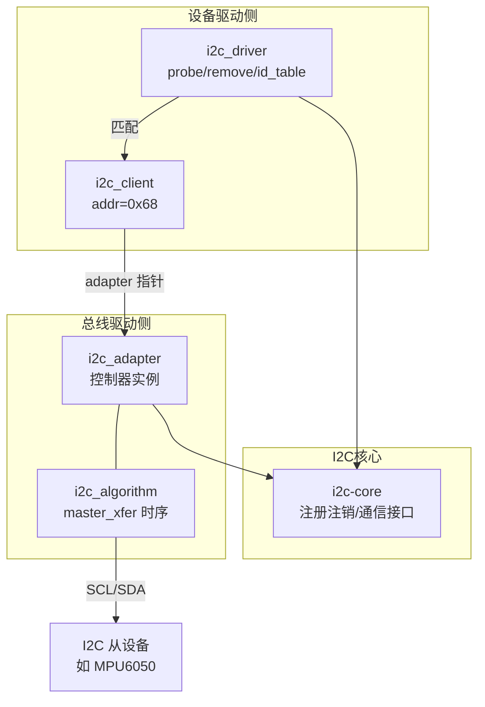

+++
title = 'LinuxI2C驱动体系结构'
date = 2026-09-04T00:00:00+08:00
draft = false
categories = ['嵌入式']
tags = ['Linux', 'I2C', '驱动开发', 'i2c_adapter', '总线驱动']
+++

# LinuxI2C驱动体系结构

## 题目

I2C 总线仅用 SCL、SDA 两根信号线就实现了设备间数据交互，极大简化了硬件资源和 PCB 布线。围绕 Linux 的 I2C 驱动体系：

1. Linux 的 I2C 驱动由哪几部分组成？各自的职责是什么？
2. I2C 总线驱动（适配器端）和 I2C 设备驱动分别包含哪些核心数据结构？

## 考察点

Linux I2C 子系统的三层划分（核心/总线驱动/设备驱动）、适配器（adapter）侧与设备（client）侧的边界，以及 `i2c_adapter`、`i2c_driver`、`i2c_client` 三个数据结构的归属。

## 回答要点

### 1. 三层体系结构

Linux 的 I2C 体系分为三部分：

| 组成部分 | 职责 | 所在位置 |
|---------|------|---------|
| I2C 核心 | 注册/注销适配器与设备驱动、提供 `i2c_transfer()` 等统一通信接口 | `drivers/i2c/i2c-core.c` |
| I2C 总线驱动（适配器驱动） | 操作 I2C 控制器硬件，实现 start/stop/read/write 等时序；它是对 I2C 硬件体系结构中**适配器端**的实现——适配器可以是 CPU 内部集成的 I2C 控制器，也可以是外挂的 I2C 扩展芯片 | `drivers/i2c/busses/`（如 `i2c-imx.c`、`i2c-gpio.c`） |
| I2C 设备驱动 | 针对挂在总线上的具体芯片（传感器、EEPROM 等）的驱动 | 各设备驱动目录（如 `drivers/hwmon/`） |

I2C 核心是一层粘合剂，提供两边的注册/注销接口（`i2c_add_adapter()`、`i2c_add_driver()` 等），对上屏蔽硬件差异。分层的好处：写设备驱动的人不需要关心控制器寄存器；移植到别的 SoC 时只换适配器驱动。

### 2. 关键数据结构的归属

最容易混的一点是**哪些数据结构属于哪一侧**：

| 数据结构 | 归属 | 描述的对象 | 关键成员/作用 |
|---------|------|-----------|--------------|
| `i2c_adapter` | **总线驱动侧** | CPU 侧的一个 I2C 控制器（一条物理 I2C 总线） | `nr`（总线编号）、`algo`（指向 `i2c_algorithm`） |
| `i2c_algorithm` | **总线驱动侧** | 该控制器如何产生通信 | `master_xfer()` 函数指针，真正发时序的地方 |
| `i2c_driver` | **设备驱动侧** | 一类 I2C 设备的驱动 | `probe()/remove()`、`id_table`、`driver.name` |
| `i2c_client` | **设备驱动侧** | 总线上挂的一个具体设备实例 | `addr`（7 位从机地址）、`adapter`（挂在哪条总线）、`dev` |

即：**总线驱动（适配器驱动）的核心是 `i2c_adapter` + `i2c_algorithm`；`i2c_driver` 和 `i2c_client` 属于设备驱动侧**，不要把后两者当成总线驱动的内容。

记忆方法：**adapter = 车站，client = 一趟班车上的某个乘客，driver = 接站的人**。一个 `i2c_client` 通过 `->adapter` 指针指明自己在哪条总线上，设备驱动通过 `i2c_transfer(client->adapter, ...)` 借用适配器完成通信。

### 3. 结构关系图



匹配流程：设备树或 ACPI 描述了总线上有谁（地址、compatible）→ 内核为其创建 `i2c_client` → I2C 核心用 `compatible` 与 `i2c_driver` 的 `of_match_table` 匹配 → 匹配成功调用驱动的 `probe()`，把 `i2c_client` 传进去。

### 4. 两侧驱动的注册代码对比

总线（适配器）驱动注册：

```c
static const struct i2c_algorithm my_algo = {
    .master_xfer = my_master_xfer,
};

static struct i2c_adapter my_adapter = {
    .owner = THIS_MODULE,
    .algo  = &my_algo,
    .nr    = 0,
};

static int __init my_init(void)
{
    return i2c_add_adapter(&my_adapter);
}
```

设备驱动注册：

```c
static const struct of_device_id my_of_match[] = {
    { .compatible = "vendor,sensor-chip" },
    { }
};

static struct i2c_driver my_i2c_driver = {
    .probe    = my_probe,
    .remove   = my_remove,
    .driver   = { .name = "my-sensor", .of_match_table = my_of_match },
};

module_i2c_driver(my_i2c_driver);
```

### 5. 小结

- 三层结构：**I2C 核心**（粘合与接口）、**总线驱动**（适配器/控制器端，核心结构 `i2c_adapter` + `i2c_algorithm`）、**设备驱动**（具体芯片，核心结构 `i2c_driver` + `i2c_client`）；
- 记住"**adapter 管控制器，client 管从设备**"，数据结构的归属就不会张冠李戴。
