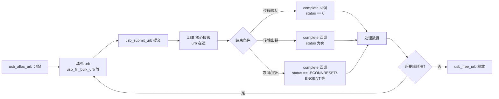

+++
title = 'LinuxUSB驱动与urb生命周期'
date = 2026-09-04T00:00:00+08:00
draft = false
categories = ['嵌入式']
tags = ['Linux', 'USB', '驱动开发', 'urb', '总线驱动']
+++

# LinuxUSB驱动与urb生命周期

## 题目

围绕 Linux USB 总线设备驱动开发的 urb 使用：

1. urb 的完整生命周期是怎样的？`usb_submit_urb()` 提交之后 urb 处于什么状态？
2. urb 在哪几种情况下才会"结束"？完成函数（completion）何时被调用？

## 考察点

urb（USB Request Block）的创建、填充、提交、完成回调的异步模型，以及 urb 结束的三种情况。

## 回答要点

### 1. 总体思路：提交不是结束，完成回调才是结束

`usb_submit_urb()` 是 urb 生命周期的**起点**——把 urb 移交给 USB 核心（USB host 控制器驱动）去异步调度，此时 urb 处于"在途"状态，远未结束。判断 urb 结束的唯一标志是**完成函数（completion callback）被调用**，而触发它的情况只有三种：**传输成功、传输出错、被主动取消（或设备被拔出）**。

### 2. urb 是什么

urb 是 Linux USB 子系统里描述"一次 USB 传输"的核心数据结构（`struct urb`），承载传输所需的全部信息：

| 关键字段 | 含义 |
|---------|------|
| `dev` | 目标 USB 设备 |
| `pipe` | 端点+方向的编码（`usb_sndbulkpipe()` 等宏生成） |
| `transfer_buffer` / `transfer_buffer_length` | 数据缓冲区及长度 |
| `complete` | 完成回调函数，urb 结束时被调用 |
| `context` | 传给完成回调的上下文 |
| `status` | 结束状态：0 成功，负数为错误码 |
| `actual_length` | 实际传输的字节数 |

USB 传输天然是异步的：提交后 CPU 不等待，控制器在后台搬运数据，结束后回调通知驱动。这与同步式的 `read()/write()` 接口风格完全不同。

### 3. urb 的完整生命周期



对应各阶段的 API：

| 阶段 | API | 说明 |
|------|-----|------|
| 分配 | `usb_alloc_urb(iso_packets, mem_flags)` | 从内核池分配，不能自己 kmalloc |
| 填充 | `usb_fill_bulk_urb()` / `usb_fill_int_urb()` / `usb_fill_control_urb()` | 按传输类型填 pipe、缓冲区、回调 |
| 提交 | `usb_submit_urb(urb, mem_flags)` | **开始**异步传输，不是结束 |
| 结束 | 完成回调被调用 | 三种情况见下表 |
| 释放 | `usb_free_urb(urb)` | 回收内存，须在确认不再使用后调用 |

### 4. urb 结束的三种情况

| 结束情况 | `urb->status` 取值 | 说明 |
|---------|-------------------|------|
| 传输成功 | 0 | 输出（OUT）方向：数据成功发出；输入（IN）方向：请求的数据已收到，`actual_length` 有效 |
| 传输出错 | 负错误码（如 `-EPIPE`、`-EOVERFLOW`、`-EPROTO`） | 总线错误、CRC 错、babble 等 |
| 被取消/去除连接 | `-ECONNRESET`（unlink）、`-ENOENT`（kill）、`-ESHUTDOWN`（设备拔出） | 驱动主动 `usb_unlink_urb()`/`usb_kill_urb()`，或 urb 在途时设备被拔出 |

### 5. usb_unlink_urb 与 usb_kill_urb 的区别

两个都是"取消在途 urb"，语义有差别：

| 对比项 | `usb_unlink_urb()` | `usb_kill_urb()` |
|--------|--------------------|------------------|
| 阻塞性 | 异步取消，立即返回 | **同步等待** urb 真正终止后才返回 |
| 使用限制 | 不能在中断上下文调用 | 不能在中断上下文调用 |
| 典型场景 | 平时想提前撤掉某个传输 | 断开/释放资源时兜底，确保没有在途 urb |
| 语义 | "尽量取消" | "必须取消完" |

设备拔出（断开）流程中，USB 核心会对所有在途 urb 调用终止，`status` 置 `-ENOENT` 或 `-ESHUTDOWN`，这也是"urb 结束"的一种。

### 6. 简单代码框架

```c
static void my_bulk_complete(struct urb *urb)
{
    if (urb->status == 0) {
        printk("got %d bytes\n", urb->actual_length);
    } else {
        printk("urb failed: %d\n", urb->status);
    }
    usb_free_urb(urb);
}

static int my_submit(struct usb_device *udev, void *buf, int len)
{
    struct urb *urb = usb_alloc_urb(0, GFP_KERNEL);
    if (!urb)
        return -ENOMEM;

    usb_fill_bulk_urb(urb, udev,
                      usb_rcvbulkpipe(udev, 0x81),
                      buf, len,
                      my_bulk_complete, NULL);

    return usb_submit_urb(urb, GFP_KERNEL);
}
```

### 7. 小结

- `usb_submit_urb()` 是**提交**，标志着 urb 进入在途状态，绝不是结束；
- urb 结束只有三种情况：**传输成功、传输出错、被取消或设备拔出**，统一表现为完成回调被调用、`status` 给出原因；
- 记住生命周期链：分配 → 填充 → 提交 → （在途）→ 完成回调 → 释放/复用。
