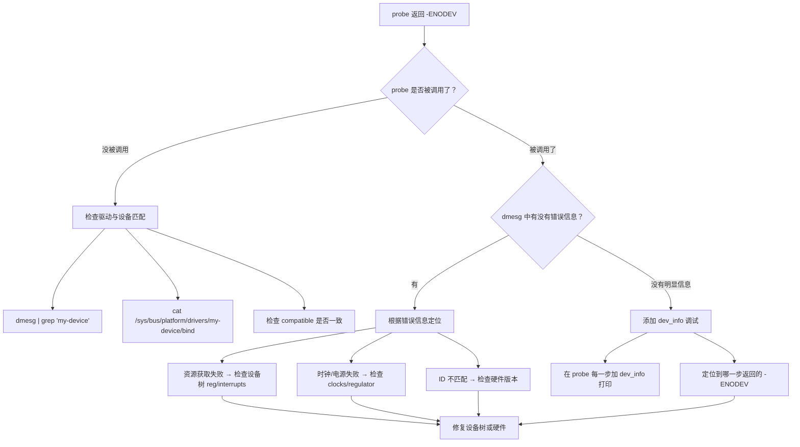

+++
title = 'probe函数返回ENODEV常见原因分析'
date = 2026-05-20T00:00:00+08:00
draft = false
categories = ['嵌入式']
tags = ['面试题', 'Linux', 'probe', 'ENODEV', '设备树', '驱动开发', 'platform_driver']
+++

# probe 函数返回 -ENODEV 常见原因分析

## 题目

Linux 驱动开发中，`probe` 函数返回 `-ENODEV`（No such device）的常见原因有哪些？如何系统地排查？

## 考察点

Linux 设备驱动模型、设备树与驱动匹配机制、probe 流程、内核资源管理、驱动调试能力。

## 回答要点

### 1. probe 函数是什么

`probe` 是 Linux 驱动模型中**驱动与设备匹配成功后**调用的初始化函数。如果 `probe` 返回非零值，内核认为初始化失败，该设备不会被添加到系统中。

```c
static int my_driver_probe(struct platform_device *pdev)
{
    // 匹配成功后，内核调用此函数
    // 负责初始化硬件、申请资源、注册设备节点等

    return 0;       // 成功
    // return -ENODEV;  // 失败：设备不存在
    // return -ENOMEM;  // 失败：内存不足
    // return -EIO;     // 失败：I/O 错误
}

static struct platform_driver my_driver = {
    .probe  = my_driver_probe,
    .remove = my_driver_remove,
    .driver = {
        .name = "my-device",
        .of_match_table = my_of_match,
    },
};
module_platform_driver(my_driver);
```

**`-ENODEV` 的语义**：表示"设备不存在或不可用"。在 `probe` 中，它通常意味着驱动虽然被加载了，但在运行时发现硬件实际上不满足工作条件。

### 2. probe 被调用的前提：驱动与设备的匹配

理解 `-ENODEV` 的原因，首先要理解 `probe` 是怎么被触发的。

```
设备树（DTS）中的节点          内核中注册的驱动
┌──────────────────┐         ┌──────────────────┐
│ my_device: ...   │         │ platform_driver  │
│   compatible =   │  匹配?  │   .of_match_table│
│   "vendor,mydev" │◀───────▶│   "vendor,mydev" │
└──────────────────┘         └──────────────────┘
         │                            │
         │  匹配成功                   │
         ▼                            ▼
    platform_device            调用 .probe()
    (内核自动创建)             (传入 pdev 参数)
```

**匹配方式有三种**：

| 匹配方式 | 说明 | 优先级 |
|---------|------|--------|
| **OF 匹配**（设备树 `compatible`） | 最常用，`of_match_table` 与 DTS 的 `compatible` 字段比较 | 最高 |
| **ID 表匹配**（`platform_device_id`） | 传统方式，通过设备名匹配 | 中 |
| **名称匹配**（`driver.name`） | 最简单，直接比较驱动名和设备名 | 最低 |

### 3. 返回 -ENODEV 的常见原因

#### 3.1 设备树 compatible 不匹配

这是**最常见**的原因——驱动和设备树中的 `compatible` 字段对不上。

```dts
// 设备树
&i2c1 {
    my_sensor@50 {
        compatible = "vendor,bme280";  // ← 注意这里的字符串
        reg = <0x50>;
    };
};
```

```c
// 驱动代码
static const struct of_device_id my_of_match[] = {
    { .compatible = "vendor,bmp280" },  // ← 拼错了！bme280 ≠ bmp280
    { }
};
MODULE_DEVICE_TABLE(of, my_of_match);
```

**结果**：匹配失败，`probe` 根本不会被调用（不是返回 `-ENODEV`，而是直接跳过）。

> 但如果驱动中有 fallback 逻辑（如通过 `driver.name` 匹配成功），进入 `probe` 后检查 `compatible` 不对，就可能主动返回 `-ENODEV`。

**排查方法**：

```bash
# 查看内核是否尝试了匹配
dmesg | grep "my-device"
# 或
dmesg | grep "of_match"

# 查看设备树中实际生效的节点
ls /proc/device-tree/i2c1/my_sensor@50/
cat /proc/device-tree/i2c1/my_sensor@50/compatible

# 查看已注册的驱动
ls /sys/bus/platform/drivers/my-device/
```

#### 3.2 硬件资源获取失败

`probe` 中需要获取硬件资源（寄存器地址、中断号、时钟、电源等），如果获取失败，通常返回 `-ENODEV` 或 `-EINVAL`。

```c
static int my_probe(struct platform_device *pdev)
{
    struct resource *res;
    void __iomem *regs;

    // 获取内存资源
    res = platform_get_resource(pdev, IORESOURCE_MEM, 0);
    if (!res)
        return -ENODEV;  // 设备树中没有 reg 属性

    // 映射寄存器
    regs = devm_ioremap_resource(&pdev->dev, res);
    if (IS_ERR(regs))
        return PTR_ERR(regs);  // 可能返回 -EBUSY, -ENOMEM 等

    // 获取中断
    int irq = platform_get_irq(pdev, 0);
    if (irq < 0)
        return irq;  // 可能返回 -ENODEV（设备树中没有 interrupts 属性）

    // ...
    return 0;
}
```

**设备树中缺少资源的典型情况**：

```dts
// 缺少 reg 属性 → platform_get_resource 返回 NULL
my_device {
    compatible = "vendor,mydev";
    // reg = <0x40002000 0x400>;  ← 忘了写
};

// 缺少 interrupts 属性 → platform_get_irq 返回 -ENODEV
my_device {
    compatible = "vendor,mydev";
    reg = <0x40002000 0x400>;
    // interrupt-parent = <&gic>;  ← 忘了写
    // interrupts = <0 25 4>;
};

// clocks 属性缺失或时钟未使能 → clk_get 返回错误
my_device {
    compatible = "vendor,mydev";
    reg = <0x40002000 0x400>;
    // clocks = <&clk_periph>;
    // clock-names = "apb";
};
```

#### 3.3 硬件不可达或未就绪

驱动匹配成功了，资源也获取到了，但读写硬件时发现设备不响应。

```c
static int my_probe(struct platform_device *pdev)
{
    void __iomem *regs;
    u32 id;

    regs = devm_platform_ioremap_resource(pdev, 0);
    if (IS_ERR(regs))
        return PTR_ERR(regs);

    // 读取芯片 ID 寄存器，验证硬件是否真实存在
    id = readl(regs + CHIP_ID_REG);
    if (id != EXPECTED_CHIP_ID) {
        dev_err(&pdev->dev, "unexpected chip id: 0x%x\n", id);
        return -ENODEV;  // 硬件不响应或 ID 不匹配
    }

    return 0;
}
```

**常见原因**：

- **电源未使能**：设备树中引用了 regulator，但 regulator 驱动未加载或电压未配置
- **时钟未使能**：设备需要的总线时钟或模块时钟未开启
- **复位未释放**：设备处于复位状态，`reset-gpios` 未正确拉高
- **物理连接问题**：I2C/SPI 设备未焊接、地址错误、总线未上拉
- **硬件版本不匹配**：读取的 chip ID 与驱动预期不一致

```c
// 典型的电源 + 时钟 + 复位 初始化序列
static int my_probe(struct platform_device *pdev)
{
    struct device *dev = &pdev->dev;
    struct regulator *vdd;
    struct clk *clk;
    struct gpio_desc *reset_gpio;

    // 1. 使能电源
    vdd = devm_regulator_get(dev, "vdd");
    if (IS_ERR(vdd))
        return PTR_ERR(vdd);  // -ENODEV 如果 regulator 不存在

    if (regulator_enable(vdd)) {
        dev_err(dev, "failed to enable regulator\n");
        return -ENODEV;
    }

    // 2. 使能时钟
    clk = devm_clk_get(dev, "apb");
    if (IS_ERR(clk))
        return PTR_ERR(clk);

    if (clk_prepare_enable(clk)) {
        dev_err(dev, "failed to enable clock\n");
        return -ENODEV;
    }

    // 3. 释放复位
    reset_gpio = devm_gpiod_get(dev, "reset", GPIOD_OUT_LOW);
    if (IS_ERR(reset_gpio))
        return PTR_ERR(reset_gpio);

    gpiod_set_value(reset_gpio, 1);  // 释放复位
    msleep(10);                       // 等待设备就绪

    // 4. 验证设备
    // ...
}
```

#### 3.4 I2C / SPI 设备无应答

I2C/SPI 子系统的 `probe` 中，最常见的 `-ENODEV` 来源是**设备在总线上无应答**。

```c
// I2C 设备 probe
static int my_i2c_probe(struct i2c_client *client,
                         const struct i2c_device_id *id)
{
    int ret;
    u8 chip_id;

    // 尝试读取芯片 ID
    ret = i2c_smbus_read_byte_data(client, WHO_AM_I_REG);
    if (ret < 0) {
        dev_err(&client->dev, "device not responding: %d\n", ret);
        return -ENODEV;  // 总线上无应答
    }

    chip_id = ret;
    if (chip_id != WHO_AM_I_VALUE) {
        dev_err(&client->dev, "wrong chip id: 0x%02x\n", chip_id);
        return -ENODEV;  // 设备类型不匹配
    }

    return 0;
}
```

**I2C 设备无应答的常见原因**：

| 原因 | 表现 | 排查 |
|------|------|------|
| 设备地址错误 | `i2c_transfer` 返回 `-ENXIO` | `i2cdetect -y <bus>` 扫描总线 |
| 设备未上电 | 同上 | 万用表测量 VDD 引脚 |
| I2C 总线未上拉 | SDA/SCL 悬空 | 示波器看波形，检查上拉电阻 |
| 设备未焊接/虚焊 | 同上 | 目检或 X 光检测 |
| 多个设备地址冲突 | 通信数据错乱 | 检查设备树中所有 I2C 节点的 `reg` 值 |

#### 3.5 设备树 status = "disabled"

```dts
// 设备树中明确禁用了设备
&i2c1 {
    my_sensor@50 {
        compatible = "vendor,mydev";
        reg = <0x50>;
        status = "disabled";  // ← 设备被禁用
    };
};
```

**注意**：`status = "disabled"` 的设备**不会被创建 `platform_device`**，所以 `probe` 不会被调用。但如果在板级 DTS overlay 中动态修改了 `status = "okay"` 而资源不完整，就可能进入 `probe` 后失败。

#### 3.6 依赖的驱动未加载

设备树中的 `phy-handle`、`dmas`、`io-channel` 等属性引用了其他驱动提供的资源，如果那些驱动还没加载，获取时会失败。

```dts
my_device {
    compatible = "vendor,mydev";
    phy-handle = <&eth_phy>;  // 依赖 PHY 驱动
    dmas = <&dma0 0 1>;       // 依赖 DMA 驱动
    io-channels = <&adc 0>;   // 依赖 IIO ADC 驱动
};
```

```c
// probe 中获取依赖资源
static int my_probe(struct platform_device *pdev)
{
    struct device_node *phy_np;
    struct phy_device *phydev;

    phy_np = of_parse_phandle(pdev->dev.of_node, "phy-handle", 0);
    if (!phy_np)
        return -ENODEV;  // 设备树中没有 phy-handle

    phydev = of_phy_find_device(phy_np);
    if (!phydev)
        return -EPROBE_DEFER;  // PHY 驱动还没加载，延迟重试

    // ...
}
```

> 这里引出一个关键区分：**`-ENODEV` vs `-EPROBE_DEFER`**。

### 4. -ENODEV vs -EPROBE_DEFER

这是面试中的高频考点。

| 错误码 | 含义 | 内核行为 |
|--------|------|---------|
| `-ENODEV` | 设备**确实不存在** | 放弃，不再重试 |
| `-EPROBE_DEFER` | 设备可能存在，但**依赖还没准备好** | 加入延迟探测列表，稍后自动重试 |

```c
static int my_probe(struct platform_device *pdev)
{
    struct clk *clk;

    clk = devm_clk_get(&pdev->dev, "apb");
    if (IS_ERR(clk)) {
        if (PTR_ERR(clk) == -EPROBE_DEFER)
            return -EPROBE_DEFER;  // 时钟驱动还没加载，请求内核稍后重试
        else
            return -ENODEV;  // 时钟真的不存在，放弃
    }

    // ...
}
```

**`-EPROBE_DEFER` 的生命周期**：

```
第一次 probe → 依赖不存在 → 返回 -EPROBE_DEFER
        │
        ▼
内核记录：这个驱动需要延迟探测
        │
        ▼
（其他驱动加载，依赖变得可用）
        │
        ▼
内核自动重新调用 probe
        │
        ▼
第二次 probe → 依赖已就绪 → 返回 0（成功）
```

### 5. 系统化排查流程



**调试技巧**：

```bash
# 1. 确认设备节点是否存在
ls /proc/device-tree/ | grep my_device

# 2. 查看设备树节点的完整信息
dtc -I fs /sys/firmware/devicetree/base | grep -A 20 "my_device"

# 3. 查看 probe 调用和错误
dmesg | grep -i "probe\|my-device\|error\|fail"

# 4. 查看已注册的设备和驱动
ls /sys/bus/platform/devices/
ls /sys/bus/platform/drivers/

# 5. 手动触发绑定
echo "my_device.0" > /sys/bus/platform/drivers/my-device/bind

# 6. 查看延迟探测列表
cat /sys/kernel/debug/deferred_devs

# 7. 动态调试（开启驱动核心调试信息）
echo 'file drivers/base/* +p' > /sys/kernel/debug/dynamic_debug/control
```

### 6. 各阶段返回 -ENODEV 的典型代码模式

```c
static int my_driver_probe(struct platform_device *pdev)
{
    struct device *dev = &pdev->dev;
    struct my_dev_data *data;
    void __iomem *regs;
    int irq, ret;

    /* ---- 阶段 1：基本数据结构分配 ---- */
    data = devm_kzalloc(dev, sizeof(*data), GFP_KERNEL);
    if (!data)
        return -ENOMEM;  // 注意：这里返回 -ENOMEM，不是 -ENODEV

    /* ---- 阶段 2：设备树/ACPI 匹配检查 ---- */
    if (!dev->of_node && !ACPI_COMPANION(dev))
        return -ENODEV;  // 既没有设备树也没有 ACPI，不处理

    /* ---- 阶段 3：硬件资源获取 ---- */
    regs = devm_platform_ioremap_resource(pdev, 0);
    if (IS_ERR(regs))
        return PTR_ERR(regs);  // -EINVAL 或 -EBUSY

    irq = platform_get_irq(pdev, 0);
    if (irq < 0)
        return irq;  // -ENODEV（没有 interrupts 属性）

    /* ---- 阶段 4：时钟/电源/复位 ---- */
    data->clk = devm_clk_get(dev, "apb");
    if (IS_ERR(data->clk)) {
        if (PTR_ERR(data->clk) == -EPROBE_DEFER)
            return -EPROBE_DEFER;
        return -ENODEV;  // 时钟真的不存在
    }
    clk_prepare_enable(data->clk);

    /* ---- 阶段 5：硬件验证 ---- */
    ret = verify_hardware(regs);
    if (ret) {
        dev_err(dev, "hardware verification failed\n");
        return -ENODEV;  // 硬件不响应或 ID 不对
    }

    /* ---- 阶段 6：注册中断 ---- */
    ret = devm_request_irq(dev, irq, my_isr, 0, "my-device", data);
    if (ret)
        return ret;

    /* ---- 阶段 7：注册设备节点 ---- */
    ret = misc_register(&data->miscdev);
    if (ret)
        return ret;

    platform_set_drvdata(pdev, data);
    dev_info(dev, "probe success\n");
    return 0;
}
```

### 7. 总结

| 返回 -ENODEV 的阶段 | 最常见原因 | 排查手段 |
|---------------------|-----------|---------|
| 设备树检查 | `of_node` 为空、`compatible` 不对 | `ls /proc/device-tree/` |
| 资源获取 | `reg` / `interrupts` 属性缺失 | `dmesg` 查看错误行号 |
| 时钟/电源 | 时钟未定义、regulator 未使能 | `cat /sys/kernel/debug/clk/clk_summary` |
| 硬件验证 | 芯片 ID 不匹配、设备无应答 | 示波器 / 逻辑分析仪 |
| I2C/SPI 通信 | 地址错误、总线未上拉、未焊接 | `i2cdetect` |
| 依赖缺失 | 引用的 phandle 目标驱动未加载 | `-EPROBE_DEFER` 替代 `-ENODEV` |

> **面试总结**：`probe` 返回 `-ENODEV` 通常发生在驱动与设备匹配成功后，在运行时发现硬件不可用。最常见的原因是：设备树资源缺失（`reg`、`interrupts`、`clocks`）、硬件不响应（电源/时钟/复位未就绪）、I2C/SPI 总线上设备无应答。关键是要区分 `-ENODEV`（设备不存在，放弃）和 `-EPROBE_DEFER`（依赖未就绪，稍后重试）。
