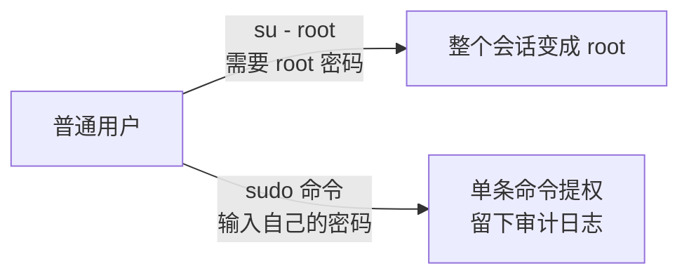

+++
title = 'root和admin有什么关系'
date = 2026-09-22T00:00:00+08:00
draft = false
categories = ['嵌入式']
tags = ['Linux', '用户权限', 'root', 'sudo', '系统管理']
+++

# root和admin有什么关系

## 题目

1. Linux 里的 root 和 admin 有什么关系？
2. root 账号在 Linux 以外的地方可能有什么意义？

## 考察点

对 Linux 权限模型的理解是停留在"root 就是管理员"的感性层面，还是清楚 UID 0 的内核语义、"管理员"是角色而非账号、以及 root 概念在其他系统（Unix 家族、Android、Windows、嵌入式设备）中的映射。

## 回答要点

### 1. root 的本质：UID 为 0 的账号，内核只认 UID 不认名字

`/etc/passwd` 的第一行就是它：

```text
root:x:0:0:root:/root:/bin/bash
```

- **内核鉴权看的是 UID**：传统 Unix 里 `uid == 0` 直接绕过文件权限检查；现代 Linux 把"root 的权力"拆成了 capabilities，UID 0 的进程默认持有全部能力——`CAP_DAC_OVERRIDE`（无视文件读写执行权限）、`CAP_NET_BIND_SERVICE`（绑定 1024 以下端口）、`CAP_SYS_ADMIN`（mount、加载模块等，几乎是"半个 root"）
- **名字只是约定**：把 root 改名，或者再建一个 UID 为 0 的账号，权限完全相同；反过来一个叫 root 但 UID 是 1000 的账号毫无特权
- root 的家目录是 `/root`，不是 `/home/root`
- **词源**：root 是文件树之"根"（`/`）的拥有者——它是整棵目录树上一切文件的最终属主

```sh
id
# uid=0(root) gid=0(root) groups=0(root)

# 再造一个 UID 0 的账号，它就是第二个"root"
useradd -o -u 0 fakeroot
```

### 2. Linux 没有"admin"这个内置账号：admin 是角色，root 是权限实体

"admin（系统管理员）"是**职责描述**，root/sudo 才是它的落地机制。各发行版把"管理员"落地的具体方式：

| 发行版/场景 | "管理员"的落地方式 |
|------------|------------------|
| Debian/Ubuntu | 安装时不设 root 密码，首个用户进 `sudo` 组，之后用 sudo 提权 |
| RHEL/SUSE/BSD 传统 | `wheel` 组（历史上控制"谁能 su 成 root"） |
| `adm` 组 | 名字有欺骗性：只授予读 `/var/log` 日志的权限，**不是**管理员 |
| 云镜像初始用户 | `ubuntu`、`ec2-user` 等；Debian 官方云镜像的默认用户干脆就叫 **admin**——这是很多人误以为 Linux 内置 admin 账号的直接来源 |

概念对照：

| 维度 | root | admin |
|------|------|-------|
| 本质 | 一个具体账号（UID 0）/一种权限等级 | 一个角色/职责（系统管理员） |
| Linux 内置 | 是，`/etc/passwd` 第一个账号 | 否（发行版或云镜像可能建同名普通用户） |
| 权力来自 | UID 0 + 全部 capabilities | 被加进 sudo/wheel 组 |
| 使用方式 | 直接登录、su、sudo | 平时用普通账号，需要时 sudo |

一句话关系：**admin 是人/角色，root 是权限实体；Linux 管理员通过 sudo/su 临时借用 root 权限干活，而不是平时就住在 root 账号里**。Windows 的 Administrator（内置账号，RID 500）才是"内置管理员账号"，Linux 没有这个对应物。

顺带辨析一句常把人绕晕的口语——"建立 root 账号"。严格地说 root 从不需要"建立"：装好系统它就躺在 `/etc/passwd` 第一行，不存在的只是"能否登录"。这句话在不同语境下指的动作完全不同：

| 口语说法 | 实际发生的动作 |
|---------|---------------|
| "给服务器开个 root" | `sudo passwd root` 给预置账号设密码（启用），不是创建 |
| Ubuntu"允许 root 登录" | 设密码解锁 + SSH 配置改 `PermitRootLogin` |
| 字面意义的"建 root 账号" | `useradd -o -u 0` 再造一个 UID 0 账号——审计分不清操作者，安全上是坏主意 |
| Android"root 手机" | 提权拿到**既有** UID 0 shell 的访问途径，不创建任何账号 |
| Windows"建管理员账号" | 新建普通账号加进 Administrators 组（Administrator 本体内置且默认禁用） |

把四个问题拆开说就不会被绕进去：**账号是否存在**（root 预置、admin 不内置）、**是否启用**（密码设置/锁定、SSH 策略）、**权限怎么授予**（UID 0、sudo/wheel 组成员）、**怎么行使**（直接登录、su、sudo）。

### 3. su 与 sudo：两种"成为管理员"的方式



- `su` = substitute user，切换的是"整个人"，退出前一直是 root
- `sudo` = superuser do，授权粒度可以细到具体命令（`visudo` 编辑 `/etc/sudoers`），每次使用记录在 `/var/log/auth.log`（RHEL 系是 `/var/log/secure`）
- 最小权限原则是现代默认：发行版倾向锁定 root、禁用 root 直接 SSH 登录（`PermitRootLogin no`），管理员走 sudo 并留下审计轨迹

### 4. root 在 Linux 以外的意义

**(1) 整个 Unix 家族同款**。BSD、macOS、Solaris/AIX 全都是 root + UID 0 的模型。macOS 的 root 默认禁用，管理员用户靠 sudo 提权——root 不是 Linux 的专利，是 Unix 权限模型的共同遗产。

**(2) Android 的"root 手机"**。Android 内核就是 Linux，但出厂不给 root shell：每个 App 分配独立 UID 做沙箱隔离，系统服务跑在各自保留的 UID 上。"刷 root" = 解锁 bootloader 后刷入 Magisk 之类的 su 管理器，拿到 UID 0 的 shell，从而越过 App 沙箱、修改系统分区。日常语境里 root 在这里已经从名词变成了动词。

**(3) 嵌入式与网络设备**。路由器、摄像头、工控盒子里跑的 Busybox 系统往往没有多用户机制，所有进程都以 root 运行，出厂还常带 root/root、root/admin 默认口令——这是 IoT 安全事故的头号来源。做嵌入式产品时"默认全 root + 弱口令"是要主动避免的反模式。

**(4) Windows 的对应物**。`Administrator`（内置账号，RID 500）是 root 的对位；`NT AUTHORITY\SYSTEM` 比 Administrator 更靠近内核侧；系统文件归 `TrustedInstaller` 所有。机制上有关键差别：Windows 靠 ACL + 所有权，管理员要"先夺取所有权再改 ACL"才能碰受保护对象；Linux 是 UID 0 直接绕过权限检查。

**(5) 软件世界的命名借用**。MySQL/MariaDB 的超级用户就叫 root，PostgreSQL 用 postgres，大量文档里 "root privileges" 泛指最高权限——都是从 Unix 借来的词。

**(6) 词源上的亲戚**。根目录 `/`、chroot（change root，把某目录假装成 `/` 的隔离手段）、rootkit（潜伏在最高权限层并隐藏自身的恶意软件）、DNS 根服务器、根证书——"root = 根"这一族词都指"树的起点 / 最高权威"。

### 5. 面试速记

- root = **UID 0**，内核认 UID 不认名字；再建一个 UID 0 账号权限完全一样
- root 是**预置账号**，"建立 root"是含混说法：实际动作是设密码启用、配置 sudo，或（坏主意地）再造一个 UID 0 账号
- Linux **没有内置 admin 账号**：admin 是角色，靠 sudo 组/wheel 组落地；`adm` 组只管看日志
- Ubuntu 默认不设 root 密码，首个用户 + sudo；Debian 云镜像默认用户叫 admin，是误解的常见来源
- su 切整个会话，sudo 单命令提权且留日志——最小权限原则
- Linux 以外：Unix 家族同款、Android"刷 root"、嵌入式设备默认全 root（安全隐患）、Windows 对应 Administrator/SYSTEM、MySQL 借用 root 命名
