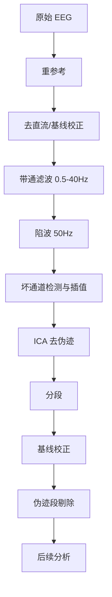

+++
title = '脑电信号特点与预处理流程'
date = 2026-04-24T00:00:00+08:00
draft = false
categories = ['嵌入式']
tags = ['脑电', 'EEG', '预处理', '信号处理']
+++

# 脑电信号特点与预处理流程

## 题目

脑电信号有什么特点？一般预处理流程是怎样的？

## 考察点

脑电信号特征、预处理各步骤的目的和原理、实际工程经验。

## 回答要点

### 1. 脑电信号的基本特点

| 特征 | 数值 |
|------|------|
| 幅度 | 5~500 μV（非常微弱） |
| 频率范围 | 0.5~100 Hz（主要能量在 0.5~30 Hz） |
| 阻抗 | 头皮电极阻抗 1~50 kΩ |
| 信噪比 | 很低（易受干扰） |
| 非平稳性 | 强（频率成分随时间变化） |
| 个体差异 | 大（年龄、状态、电极位置） |

### 2. 脑电信号的主要成分

| 节律 | 频率范围 | 产生位置 | 意义 |
|------|---------|---------|------|
| δ (Delta) | 0.5~4 Hz | 额叶 | 深度睡眠 |
| θ (Theta) | 4~8 Hz | 颞叶 | 困倦、冥想 |
| α (Alpha) | 8~13 Hz | 枕叶 | 放松闭眼 |
| β (Beta) | 13~30 Hz | 额叶 | 专注、思考 |
| γ (Gamma) | 30~100 Hz | 全脑 | 高级认知 |
| μ (Mu) | 8~13 Hz | 运动皮层 | 运动相关（与α同频但位置不同） |

### 3. 脑电信号的主要干扰源

| 干扰类型 | 频率 | 来源 | 波形特征 |
|---------|------|------|---------|
| 工频干扰 | 50/60 Hz | 电源线 | 全通道正弦波 |
| 基线漂移 | < 0.5 Hz | 出汗、电极移动 | 慢漂移 |
| 眼电（EOG） | < 5 Hz | 眨眼、眼球运动 | 前额通道大幅偏移 |
| 肌电（EMG） | 20~300 Hz | 面部/颈部肌肉 | 高频随机 |
| 心电（ECG） | ~1 Hz | 心脏跳动 | 周期性尖峰 |

### 4. 标准预处理流程



#### 步骤详解

**4.1 重参考（Re-referencing）**

```python
# 常用：平均参考
eeg_referenced = eeg - np.mean(eeg, axis=0)

# 或：双侧乳突参考
eeg_referenced = eeg - 0.5 * (eeg['M1'] + eeg['M2'])
```

| 参考方式 | 说明 |
|---------|------|
| 单极参考 | 相对于一个参考电极（如 Cz） |
| 双侧乳突 | 左右耳垂平均 |
| 平均参考 | 所有通道平均（最常用） |

**4.2 去直流 / 基线校正**

```python
# 去除直流偏移
eeg_dc_removed = eeg - np.mean(eeg, axis=1, keepdims=True)
```

**4.3 带通滤波**

```python
from scipy.signal import firwin, filtfilt

fs = 250
b = firwin(101, [0.5, 40.0], pass_zero='bandpass', fs=fs)
eeg_filtered = filtfilt(b, [1.0], eeg, axis=1)
```

| 滤波 | 截止频率 | 目的 |
|------|---------|------|
| 高通 | 0.5 Hz | 去基线漂移、直流偏移 |
| 低通 | 40~100 Hz | 去高频噪声（肌电） |

**4.4 陷波滤波（去工频）**

```python
from scipy.signal import iirnotch, filtfilt

b, a = iirnotch(50.0, Q=35, fs=250)
eeg_notched = filtfilt(b, a, eeg_filtered, axis=1)
```

**4.5 坏通道检测**

```python
def detect_bad_channels(eeg, threshold=3.0):
    channel_std = np.std(eeg, axis=1)
    global_std = np.mean(channel_std)
    bad = np.where(channel_std > threshold * global_std)[0]
    return bad

# 用邻近通道平均值插值替换坏通道
def interpolate_channel(eeg, bad_idx, good_idx):
    eeg[bad_idx] = np.mean(eeg[good_idx], axis=0)
```

**4.6 分段（Epoching）**

```python
# 以事件标记为中心，提取 [-200ms, 800ms] 的数据段
def epoch_data(eeg, events, fs, tmin=-0.2, tmax=0.8):
    samples_before = int(abs(tmin) * fs)
    samples_after = int(tmax * fs)
    epochs = []

    for event_sample in events:
        start = event_sample - samples_before
        end = event_sample + samples_after
        if start >= 0 and end < eeg.shape[1]:
            epochs.append(eeg[:, start:end])

    return np.array(epochs)
```

**4.7 基线校正（分段后）**

```python
# 用分段前 200ms 的平均值作为基线
baseline_samples = int(0.2 * fs)
for i in range(len(epochs)):
    baseline = np.mean(epochs[i][:, :baseline_samples], axis=1, keepdims=True)
    epochs[i] = epochs[i] - baseline
```

**4.8 伪迹段剔除**

```python
def reject_artifact_epochs(epochs, threshold_uv=100):
    clean = []
    for epoch in epochs:
        peak_to_peak = np.max(epoch) - np.min(epoch)
        if peak_to_peak < threshold_uv:
            clean.append(epoch)
    return np.array(clean)
```

### 5. 预处理参数选择总结

| 步骤 | 参数 | 推荐值 |
|------|------|--------|
| 带通滤波 | 低频截止 | 0.5 Hz（研究慢波用 0.1 Hz） |
| 带通滤波 | 高频截止 | 40 Hz（研究 γ 用 100 Hz） |
| 陷波 | 中心频率 | 50 Hz（中国）/ 60 Hz（美国） |
| 分段 | 基线 | -200 ms |
| 分段 | 分析窗 | 视实验范式而定 |
| 剔除阈值 | 峰峰值 | 100 μV（严格）或 150 μV（宽松） |
