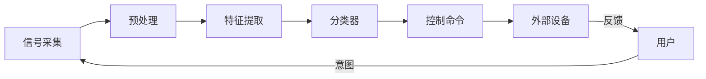

+++
title = '脑机接口BCI分类算法'
date = 2026-04-24T00:00:00+08:00
draft = false
categories = ['嵌入式']
tags = ['脑电', 'BCI', '脑机接口', '分类算法', '机器学习']
+++

# 脑机接口BCI分类算法

## 题目

1. 脑机接口系统的基本架构是什么？
2. BCI中常用的分类算法有哪些？各有什么优缺点？

## 考察点

BCI系统架构、特征提取与分类方法、嵌入式实时BCI实现。

## 回答要点

### 1. BCI 系统基本架构



| BCI 类型 | 原理 | 信号特征 |
|---------|------|---------|
| P300 Speller | 事件相关电位 | P300 成分（~300ms） |
| 运动想象 MI | 事件相关去同步 | μ/β 频段功率变化 |
| SSVEP | 稳态视觉诱发电位 | 特定频率的稳态响应 |
| Hybrid BCI | 组合多种范式 | 多种特征融合 |

### 2. 特征提取方法

#### 2.1 时域特征

```python
def extract_time_features(epoch):
    features = {}

    features['mean'] = np.mean(epoch)
    features['variance'] = np.var(epoch)
    features['peak_to_peak'] = np.max(epoch) - np.min(epoch)
    features['rms'] = np.sqrt(np.mean(epoch ** 2))
    features['zero_crossing'] = np.sum(np.diff(np.sign(epoch)) != 0)

    slope = np.diff(epoch)
    features['slope_mean'] = np.mean(slope)
    features['hjorth_activity'] = np.var(epoch)
    features['hjorth_mobility'] = np.var(slope) / np.var(epoch)

    return features
```

#### 2.2 频域特征

```python
def extract_freq_features(epoch, fs):
    from scipy.signal import welch
    features = {}

    freqs, psd = welch(epoch, fs=fs, nperseg=len(epoch))

    bands = {
        'delta': (0.5, 4), 'theta': (4, 8),
        'alpha': (8, 13), 'beta': (13, 30), 'gamma': (30, 100)
    }

    total_power = np.trapz(psd, freqs)
    for name, (f_low, f_high) in bands.items():
        mask = (freqs >= f_low) & (freqs <= f_high)
        power = np.trapz(psd[mask], freqs[mask])
        features[f'{name}_abs'] = power
        features[f'{name}_rel'] = power / total_power

    features['alpha_beta_ratio'] = features['alpha_abs'] / (features['beta_abs'] + 1e-10)

    return features
```

#### 2.3 CSP（共空间模式）— 运动想象核心特征

CSP 寻找一个空间滤波器，最大化一类信号的方差同时最小化另一类喵~

```python
from mne.decoding import CSP

csp = CSP(n_components=4, reg=None, log=True, norm_trace=False)

# X: (n_epochs, n_channels, n_samples)
# y: 标签 (0=左手机想, 1=右手机想)
X_csp = csp.fit_transform(X, y)

# X_csp: (n_epochs, n_components) — CSP 特征
```

#### 2.4 特征对比

| 特征类型 | 适用范式 | 维度 | 计算量 |
|---------|---------|------|--------|
| 时域统计 | P300/MI | 低 | 低 |
| 频段功率 | MI/SSVEP | 中 | 中 |
| CSP | MI | 低 | 中 |
| 时频特征 | 通用 | 高 | 高 |
| 自回归（AR） | 通用 | 低 | 低 |

### 3. 分类算法

#### 3.1 LDA（线性判别分析）

```python
from sklearn.discriminant_analysis import LinearDiscriminantAnalysis

clf = LDA()
clf.fit(X_train, y_train)
y_pred = clf.predict(X_test)
```

| 优点 | 缺点 |
|------|------|
| 简单、快速 | 线性决策边界 |
| 小样本表现好 | 假设正态分布 |
| 适合实时 BCI | 特征高度非线性时效果差 |
| 嵌入式可实现 | — |

#### 3.2 SVM（支持向量机）

```python
from sklearn.svm import SVC

clf = SVC(kernel='rbf', C=1.0, gamma='scale')
clf.fit(X_train, y_train)
```

| 优点 | 缺点 |
|------|------|
| 非线性分类（RBF核） | 参数调优 |
| 泛化能力强 | 计算量比 LDA 大 |
| 小样本表现好 | 嵌入式部署复杂 |

#### 3.3 随机森林

```python
from sklearn.ensemble import RandomForestClassifier

clf = RandomForestClassifier(n_estimators=100, max_depth=10)
clf.fit(X_train, y_train)
```

| 优点 | 缺点 |
|------|------|
| 不需要特征缩放 | 需要更多样本 |
| 可评估特征重要性 | 模型较大 |
| 鲁棒性好 | 实时性不如 LDA |

#### 3.4 CNN / 深度学习

```python
import torch.nn as nn

class EEGNet(nn.Module):
    def __init__(self, n_channels, n_samples, n_classes):
        super().__init__()
        self.conv1 = nn.Conv2d(1, 16, (1, 64), padding=(0, 32))
        self.bn1 = nn.BatchNorm2d(16)
        self.depthwise = nn.Conv2d(16, 32, (n_channels, 1), groups=16)
        self.bn2 = nn.BatchNorm2d(32)
        self.pool = nn.AvgPool2d((1, 4))
        self.dropout = nn.Dropout(0.5)
        self.fc = nn.Linear(32 * (n_samples // 4), n_classes)

    def forward(self, x):
        x = torch.relu(self.bn1(self.conv1(x)))
        x = torch.relu(self.bn2(self.depthwise(x)))
        x = self.pool(x)
        x = self.dropout(x)
        x = x.view(x.size(0), -1)
        return self.fc(x)
```

| 优点 | 缺点 |
|------|------|
| 自动特征学习 | 需要大量数据 |
| 端到端训练 | 计算资源需求高 |
| 性能上限高 | 嵌入式部署困难 |

### 4. 分类算法对比

| 算法 | 准确率 | 训练速度 | 推理速度 | 嵌入式部署 | 推荐场景 |
|------|--------|---------|---------|-----------|---------|
| LDA | 中 | 极快 | 极快 | ✅ 容易 | **实时 BCI** |
| SVM | 中高 | 中 | 快 | ⚠️ 需优化 | 离线/准实时 |
| 随机森林 | 高 | 中 | 中 | ⚠️ 需优化 | 离线分析 |
| CNN | 高 | 慢 | 中 | ❌ 困难 | 研究/离线 |

### 5. BCI 系统评价指标

| 指标 | 公式 | 说明 |
|------|------|------|
| 准确率 | $(TP+TN)/(TP+TN+FP+FN)$ | 整体分类正确率 |
| 灵敏度 | $TP/(TP+FN)$ | 正类识别率 |
| 特异度 | $TN/(TN+FP)$ | 负类识别率 |
| ITR（信息传输率） | $B \cdot (log_2 N + P log_2 P + (1-P)log_2\frac{1-P}{N-1})$ | bits/min |
| Kappa 系数 | $(Acc - P_e)/(1 - P_e)$ | 校正随机猜测 |

### 6. 嵌入式实时 BCI 实现要点

```c
// 典型实时 BCI 处理流水线（Cortex-M4/M7）

// 1. DMA 采集 EEG 数据（250 Hz, 8 通道）
// 2. 半传输完成中断触发处理

void process_eeg_block(float *block, int block_size) {
    // 步骤1：带通滤波（FIR，CMSIS-DSP）
    arm_fir_f32(&fir_instance, block, filtered, block_size);

    // 步骤2：特征提取（频段功率）
    arm_rfft_fast_f32(&fft_instance, filtered, fft_out, 0);
    float band_powers[5];
    compute_band_powers(fft_out, FFT_SIZE, FS, band_powers);

    // 步骤3：CSP 空间滤波（矩阵乘法）
    float csp_features[4];
    arm_matrix_instance_f32 src, dst, w;
    arm_mat_mult_f32(&src, &w, &dst);

    // 步骤4：LDA 分类
    float score = 0;
    for (int i = 0; i < 4; i++) {
        score += lda_weights[i] * csp_features[i];
    }
    score += lda_bias;

    int label = (score > 0) ? 1 : 0;

    // 步骤5：输出控制命令
    if (label == 1) {
        send_command(CMD_RIGHT);
    } else {
        send_command(CMD_LEFT);
    }
}
```

| 资源需求 | 典型值 |
|---------|--------|
| RAM | ~20KB（缓冲区 + FFT + 滤波器状态） |
| Flash | ~50KB（代码 + 模型参数） |
| 计算时间 | ~2ms/块（Cortex-M4 @ 168MHz） |
| 延迟 | < 50ms（从采集到输出） |
