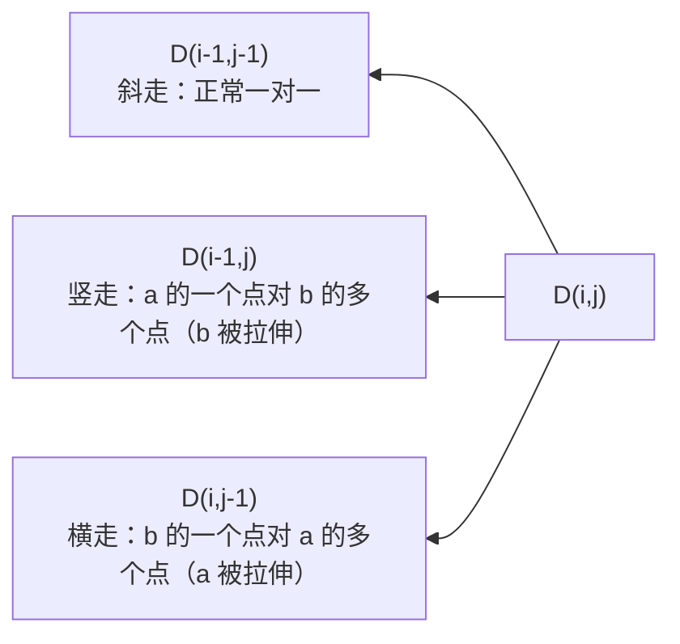

+++
title = 'DTW动态时间规整'
date = 2026-09-22T00:00:00+08:00
draft = false
categories = ['嵌入式']
tags = ['DTW', '数字信号处理', '动态规划', '时序匹配', '算法']
+++

# DTW动态时间规整

## 题目

1. DTW 解决什么问题？
2. 为什么普通欧氏距离不行？
3. 怎么实现，复杂度多少？

## 考察点

时序相似度度量的理解：时间轴不对齐问题、动态规划求最优对齐路径、DP 家族关系（与编辑距离同族）、典型应用场景与嵌入式实现要点。

## 回答要点

### 1. DTW 解决的问题：形状相似但快慢不同的两段序列怎么比相似度

两段信号内容一样、时间轴上却不对齐：同一个人说"你好"，一次快一次慢；同一种心跳波形，节律不同；同一个手势，动作快慢不同。逐点比较（欧氏距离）会发生**错配**——快的那段说到"好"时，慢的那段还在"你"，算出来的距离很大，但其实两段信号是同一个东西。

DTW（Dynamic Time Warping，动态时间规整）允许**时间轴非线性地拉伸和压缩**，在两条序列之间找一条最优的对齐路径，让累计距离最小。它输出两个东西：一个**相似度分数**（DTW 距离），和**点对点的对齐关系**（哪个点对应哪个点）。

| 方法 | 对齐方式 | 局限 |
|------|---------|------|
| 欧氏距离 | 严格第 i 点对第 i 点 | 速度不同就错配；长度不同直接没法算 |
| DTW | 一对多允许重复对齐（可拉伸） | O(N×M)；不约束会病态扭曲 |
| 编辑距离 | 插入/删除/替换离散符号 | 面向离散字符串，连续值序列不适用 |

### 2. 算法：动态规划求最优对齐路径

设序列 `a[0..n-1]`、`b[0..m-1]`：

1. **局部代价矩阵**：`d(i,j) = |a[i] - b[j]|`（特征是多维向量时换成向量距离，如两帧 MFCC 的欧氏距离）
2. **累计距离递推**：

```text
D(i,j) = d(i,j) + min( D(i-1,j-1), D(i-1,j), D(i,j-1) )
```



3. **约束**：边界约束（首尾必须互相对齐）、单调连续（路径只能往右/上/右上走，不能回头——时间不能倒流）
4. `D(n-1, m-1)` 就是 DTW 距离；从它回溯就得到 warping path（对齐路径）

复杂度：时间 O(N×M)，空间 O(N×M)（滚动数组可压到两行）。它和编辑距离、LCS 是同一个 DP 家族——都是"序列对齐 + 累计代价最小"，区别在 DTW 面向连续值、允许一个点重复对齐多个点。

### 3. 防止病态扭曲：窗口约束

不加限制的 DTW 可能给出荒唐的对齐——把一小段信号拉长去对齐对方一大半。工程上总要加约束：

- **Sakoe-Chiba 带**：限制 `|i - j| ≤ w`，对齐路径不能偏离对角线太远（w 的物理含义：两段序列的速度差不超过多少倍）
- **Itakura 平行四边形**：对角线两侧的菱形约束，早期语音识别常用
- **FastDTW**：多分辨率粗到细分层的近似算法，把复杂度降到近似 O(N)，长序列才需要

### 4. C 实现（可直接运行）

```c
#include <stdio.h>
#include <stdlib.h>
#include <math.h>

static double dtw_distance(const double *a, int n, const double *b, int m)
{
    double **D = malloc((size_t)n * sizeof(double *));
    for (int i = 0; i < n; i++)
        D[i] = malloc((size_t)m * sizeof(double));

    D[0][0] = fabs(a[0] - b[0]);
    for (int i = 1; i < n; i++)
        D[i][0] = D[i - 1][0] + fabs(a[i] - b[0]);
    for (int j = 1; j < m; j++)
        D[0][j] = D[0][j - 1] + fabs(a[0] - b[j]);

    for (int i = 1; i < n; i++) {
        for (int j = 1; j < m; j++) {
            double best = D[i - 1][j - 1];
            if (D[i - 1][j] < best) best = D[i - 1][j];
            if (D[i][j - 1] < best) best = D[i][j - 1];
            D[i][j] = fabs(a[i] - b[j]) + best;
        }
    }

    double result = D[n - 1][m - 1];
    for (int i = 0; i < n; i++)
        free(D[i]);
    free(D);
    return result;
}

int main(void)
{
    double a[6] = {0, 1, 2, 3, 4, 5};
    double b[8] = {0, 0, 1, 2, 3, 4, 5, 5};

    printf("DTW = %f\n", dtw_distance(a, 6, b, 8));
    return 0;
}
```

`a` 是 6 个点的上升斜坡，`b` 是同一个斜坡放慢（首尾各多停顿一步），长度都不同（欧氏距离根本没法定义），DTW 距离为 **0**——正确识别出"这是同一条形状"。

嵌入式落地要点：

- **省内存**：只要距离不需要路径时，滚动数组两行即可，O(min(N,M))
- **定点化**：无 FPU 的 MCU 上把差值和累计距离换成 Q15/Q31 定点数，注意累计项的位宽饱和
- **模板匹配用法**：参考模板（如一个词的 MFCC 帧序列）离线存在 flash，运行时对滑窗采集的序列逐个算 DTW 距离，取最小者且低于阈值就判命中——这正是小词表 MCU 语音识别的经典配方

### 5. 典型应用场景

| 领域 | 用法 |
|------|------|
| 语音识别 | 孤立词识别：MFCC 特征帧序列 + 模板 DTW，小词表/零训练场景的标准方案 |
| 生物医学 | 心电波形对齐比对（异常搏动检测）、脑电/肌电 epoch 与模板匹配 |
| 传感器 | IMU 加速度序列做手势/动作模板匹配、振动信号模式识别（轴承故障特征） |
| 数据科学 | 时间序列分类与聚类（金融曲线、日志波形检索） |

现状定位：大规模、大数据的场景已经被深度学习（embedding + 分类器）取代，但 DTW 在**模板少、没有训练数据、要可解释、要在 MCU 上跑**的场景仍是首选——它不需要训练，只要几条参考模板就能工作。

结合具体方向看它落在哪里：

- **生理信号采集（脑电/心电）**：长程动态记录的数据量巨大，下位机常需要在线检测事件、只回传命中片段。眨眼、咬牙、体动这几类伪迹形态固定、样本又少（不值得训模型），存几条模板做 DTW 检测正合适——MCU 跑得动、零训练数据、结果可解释；与离线端的精处理（ICA 等）分层配合：在线粗筛 + 离线精去伪迹。若链路含 ECG 通道，QRS 波形模板匹配、异常搏动识别是教科书应用
- **可穿戴与便携设备**：IMU 手势识别（甩动开机、敲击拍照）、小词表离线语音命令（MFCC + DTW），都是 MCU 上零训练的现实方案
- **用不上的方向不硬凑**：超声的信号处理在图像域（波束形成、包络检测、对数压缩），影像防抖的陀螺仪-帧对齐用互相关和插值——这些场景不存在"速度会变"的对齐问题，DTW 没有出场机会

### 6. 什么时候轮到 DTW，什么时候轮不到

比记应用清单更有用的是选型判据——看目标波形会不会"变速"：

| 场景特征 | 选择 | 原因 |
|---------|------|------|
| 目标会变速、时长会伸缩（眨眼有快有慢、说话有快有慢、手势有快有慢） | DTW | 逐点比较必然错位，需要允许拉伸的对齐 |
| 速度固定、只是位置未知（雷达回波、周期性干扰定位） | 互相关 / 匹配滤波 | 可用 FFT 加速，比 DTW 快得多 |
| 有训练数据、有算力、追求精度上限 | 深度学习 | 精度上限高，但要付数据和训练成本 |

### 7. 面试速记

- DTW 解决**两段时序"形状相似但快慢不同"的相似度比较**：允许时间轴非线性拉伸，找累计距离最小的对齐路径
- 核心递推 `D(i,j) = d(i,j) + min(三个方向的累计)`，约束单调连续 + 首尾对齐
- 复杂度 O(N×M)；Sakoe-Chiba 窗防病态扭曲；长序列用 FastDTW 近似线性
- 经典应用：**MFCC + DTW 孤立词语音识别**、心电/手势/振动模板匹配
- 与编辑距离同族（序列对齐 DP）；DTW 对连续值、允许重复对齐，编辑距离对离散符号、允许增删改
- 嵌入式落地典型：长程脑电下位机在线伪迹标记（眨眼/咬牙/体动模板匹配）、IMU 手势、小词表语音命令
- 选型判据：目标会变速 → DTW；速度固定找位置 → 互相关（FFT 可加速）；有数据有算力 → 深度学习
