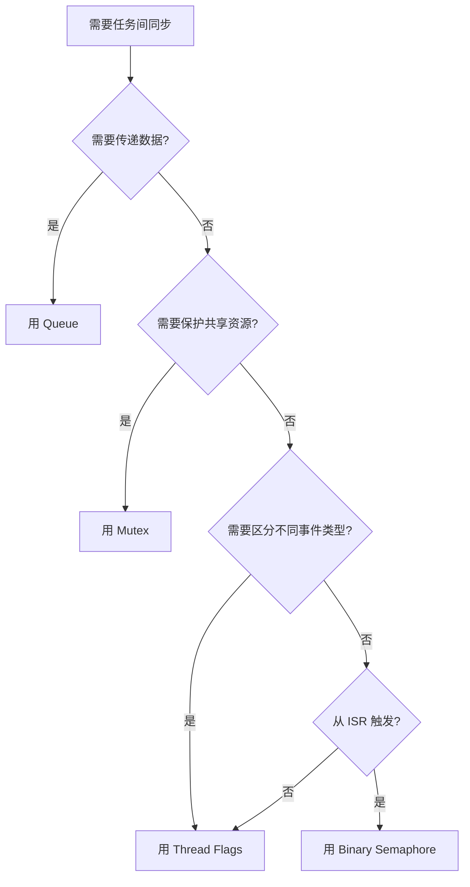

+++
title = 'FreeRTOS任务间同步：二值信号量与Thread Flags'
date = 2026-05-03T00:00:00+08:00
draft = false
categories = ['嵌入式']
tags = ['STM32', 'FreeRTOS', '信号量', 'Thread Flags', 'RTOS', '任务同步']
+++

# FreeRTOS任务间同步：二值信号量与Thread Flags

上一篇光敏传感器用了**轮询**方式读取 GPIO，简单但没有利用 RTOS 的同步机制。本文用同一个光敏传感器场景，对比两种任务间同步方式：**Binary Semaphore（二值信号量）** 和 **Thread Flags（任务标志）**。

## 先说结论：当前场景选哪个？

| 对比项 | Binary Semaphore | Thread Flags |
|--------|-----------------|-------------|
| 能否区分"遮光/正常"两种状态 | ❌ 只能传递"事件发生了" | ✅ 不同 flag 位代表不同状态 |
| 定向通知某个任务 | ❌ 谁 acquire 谁拿走 | ✅ 直接指定目标任务 |
| 需要额外创建对象 | ✅ 需要创建信号量 | ❌ 任务自带，无需创建 |
| 代码简洁度 | 一般 | ✅ 更简洁 |

**结论：光敏传感器通知 LED 任务，用 Thread Flags 更合适。** 但 Binary Semaphore 在其他场景下更有优势，下面逐一实操。

---

## 第一部分：Thread Flags（推荐）

### 场景描述

- `LightSensor` 任务轮询读取 PB13，检测到遮光/正常后，用 **Thread Flags** 通知 `GreenLed` 任务
- `GreenLed` 任务根据收到的 flag 决定亮灯还是灭灯

### 1.1 CubeMX 配置

无需额外配置。Thread Flags 是任务自带的机制，不需要在 CubeMX 中创建任何对象。

### 1.2 代码实现

```c
#define FLAG_DARK    (1U << 0)
#define FLAG_LIGHT   (1U << 1)

extern osThreadId_t greenLedHandle;

void StartLightSensor(void *argument)
{
  for(;;)
  {
    GPIO_PinState state = HAL_GPIO_ReadPin(LIGHT_SENSOR_GPIO_Port, LIGHT_SENSOR_Pin);

    if (state == GPIO_PIN_RESET)
    {
      osThreadFlagsSet(greenLedHandle, FLAG_DARK);
    }
    else
    {
      osThreadFlagsSet(greenLedHandle, FLAG_LIGHT);
    }

    osDelay(100);
  }
}

void StartGreenLed(void *argument)
{
  for(;;)
  {
    uint32_t flags = osThreadFlagsWait(FLAG_DARK | FLAG_LIGHT, osFlagsWaitAny, osWaitForever);

    if (flags & FLAG_DARK)
    {
      HAL_GPIO_WritePin(LED_GREEN_GPIO_Port, LED_GREEN_Pin, GPIO_PIN_SET);
    }
    else if (flags & FLAG_LIGHT)
    {
      HAL_GPIO_WritePin(LED_GREEN_GPIO_Port, LED_GREEN_Pin, GPIO_PIN_RESET);
    }
  }
}
```

### 1.3 关键 API

| 函数 | 用途 |
|------|------|
| `osThreadFlagsSet(thread_id, flags)` | 向指定任务发送 flag |
| `osThreadFlagsWait(flags, options, timeout)` | 等待 flag，支持 `osFlagsWaitAny` / `osFlagsWaitAll` |
| `osThreadFlagsClear(flags)` | 清除指定 flag |

### 1.4 核心优势

- `osThreadFlagsSet(greenLedHandle, FLAG_DARK)` — **定向通知** GreenLed 任务
- `FLAG_DARK` 和 `FLAG_LIGHT` 是不同的 bit — **区分两种状态**
- 不需要创建任何额外对象 — **代码最简洁**

---

## 第二部分：Binary Semaphore

### 场景描述

用二值信号量实现"中断触发 → 任务处理"的经典模式：PB13 配置为 EXTI 中断，中断中释放信号量，任务中获取信号量。

### 2.1 CubeMX 配置

#### 创建二值信号量

- **System Core** → **Tasks and Queues**，切换到 **Semaphores** 标签
- 点 **Add**，配置：
  - **Semaphore Name**：`xLightSem`
  - **Semaphore Type**：`Binary`（二值）
  - 其余保持默认

#### PB13 配置为 EXTI 中断

- **Pinout view** 中，点击 **PB13**，选择 **`GPIO_EXTI13`**
- 左侧 **System Core** → **GPIO**，找到 PB13 的 EXTI 配置：
  - **GPIO mode**：`External Interrupt Mode with Falling edge trigger detection`（下降沿触发，即遮光瞬间触发）
  - **GPIO Pull-up/Pull-down**：`Pull-up`
- **System Core** → **NVIC**，勾选 **`EXTI line[15:10] interrupts`** 的 **Enabled**

### 2.2 代码实现

```c
extern osSemaphoreId_t xLightSemHandle;

void HAL_GPIO_EXTI_Callback(uint16_t GPIO_Pin)
{
  if (GPIO_Pin == LIGHT_SENSOR_Pin)
  {
    osSemaphoreRelease(xLightSemHandle);
  }
}

void StartLightSensor(void *argument)
{
  for(;;)
  {
    osSemaphoreAcquire(xLightSemHandle, osWaitForever);

    GPIO_PinState state = HAL_GPIO_ReadPin(LIGHT_SENSOR_GPIO_Port, LIGHT_SENSOR_Pin);

    if (state == GPIO_PIN_RESET)
    {
      HAL_GPIO_WritePin(LED_GREEN_GPIO_Port, LED_GREEN_Pin, GPIO_PIN_SET);
    }
    else
    {
      HAL_GPIO_WritePin(LED_GREEN_GPIO_Port, LED_GREEN_Pin, GPIO_PIN_RESET);
    }
  }
}
```

### 2.3 关键 API

| 函数 | 用途 |
|------|------|
| `osSemaphoreNew(max_count, initial_count, NULL)` | 创建信号量（CubeMX 自动生成） |
| `osSemaphoreAcquire(sem_id, timeout)` | 获取信号量，获取不到则阻塞 |
| `osSemaphoreRelease(sem_id)` | 释放信号量 |

### 2.4 用信号量的局限

回到光敏传感器场景，如果用信号量要区分"遮光"和"正常"两种状态：

- 方案 A：创建**两个**二值信号量（一个遮光、一个正常）→ 浪费资源
- 方案 B：一个信号量 + **全局变量**传递状态 → 多了共享变量，还得考虑保护

所以这种需要**传递状态类型 + 定向通知**的场景，Thread Flags 更优。

---

## 第三部分：什么时候用信号量更合适？

| 场景 | 推荐机制 | 原因 |
|------|---------|------|
| ISR 通知任务"有事了"（不关心具体状态） | **Binary Semaphore** | 最经典的 ISR-Task 同步模式 |
| 互斥访问共享资源（如两个任务都用串口） | **Mutex** | 带优先级继承，防止优先级反转 |
| 限制同时访问的任务数量 | **Counting Semaphore** | 计数型限流 |
| 传递不同类型的事件/状态 | **Thread Flags** | 不同 bit 位代表不同含义 |
| 任务间传递数据 | **Queue** | 自带阻塞/同步，能传具体数据 |

### 选择流程



---

## 总结

| | Thread Flags | Binary Semaphore |
|---|---|---|
| 本篇推荐场景 | ✅ 光敏传感器通知 LED | 不推荐 |
| 创建方式 | 任务自带 | 需 CubeMX 创建 |
| 传递状态 | ✅ 多个 bit 区分 | ❌ 只有有/无 |
| 定向通知 | ✅ 指定任务 | ❌ 谁抢到是谁的 |
| ISR 中使用 | 不建议（CMSIS_V2 支持有限） | ✅ 经典用法 |
