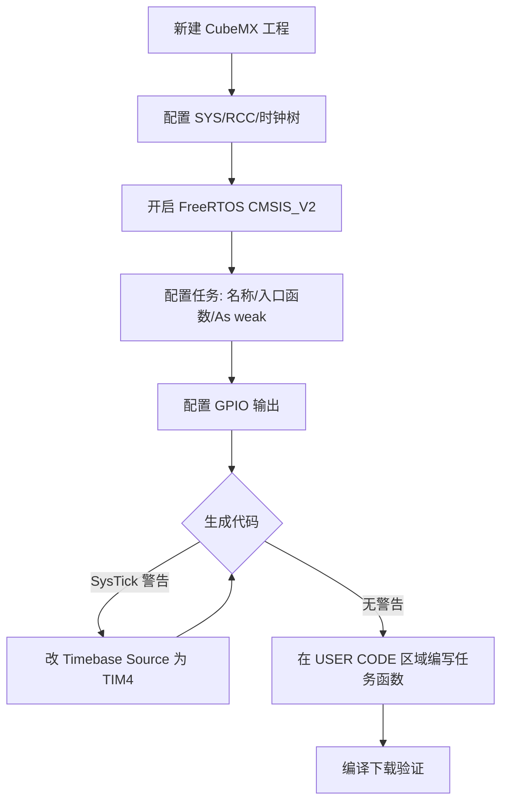

+++
title = 'STM32CubeMX搭建FreeRTOS多任务工程'
date = 2026-05-03T00:00:00+08:00
draft = false
categories = ['嵌入式']
tags = ['STM32', 'CubeMX', 'FreeRTOS', '多任务', 'RTOS', '嵌入式']
+++

# STM32CubeMX搭建FreeRTOS多任务工程

用 **STM32CubeMX** 搭建一个基于 FreeRTOS 的多任务 LED 闪烁工程。整个流程分三步：CubeMX 配置 → 代码微调 → 现象验证。

## 第一步：CubeMX 图形化配置

打开 CubeMX，新建工程，选择具体 F103 型号（如 F103C8T6）。

### 1.1 基础系统与调试接口

- **Pinout & Configuration** → **System Core** → **SYS**：
  - `Debug` 选择 `Serial Wire`（解除调试引脚占用）
- **RCC**：
  - `High Speed Clock (HSE)` 选择 `Crystal/Ceramic Resonator`（外部晶振）

### 1.2 时钟树配置

- 切到 **Clock Configuration** 标签页
- 按典型值配到 **HCLK = 72MHz**，回车后让 CubeMX 自动调整

### 1.3 开启 FreeRTOS

- **Pinout & Configuration** → **Middleware** → 双击 **FREERTOS**
- **Interface** 选 **CMSIS_V2**（API 更通用，对 STM32 优化更好）
- 其余保持默认，点击 OK，FreeRTOS 已植入工程

### 1.4 修改默认任务

- 回到 **System Core**，会多出一个 **Tasks and Queues** 菜单
- 里面已有一个默认任务 `defaultTask`，点击它，修改属性：
  - **Task Name**：`GreenLed`
  - **Entry Function**：`StartGreenLed`
  - **Priority**：`osPriorityNormal`
  - **Code Generation Option**：勾选 `As weak`（这样可以在外部重写函数，不会被 CubeMX 锁在生成的代码里）

### 1.5 创建第二个任务

- 在 **Tasks and Queues** 界面点 **Add**，创建任务：
  - **Task Name**：`RedLed`
  - **Entry Function**：`StartRedLed`
  - **Priority**：`osPriorityNormal`
  - **Code Generation Option**：勾选 `As weak`

> **踩坑提醒**：新建任务后，**必须手动修改 Entry Function 名称**，否则生成的代码中入口函数名与你在 `main.c` 中重写的函数名不匹配，任务无法启动。

### 1.6 配置 GPIO（LED 输出）

- **Pinout view** 里，在芯片图上：
  - 选 **PC13**，设为 `GPIO_Output`（F103C8T6 最小系统板，PC13 通常板载一个 LED）
  - 再选 **PA1**（或其他空闲 GPIO），设为 `GPIO_Output`，外接另一个 LED
- 右键这两个引脚选 `Enter User Label`，分别命名为 `LED_GREEN` 和 `LED_RED`

### 1.7 生成代码

- 切到 **Project Manager** 页，填好工程名和路径
- **Toolchain/IDE** 选你用的（Keil MDK-ARM V5 或 IAR）
- 点右上角 **GENERATE CODE**

---

## 第二步：HAL 时基冲突处理（关键）

点击 GENERATE CODE 后，CubeMX 可能弹出如下警告：

> **Warning**: When RTOS is used, it is strongly recommended to use a HAL timebase source other than the Systick.

**必须点"No"，先改好再生成代码。**

### 为什么会有这个警告？

| 场景 | SysTick 用途 |
|------|-------------|
| 裸机程序 | HAL 库用它做 `HAL_Delay()` 的时基 |
| FreeRTOS 程序 | RTOS 征用它做心跳时钟，触发任务调度 |

两者抢同一个资源，会导致 `HAL_Delay()` 时间错乱、外设超时异常。

### 解决方法

1. 回到 **Pinout & Configuration** → **System Core** → **SYS**
2. 找到 **Timebase Source** 下拉框，从 `SysTick` 改为一个未使用的定时器
3. 重新点 **GENERATE CODE**，警告消失

> **F103C8T6 选哪个定时器？**
>
> F103C8T6 属于**中容量（Medium Density）**型号，硬件上只集成了：
>
> | 类型 | 可用定时器 |
> |------|-----------|
> | 高级定时器 | TIM1 |
> | 通用定时器 | TIM2、TIM3、TIM4 |
>
> TIM6/TIM7 等基本定时器只在更高端的 F103（如 ZET6）等大容量型号上才有，CubeMX 里看不到是正常的。
>
> 实操建议：选 **TIM4**。刚开始跑 LED 灯工程基本不会用到 TIM4 的其他功能，它通常最"闲"，拿来给 HAL 库当时基没问题。以后工程复杂了再根据需要调整。

---

## 第三步：编写任务代码

用 IDE 打开生成的工程。

### 3.1 重写任务函数

打开 `main.c`，在 `/* USER CODE BEGIN 4 */` 和 `/* USER CODE END 4 */` 之间粘贴任务函数：

```c
/* USER CODE BEGIN 4 */

void StartGreenLed(void *argument)
{
  for(;;)
  {
    HAL_GPIO_TogglePin(LED_GREEN_GPIO_Port, LED_GREEN_Pin);
    osDelay(500);
  }
}

void StartRedLed(void *argument)
{
  for(;;)
  {
    HAL_GPIO_TogglePin(LED_RED_GPIO_Port, LED_RED_Pin);
    osDelay(1000);
  }
}

/* USER CODE END 4 */
```

### 3.2 `osDelay()` vs `HAL_Delay()`

| 函数 | 行为 | 对调度的影响 |
|------|------|-------------|
| `osDelay()` | 任务进入**阻塞态**，主动让出 CPU | ✅ 其他任务可以运行 |
| `HAL_Delay()` | **死循环空转**等待，CPU 被占满 | ❌ 阻塞整个系统 |

在 FreeRTOS 任务中**必须使用 `osDelay()`**，而不是 `HAL_Delay()`。

### 3.3 编译下载

- 保存文件，编译工程
- 连接 STM32F103 开发板，用 ST-Link 或串口下载程序

---

## 第四步：现象验证

上电后预期现象：

- **绿色 LED**（PC13）以 500ms 周期翻转（每秒 2 次）
- **红色 LED**（PA1）以 1000ms 周期翻转（每秒 1 次）

两个 LED 在不同的任务里独立工作，验证了 FreeRTOS 多任务调度已正常运行。

### 排错清单

| 现象 | 可能原因 | 解决方法 |
|------|---------|---------|
| LED 常亮或不亮 | PC13 低电平点亮 | 检查对地接线 |
| 程序跑飞/死机 | 栈溢出 | `FreeRTOSConfig.h` 中把 `configMINIMAL_STACK_SIZE` 改小（如 64） |
| 任务不切换 | 抢占式调度未启用 | 确保 `USE_PREEMPTION` 保持启用（默认启用） |
| `HAL_Delay()` 异常 | HAL 时基冲突 | 按第二步将 Timebase Source 改为未使用的定时器（如 TIM4） |

---

## 流程总结

